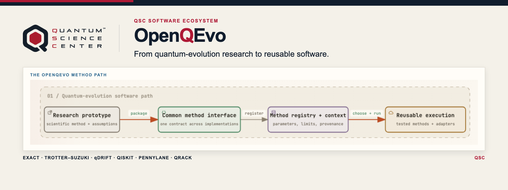
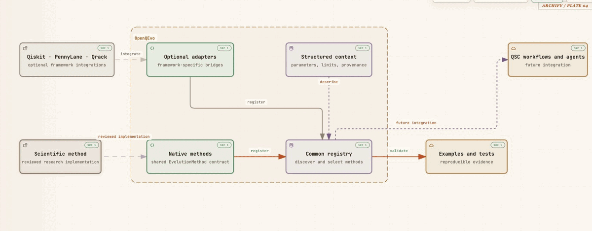
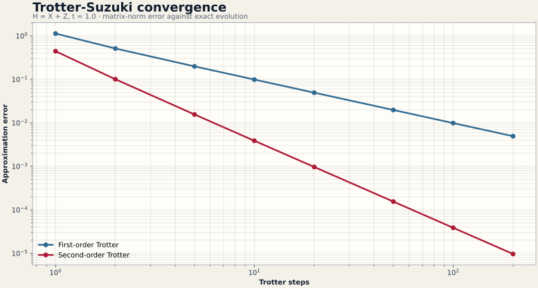

<p align="center">
  <a href="https://qscience.org/">
    
  </a>
</p>

# openQEvo

**openQEvo helps quantum-algorithm researchers turn evolution-method prototypes
into discoverable, tested, and reusable Python components through a common
method interface, registry, framework adapters, and structured context.**

[](https://github.com/QSCSoftwareThrust/OpenQEvo/actions/workflows/ci.yml)
[](pyproject.toml)
[](#project-status)

The current prototype covers exact evolution, first- and second-order product
formulas, a qDRIFT randomized baseline, and optional Qiskit, PennyLane, and
Qrack adapters. Interaction-picture, annealing, and other evolution families
remain research directions.

[See the example](#see-it-in-action) ·
[Quick start](#quick-start) ·
[Architecture](docs/architecture.md) ·
[Roadmap](docs/roadmap.md) ·
[Contributing](CONTRIBUTING.md)

[](.github/assets/openqevo-architecture.html)

*Figure 1. The animated trace follows the path from reviewed scientific methods
and optional framework adapters through the registry and context layer to
reproducible evidence and future workflow integration. Open the
[interactive architecture map](.github/assets/openqevo-architecture.html) for
reader-controlled Live/Still tracing.*

> [!IMPORTANT]
> openQEvo is a source-installable, pre-alpha prototype—not a published
> release. The native Trotter implementations are reference placeholders
> awaiting Algorithms Thrust review, and the project license is still
> undecided.

## At a glance

| | |
| --- | --- |
| **QSC contribution** | Establishes a reusable engineering path from Algorithms Thrust research code to tested ecosystem software. |
| **Ecosystem area** | Applications |
| **Primary users** | Quantum-algorithm researchers, framework integrators, and QSC software teams |
| **Maturity** | Prototype (`Development Status :: 2 - Pre-Alpha`) |
| **Current milestone** | Replace reference placeholders with reviewed scientific implementations and complete the first licensed release. |
| **Lead / contact** | QSC Software Thrust via the [OpenQEvo issue tracker](https://github.com/QSCSoftwareThrust/OpenQEvo/issues) |
| **Last reviewed** | 2026-08-25 |

## Why this matters

Quantum-evolution research often begins as a standalone scientific script.
That is appropriate for exploration, but it makes methods harder to discover,
compare, validate, and reuse across frameworks. openQEvo provides a repeatable
route from those scripts to maintained software without hiding method
provenance or approximation limits.

For QSC, the project is also a concrete integration pattern: the Algorithms
Thrust supplies reviewed science, while Software Thrust teams contribute
packaging, tests, metadata, adapters, documentation, and future workflow
integration. The pattern can extend to other algorithm families after it is
validated here.

## What it does

- **Presents one method interface.** Native implementations and optional
  framework adapters implement the same `EvolutionMethod` contract.
- **Makes methods discoverable.** A registry supports `get()`,
  `list_methods()`, and `list_methods_detail()`.
- **Carries scientific context.** JSON records capture applicability,
  parameters, limitations, complexity, references, and example paths.
- **Checks convergence and consistency.** Tests compare approximation methods
  against exact small-system evolution and validate method metadata.
- **Keeps integrations optional.** Qiskit, PennyLane, and Qrack adapters load
  only when their dependencies are installed.

## See it in action

[](examples/trotter_convergence.py)

*Figure 2. The bundled `H = X + Z` example compares the reference first- and
second-order formulas against exact evolution. From 1 to 200 steps, the
second-order error falls from `4.44e-1` to `9.67e-6`; the first-order error
falls from `1.13e+0` to `4.94e-3`.*

Run the example in the terminal:

```bash
python examples/trotter_convergence.py
```

Recreate the figure after installing the optional visualization dependency:

```bash
python -m pip install -e ".[visualization]"
python examples/trotter_convergence.py \
  --plot .github/assets/trotter-convergence.svg
```

## Project status

Status below reflects the repository on 2026-08-25.

| Capability | Status | Evidence / boundary |
| --- | --- | --- |
| Exact matrix evolution | Available | Classical small-system reference with context metadata and tests |
| First-order Trotter | Prototype | Implemented and tested; explicitly a placeholder pending Algorithms Thrust review |
| Second-order Trotter | Prototype | Implemented and tested; explicitly a placeholder pending Algorithms Thrust review |
| qDRIFT randomized evolution | Prototype | Registered dense-unitary baseline with reproducible sampling, context metadata, and tests |
| Qiskit adapter | Implemented | Optional adapter with 9 tests; exercised locally when Qiskit is installed |
| PennyLane adapter | Implemented | Optional adapter and tests are present; dependency-conditional |
| Qrack adapter | Experimental | Optional implementation with 7 fake-runtime integration tests; GPU/OpenCL validation remains pending |
| Structured context and recommendations | Available | Schema-validated method metadata, selection rules, and executable recommendation payloads |
| PyPI / Spack distribution | Planned | Source install works; no public package or Spack recipe is claimed |
| License and citation metadata | Blocked | License decision, `LICENSE`, and `CITATION.cff` are required before release |

## Quick start

### Install from source

```bash
git clone https://github.com/QSCSoftwareThrust/OpenQEvo.git
cd OpenQEvo
python -m pip install -e .
```

Install development tools or optional adapters as needed:

```bash
python -m pip install -e ".[dev]"
python -m pip install -e ".[qiskit]"
python -m pip install -e ".[pennylane]"
python -m pip install -e ".[qrack]"
python -m pip install -e ".[adapters]"
```

### Compare two evolution methods

```python
import numpy as np
import openqevo

x = np.array([[0, 1], [1, 0]], dtype=complex)
z = np.array([[1, 0], [0, -1]], dtype=complex)
terms = [x, z]

exact = openqevo.get("exact").evolve(terms, t=1.0)
approx = openqevo.get("trotter_s2").evolve(terms, t=1.0, steps=20)

print(openqevo.list_methods())
print("approximation error:", np.linalg.norm(approx - exact))
```

The registry always lists the native/reference methods (`exact`, `trotter_s1`,
`trotter_s2`, and `qdrift`). Optional adapter names appear when their
dependencies are installed.

## Validation and evidence

- **Core and context:** tests cover registry behavior, Trotter and qDRIFT
  behavior, exact reference cases, recommendation execution, error handling,
  and JSON-schema validation.
- **Qiskit adapter:** 9 additional tests pass when Qiskit is installed.
- **PennyLane adapter:** 9 dependency-conditional tests cover the equivalent
  integration surface.
- **Qrack adapter:** 7 fake-runtime tests exercise decomposition and adapter
  behavior without requiring a host Qrack installation.
- **Continuous integration:** linting and the default test suite run on Python
  3.10, 3.11, and 3.12.
- **Reproducible example:** `examples/trotter_convergence.py` generates the
  tabular result and README figure from the same calculation.
- **Paper pilot:** `experiments/xz_pilot/` compares exact, first- and
  second-order Trotter, and 30 seeded qDRIFT trajectories under equal
  formula-level operation budgets. It archives raw JSONL records, an aggregated
  summary, an uncertainty-aware figure, and SHA-256 checksums.

Run the locally available suite with:

```bash
python -m pytest -q
ruff check .
ruff format --check .
```

The current CI environment installs the core development dependencies; optional
adapter tests skip when their framework is absent. A release gate is to exercise
supported adapters explicitly in CI.

## Current limitations

- Native Trotter code is a package-structure reference, not yet the reviewed
  Algorithms Thrust production implementation.
- The public interface currently returns dense unitaries, which limits useful
  validation to small systems and is not a scalable execution boundary.
- qDRIFT is a dense-unitary randomized baseline that still needs shared
  scientific and adapter-conformance review.
- Qrack support is experimental; the included tests use a fake runtime, and
  GPU/OpenCL validation depends on the host environment.
- Krylov, interaction-picture, annealing, automated method selection, and
  production-scale controlled benchmark datasets remain research or roadmap
  items; the repository contains only the exploratory `H = X + Z` pilot.
- The package is not on PyPI, no Spack recipe is claimed, and no stable API
  compatibility promise has been made.
- Licensing, citation, and approved QSC acknowledgment language remain open.

## Cross-project responsibilities

| Project | Contribution | Coordination |
| --- | --- | --- |
| **Algorithms Thrust** | Review and supply scientific method implementations | Current release gate |
| **HW — Hybrid Workflows** | Context, how-to guidance, and representative examples | [Issue #4](https://github.com/QSCSoftwareThrust/OpenQEvo/issues/4) |
| **DS — Data Schema** | Refine and validate method-context schema | [Issue #2](https://github.com/QSCSoftwareThrust/OpenQEvo/issues/2) |
| **AS — Agentic Software** | Define future MCP/RAG orchestration boundary | [Issue #3](https://github.com/QSCSoftwareThrust/OpenQEvo/issues/3) |
| **SE — Software Engineering** | Packaging, testing, CI, documentation, and release process | [Issue #1](https://github.com/QSCSoftwareThrust/OpenQEvo/issues/1) |

## Documentation

- [Architecture](docs/architecture.md) — method, registry, adapter, and context design
- [Roadmap](docs/roadmap.md) — release gates and longer-term direction
- [Cross-project workflow](docs/cross-project.md) — collaboration model
- [Contributing](CONTRIBUTING.md) — development setup and review process

## Repository layout

```text
.
├── src/openqevo/   # Registry, method contract, reference methods, adapters
├── context/        # Schema and method metadata
├── examples/       # Reproducible demonstrations
├── tests/          # Core, context, and optional-adapter validation
└── docs/           # Architecture, roadmap, and cross-project workflow
```

## Roadmap

- **Now:** review the Trotter and qDRIFT implementations, update the context
  claims, decide the license, and rebaseline the first release.
- **Next:** publish a tested package with explicit adapter CI, documentation,
  citation metadata, and one reproducible benchmark artifact.
- **Later:** add reviewed methods such as Krylov and interaction-picture
  approaches, scalable result contracts, validated Qrack acceleration, Spack
  support, and workflow or agent integrations.

See the [project roadmap](docs/roadmap.md) for the release gates and historical
planning context.

## Contributing

Contributions are welcome from QSC teams and the broader research community.
See [CONTRIBUTING.md](CONTRIBUTING.md) for method-integration requirements,
development setup, tests, style checks, and the review process.

## Citation and acknowledgment

A preferred citation and approved QSC funding acknowledgment have not yet been
published. Add `CITATION.cff` and the approved acknowledgment before the first
public release.

## License

The license is **not yet decided**. A `LICENSE` file and matching package
metadata are required before this repository is distributed as released
software.

## Contact

Use the [OpenQEvo issue tracker](https://github.com/QSCSoftwareThrust/OpenQEvo/issues)
for questions, method proposals, integration requests, or release blockers.
