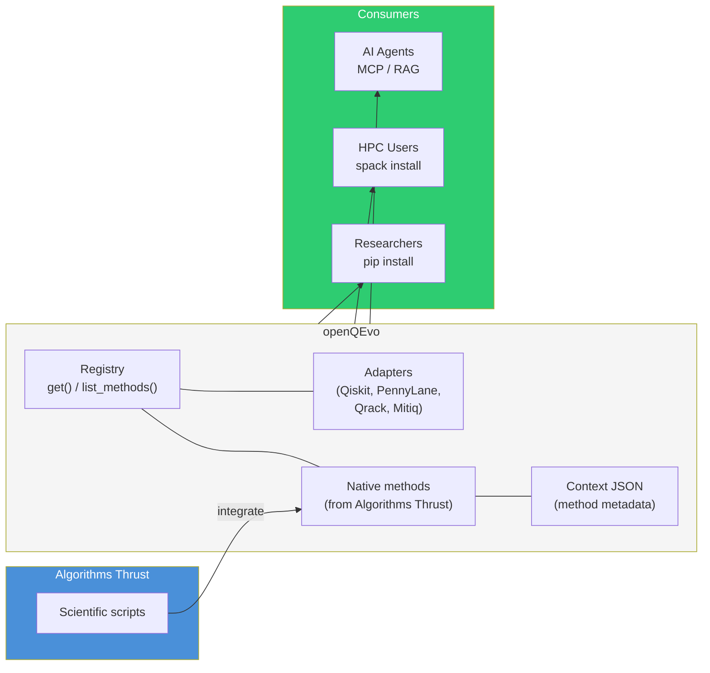

# openQEvo

**openQEvo** takes scientific scripts and prototype code from the QSC
Algorithms Thrust and packages them into a well-engineered, documented,
tested, and reproducible Python library.

The first target is **Trotterization** — computing the quantum evolution
operator $e^{-iHt}$ via product formulas. Future methods from the Algorithms
Thrust will follow the same pattern established here.

## Why this exists

Researchers in the Algorithms Thrust produce scientific scripts that
demonstrate time-evolution strategies, but these scripts are typically
standalone, undocumented, and not designed for reuse. openQEvo bridges
that gap: the Software Thrust takes those scripts, applies software
engineering practices (packaging, testing, CI/CD, documentation), adds
structured context for AI-assisted tooling, and delivers a library that
other thrusts and external users can depend on.

This repository is a **prototype** for how the Software Thrust integrates
scientific code from other thrusts into the
[openQSE](https://github.com/QSCSoftwareThrust/Thrust-Structure) ecosystem.
If the model works here, it scales to other algorithm families.

## How it works



## Methods

| Method | Source | Description | Status |
|--------|--------|-------------|--------|
| Trotter-Suzuki (1st order) | Algorithms Thrust | First-order product formula for $e^{-iHt}$ | Placeholder |
| Trotter-Suzuki (2nd order) | Algorithms Thrust | Symmetric product formula | Placeholder |
| Exact | openQEvo | Direct matrix exponentiation (reference) | Done |
| Qiskit Trotter | Qiskit | Adapter for `qiskit.synthesis.SuzukiTrotter` | Stub |
| PennyLane Trotter | PennyLane | Adapter for `qml.TrotterProduct` | Stub |
| Qrack Trotter | Qrack (Unitary Foundation) | GPU-accelerated Trotter circuit execution | Stub |
| Mitiq ZNE | Mitiq (Unitary Foundation) | Error-mitigated evolution via zero-noise extrapolation | Stub |

## Installation

```bash
pip install openqevo
```

> Package not yet released. For development:

```bash
git clone https://github.com/QSCSoftwareThrust/OpenQEvo.git
cd OpenQEvo
pip install -e ".[dev]"
```

## Usage

```python
import openqevo

# List available methods
openqevo.list_methods()
# → ['exact', 'trotter_s1', 'trotter_s2']

# Get a method by name
method = openqevo.get("trotter_s2")
result = method.evolve(terms, t=1.0, steps=10)

# Swap to a different strategy — same interface
other = openqevo.get("trotter_s1")
result = other.evolve(terms, t=1.0, steps=50)
```

## Cross-project responsibilities

| Project | Role | Issue |
|---------|------|-------|
| **HW** (Hybrid Workflows) | Context files, how-to guides, test examples | [#4](https://github.com/QSCSoftwareThrust/OpenQEvo/issues/4) |
| **DS** (Data Schema) | JSON schema for method context | [#2](https://github.com/QSCSoftwareThrust/OpenQEvo/issues/2) |
| **AS** (Agentic Software) | AI orchestration layer (MCP/RAG) | [#3](https://github.com/QSCSoftwareThrust/OpenQEvo/issues/3) |
| **SE** (Software Engineering) | Packaging, CI/CD, docs | [#1](https://github.com/QSCSoftwareThrust/OpenQEvo/issues/1) |

## Documentation

- [Architecture](docs/architecture.md) — Software design, class diagrams, and how to add new methods
- [Roadmap](docs/roadmap.md) — Implementation plan and timeline
- [Cross-project workflow](docs/cross-project.md) — How the Software Thrust projects collaborate on openQEvo
- [Contributing](CONTRIBUTING.md) — Development setup and PR guidelines

## Links

- [QSC Software Thrust](https://github.com/QSCSoftwareThrust)
- [Thrust-Structure](https://github.com/QSCSoftwareThrust/Thrust-Structure) (coordination hub)
- [DataSchema RFC: trotterization schema](https://github.com/QSCSoftwareThrust/DataSchema/issues/5)

## License

*TBD*
