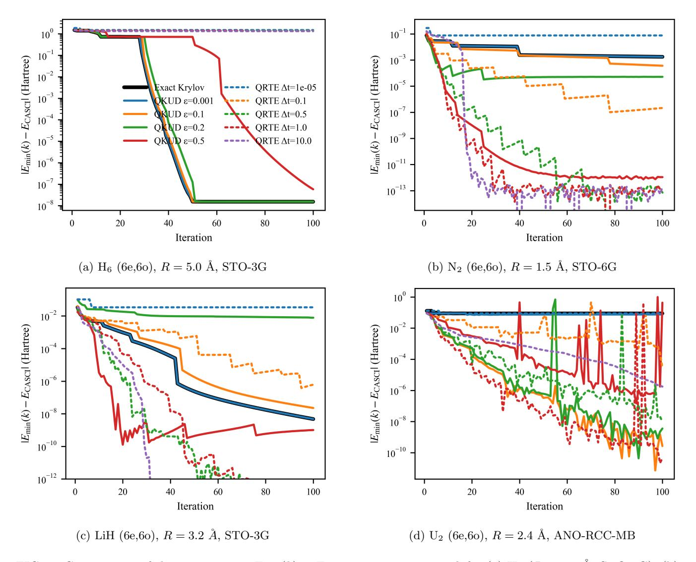
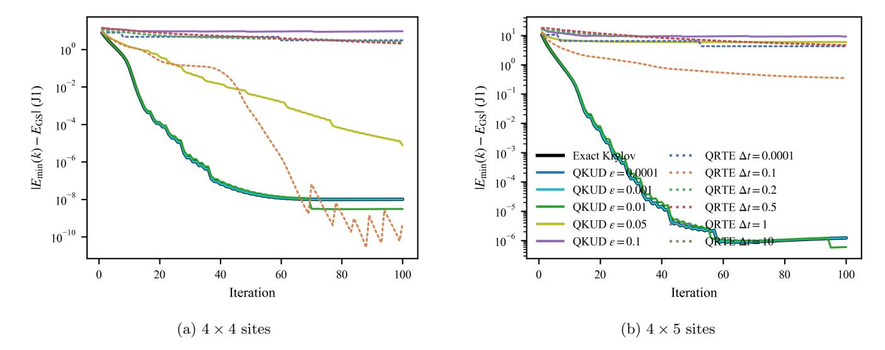
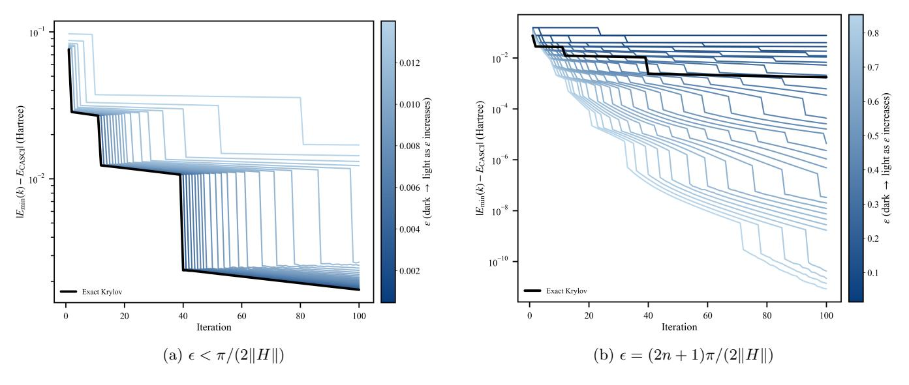
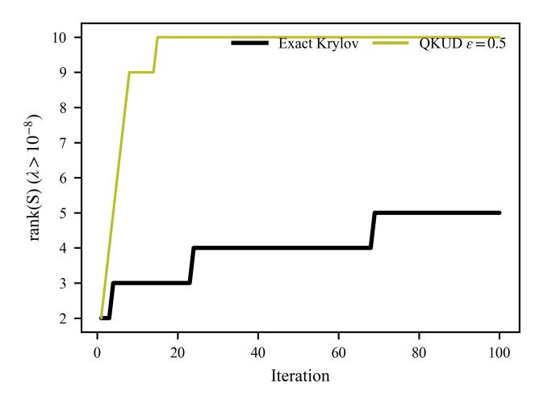
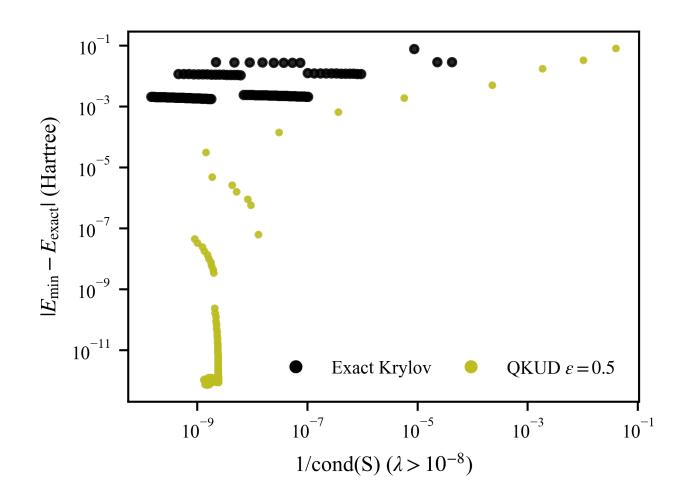

# Exact and Tunable Quantum Krylov Subspaces via Unitary Decomposition

Ayush Asthana1,\*

1Department of Chemistry, University of North Dakota, Grand Forks, ND 58201, USA

Quantum Krylov subspace methods can extract ground and excited states by diagonalizing the Hamiltonian in a compact variational space. In practice, these spaces are almost always generated by real or imaginary time evolution, forcing a timestep trade-off between dynamical accuracy and basis collapse and often producing ill-conditioned overlap matrices that stall convergence. Here we introduce Quantum Krylov using Unitary Decomposition (QKUD), a time-evolution-free construction that maps Hamiltonian powers to implementable unitaries via the Hermitian transform  $\sin(\epsilon H)/\epsilon$ . QKUD reduces to the exact Hamiltonian-power Krylov recursion as  $\epsilon \to 0$ , while finite  $\epsilon$  provides a controllable deformation that tunes subspace geometry and improves conditioning. Across molecular active-space benchmarks and a frustrated 2D J1-J2 Heisenberg model, QKUD reproduces exact-Krylov convergence in well-conditioned regimes and systematically restores variational improvement when both exact Krylov and time-evolution Krylov stagnate. These results identify overlap conditioning, instead of time-evolution fidelity, is the key resource for robust quantum Krylov simulation and provide a resilient way forward for accurate quantum simulation of challenging quantum many-body problems.

### I. INTRODUCTION

Rapid advances in quantum hardware and algorithms [1–9] have led to early fault-tolerant demonstrations and first experiments on emerging platforms [10-14], yet it remains unclear which algorithmic paradigms can deliver decisive advantage on scientifically relevant many-body problems under realistic resource constraints [15]. Quantum phase estimation (QPE) [16– 18] is a flagship fault-tolerant approach, but its resource demands and the initial-state problem [18] motivate complementary strategies. Near-term variational methods such as ADAPT-VQE [19, 20] and other directions including dissipative engineering and quantum control [21–23] are promising but can incur substantial optimization or measurement overhead. In this landscape, quantum Krylov subspace algorithms [24–29] (see Ref. [30] for a review) offer a meaningful middle ground by extracting eigenstates from compact variational subspaces whose basis vectors can be represented exactly on a quantum processor [31]. They have also been recently used for error mitigation in large systems [32] A broad family of Krylov constructions has been proposed, including QLanczos [33], QRTE and related filter-diagonalization methods [34–37], QITE-based approaches [33, 38, 39], multireference and power-method variants [40–43], and recent sampling-diagonalization implementations [44, 45]. However, almost all practical quantum Krylov methods construct the basis by real or imaginary time evolution, introducing a timestep  $\Delta t$  that must be chosen a priori. This creates an intrinsic tradeoff: small  $\Delta t$  improves dynamical fidelity but drives successive basis vectors toward near-linear dependence (basis collapse), while larger  $\Delta t$  can alleviate collapse at the cost of system-dependent distortions of the Krylov

span. Consequently, aside from resource-intensive exact constructions such as Chebyshev-polynomial Krylov [26], current time-evolution Krylov approaches are not strictly exact and can stagnate or become highly parameter sensitive with no standard way of finding a parameter that universally works.

Here we address this bottleneck by constructing quantum Krylov subspaces without explicit time evolution. Building on unitary decomposition techniques [46, 47], we map Hamiltonian powers to unitary operations on a quantum device and introduce Quantum Krylov using Unitary Decomposition (QKUD). QKUD recovers strict Krylov recursion in the limit  $\epsilon \to 0$ , while finite  $\epsilon$  provides a controlled deformation of the subspace geometry (conditioning and linear independence) rather than discretizing physical time. This decoupling eliminates timestep-selection ambiguity and avoids the basiscollapse pathology inherent to time-stepped constructions. Unlike Chebyshev polynomial Krylov methods, which require high-degree unitary polynomial approximations to H (hence deep circuits), QKUD achieves exactness in principle and also offers a continuous interpolation between exact and deformed subspaces. We show across molecular benchmarks and a many-body spin model that QKUD mimics exact Krylov convergence at low  $\epsilon$  and exactly solves the problem when the exact Krylov is well behaved. In cases where exact Krylov saturates early, increasing  $\epsilon$  in periods of  $\frac{(2n+1)\pi}{2||H||}$  or  $\frac{(n)\pi}{||H||}$ provides a systematic way of deforming the subspaces to break through the ill-conditioning of the overlap matrix. This approach suggests a new paradigm for quantum algorithms by treating subspace geometry as a controllable resource, potentially improving robustness across many applications and associated algorithms.

\* ayush.asthana@und.edu

### II. THEORY

Krylov algorithms build a variational subspace by repeatedly applying an operator derived from the Hamiltonian to an initial state. Writing  $|\Psi_0\rangle = \sum_j c_j |E_j\rangle$ , one has  $\hat{H}^n|\Psi_0\rangle = \sum_j c_j E_j^n |E_j\rangle$ , so successive Krylov vectors contain increasingly high powers of the eigenvalues. With a suitable shift/rescaling (so the ground-state eigenvalue is extremal in magnitude), these powers act as a spectral filter that effectively magnifies the ground-state contribution relative to excited-state components, enabling rapid convergence upon subspace diagonalization.

# A. QKUD: Quantum Krylov using Unitary Decomposition

In this section, we outline the theoretical formulation of QKUD method. The key idea is to construct the Krylov basis using a Hermitian combination of unitary operators derived from the Hamiltonian, instead of relying on approximate time-evolution. For a Hermitian Hamiltonian  $\hat{H}$  (such as a molecular Hamiltonian), we define the unitary operator

$$X = ie^{-i\epsilon \hat{H}},\tag{1}$$

where  $\epsilon$  is a small real deformation parameter. Note that X is unitary (up to the global phase i), so  $X + X^{\dagger}$  is a Hermitian operator. Starting from an initial state  $|\Psi_0\rangle$ , we generate the Krylov subspace by repeatedly applying  $X + X^{\dagger}$  (developed using unitary decomposition technique in Ref. [46]). The first Krylov basis state is

$$|\Psi_1\rangle = \frac{1}{2\epsilon}(X + X^{\dagger})|\Psi_0\rangle,$$
 (2)

and higher-order basis states are obtained recursively as

$$|\Psi_n\rangle = \frac{1}{2\epsilon}(X + X^{\dagger})|\Psi_{n-1}\rangle.$$
 (3)

Up to normalization, this means  $|\Psi_n\rangle \propto (X+X^{\dagger})^n |\Psi_0\rangle$ . In the limit  $\epsilon \to 0$ ,  $(X+X^{\dagger})$  approaches  $2\epsilon \hat{H}$  as

$$ie^{-i\epsilon\hat{H}} = i(I - i\epsilon\hat{H} + \mathcal{O}(\epsilon^2)),$$
 (4)

$$\frac{1}{2\epsilon}(X+X^{\dagger}) = \hat{H} + \mathcal{O}(\epsilon^2), \tag{5}$$

and thus the above recursion exactly recovers the standard Krylov subspace  $\{|\Psi_0\rangle, \hat{H}|\Psi_0\rangle, \hat{H}^2|\Psi_0\rangle, \dots\}$ . For any finite  $\epsilon$ , however, the generated subspace is a smoothly deformed version of the exact Krylov space.

It is important to emphasize that  $\epsilon$  in QKUD is not a real or imaginary time-step parameter. There is no time-step tradeoff that governing basis collapse in QKUD. The  $\epsilon$ , instead, serves as a variational control that tunes the geometry of the Krylov basis. As  $\epsilon$  deviates from zero, the basis vectors  $|\Psi_n\rangle$  are gradually deformed away from the

strict power-of- $\hat{H}$  form. This continuous deformation can improve numerical conditioning of the subspace without introducing the systematic errors that a discrete timestep would entail. In practice, we observe that QKUD remains stable over a broad range of  $\epsilon$  values, and in the  $\epsilon \to 0$  limit it converges to the exact Krylov algorithm, as expected.

To evaluate eigenvalues in this variational Krylov basis, we express the required matrix elements that project the Hamiltonian on the Krylov subspace as expectation values that can be measured on the quantum processor. The i, j Matrix elements for the Hamiltonian  $(M_{i,j})$  and overlap matrices  $(S_{i,j})$  in QKUD can be written as

$$\langle \Psi_i | \hat{H} | \Psi_j \rangle = \frac{1}{(2\epsilon)^{i+j}} \langle \Psi_0 | (X + X^{\dagger})^{i\dagger} \hat{H} (X + X^{\dagger})^j | \Psi_0 \rangle,$$
$$\langle \Psi_i | \Psi_j \rangle = \frac{1}{(2\epsilon)^{i+j}} \langle \Psi_0 | (X + X^{\dagger})^{i\dagger} (X + X^{\dagger})^j | \Psi_0 \rangle,$$
(6)

which involves an expectation value evaluated on the initial state  $|\Psi_0\rangle$  with unitary operations X and  $X^{\dagger}$  applied. Using these measured matrix elements, we set up the generalized eigenvalue problem

$$MC = SCE,$$
 (7)

which is solved on a classical computer to obtain the eigenvalues E. The coefficients in C define the linear combination of the  $|\Psi_i\rangle$  that approximates the eigenstate. In practice, we grow the Krylov subspace incrementally one Krylov vector at a time. One convergence criterion is that the lowest eigenvalue has converged within a tolerance,  $|E_n - E_{n-1}| < \delta$ , at which point adding further basis vectors does not significantly change the result. Another possible criterion is based on linear dependence: if the newly generated  $|\Psi_n\rangle$  is nearly redundant with the existing subspace, then the effective dimension of the Krylov space has been saturated. We define the effective rank of the overlap matrix S as the number of eigenvalues  $\lambda_i$  of S that exceed a small cutoff (e.g.  $\lambda_i > 10^{-8}$ ); this provides a quantitative measure of the independent subspace size.

Finally, we provide two implementation proposals (provided in detail in SI) of QKUD on quantum hardware. The first is the straightforward implementation of Eq.(3) for each new Krylov vector but that would require fault-tolerant hardware. The second is a hardware-friendly implementation, that is carried out by realizing  $(X + X^{\dagger})$  operations by breaking down the linear combination of operators into independent expectation value measurements; for example, the first expectation value

can be written as

$$\langle \Psi_{1} | H | \Psi_{1} \rangle = \frac{1}{(2\epsilon)^{2}} \langle \Psi_{0} | (\hat{X} + \hat{X}^{\dagger}) H (\hat{X} + \hat{X}^{\dagger}) | \Psi_{0} \rangle,$$

$$= \frac{1}{(2\epsilon)^{2}} \langle \Psi_{0} | \hat{X} H \hat{X} | \Psi_{0} \rangle + \frac{1}{(2\epsilon)^{2}} \langle \Psi_{0} | \hat{X}^{\dagger} H \hat{X} | \Psi_{0} \rangle$$

$$+ \frac{1}{(2\epsilon)^{2}} \langle \Psi_{0} | \hat{X} H \hat{X}^{\dagger} | \Psi_{0} \rangle + \frac{1}{(2\epsilon)^{2}} \langle \Psi_{0} | \hat{X}^{\dagger} H \hat{X}^{\dagger} | \Psi_{0} \rangle.$$
(8)

Each of these expectation values requires prepared states of the form  $e^{\pm i\epsilon n_i H} |\Psi_0\rangle$  (forward and backward timeevolution terms), which are as complex to prepare as in QRTE. These quantum measurements are then followed by classical postprocessing. Although the QKUD vectors are constructed from forward- and backwardevolved states, their final combination reconstructs the exact action of H on  $|\Psi_0\rangle$  rather than a time-evolved state. QKUD has no worse asymptotic scaling in shot count, circuit depth, or qubit count than standard subspace-diagonalization Krylov approaches (e.g., QRTE and related filter-diagonalization methods), which require  $O(i^2N^4)$  shots without simplifications, where i and N are the numbers of iterations and qubits, respectively. In the hardware-friendly version we propose, the number of quantum measurements is only four times that of standard QRTE while maintaining the same gate depth. This simplicity makes QKUD a promising and practical approach for current and future quantum devices.

#### B. QRTE: Qauntum Real-Time Evolution

In time-evolution-based Krylov methods, QRTE is the most popular method. In QRTE-based quantum Krylov methods and closely connected filter-diagonalization schemes [33, 34, 48] the basis is generated by discrete real-time propagation under  $\hat{H}$ ,

$$U(\Delta t) = e^{-i\hat{H}\Delta t},$$

$$|\Phi_n\rangle = U(\Delta t)^n |\Psi_0\rangle, \quad n = 0, \dots, K - 1.$$
(9)

Writing  $|\Psi_0\rangle = \sum_j c_j |E_j\rangle$  gives  $|\Phi_n\rangle = \sum_j c_j e^{-iE_j n\Delta t} |E_j\rangle$ , so the subspace is controlled by the sampled phases  $e^{-iE_j\Delta t}$ . The matrices entering the generalized eigenvalue problem (7) can be expressed as time-correlation functions,

$$S_{i,j} = \langle \Phi_i | \Phi_j \rangle,$$

$$M_{i,j} = \langle \Phi_i | \hat{H} | \Phi_j \rangle.$$
(11)

Filter diagonalization replaces  $\{|\Phi_n\rangle\}$  by energy-windowed combinations  $|\chi_{\mu}\rangle = \sum_{n=0}^{K-1} w_{\mu n} |\Phi_n\rangle$ , which induces a spectral filter  $F_{\mu}(E) = \sum_{n=0}^{K-1} w_{\mu n} e^{-iEn\Delta t}$  so that  $|\chi_{\mu}\rangle = \sum_{j} c_j F_{\mu}(E_j) |E_j\rangle$ . A key practical distinction from QKUD is that  $\Delta t$  simultaneously sets basis geometry and spectral sampling: for small  $\Delta t$ ,  $U(\Delta t) \approx$ 

 $I-i\hat{H}\Delta t$  and successive  $|\Phi_n\rangle$  become nearly linearly dependent (basis collapse), while larger  $\Delta t$  can reduce collapse but changes the induced span through the  $2\pi/\Delta t$  periodicity of  $E\mapsto e^{-iE\Delta t}$ . In contrast, QKUD tunes subspace geometry via the deformation parameter  $\epsilon$  in  $(X+X^{\dagger})/(2\epsilon)=\hat{H}+\mathcal{O}(\epsilon^2)$  (5) without introducing any physical time discretization.

#### III. RESULTS AND DISCUSSION

The benchmarks in Figs. 1–2 evaluate a single practical question: under realistic iteration and measurement budgets, what controls whether a Krylov-type variational procedure continues to make progress? Across both lattice and molecular problems, the trends consistently indicate that the dominant limiter is the conditioning (linear independence) of the generated basis and the resulting stability of the generalized eigenvalue problem, rather than the nominal fidelity of the primitive used to generate trial vectors. This distinction is particularly sharp for QRTE-style constructions. While taking  $\Delta t \rightarrow 0$  improves dynamical faithfulness, it simultaneously drives successive time-evolved vectors toward near-linear dependence (since  $e^{-i\hat{H}\Delta t} \approx I - i\hat{H}\Delta t$ ), causing basis collapse and ill-conditioned overlap matrices. Increasing  $\Delta t$  can mitigate collapse by separating eigenphases more strongly, but it also introduces system-dependent distortions of the induced span; consequently, the performance of fixed- $\Delta t$  QRTE becomes a tuning problem whose solution need not transfer across systems. QKUD addresses the same bottleneck by operating directly at the level of Hamiltonian-power subspaces: it reduces to strict exact Krylov recursion as  $\epsilon \to 0$  and introduces a controlled  $O(\epsilon^2)$  deformation at finite  $\epsilon$  (5), so  $\epsilon$  tunes subspace geometry without appealing to discretized physical time.

# A. Varied correlation character in chemical model systems

The molecular active-space benchmarks in Fig. 1 are chosen to carefully span a wide range of electronic correlation regimes ranging from moderate to challenging in the active space size [49]. It shows the following behavior in chemically relevant settings, with errors reported relative to CASCI. First, QRTE remains strongly  $\Delta t$  dependent and can fail to provide a usable basis within a practical iteration window. This is most apparent in H6 (Fig. 1), where, across the explored timesteps, QRTE does not consistently access the low-error regime within the iteration budget: small  $\Delta t$  values plateau early in a manner consistent with collapse, while larger  $\Delta t$  values do not reliably recover monotonic convergence. QKUD, by contrast, exhibits stable convergence in this case and closely follows Exact Krylov at small  $\epsilon$ , consistent with its  $\epsilon \to 0$  limit. Second, several molecular panels highlight a complementary regime in which strict (non-

FIG. 1: Convergence of the energy error  $E_{\min}(k) - E_{\text{CASCI}}$  versus iteration k for (a) H6 (R = 5.0 Å, STO-3G), (b) N2 (R = 1.5 Å, STO-6G), (c) LiH (R = 3.2 Å, STO-3G), and (d) U2 (R = 2.4 Å, ANO-RCC-MB) in the (6e,6o) active space. Exact Krylov is compared with QKUD and QRTE with various parameter values. Differences in convergence primarily reflect the conditioning of the generated subspace rather than time-evolution accuracy.

orthogonalized) Krylov recursion itself saturates early within the tested iteration window. In such cases, taking  $\epsilon$  very small forces QKUD to reproduce that same saturation, whereas moderate  $\epsilon$  values deliberately reshape the span enough to restore variational improvement. This behavior is clearly reflected in instances where the Exact Krylov reference stalls at a relatively large residual error while larger  $\epsilon$  choices (and, in QRTE, certain larger timesteps) achieve additional orders-of-magnitude improvement. The natural interpretation is that, once the overlap spectrum develops extremely small eigenvalues, the procedure stops adding genuinely new independent information; controlled distortion can reweight the span so that the generalized eigenproblem remains informative and the Ritz value continues to improve. Across the molecular benchmarks studied here, QKUD is consistent and reaches chemical accuracy in every case.

### B. Generality: frustrated $J_1$ – $J_2$ Heisenberg Hamiltonian on a Square Lattice

In Fig. 2, we study a spin- $\frac{1}{2}$  model on an  $L_x \times L_y$  square lattice with site coordinates (x, y), where  $x = 0, \ldots, L_x - 1$  and  $y = 0, \ldots, L_y - 1$ . The implementation maps each site to a qubit. The Hamiltonian is

$$\hat{H} = J_1 \sum_{\langle i,j \rangle} \left( \hat{X}_i \hat{X}_j + \hat{Y}_i \hat{Y}_j + \hat{Z}_i \hat{Z}_j \right)$$

$$+ J_2 \sum_{\langle \langle i,j \rangle \rangle} \left( \hat{X}_i \hat{X}_j + \hat{Y}_i \hat{Y}_j + \hat{Z}_i \hat{Z}_j \right),$$

$$(12)$$

FIG. 2: Frustrated 2D Heisenberg model at  $J_2/J_1 = 0.5$ : energy error (relative to exact diagonalization) versus Krylov iteration k for increasing system size: (a)  $4 \times 4$ , and (b)  $4 \times 5$  sites. As the system size increases, a QRTE-generated Krylov basis built from fixed timesteps  $\Delta t$  becomes increasingly unreliable (no single  $\Delta t$  yields consistent convergence), illustrating the breakdown of a fixed- $\Delta t$  strategy at larger sizes.

FIG. 3: N2 at R=1.5 Å (STO-6G): QKUD behavior for two representative deformation-parameter choice, shown for (a)  $\epsilon < \pi/(2\|H\|)$  and (b)  $\epsilon = (2n+1)\pi/(2\|H\|)$ .  $\epsilon$  is chosen to be between 0 and  $\frac{\pi}{2|H|}$  in (a) and chosen as the odd periods of  $\frac{\pi}{2|H|}$  in (b). In both cases  $\epsilon$  smoothly deforms the geometry that allows it to reach close to exact Krylov solution in (a) and very high accuracies compared with exact solver solution in (b).

where  $\hat{X}, \hat{Y}, \hat{Z}$  are Pauli operators Nearest-neighbor bonds  $\langle i, j \rangle$  are generated along the horizontal and vertical directions:

$$(x,y) \leftrightarrow (x+1,y), \qquad (x,y) \leftrightarrow (x,y+1), \qquad (13)$$

while next-nearest-neighbor (frustrating) bonds  $\langle\!\langle i,j\rangle\!\rangle$  are taken along both diagonals:

$$(x,y) \leftrightarrow (x+1,y+1), \qquad (x,y) \leftrightarrow (x+1,y-1).$$
 (14)

Each bond is included once. Open boundaries with only in-range pairs are kept. In the numerical analysis, couplings are parameterized as

$$J_1 = 1, J_2 = r J_1, (15)$$

with  $r \equiv J_2/J_1$  controlling frustration that we set to 0.5 which places the model in the frustrated regime.

Figure 2 provides a stringent scalability test reporting the ground-state energy error relative to exact di-

agonalization as a function of Krylov iteration for increasing lattice size of the frustrated 2D model. For the smaller lattices, QRTE can yield strong convergence for  $\Delta t = 0.1$ , but this behavior is not scalable: as the lattice grows from  $4 \times 4$  to  $4 \times 5$ , fixed- $\Delta t$  QRTE becomes increasingly unreliable, with different timesteps exhibiting stagnation or inconsistent late-iteration behavior and no single  $\Delta t$  producing uniform convergence across sizes. This is consistent with the underlying spectral picture: as the many-body spectrum becomes denser and more structured with system size, the window of timesteps that avoids both (i) collapse from near-linear dependence and (ii) unhelpful distortion narrows and shifts in an instancedependent manner. In contrast, QKUD closely tracks the Exact Krylov reference whenever strict recursion remains well conditioned, and it maintains stable convergence across the full size sweep for small-to-moderate  $\epsilon$ . The key point is not that time evolution becomes generically "less accurate" with size, but that fixed- $\Delta t$ sampling becomes a progressively more brittle method to generate a well-conditioned, variationally useful basis as many-body complexity increases. There are some many-body Hamiltonian cases where even QKUD can exhibit linear dependence, especially when the exact Krylov saturates quickly; these cases may be assisted by using a shifted Hamiltonian to reduce its norm or combining QKUD with a multireference starting state, for example as proposed in MRSQK [50].

Taken together, these results support a unified operating principle for practical quantum Krylov algorithms. When strict Krylov recursion is a good solution (i.e., the generated basis remains well conditioned over the relevant iteration range), QKUD at small  $\epsilon$  is essentially indistinguishable from Exact Krylov, as expected. When strict recursion saturates within realistic iteration limits, finite  $\epsilon$  provides a systematic and predictable knob to deform the basis and recover progress. QRTE, in contrast, achieves collapse-avoidance and distortion only indirectly through a fixed timestep, making its performance intrinsically  $\Delta t$  dependent: for some instances it may be impossible to find any fixed  $\Delta t$  that works within the available budget (as in  $H_6$ ), and even when convergence is possible, identifying a suitable timestep becomes increasingly difficult as system size and spectral complexity grow (as in the frustrated 2D scaling). The broader implication is that scalable Krylov strategies should prioritize explicit control of overlap conditioning and subspace geometry over reliance on delicate, instance-specific timestep selection in real-time evolution constructions.

### C. Role of deformation parameter $\epsilon$

QKUD is built from the Hermitian generator

$$A(\epsilon) \equiv \frac{\hat{X} + \hat{X}^{\dagger}}{2\epsilon} = \frac{\sin(\epsilon \hat{H})}{\epsilon}, \tag{16}$$

which reduces to Hamiltonian-power Krylov in the small-  $\epsilon$  limit,

$$\frac{\sin(\epsilon \hat{H})}{\epsilon} = \hat{H} + \mathcal{O}(\epsilon^2). \tag{17}$$

Finite  $\epsilon$  therefore does not represent a time step; it smoothly deforms the Krylov span by a controlled spectral reweighting. In the eigenbasis  $\hat{H}|E\rangle = E|E\rangle$ ,

$$A(\epsilon)|E\rangle = f_{\epsilon}(E)|E\rangle, \qquad f_{\epsilon}(E) = \frac{\sin(\epsilon E)}{\epsilon} = E\operatorname{sinc}(\epsilon E),$$
(18)

so increasing  $\epsilon$  damps large-|E| components through the sinc factor and can improve the conditioning of the overlap matrix without sacrificing Hermiticity.

A convenient operating window is set by the Hamiltonian norm  $||H|| \equiv \max |E|$ . Different strategies for estimating ||H|| such as through use of Jordon-Wignerized Pauli Hamiltonian. When  $\epsilon < \pi/(2||H||)$ , the map  $E \mapsto \sin(\epsilon E)$  is monotone across the full spectrum, so QKUD remains strongly Krylov-like while still benefitting from mild spectral damping. This behavior is consistent with our N2 results in Fig. 3a, where trajectories for  $\epsilon \in (0, \pi/(2||H||))$  track the exact-Krylov trend and show stable, predictable convergence.

Beyond this window, the spectral reweighting becomes more aggressive and can be exploited deliberately to mitigate collinearity of Kryov vectors and generalizedeigenproblem ill-conditioning that may cause the exact-Krylov baseline to stall at larger subspace sizes. A particularly robust practical choice is a discrete schedule

$$\epsilon_n = \frac{n\pi}{||H||} \text{ or } \frac{(2n+1)\pi}{2||H||},$$
(19)

which periodically suppresses extremal spectral contributions and refreshes the effective geometry of the generated vectors. Empirically, this schedule yields a more consistent convergence story on N2 (Fig. 3), with many runs continuing to improve even in regimes where the exact-Krylov curve saturates. For this reason, we recommend  $\epsilon_n = n\pi/||H||$  or  $\frac{(2n+1)\pi}{2||H||}$  as default, especially as a fallback strategy when overlap conditioning limits further progress in the undeformed Krylov recursion.

Relative to QRTE, the key distinction is that QRTE tunes subspace geometry indirectly through the unitary step  $U(\Delta t) = e^{-i\hat{H}\Delta t}$ , where too small  $\Delta t$  hints at nearlinear dependence  $(U(\Delta t) \approx I - i\hat{H}\Delta t)$  and larger  $\Delta t$  introduces phase wrapping through the periodic map  $E \mapsto e^{-iE\Delta t}$ . In contrast, QKUD uses the Hermitian, analytic transform  $\sin\left(\epsilon\hat{H}\right)/\epsilon$ , so  $\epsilon$  acts as a direct and controllable deformation knob, with a natural monotone regime and a simple discrete schedule that can be used to improve robustness when conditioning becomes the limiting factor.

- (a) Effective rank of the overlap matrix S vs. iteration k (counting eigenvalues  $\lambda(S) > 10^{-8}$ ).
- (b) Energy error  $|E_{\min}(k) E_{\text{CASCI}}|$  vs. inverse condition number 1/cond(S).

FIG. 4: Subspace-geometry diagnostics for N2 at R = 1.5 Å (STO-6G, 6e,6o). (a) Effective rank of the Krylov overlap matrix S as the subspace grows. (b) Energy error plotted against  $1/\text{cond}(S) = \sigma_{\min}(S)/\sigma_{\max}(S)$ . Improved energy in QKUD correlate with rank growth and maintaining a well-conditioned overlap matrix.

## D. Geometry analysis

### IV. CONCLUSIONS

Figure 4a and Fig. 4b directly diagnose how subspace geometry limits convergence for  $N_2$  at R = 1.5 Å and how QKUD alleviates this bottleneck. In Fig. 4b, we plot the achieved energy error  $|E_{\min} - E_{\text{exact}}|$  versus  $1/\operatorname{cond}(S)$ , where  $\operatorname{cond}(S)$  is computed after discarding overlap eigenvalues below 10-8; moving left corresponds to a more ill conditioned overlap and a harder generalized eigenproblem. Exact Krylov (black) clusters at relatively large errors even deep in the ill conditioned regime, indicating that the nominal increase in iteration does not translate into additional usable directions in the span and the solve effectively stalls. In contrast, QKUD at fixed  $\epsilon = 0.5$  (yellow) accesses orders-of-magnitude smaller errors while operating at comparable values of 1/cond(S), consistent with the deformation producing vectors that remain informative for the target eigenspace rather than collapsing into near-collinearity. This interpretation is corroborated by Fig. 4a, which reports the effective rank of S (counting eigenvalues  $\lambda > 10^{-8}$ ): QKUD rapidly grows to near full rank (approaching the intended subspace dimension) within the first few tens of iterations, whereas exact Krylov remains rank limited throughout. Together, these results show that QKUD improves the usable dimensionality and stability of the subspace, enabling continued variational improvement precisely in regimes where overlap ill conditioning constrains the undeformed Krylov recursion.

We introduced Quantum Krylov using Unitary Decomposition (QKUD), a strategy for constructing quantum Krylov subspaces without explicit time evolution by mapping Hamiltonian powers through a unitary decomposition. QKUD is formally exact in the limit  $\epsilon \to 0$ , recovering strict Krylov recursion, while finite  $\epsilon$  provides a controlled deformation that tunes subspace geometry rather than discretizing physical time. This separation removes timestep-selection ambiguity inherent to real-time-evolution Krylov methods and mitigates basis collapse when successive time-evolved vectors become nearly linearly dependent.

Across benchmarks spanning weakly correlated, neardegenerate, and strongly correlated regimes, QKUD reproduces exact Krylov convergence when the recursion remains well conditioned and restores convergence when strict Krylov and time-evolution-generated bases stagnate within practical iteration budgets. try diagnostics show that energy improvement tracks overlap-matrix stability, including maintaining nonvanishing  $\sigma_{\min}$  and avoiding large  $\operatorname{cond}(S)$ , more reliably than it tracks rank growth alone. This identifies overlap conditioning, not time-evolution fidelity, as the relevant bottleneck for Krylov performance on quantum hardware. Classically, basis collapse is addressed by orthogonalization or restarts; however, full re-orthonormalization of quantum states is prohibitively costly. QKUD instead improves robustness by modifying basis generation to avoid linear dependence.

For near-term and early fault-tolerant quantum simulation, these results suggest that Krylov algorithm design should prioritize control of Krylov-subspace geometry and conditioning over pursuing ever more accurate coherent time evolution. The stagnation of exact Krylov observed for  $N_2$  and  $U_2$  illustrates that this limitation is most severe in strongly correlated settings, and the same mechanism is expected to arise broadly in interacting many-body systems. QKUD not only provides a route to exact Krylov simulation in principle, but also offers a tunable, analytic handle for shaping the Krylov basis under realistic resource constraints, complementary to asymptotically exact approaches. More broadly, treating subspace geometry as a controllable resource suggests new directions for robust Krylov-based simulation and related iterative quantum algorithms.

V. ACKNOWLEDGMENTS

AA acknowledges NSF awards 2427046 and 2429752 for support. AA thanks Anthony Schlimgen and Kade Head-Marsden for helpful discussions, and Ed Barnes for helpful feedback on this project. AA thanks Tushar Kumar Jain, Nick Mayhall, and Vibin Abraham for their useful comments. AA also acknowledges the UND Computational Research Center for computing resources.

- Y. Alexeev, V. S. Batista, N. Bauman, L. Bertels, D. Claudino, R. Dutta, L. Gagliardi, S. Godwin, N. Govind, M. Head-Gordon, et al., A perspective on quantum computing applications in quantum chemistry using 25–100 logical qubits, J. Chem. Theory Comput. (2025).
- [2] J. Tilly, H. Chen, S. Cao, D. Picozzi, K. Setia, Y. Li, E. Grant, L. Wossnig, I. Rungger, G. H. Booth, et al., The variational quantum eigensolver: a review of methods and best practices, arXiv (2021).
- [3] S. McArdle, S. Endo, A. Aspuru-Guzik, S. C. Benjamin, and X. Yuan, Quantum comput. chem., Rev. Modern Phys. 92, 015003 (2020).
- [4] M. Cerezo, A. Arrasmith, R. Babbush, S. C. Benjamin, S. Endo, K. Fujii, J. R. McClean, K. Mitarai, X. Yuan, L. Cincio, et al., Variational quantum algorithms, Nat. Rev. Phys., 1 (2021).
- [5] A. Peruzzo, J. McClean, P. Shadbolt, M.-H. Yung, X.-Q. Zhou, P. J. Love, A. Aspuru-Guzik, and J. L. O'brien, A variational eigenvalue solver on a photonic quantum processor, Nat. Commun. 5, 1 (2014).
- [6] A. B. Magann, C. Arenz, M. D. Grace, T.-S. Ho, R. L. Kosut, J. R. McClean, H. A. Rabitz, and M. Sarovar, From pulses to circuits and back again: A quantum optimal control perspective on variational quantum algorithms, Quantum 2, 010101 (2021).
- [7] A. Kandala, A. Mezzacapo, K. Temme, M. Takita, M. Brink, J. M. Chow, and J. M. Gambetta, Hardwareefficient variational quantum eigensolver for small molecules and quantum magnets, Nature 549, 242 (2017).
- [8] Y. Cao, J. Romero, J. P. Olson, M. Degroote, P. D. Johnson, M. Kieferová, I. D. Kivlichan, T. Menke, B. Peropadre, N. P. Sawaya, et al., Quantum chemistry in the age of quantum computing, Chem. Rev. 119, 10856 (2019).
- [9] D. A. Fedorov, B. Peng, N. Govind, and Y. Alexeev, Vqe method: A short survey and recent developments, Mat. Theory 6, 1 (2022).
- [10] Observation of constructive interference at the edge of quantum ergodicity, Nature **646**, 825 (2025).
- [11] J. Robledo-Moreno, M. Motta, H. Haas, A. Javadi-Abhari, P. Jurcevic, W. Kirby, S. Martiel, K. Sharma, S. Sharma, T. Shirakawa, et al., Chemistry beyond exact solutions on a quantum-centric supercomputer, arXiv

- (2024).
- [12] S. Barison, J. R. Moreno, and M. Motta, Quantumcentric computation of molecular excited states with extended sample-based quantum diagonalization, Quantum 10, 025034 (2025).
- [13] D. Danilov, J. Robledo-Moreno, K. J. Sung, M. Motta, and J. Shee, Enhancing the accuracy and efficiency of sample-based quantum diagonalization with phaseless auxiliary-field quantum monte carlo, J. Chem. Theory Comput. (2025).
- [14] Y. Yoshida, L. Erhart, T. Murokoshi, R. Nakagawa, C. Mori, T. Miyanaga, T. Mori, and W. Mizukami, Auxiliary-field quantum monte carlo method with quantum selected configuration interaction, arXiv preprint arXiv:2502.21081 (2025).
- [15] R. Babbush, R. King, S. Boixo, W. Huggins, T. Khattar, G. H. Low, J. R. McClean, T. O'Brien, and N. C. Rubin, The grand challenge of quantum applications, arXiv (2025).
- [16] A. Y. Kitaev, Quantum measurements and the abelian stabilizer problem, arXiv preprint quant-ph/9511026 (1995).
- [17] B. Bauer, S. Bravyi, M. Motta, and G. K.-L. Chan, Quantum algorithms for quantum chemistry and quantum materials science, Chem. Rev. 120, 12685 (2020).
- [18] S. Lee, J. Lee, H. Zhai, Y. Tong, A. M. Dalzell, A. Kumar, P. Helms, J. Gray, Z.-H. Cui, W. Liu, et al., Evaluating the evidence for exponential quantum advantage in ground-state quantum chemistry, Nat. Commun. 14, 1952 (2023).
- [19] H. R. Grimsley, S. E. Economou, E. Barnes, and N. J. Mayhall, An adaptive variational algorithm for exact molecular simulations on a quantum computer, Nat. Commun. 10, 1 (2019).
- [20] M. Ramôa, P. G. Anastasiou, L. P. Santos, N. J. Mayhall, E. Barnes, and S. E. Economou, Reducing the resources required by adapt-vqe using coupled exchange operators and improved subroutines, Quantum 11, 86 (2025).
- [21] L. Lin, Dissipative preparation of many-body quantum states: Toward practical quantum advantage, APL Computational Physics 1, 010901 (2025).
- [22] O. R. Meitei, B. T. Gard, G. S. Barron, D. P. Pappas, S. E. Economou, E. Barnes, and N. J. Mayhall, Gate-free state preparation for fast variational quantum eigensolver simulations, Quantum 7, 155 (2021).

- [23] A. Asthana, C. Liu, O. R. Meitei, S. E. Economou, E. Barnes, and N. J. Mayhall, Minimizing state preparation times in pulse-level variational molecular simulations, arXiv (2022).
- [24] C. L. Cortes and S. K. Gray, Quantum krylov subspace algorithms for ground-and excited-state energy estimation, Phys. Rev. A 105, 022417 (2022).
- [25] P. Nandy, A. S. Matsoukas-Roubeas, P. Martínez-Azcona, A. Dymarsky, and A. del Campo, Quantum dynamics in krylov space: Methods and applications, Physics Reports 1125, 1 (2025).
- [26] W. Kirby, M. Motta, and A. Mezzacapo, Exact and efficient lanczos method on a quantum computer, Quantum 7, 1018 (2023).
- [27] N. V. Tkachenko, L. Cincio, A. I. Boldyrev, S. Tretiak, P. A. Dub, and Y. Zhang, Quantum davidson algorithm for excited states, Quantum 9, 035012 (2024).
- [28] G. Lee, D. Lee, and J. Huh, Sampling error analysis in quantum krylov subspace diagonalization, Quantum 8, 1477 (2024).
- [29] Y. Shen, K. Klymko, J. Sud, D. B. Williams-Young, W. A. de Jong, and N. M. Tubman, Real-time krylov theory for quantum computing algorithms, Quantum 7, 1066 (2023).
- [30] M. Motta, W. Kirby, I. Liepuoniute, K. J. Sung, J. Cohn, A. Mezzacapo, K. Klymko, N. Nguyen, N. Yoshioka, and J. E. Rice, Subspace methods for electronic structure simulations on quantum computers, Electronic Structure 6, 013001 (2024).
- [31] T. Rohwedder and R. Schneider, An analysis for the dis acceleration method used in quantum chemistry calculations, Journal of mathematical chemistry 49, 1889 (2011).
- [32] L. E. Fischer, D. Bultrini, I. Tavernelli, and F. Tacchino, Large-scale implementation of quantum subspace expansion with classical shadows, arXiv preprint arXiv:2510.25640 (2025).
- [33] M. Motta, C. Sun, A. T. Tan, M. J. O'Rourke, E. Ye, A. J. Minnich, F. G. Brandão, and G. K.-L. Chan, Determining eigenstates and thermal states on a quantum computer using quantum imaginary time evolution, Nat. Phys. 16, 205 (2020).
- [34] R. M. Parrish and P. L. McMahon, Quantum filter diagonalization: Quantum eigendecomposition without full quantum phase estimation, arXiv (2019).
- [35] J. Cohn, M. Motta, and R. M. Parrish, Quantum filter diagonalization with compressed double-factorized hamiltonians, Quantum 2, 040352 (2021).
- [36] O. Oumarou, P. J. Ollitrault, C. L. Cortes, M. Scheurer, R. M. Parrish, and C. Gogolin, Molecular properties from quantum krylov subspace diagonalization, J. Chem. The-

- ory Comput. 21, 4543 (2025).
- [37] K. Klymko, C. Mejuto-Zaera, S. J. Cotton, F. Wudarski, M. Urbanek, D. Hait, M. Head-Gordon, K. B. Whaley, J. Moussa, N. Wiebe, et al., Real-time evolution for ultracompact hamiltonian eigenstates on quantum hardware, PRX Quantum 3, 020323 (2022).
- [38] S. McArdle, T. Jones, S. Endo, Y. Li, S. C. Benjamin, and X. Yuan, Variational ansatz-based quantum simulation of imaginary time evolution, Quantum 5, 75 (2019).
- [39] K. Yeter-Aydeniz, R. C. Pooser, and G. Siopsis, Practical quantum computation of chemical and nuclear energy levels using quantum imaginary time evolution and lanczos algorithms, npj Quantum Information 6, 63 (2020).
- [40] N. H. Stair, R. Huang, and F. A. Evangelista, A multireference quantum krylov algorithm for strongly correlated electrons, J. Chem. Theory Comput. 16, 2236 (2020).
- [41] Z. Zhang, A. Wang, X. Xu, and Y. Li, Measurementefficient quantum krylov subspace diagonalisation, Quantum 8, 1438 (2024).
- [42] K. Seki and S. Yunoki, Quantum power method by a superposition of time-evolved states, PRX Quantum 2, 010333 (2021).
- [43] N. V. Tkachenko, L. Cincio, A. I. Boldyrev, S. Tretiak, P. A. Dub, and Y. Zhang, Quantum davidson algorithm for excited states, Quantum Science and Technology 9, 035012 (2024).
- [44] J. Yu, J. R. Moreno, J. T. Iosue, L. Bertels, D. Claudino, B. Fuller, P. Groszkowski, T. S. Humble, P. Jurcevic, W. Kirby, et al., Quantum-centric algorithm for samplebased krylov diagonalization, arXiv (2025).
- [45] N. Yoshioka, M. Amico, W. Kirby, P. Jurcevic, A. Dutt, B. Fuller, S. Garion, H. Haas, I. Hamamura, A. Ivrii, et al., Krylov diagonalization of large many-body hamiltonians on a quantum processor, Nat. Commun. 16, 5014 (2025).
- [46] A. W. Schlimgen, K. Head-Marsden, L. M. Sager, P. Narang, and D. A. Mazziotti, Quantum simulation of open quantum systems using a unitary decomposition of operators, Phys. Rev. Lett. 127, 270503 (2021).
- [47] A. W. Schlimgen, K. Head-Marsden, L. M. Sager, P. Narang, and D. A. Mazziotti, Quantum simulation of the lindblad equation using a unitary decomposition of operators, Physical Review Research 4, 023216 (2022).
- [48] J. Cohn, M. Motta, and R. M. Parrish, Quantum filter diagonalization with compressed double-factorized hamiltonians, Quantum 2, 040352 (2021).
- [49] S. P. Sundar, V. Abraham, B. Peng, and A. Asthana, Chemically decisive benchmarks on the path to quantum utility (2026), arXiv:2601.10813 [physics.chem-ph].
- [50] N. H. Stair, R. Huang, and F. A. Evangelista, A multireference quantum krylov algorithm for strongly correlated electrons, J. Chem. Theory Comput. 16, 2236 (2020).