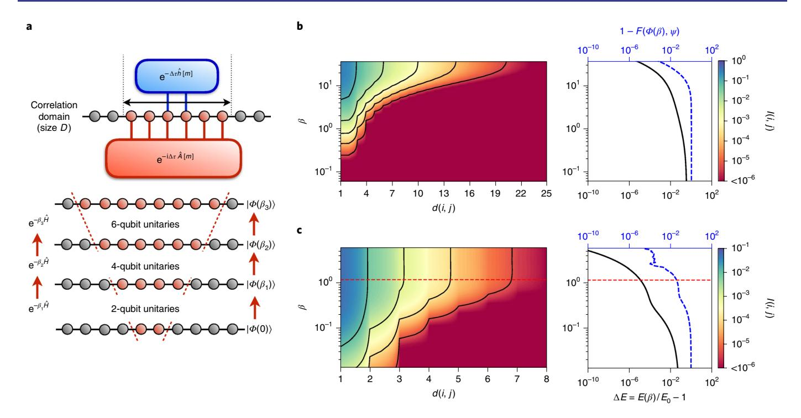
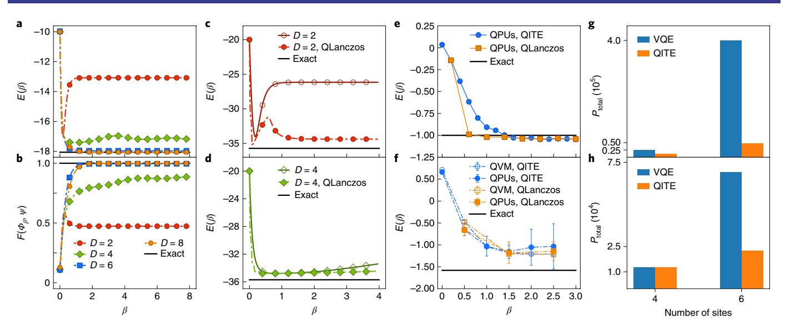
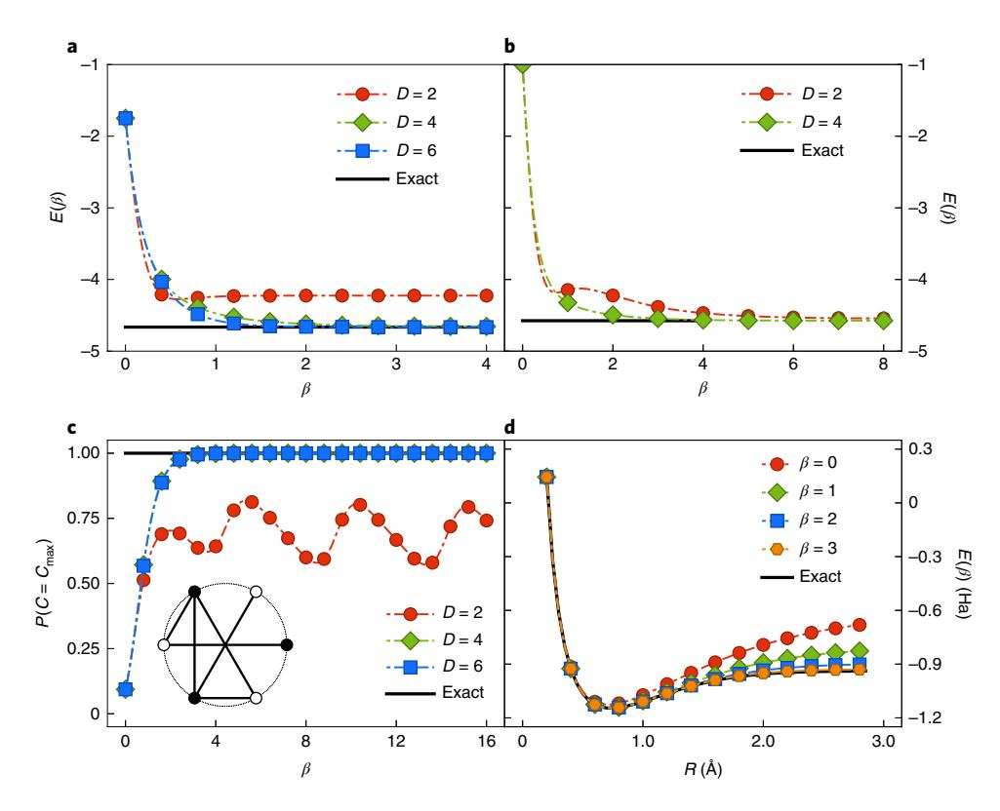
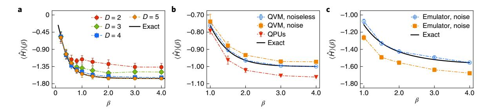

**Corrected: Publisher Correction; Publisher Correction** 

# Determining eigenstates and thermal states on a quantum computer using quantum imaginary time evolution

Mario Motta1, Chong Sun1, Adrian T. K. Tan2, Matthew J. O'Rourke1, Erika Ye2, Austin J. Minnich2, Fernando G. S. L. Brandão3 and Garnet Kin-Lic Chan1

The accurate computation of Hamiltonian ground, excited and thermal states on quantum computers stands to impact many problems in the physical and computer sciences, from quantum simulation to machine learning. Given the challenges posed in constructing large-scale quantum computers, these tasks should be carried out in a resource-efficient way. In this regard, existing techniques based on phase estimation or variational algorithms display potential disadvantages; phase estimation requires deep circuits with ancillae, that are hard to execute reliably without error correction, while variational algorithms, while flexible with respect to circuit depth, entail additional high-dimensional classical optimization. Here, we introduce the quantum imaginary time evolution and quantum Lanczos algorithms, which are analogues of classical algorithms for finding ground and excited states. Compared with their classical counterparts, they require exponentially less space and time per iteration, and can be implemented without deep circuits and ancillae, or high-dimensional optimization. We furthermore discuss quantum imaginary time evolution as a subroutine to generate Gibbs averages through an analogue of minimally entangled typical thermal states. Finally, we demonstrate the potential of these algorithms via an implementation using exact classical emulation as well as through prototype circuits on the Rigetti quantum virtual machine and Aspen-1 quantum processing unit.

n important application for a quantum computer is to compute the ground state  $\Psi$  of a Hamiltonian  $\hat{H}$  (refs. 1,2). This arises in simulations, for example, of the electronic structure of molecules and materials3-6, as well as in more general optimization problems. While efficient ground-state determination cannot be guaranteed for all Hamiltonians, as this is a QMA-hard problem7, several heuristic quantum algorithms have been proposed, including adiabatic state preparation with quantum phase estimation8,9 and quantum-classical variational algorithms, such as the quantum approximate optimization algorithm10-12 and variational quantum eigensolver (VQE)13-15. Despite many advances, these algorithms also have potential disadvantages, especially in the context of nearterm quantum computing architectures with limited quantum resources. For example, phase estimation produces a nearly exact eigenstate, but appears impractical without error correction, while variational algorithms, though somewhat robust to coherent errors, are limited in accuracy by a fixed ansatz, and involve high-dimensional noisy classical optimizations16.

In classical simulations, different strategies are employed to numerically determine nearly exact ground states. One popular approach is imaginary time evolution, which expresses the ground state as the long-time limit of the imaginary time Schrödinger equa-

tion 
$$-\partial_{\beta}|\Phi(\beta)\rangle = \hat{H}|\Phi(\beta)\rangle$$
,  $|\Psi\rangle = \lim_{\beta \to \infty} \frac{|\Phi(\beta)\rangle}{\|\Phi(\beta)\|}$  (for  $\langle \Phi(0)|\Psi\rangle \neq 0$ ).

Unlike variational algorithms with a fixed ansatz, imaginary time evolution always converges to the ground state, as distinguished from imaginary time ansatz optimization  $^{17}$ . Another family of approaches is variants of the iterative Lanczos method  $^{18}$ . The Lanczos iteration constructs the Hamiltonian matrix H in a Krylov

subspace  $\{|\Phi\rangle, \hat{H}|\Phi\rangle, \hat{H}^2|\Phi\rangle\dots\}$ ; diagonalizing H yields a variational estimate of the ground state, which tends to  $|\Psi\rangle$  for a large number of iterations. For an N-qubit Hamiltonian, the classical complexity of the imaginary time evolution and Lanczos algorithms scales as  $\sim \exp{(\mathcal{O}(N))}$  in space and time. Exponential space comes from storing  $\Phi(\beta)$  or the Lanczos vector, while exponential time comes from the cost of Hamiltonian multiplication  $\hat{H}|\Phi\rangle$ , as well as, in principle though not in practice, the N-dependence of the number of propagation steps or Lanczos iterations. Thus it is natural to consider quantum versions of these algorithms that can overcome the exponential bottlenecks.

Here we describe the quantum imaginary time evolution (QITE), quantum Lanczos (QLanczos) and quantum analogue of the minimally entangled typical thermal states (QMETTS) algorithms, to determine ground states, ground and excited states and thermal states on a quantum computer. Under the assumption of finite correlation length, these methods rigorously use exponentially reduced space and time per propagation step or iteration, compared with their direct classical counterparts. Even when such assumptions do not hold, the inexact versions of the QITE and QLanczos algorithms remain valid heuristics that can be applied within a limited computational budget, and offer advantages over existing ground-state quantum algorithms, as they do not use deep circuits and converge to their solutions without nonlinear optimization. A crucial common component is the efficient implementation of the non-Hermitian operation of an imaginary time step  $e^{-\Delta \tau \hat{H}}$  (for small  $\Delta \tau$ ) assuming a finite correlation length in the state. Non-Hermitian operations are not natural on a quantum computer and are usually achieved using ancillae and postselection, but we describe how to implement

1Division of Chemistry and Chemical Engineering, California Institute of Technology, Pasadena, CA, USA. 2Division of Engineering and Applied Science, California Institute of Technology, Pasadena, CA, USA. 3Institute for Quantum Information and Matter, California Institute of Technology, Pasadena, CA, USA. \*e-mail: mariomotta31416@gmail.com; gkc1000@gmail.com

ARTICLES NATURE PHYSICS

imaginary time evolution on a given state without these resources. The lack of ancillae and complex circuits makes our algorithms potentially suitable for near-term quantum architectures. We demonstrate the algorithms on spin and fermionic Hamiltonians using exact classical emulation, and demonstrate proof-of-concept implementations on the Rigetti quantum virtual machine (QVM) and Aspen-1 quantum processing units (QPUs).

## Quantum imaginary time evolution

Define a geometric k-local Hamiltonian  $\hat{H} = \sum_m \hat{h}[m]$  (where each term  $\hat{h}[m]$  acts on at most k neighbouring qubits on an underlying graph) and a Trotter decomposition of the corresponding imaginary time evolution,

$$e^{-\beta\hat{H}} = (e^{-\Delta\tau\,\hat{h}[1]}e^{-\Delta\tau\,\hat{h}[2]}\dots)^n + \mathcal{O}(\Delta\tau); \ n = \frac{\beta}{\Delta\tau} \eqno(1)$$

applied to a state  $|\Psi\rangle$ . After a single Trotter step, we have

$$|\Psi'\rangle = e^{-\Delta\tau \,\hat{h}[m]}|\Psi\rangle \tag{2}$$

The basic idea is that the normalized state  $|\bar{\Psi}'\rangle = |\Psi'\rangle/|\Psi'|$  is generated from  $|\Psi\rangle$  by a unitary operator  $e^{-i\Delta\tau\hat{A}[m]}$  acting on a neighbourhood of the qubits acted on by  $\hat{h}[m]$ , where  $\hat{A}[m]$  can be determined from tomography of  $|\Psi\rangle$  in this neighbourhood up to controllable errors. This is illustrated by the simple example where  $|\Psi\rangle$  is a product state. The squared norm  $c=\langle\Psi|e^{-2\Delta\tau\hat{h}[m]}|\Psi\rangle$  can be calculated from the expectation value of  $\hat{h}[m]$ , requiring measurements over k qubits,

$$c = 1 - 2 \Delta \tau \langle \Psi | \hat{h}[m] | \Psi \rangle + \mathcal{O}(\Delta \tau^2)$$
 (3)

Because  $|\Psi\rangle$  is a product state,  $|\Psi'\rangle$  is obtained by applying the unitary operator  $\mathrm{e}^{-\mathrm{i}\,\Delta\tau\,\hat{A}[m]}$  also on k qubits.  $\hat{A}[m]$  can be expanded in terms of an operator basis, for example the Pauli basis  $\{\hat{\sigma}_i\}$  on k qubits,

$$\hat{A}[m] = \sum_{i_1,\dots,i_k} a[m]_{i_1,\dots,i_k} \hat{\sigma}_{i_1} \dots \hat{\sigma}_{i_k} \equiv \sum_{I} a[m]_I \hat{\sigma}_I$$
(4)

Up to  $\mathcal{O}(\Delta \tau)$ , the coefficients  $a[m]_t$  are defined by the linear system  $S\mathbf{a}[m] = \mathbf{b}$  where the elements of S and  $\mathbf{b}$  are expectation values over k qubits,

$$S_{I,I'} = \langle \Psi | \hat{\sigma}_I^{\dagger} \hat{\sigma}_{I'} | \Psi \rangle , \ b_I = \frac{-i}{\sqrt{c}} \langle \Psi | \hat{\sigma}_I^{\dagger} \hat{h}[m] | \Psi \rangle \tag{5}$$

In general, S has a null space; to ensure that  $\mathbf{a}[m]$  is real, we minimize  $\left\| \vec{P}' - (1 - \mathrm{i} \, \Delta \tau \, \hat{A}[m]) \mathbf{Y} \right\|^2$  with respect to real variations in  $\mathbf{a}[m]$  (Supplementary Information). Because the solution is determined from a linear problem, there are no local minima.

In this simple case, the normalized result of the imaginary time evolution step could be represented by a unitary update over k qubits, because  $|\Psi\rangle$  had correlation length zero. After the initial step, this is no longer the case. However, for a more general  $|\Psi\rangle$  with finite correlations over at most C qubits (that is, correlations between observables separated by distance L are bounded by  $\exp(-L/C)$ ),  $|\bar{\Psi}'\rangle$  can be generated by a unitary acting on a domain of width at most O(C) qubits surrounding the qubits acted on by  $\hat{h}[m]$ . This follows from Uhlmann's theorem19, which states that two pure states with marginals close to each other must be related by a unitary transformation on the purifying subsystem (Supplementary Information). The unitary  $e^{-i \Delta r \hat{A}[m]}$  can then be determined by measurements and solving the least squares problem in this domain (Fig. 1). For example, for a nearest-neighbour local Hamiltonian on a d-dimensional cubic lattice, the domain size D is bounded by  $O(C^d)$ . In many physical

systems, we expect the maximum correlation length throughout the Trotter steps to increase with  $\beta$  and saturate for  $C_{\text{max}} \ll N$  (ref.  $^{20}$ ). Figure 1 shows the mutual information between qubits i and j as a function of imaginary time in the one-dimensional (1D) and two-dimensional (2D) ferromagnetic transverse-field Ising models computed by tensor network simulation (Supplementary Information), demonstrating a monotonic increase and clear saturation.

The above replacement of imaginary time evolution steps by unitary updates can be extended to more general Hamiltonians, such as Hamiltonians with long-range interactions and fermionic Hamiltonians. For fermions, in particular, the locality of the corresponding qubit Hamiltonian depends on the qubit mapping. In principle, a geometric k-local fermionic Hamiltonian can be mapped to a geometric local qubit Hamiltonian21,22, allowing the above techniques to be applied directly. Alternatively, we conjecture that by constructing equation (4) with a local fermionic basis the unitary update can be constructed over  $D \sim O(C^d)$ , C being the fermionic correlation length (Supplementary Information).

#### **Cost of QITE**

The number of measurements and classical storage at a given time step (starting propagation from a product state) is bounded by  $\exp(O(C^d))$  (with C the correlation length at that time step), since each unitary at that step acts on at most  $O(C^d)$  sites; classical solution of the least squares problem has a similar scaling,  $\exp(O(C^d))$ , as does the synthesis and application as a quantum circuit (composed of two-qubit gates) of the unitary  $\mathrm{e}^{-\mathrm{i}\,\hat{\Delta} r\,\hat{A}[m]}$ . Thus, space and time requirements are bounded by exponentials in  $C^d$ , but are polynomial in N when we are interested in a local approximation of the state (or quasipolynomial for a global approximation); the polynomial in N comes from the number of terms in  $\hat{H}$  (see Supplementary Information for details).

The exponential dependence on  $C^d$  can be greatly reduced in many cases, such as if  $\hat{A}[m]$  has a locality structure, for example if it is (approximately) a p-local Hamiltonian (that is, all  $a[m]_{i_1...i_k}$  in equation (4) are zero except for those where at most p of the  $\hat{\sigma}_i$  operators differ from the identity) then the cost of tomography becomes only  $C^{O(dp)}$ , while the cost of finding and implementing the unitary is  $O(pC^dT_e)$ ,  $T_e$  being the cost of computing one entry of  $\hat{A}[m]$  (ref. 23). If we assume further that  $\hat{A}[m]$  is geometric local, the cost of tomography is reduced further to  $O(pC^d)$ . However, it is important to note that even if C is too large to construct the unitaries exactly we can still run the algorithm as a heuristic, truncating the unitary updates to domain sizes that fit the computational budget. This gives the inexact QITE algorithm, described and studied in detail below.

Compared with a direct classical implementation of imaginary time evolution, the cost of a QITE time step (for bounded C) is linear in N in space and polynomial in N in time, thus giving an exponential reduction in space and time. Note that a finite correlation length  $C_0$  in the ground state does not generally imply an efficient classical strategy. In the Supplementary Information, we analyse multiple classical heuristics under the assumption of finite ground-state correlations, including truncating the problem size at  $C_0$ , classical simulation in the Heisenberg representation and tensor network calculations24–27.

# Inexact QITE

Given limited resources, for example on near-term devices, we can choose to measure and construct the unitary over a domain D smaller than that induced by correlations, to fit the computational budget. For example, if D=1, this gives a mean-field approximation of the imaginary time evolution, and larger D gives successively better approximations to the ground state. Importantly, while the unitary is no longer an exact representation of the imaginary time evolution, there is no issue of a local minimum in its construction, although the energy is no longer guaranteed to decrease at every

NATURE PHYSICS ARTICLES

**Fig. 1** | Physical foundations of the QITE algorithm. **a**, Schematic of the QITE algorithm. Top: imaginary time evolution under a geometric k-local operator  $\hat{h}[m]$  can be reproduced by a unitary operation acting on D > k qubits. Bottom: exact imaginary time evolution starting from a product state requires unitaries acting on a domain D that grows with correlations. **b**,**c**, Left: mutual information I(i, j) between qubits i, j as a function of distance d(i, j) and imaginary time  $\beta$ , for a 1D (**b**) and a 2D (**c**) ferromagnetic transverse-field Ising model, with h = 1.25, 50 qubits and h = 3.5,  $21 \times 31$  qubits respectively. I(i, j) saturates at longer times. Right: relative error in the energy  $\Delta E$  and fidelity  $F = |\langle \Phi(\beta)|\Psi\rangle|^2$  between the finite-time state  $\Phi(\beta)$  and infinite-time state  $\Psi$  as a function of  $\beta$ . The noise in the 2D fidelity error at large  $\beta$  arises from the approximate nature of the algorithm used (see Supplementary Information for details).

step. In this case, one can apply inexact imaginary time evolution until the energy stops decreasing; the energy will still be a variational upper bound. One can also use the QLanczos algorithm, described later.

# Illustrative QITE calculations

To illustrate the QITE algorithm, we have carried out exact classical emulations (assuming perfect expectation values and gates) for several Hamiltonians (Supplementary Information): short-range 1D Heisenberg (with and without a field); 1D AFM transversefield Ising; long-range 1D Heisenberg with spin-spin coupling  $J_{ii} = (|i-j|+1)^{-1}$ ; 1D Hubbard at half-filling; a six-qubit MAXCUT10-12 instance and a minimal basis two-qubit dihydrogen molecular Hamiltonian28. To assess the feasibility of implementation on near-term quantum devices, we have carried out noisy classical emulation (sampling expectation values and with an error model) using the Rigetti QVM and a physical simulation using the Rigetti Aspen-1 QPUs, for a single-qubit field model  $(X + Z)/\sqrt{2}$ (ref. 29) and a 1D AFM transverse-field Ising model. We also carried out measurement resource estimates for QITE on the short-range 1D Heisenberg (with field) model studied in ref. 5 with VQE, and the 1D AFM transverse-field Ising model; we compared these with resource estimates using the publicly available VQE implementation in IBM's Qiskit. We carried out QITE using different fixed *D* for the unitary or fermionic unitary (see Supplementary Information for descriptions of simulations and models).

Figures 2a–f and 3 show the energy obtained by QITE as a function of  $\beta$  and D for the various models. As we increase D, the asymptotic  $(\beta \to \infty)$  energies rapidly converge to the exact ground state. For small D, the inexact QITE tracks the exact QITE for a time until the correlation length exceeds D. Afterwards, it may go down or up.

The non-monotonic behaviour is strongest for small domains: in the MAXCUT example, the smallest domain D=2 gives an oscillating energy; the first point at which the energy stops decreasing is a reasonable estimate of the ground-state energy. In all models, increasing D past a maximum value (less than N) no longer affects the asymptotic energy, showing that the correlations have saturated (this is true even in the MAXCUT instance). Figure 2g,h shows an estimate from classical emulation of the number of Pauli string expectation values to be measured in the QITE algorithm as well as the hardware-efficient VQE ansatz (using the optimization protocol in ref. 5) to obtain an energy accuracy of 1% in the 1D Heisenberg model with field J=B=1 (Fig. 2g) and 1% or 2% in the 1D AFM transverse-field Ising model (Fig. 2h; the looser threshold was chosen to enable convergence of VQE). QITE is competitive with VQE for the four-site model and requires many fewer measurements in the six-site model. While the number of measurements could potentially be reduced in VQE by different optimizers and ansatze, the data suggest that QITE is a promising alternative to VQE on near-term devices.

Figure 2e,f shows the results of running the QITE algorithm on Rigetti's QVM and Aspen-1 QPUs for one and two qubits, respectively. The error bars are due to gate, readout, incoherent and crosstalk errors. Sufficient samples were used to ensure that sampling error is negligible. Encouragingly for near-term simulations, despite these errors it is possible to converge to a ground-state energy close to the exact energy for the single-qubit case. This result reflects a robustness that is sometimes informally observed in imaginary time evolution algorithms, in which the ground-state energy is approached even if the imaginary time step is not perfectly implemented. In the two-qubit case, although the QITE energy converges, there is a systematic shift, which is reproduced on the QVM using

ARTICLES NATURE PHYSICS

**Fig. 2** | Classical simulation and experimental implementation of QITE and QLanczos algorithms. **a,b**, QITE energy  $E(\beta)$  (**a**) and F between  $\Phi(\beta)$  and  $\Psi(\mathbf{b})$  as a function of  $\beta$ , for a 1D 10-site Heisenberg model, showing convergence with increasing D. **c,d**, QITE (dashed lines) and QLanczos (solid lines) energies as a function of  $\beta$ , for a 1D Heisenberg model with N=20 qubits, using D=2 (**c**) and 4 qubits (**d**), showing improved convergence of QLanczos over QITE. **e,f**, QITE and QLanczos energy as a function of  $\beta$  for a single-qubit model (**e**) and a two-qubit AFM transverse-field Ising model using QVMs and QPUs (**f**). Black lines denote the exact ground-state energy or maximum fidelity. **g,h**, Estimate of the number of Pauli string expectation values ( $P_{\text{total}}$ ) needed for QITE and VQE to converge within 1% of the exact energy for a four-site (left) and six-site (right) 1D Heisenberg model with magnetic field (**g**) and 1% (2%) of the exact energy for a four-site (six-site) 1D AFM transverse-field Ising model (**h**). Error bars represent s.d. computed from multiple runs.

**Fig. 3** | Application of QITE to long-range spin and fermionic models, and a combinatorial optimization problem. **a**, QITE energy as a function of  $\beta$  for a six-site 1D long-range Heisenberg model, for D=2-6 (**a**), and a four-site 1D Hubbard model with interaction strength U/t=1, for D=2, 4 (**b**). **c**, Probability of MAXCUT detection,  $P(C=C_{max})$ , as a function of imaginary time  $\beta$ , for the six-site graph in the inset. **d**, QITE energy (in hartrees, Ha) for the H2 molecule in the STO-6G basis as a function of bond length R and  $\beta$ . The black line is the exact ground-state energy/probability of detection.

available noise parameters for readout, decoherence and depolarizing noise30. Remaining discrepancies between the emulator and hardware are probably attributable to cross-talk between parallel

gates not included in the noise model (Supplementary Information). However, reducing decoherence and depolarizing errors in the QVM or using different sets of qubits with improved noise characteristics

NATURE PHYSICS ARTICLES

**Fig. 4 | Classical simulation and experimental implementation of the QMETTS algorithm. a**, Thermal (Gibbs) average  $\langle \hat{H} \rangle$  at temperature  $\beta$  from QMETTS for a 1D six-site Heisenberg model (exact emulation). The black line is the exact thermal average without sampling error. **b,c**, Thermal average  $\langle \hat{H} \rangle$  at temperature  $\beta$  from QMETTS for a single-qubit field model using QVMs and QPUs (**b**) and a two-qubit AFM transverse-field Ising model using QVM (**c**). Error bars represent (block) s.d. computed from multiple samples/runs.

(Supplementary Information) all lead to improved convergence to the exact ground-state energy.

## **QLanczos algorithm**

Given the QITE subroutine, we now consider how to formulate the QLanczos algorithm, which is an especially economical realization of a quantum subspace method31,32. An important practical motivation is that the Lanczos algorithm typically converges much more quickly than imaginary time evolution, and often in physical simulations only tens of iterations are needed to converge to good precision. In addition, Lanczos provides a natural way to compute excited states. Consider the sequence of imaginary time vectors  $|\Phi_l\rangle = e^{-l\Delta\tau H}|\Phi\rangle$ , l=0, 1, ..., n, where  $c_l = \|\Phi_l\|$ . In QLanczos, we consider the vectors after even numbers of time steps  $|\Phi_0\rangle, |\Phi_2\rangle, \dots$  to form a basis for the ground state. (Supplementary Information describes the equivalent treatment in terms of normalized imaginary time vectors.) These vectors define an overlap matrix whose elements can be computed entirely from norms,  $S_{ll'} = \langle \Phi_l | \Phi_{l'} \rangle = c_{(l+l')/2}^2$ , where  $c_{(l+l')/2}$  is the norm of another integer time-step vector, and the overlap matrix elements for n/2 vectors can be accumulated for free after n steps of time evolution. The Hamiltonian matrix elements satisfy the identity  $H_{ll'} = \langle \Phi_l | \hat{H} | \Phi_{l'} \rangle = \langle \Phi_{(l+l')/2} | \hat{H} | \Phi_{(l+l')/2} \rangle$ . Although the Hamiltonian has  $\sim n^2$  matrix elements in the basis of the  $\Phi_1$  states, there are only  $\sim n$  unique elements, and importantly each is a simple expectation value of the energy during the imaginary time evolution. This economy of matrix elements is a property shared with the classical Lanczos algorithm. Whereas the classical Lanczos iteration builds a Krylov space in powers of  $\hat{H}$ , QLanczos builds a Krylov space in powers of  $e^{-2\Delta \tau H}$ ; in the limit of small  $\Delta \tau$  these Krylov spaces are identical. Diagonalization of the QLanczos Hamiltonian matrix is guaranteed to give a ground-state energy lower than that of the last imaginary time vector  $\Phi_n$  (while higher roots approximate excited states).

With a limited computational budget, we can use inexact QITE to generate  $\Phi_l$ ,  $\Phi_l'$ . However, in this case the above expressions for  $S_{ll'}$  and  $H_{ll'}$  in terms of expectation values no longer exactly hold, which can create numerical issues (for example the overlap may no longer be positive). To handle this, as well as errors due to noise and sampling in real experiments, the QLanczos algorithm needs to be stabilized by ensuring that successive vectors are not nearly linearly dependent (Supplementary Information).

We demonstrate the QLanczos algorithm using classical emulation on the 1D Heisenberg Hamiltonian, as used for the QITE algorithm in Fig. 2 (Supplementary Information). Using exact QITE (large domains) to generate matrix elements, exact QLanczos converges much more rapidly than imaginary time evolution. Convergence of inexact QITE (small domains), however, can both be faster and reach lower energies than inexact QLanczos. We also

assess the feasibility of QLanczos in the presence of noise, using emulated noise on the Rigetti QVM as well as on the Rigetti Aspen-1 QPUs. In Fig. 2, we see that QLanczos also provides more rapid convergence than QITE with both noisy classical emulation and on the physical device for one and two qubits.

# Quantum thermal averages

The QITE subroutine can be used in a range of other algorithms. For example, we discuss how to compute thermal averages  $Tr[\hat{O}e^{-\beta\hat{H}}]/Tr[e^{-\beta\hat{H}}]$  using imaginary time evolution. Several procedures have been proposed for quantum thermal averaging, ranging from generating the finite-temperature state explicitly by equilibration with a bath33 to a quantum analogue of Metropolis sampling34 that relies on phase estimation, as well as ancilla-based Hamiltonian simulation methods with postselection35 and approaches based on recovery maps36. However, given a method for imaginary time evolution, one can generate thermal averages of observables without any ancillae or deep circuits. This can be done by adapting to the quantum setting the classical METTS algorithm37,38, which generates a Markov chain from which the thermal average can be sampled. The QMETTS algorithm can be carried out as follows: (1) start from a product state, carry out imaginary time evolution (using QITE) up to time  $\beta$ ; (2) measure the expectation value of  $\hat{O}$  to produce its thermal average; (3) measure a product operator such as  $\hat{Z}_1\hat{Z}_2...\hat{Z}_N$ , to collapse back onto a random product state; (4) repeat (1). Note that in step (3) we can measure in any product basis, and randomizing the product basis can be used to reduce the autocorrelation time and avoid ergodicity problems in sampling. In Fig. 4 we show the results of QMETTS (using exact classical emulation) for the thermal average  $\langle \hat{H} \rangle$  as a function of temperature  $\beta$ , for the six-site Heisenberg model for several temperatures and domain sizes: sufficiently large D converges to the exact thermal average at each  $\beta$ ; error bars reflect only finite QMETTS samples. We also show an implementation of QMETTS on the Aspen-1 QPU and QVM with a single-qubit field model (Fig. 4b), and using the QVM for a two-qubit AFM transverse-field Ising model (Fig. 4c).

#### Conclusions

In summary, the quantum analogues of imaginary time evolution, Lanczos and METTS algorithms that we have presented enable a new class of eigenstate and thermal state quantum simulations, that can be carried out without ancillae or deep circuits and that, for bounded correlation length, achieve exponential reductions in space and time per iteration relative to known classical counterparts. Encouragingly, these algorithms appear useful in conjunction with near-term quantum architectures, and serve to demonstrate the power of quantum elevations of classical simulation techniques, in the continuing search for quantum supremacy.

ARTICLES NATURE PHYSICS

#### Data availability

The data that support the findings of this study are available from the corresponding authors on reasonable request

#### Code availability

The code used to generate the data presented in this study can be publicly accessed on GitHub at https://github.com/mariomotta/QITE.git

#### Online content

Any methods, additional references, Nature Research reporting summaries, source data, extended data, supplementary information, acknowledgements, peer review information; details of author contributions and competing interests; and statements of data and code availability are available at https://doi.org/10.1038/s41567-019-0704-4.

Received: 1 April 2019; Accepted: 24 September 2019; Published online: 11 November 2019

#### References

- Feynman, R. P. Simulating physics with computers. Int. J. Theor. Phys. 21, 467–488 (1982).
- Abrams, D. S. & Lloyd, S. Simulation of many-body Fermi systems on a universal quantum computer. *Phys. Rev. Lett.* 79, 2586–2589 (1997).
- Lloyd, S. Universal quantum simulators. Science 273, 1073–1078 (1996).
  Aspuru-Guzik, A., Dutoi, A. D., Love, P. J. & Head-Gordon, M. Simulated
- Aspuru-Guzik, A., Dutoi, A. D., Love, P. J. & Head-Gordon, M. Simulated quantum computation of molecular energies. Science 309, 1704–1707 (2005).
- Kandala, A. et al. Hardware-efficient variational quantum eigensolver for small molecules and quantum magnets. *Nature* 549, 242–246 (2017).
- Kandala, A. et al. Error mitigation extends the computational reach of a noisy quantum processor. *Nature* 567, 491–495 (2019).
- 7. Kempe, J., Kitaev, A. & Regev, O. The complexity of the local Hamiltonian problem. *SIAM J. Comput.* **35**, 1070–1097 (2006).
- Farhi, E., Goldstone, J., Gutmann, S. & Sipser, M. Quantum Computation by Adiabatic Evolution Report No. MIT-CTP-2936 (MIT, 2000).
- Kitaev, A. Y. Quantum measurements and the Abelian stabilizer problem. Preprint at https://arxiv.org/abs/quant-ph/9511026 (1995).
- Farhi, E., Goldstone, J., Gutmann, S. & Sipser, M. A quantum approximate optimization algorithm. Report No. MIT-CTP/4610 (MIT, 2014).
- Otterbach, J. S. et al. Unsupervised machine learning on a hybrid quantum computer. Preprint at https://arxiv.org/abs/1712.05771 (2017).
- Moll, N. et al. Quantum optimization using variational algorithms on near-term quantum devices. Quantum Sci. Technol. 3, 030503 (2018).
- 13. Peruzzo, A. et al. A variational eigenvalue solver on a photonic quantum processor. *Nat. Commun.* **5**, 4213 (2014).
- McClean, J. R., Romero, J., Babbush, R. & Aspuru-Guzik, A. The theory of variational hybrid quantum-classical algorithms. *New J. Phys.* 18, 023023 (2016).
- Grimsley, H. R., Economou, S. E., Barnes, E. & Mayhall, N. J. An adaptive variational algorithm for exact molecular simulations on a quantum computer. *Nat. Commun.* 10, 3007 (2019).
- McClean, J. R., Boixo, S., Smelyanskiy, V. N., Babbush, R. & Neven, H. Barren plateaus in quantum neural network training landscapes. *Nat. Commun.* 9, 4812 (2018)
- McArdle, S. et al. Variational ansatz-based quantum simulation of imaginary time evolution. npj Quantum Inf. 5, 75 (2019).
- Lanczos, C. An iteration method for the solution of the eigenvalue problem of linear differential and integral operators. J. Res. Natl Bur. Stand. B 45, 255–282 (1950).
- Uhlmann, A. The 'transition probability' in the state space of a \*-algebra. Rep. Math. Phys. 9, 273–279 (1976).
- Hastings, M. B. & Koma, T. Spectral gap and exponential decay of correlations. Commun. Math. Phys. 265, 781–804 (2006).
- Bravyi, S. B. & Kitaev, A. Y. Fermionic quantum computation. Ann. Phys. (N. Y.) 298, 210–226 (2002).
- Verstraete, F. & Cirac, J. I. Mapping local Hamiltonians of fermions to local Hamiltonians of spins. J. Stat. Mech. 2005, P09012 (2005).

- Berry, D. W., Childs, A. M. & Kothari, R. Hamiltonian simulation with nearly optimal dependence on all parameters. In 2015 IEEE 56th Annual Symposium on Foundations of Computer Science 792–809 (IEEE, 2015).
- Vidal, G. Efficient simulation of one-dimensional quantum many-body systems. Phys. Rev. Lett. 93, 040502 (2004).
- Schollwöck, U. The density-matrix renormalization group in the age of matrix product states. Ann. Phys. (N. Y.) 326, 96–192 (2011).
- Schuch, N., Wolf, M. M., Verstraete, F. & Cirac, J. I. Computational complexity of projected entangled pair states. *Phys. Rev. Lett.* 98, 140506 (2007).
- Haferkamp, J., Hangleiter, D., Eisert, J. & Gluza, M. Contracting projected entangled pair states is average-case hard. Preprint at https://arxiv.org/ abs/1810.00738 (2018).
- O'Malley, P. J. J. et al. Scalable quantum simulation of molecular energies. Phys. Rev. X 6, 031007 (2016).
- Lamm, H. & Lawrence, S. Simulation of nonequilibrium dynamics on a quantum computer. *Phys. Rev. Lett.* 121, 170501 (2018).
- Rigetti Computing: Quantum Cloud Services; https://qcs.rigetti.com/ dashboard
- McClean, J. R., Kimchi-Schwartz, M. E., Carter, J. & de Jong, W. A. Hybrid quantum-classical hierarchy for mitigation of decoherence and determination of excited states. *Phys. Rev. A* 95, 042308 (2017).
- Colless, J. I. et al. Computation of molecular spectra on a quantum processor with an error-resilient algorithm. *Phys. Rev. X* 8, 011021 (2018).
- Terhal, B. M. & DiVincenzo, D. P. Problem of equilibration and the computation of correlation functions on a quantum computer. *Phys. Rev. A* 61, 022301 (2000).
- Temme, K., Osborne, T. J., Vollbrecht, K. G., Poulin, D. & Verstraete, F. Quantum Metropolis sampling. *Nature* 471, 87 (2011).
- Chowdhury, A. N. & Somma, R. D. Quantum algorithms for Gibbs sampling and hitting-time estimation. Quantum Inf. Comput. 17, 41–64 (2017).
- Brandão, F. G. & Kastoryano, M. J. Finite correlation length implies efficient preparation of quantum thermal states. *Commun. Math. Phys.* 365, 1–16 (2019).
- 37. White, S. R. Minimally entangled typical quantum states at finite temperature. *Phys. Rev. Lett.* **102**, 190601 (2009).
- Stoudenmire, E. M. & White, S. R. Minimally entangled typical thermal state algorithms. New J. Phys. 12, 055026 (2010).

# Acknowledgements

M.M., G.K.-L.C., E.G.S.L.B., A.T.K.T. and A.J.M. were supported by the US NSF via RAISE-TAQS CCF 1839204. M.J.O'R. was supported by an NSF graduate fellowship via grant No. DEG-1745301; the tensor network algorithms were developed with the support of the US DOD via MURI FA9550-18-1-0095. E.Y. was supported by a Google fellowship. C.S. was supported by the US DOE via DE-SC0019374. G.K.-L.C. is a Simons Investigator in Physics and a member of the Simons Collaboration on the Many-Electron Problem. The Rigetti computations were made possible by a generous grant through Rigetti Quantum Cloud Services supported by the CQIA–Rigetti Partnership Program. We thank G. H. Low, J. R. McClean and R. Babbush for discussions, and the Rigetti team for help with the OVM and OPU simulations.

### **Author contributions**

M.M., C.S. and G.K.-L.C. designed the algorithms. F.G.S.L.B. established the mathematical proofs and error estimates. E.Y. and M.J.O'R. performed classical tensor network simulations. M.M., C.S. and A.T.K.T. carried out classical exact emulations. A.T.K.T. and A.J.M. designed and carried out the Rigetti QVM and QPU experiments. All authors contributed to the discussion of results and writing of the manuscript.

#### **Competing interests**

The authors declare no competing interests.

# Additional information

 $\label{eq:supplementary} \textbf{Supplementary information} \ is \ available \ for \ this \ paper \ at \ https://doi.org/10.1038/s41567-019-0704-4.$ 

Correspondence and requests for materials should be addressed to M.M. or G.K.-L.C.

Reprints and permissions information is available at www.nature.com/reprints.

**Publisher's note** Springer Nature remains neutral with regard to jurisdictional claims in published maps and institutional affiliations.

© The Author(s), under exclusive licence to Springer Nature Limited 2020