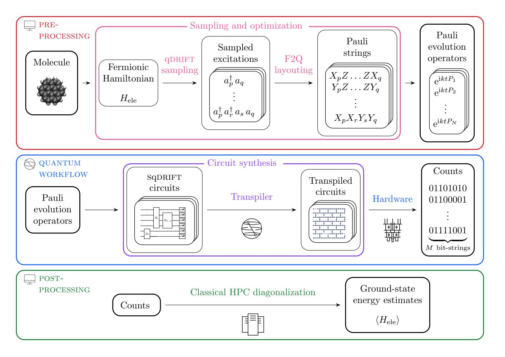
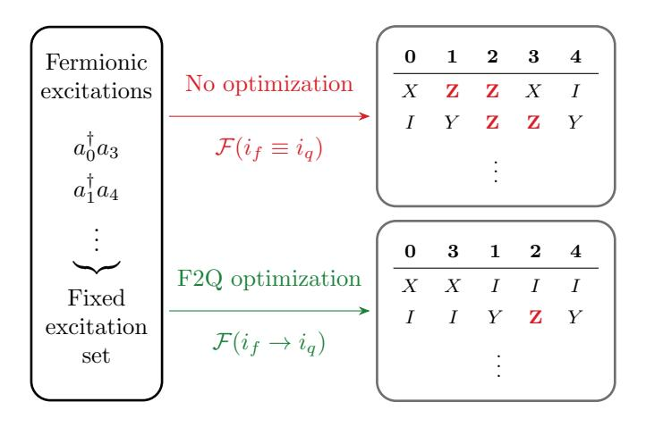
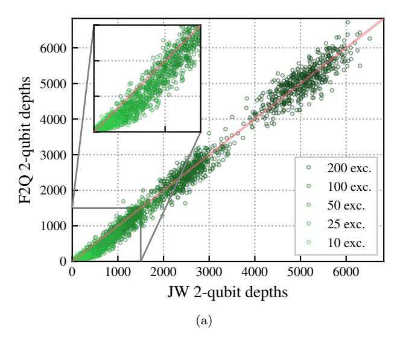
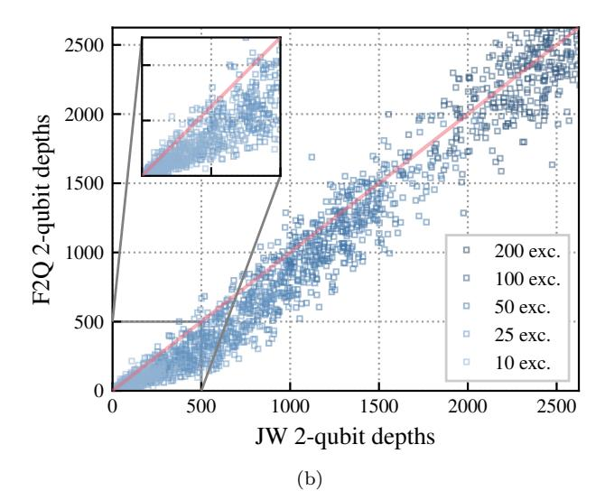
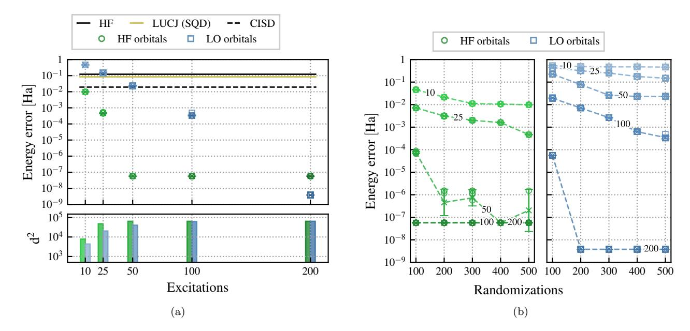
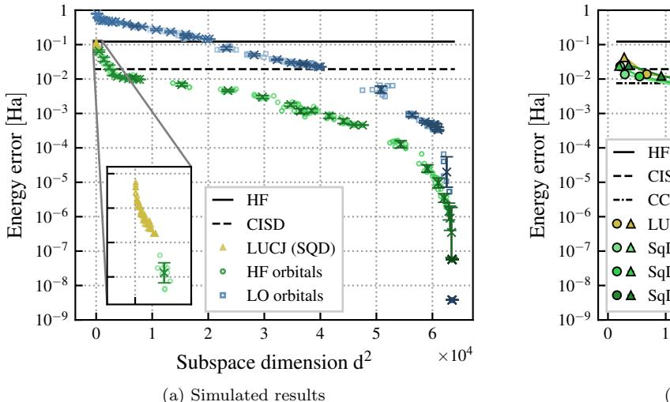
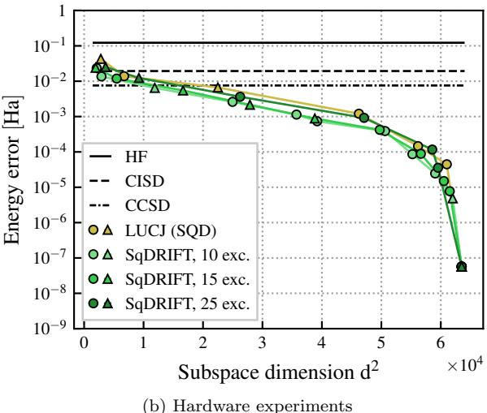
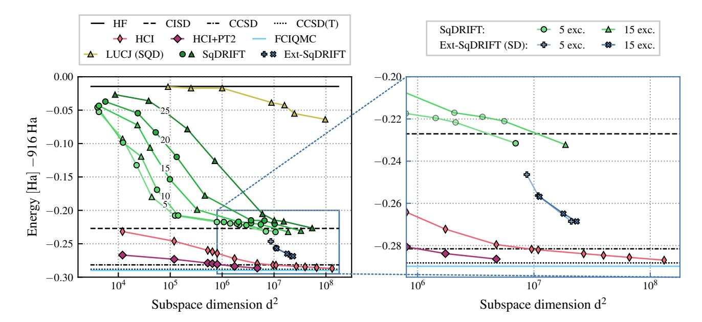
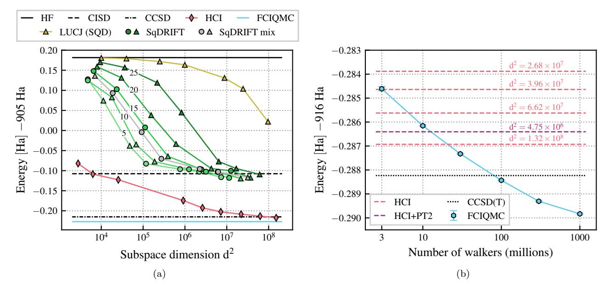
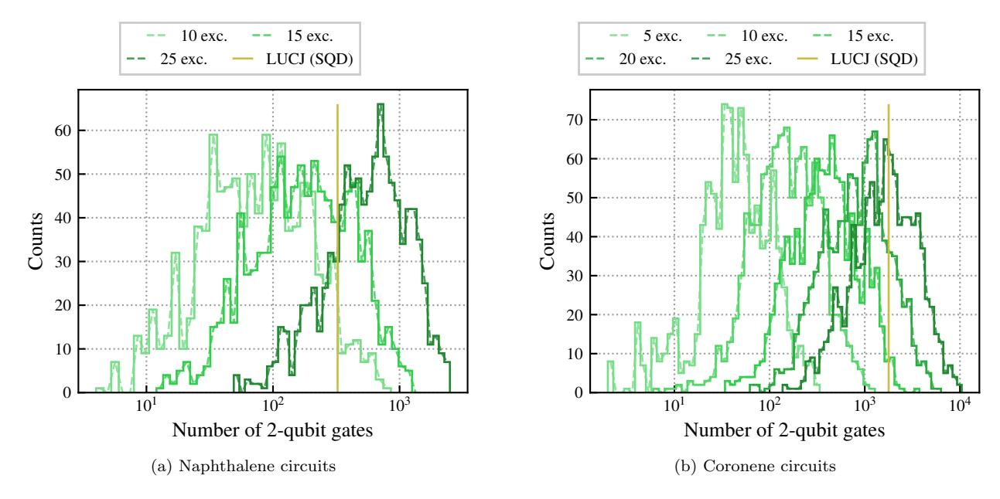

# Quantum chemistry with provable convergence via randomized sample-based Krylov quantum diagonalization

Samuele Piccinelli,1,2,\* Alberto Baiardi,1 Stefano Barison,1,3 Max Rossmannek,1 Almudena Carrera Vazquez,1 Francesco Tacchino,1 Stefano Mensa,4 Edoardo Altamura,4,5 Ali Alavi,6,5 Mario Motta,7 Javier Robledo-Moreno,7 William Kirby,7 Kunal Sharma,7 Antonio Mezzacapo,7 and Ivano Tavernelli1,†

1IBM Quantum, IBM Research Europe - Zurich, CH-8803 Rüschlikon, Switzerland
2Institute of Physics, École Polytechnique Fédérale de Lausanne (EPFL), CH-1015 Lausanne, Switzerland
3Institute for Theoretical Physics, ETH Zürich, CH-8093 Zürich, Switzerland
4The Hartree Centre, STFC, Sci-Tech Daresbury, Warrington, WA4 4AD, United Kingdom
5Yusuf Hamied Department of Chemistry, University of Cambridge, Lensfield Road, Cambridge CB2 1EW, United Kingdom
6Max Planck Institute for Solid State Research, Heisenbergstr. 1, 70569 Stuttgart, Germany
7IBM Quantum, IBM T.J. Watson Research Center, Yorktown Heights, NY 10598, United States
(Dated: January 28, 2026)

Quantum algorithms based on classical processing of individual samples have recently emerged as the most effective and robust methods to approximate ground-state wave functions of manybody quantum systems on pre-fault-tolerant and early-fault-tolerant quantum devices. In these algorithms, the quantum computer acts as a sampling engine that generates the subspace in which the Hamiltonian is classically diagonalized. The recently proposed Sample-based Krylov Quantum Diagonalization (SKQD), uses quantum Krylov states as circuits from which samples are collected. Convergence guarantees can be derived for SKQD under similar assumptions to those of quantum phase estimation, provided that the ground-state wave function is well approximated by a polynomial subset of the full Hilbert space. However, implementations of SKQD for complex many-body Hamiltonians, such as quantum chemistry ones, are limited by the depths of time-evolution circuits needed to generate Krylov vectors. In this work, we introduce a method that combines SKQD with a qDRIFT randomized compilation of the Hamiltonian propagator. The resulting algorithm, termed SqDRIFT, enables quantum chemistry experiments on quantum processors, while preserving the convergence guarantees similar to the phase estimation algorithm. We demonstrate its viability by applying SqDRIFT to calculate the electronic ground-state energy of several polycyclic aromatic hydrocarbons, up to system sizes beyond the reach of exact diagonalization.

## I. INTRODUCTION

Quantum computing has emerged as a novel computational paradigm capable of addressing specific problems that exhibit unfavorable scaling on classical computers. Quantum chemistry is a prime candidate among these problems, and quantum computers are believed to be able to speed up the solution of the electronic Schrödinger equation within a given basis set, which is a central computational challenge in quantum chemistry [1–4]. Quantum algorithms for solving the Schrödinger equation with performance guarantees already exist, and are mostly based on Quantum Phase Estimation (QPE) [5– 10. Since QPE requires executing deep and complex quantum circuits, beyond the reach of current noisy quantum computers, alternative approaches tailored to near-term quantum processors have been actively investigated. A prime example are variational algorithms such as the Variational Quantum Eigensolver (VQE) [11–13], where a parameterized quantum circuit is optimized classically, according to a cost function given by evaluating the expectation value of the Hamiltonian on a quantum computer. However, the practical implementation

of VQE faces scalability challenges due to a steep measurement overhead [14] and the difficulty of navigating the optimization landscape [15]. Alternative strategies are required to scale-up quantum-chemical calculations on quantum computers beyond the reach of brute-force classical simulations – the so-called "quantum utility" regime [16].

Methods exploiting quantum-centric supercomputing platforms to sample classically-hard probability distributions – and classically process those samples – are emerging as a promising route towards this goal. Examples of this class of methods for natural science applications are quantum algorithms inspired by classical selected configuration interaction (SCI) [17–22]. The extension of classical SCI methods to the quantum setting was proposed in the quantum-selected configuration interaction method (QSCI) [23] and in the sample-based quantum diagonalization (SQD), which enabled chemistry experiments up to 72 spin orbitals using error mitigation techniques such as configuration recovery (CR) [24]. In these approaches, one diagonalizes a many-body Hamiltonian in a subspace of Slater determinants generated by collecting samples from a quantum circuit. As sampling from a quantum circuit is, in general, a computationally hard task, a quantum advantage over classical SCI can be expected, provided that accurate energies can be obtained with a sufficiently small diagonalization subspace. This

\* samuele.piccinelli@ibm.com

† ita@zurich.ibm.com

condition is met by ground states that are well approximated by wavefunctions supported over a small subset of the full Hilbert space. In particular, the SQD workflow showcased complex molecular systems, with implementations successfully utilizing up to 77 qubits [24–28].

Borrowing from VQE-based approaches, hardware-efficient variational circuit ansätze [29, 30] can be used to this end. However, this introduces a heuristic component as these ansätze are not guaranteed to sample the support of the exact ground-state wave function.

A circuit choice that eliminates the need for a variational ansatz are time-evolution circuits [31–33], which are employed in Krylov subspace diagonalization methods [34–38]. We will refer to these as Sample-based Krylov Quantum Diagonalization (SKQD) methods, following [33]. The key advantage of SKQD is that time-evolution circuits are guaranteed to sample the configurations on which the ground-state has a large support, provided that the initial state for the propagation has a sufficiently large overlap with the true ground state (and that the wave function is concentrated, as in any SQD-based method). The same requirement must be met by any Krylov quantum diagonalization approach [35, 36], as well as by methods based on quantum phase estimation [39].

In addition to this formal advantage, SKQD can be implemented on current state-of-the-art quantum processors [33] provided that the time-evolution circuits can be compiled to current hardware architectures without an excessive number of two-qubit gates. Conversely, for generic quantum-chemical Hamiltonians, implementing even a single first-order Trotter step may yield circuits that are too deep to be reliably implemented on currently-available quantum computers [32], with increasing system sizes. Approximate compilation schemes can be employed to reduce the depth of implementing a single Trotter step. This can be achieved, e.g., using matrix product operator (MPO)-based compression methods [40, 41], as proposed and experimentally demonstrated for quantum circuits of up to 36 qubits in Ref. [31]. However, tensor-network based compression techniques can face scalability challenges when the time evolution circuits generate volume-law entanglement. Hence, realizing SKQD on realistic quantum chemical simulations of larger molecular systems at the utility scale continues to pose a major challenge.

In this work, we fill this gap and present a practical, quantum-chemistry friendly variant of SKQD, which provides an alternative approach to circuit depth reduction with convergence guarantees and not limited by entanglement growth. Instead of compiling the time-evolution circuit using conventional Trotter formulas [42], we propose to leverage the qDRIFT randomized compilation strategy [43]. In qDRIFT, the time-evolution is realized through an ensemble of circuits, each one obtained by selecting randomly a subset of Hamiltonian terms, with a probability proportional to the corresponding Hamiltonian coefficient. For sparse Hamiltonians, like the

quantum-chemical ones, this compilation strategy yields asymptotically shallower circuits compared to Trotterbased formulas. Here we propose to sample from the time-evolution circuits approximated by qDRIFT unitaries, and use those samples to perform classical subspace diagonalization. We refer to this approach as Sq-DRIFT. By leveraging theoretical results on the asymptotic scaling of qDRIFT [43, 44], we extend the convergence guarantees of SKQD [33] to SqDRIFT. This ultimately demonstrates that SqDRIFT can efficiently sample the support of concentrated ground-state wave functions with shallower circuits.

Besides this formal scaling analysis, we show, based on classical simulations and quantum computations, how SqDRIFT enables practical quantum-chemical SQD calculations on quantum computers. Specifically, we calculate the ground-state energy of two polycyclic aromatic hydrocarbon (PAH) systems, namely naphthalene and coronene, using an active space that includes all  $\pi$ -type molecular orbitals. Classical, noiseless simulations on naphthalene showcase that SqDRIFT can efficiently generate samples belonging to the support of the groundstate wave function. Importantly, the sample accuracy increases with the qDRIFT circuit depth, hence indicating that SqDRIFT can trade circuit complexity for sampling overhead. Moreover, we successfully execute the SqDRIFT protocol on state-of-the-art IBM Quantum processors for coronene, demonstrating that it can achieve accurate results on up to 48 qubits.

#### II. THEORY

## A. Sample-based Krylov Quantum Diagonalization

We review here the SKQD workflow introduced in [33]. First, we observe that these quantum sampled-subspace methods work if the ground state of a target Hamiltonian is well-approximated by a concentrated wave function. Concentrated means that the wave function is supported over a small portion of the Hilbert space. More precisely, an n-qubit wave function  $|\Psi\rangle$  is  $(\alpha_L, \beta_L)$ -concentrated [33] if it can be expressed as:

$$|\Psi\rangle = \sum_{i=1}^{2^n} c_i |b_i\rangle , \qquad (1)$$

where  $|b_i\rangle$  are ordered *n*-qubit bitstrings such that  $||c_1|| \geq \ldots \geq ||c_{2^n}||$ , satisfying

$$\sum_{i=1}^{L} \|c_i\|^2 \ge \alpha_L \quad \text{and} \quad \|c_i\|^2 \ge \beta_L \quad \forall i \le L. \quad (2)$$

We consider a wavefunction to be *concentrated* if it is  $(\alpha_L, \beta_L)$ -concentrated with L = poly(n) for n qubits,  $1 - \alpha_L \ll 1$ , and  $\beta_L = \Omega(1/\text{poly}(n))$ : this makes precise the notion that the wavefunction is approximately supported on those L bitstrings.

The bitstrings  $|b_i\rangle$  yielding the largest contribution to the ground-state wave function in Eq. (1) are identified by sampling from a quantum circuit. The Hamiltonian is then projected and diagonalized classically in the subspace generated by the sampled bitstrings, from which one obtains an approximation of the ground state energy and of the corresponding wavefunction supported in the subspace itself. The concentration hypothesis guarantees that accurate approximations are reachable without employing an exponentially large subspace, i.e., with manageable classical computational resources.

The key challenge is to construct a quantum circuit that is at the same time easy to implement on quantum processors and guaranteed to sample the important bitstrings efficiently. Ideally, the circuit should generate a constant probability distribution over the important bitstrings  $|b_i\rangle$  of Eq. (1). This minimizes the sampling overhead needed to extract all  $|b_i\rangle$  bitstrings. Notably, a circuit representing the ground-state wave function  $|\phi_0\rangle$ may not generate such a distribution, since a given bitstring  $|b_i\rangle$  will be sampled with probability  $|\langle \phi_0|b_i\rangle|^2$ , which can be far from uniform over the important bitstrings. Hence, conventional ansätze tailored to encode ground-state wave functions may not yield good trial states for sample-based approaches. While we may optimize the ansatz based on the variational principle in order to improve the quality of the simulation, this is not guaranteed. For this reason, identifying good set of nonvariational trial states is desirable. As we will discuss below, time-evolution circuits constitute such a set. These states are used in SKQD [33], which is a direct extension of Krylov Quantum Diagonalization (KQD) methods [34, 37, 45]. We review both variants in the next section.

Consider an n-qubit Hamiltonian H with eigenvalues  $E_0 \leq E_1 \leq \ldots$  and exact ground state  $|\phi_0\rangle$ . Given a reference wavefunction  $|\psi_0\rangle$  and reference evolution time t, the Krylov subspace  $\mathcal{K}_d$  of order d (here and in the following, we will assume that d is odd) [46] is constructed as the linear space spanned by the vectors

$$|\psi_k\rangle = e^{-ikHt}|\psi_0\rangle,$$
 (3)

for  $k \in \{0, 1, ..., d-1\}$ . By projecting H in  $\mathcal{K}_d$ , the task of approximating the ground state of the target Hamiltonian is then reduced to solving the generalized eigenvalue problem

$$\mathbf{H}v = \tilde{E}\mathbf{S}v. \tag{4}$$

Here,  $\mathbf{H}_{ij} = \langle \psi_i | H | \psi_j \rangle$ ,  $\mathbf{S}_{ij} = \langle \psi_i | \psi_j \rangle$  and each vector v defines a quantum state  $|\phi\rangle = \sum_k v_k | \psi_k \rangle \in \mathcal{K}_d$ . All the matrix elements of  $\mathbf{H}$  and  $\mathbf{S}$  can, in principle, be evaluated using a quantum computer [37] provided that one is able to implement the unitary evolution operators  $U_k(t) = \mathrm{e}^{-\mathrm{i}kHt}$  with arbitrary precision. In general, however, terms of the form  $\langle \psi_i | H | \psi_j \rangle$  with  $i \neq j$  require

quantum controlled operations, which are challenging to compile and realize on noisy quantum processors with local connectivity.

SKQD, a sample-based alternative, by passes this limitation by combining elements from both the SQD and KQD pipelines: here, instead of forming matrix elements between the time-evolved states, one samples from them. These time-evolved states are

$$|\Psi_k\rangle = \left(\prod_{j=1}^k e^{-iHt}\right)|\Psi_{\text{init}}\rangle = e^{-iHkt}|\Psi_{\text{init}}\rangle , \quad (5)$$

where the initial reference wavefunction  $|\Psi_{\rm init}\rangle$  should be chosen such that it is easy to prepare on a quantum computer and has a non-negligible overlap with  $|\phi_0\rangle$ . Samples are collected from the circuits preparing  $|\Psi_k\rangle$  for different k values, they are merged together, and H is diagonalized in the resulting subspace. Remarkably, it was proven in Ref. [33] that, if ground state concentration assumptions are met, SKQD is guaranteed to efficiently yield accurate solutions in the asymptotic limit.

To implement SKQD – and thus benefit from its unique combination of convergence guarantees and affordable experimental requirements – suitable unitary compilation strategies for time-evolution operators are needed. However, while standard approaches (for instance, Suzuki-Trotter product formulas [47]) work well for example for spin and impurity models [33], they become quickly impractical when targeting molecular systems, particularly on noisy quantum processors, because they yield very deep circuits. In this work, we aim at enabling quantum chemistry SKQD calculations by adopting qDRIFT, a randomized time-evolution approach [43].

## B. The qDRIFT compilation protocol

The quantum stochastic drift (qDRIFT) protocol [43] aims at compiling the time-evolution operator  $e^{-iHt}$  for Hamiltonians expressed as

$$H = \sum_{i=1}^{\mathcal{N}} c_i h_i \,, \tag{6}$$

where, without loss of generality, we require  $c_i > 0$  and that the largest eigenvalue of  $h_i$  be equal, in absolute value, to 1. Note that Eq. (6) includes, as a special case, the decomposition of H in the Pauli basis (i.e., in terms of Pauli strings). However, other choices are possible such as, e.g., mapping each  $h_i$  term to a string of fermionic second-quantization operators. The qDRIFT protocol relies on a subroutine that constructs, for a target time t, the unitary operator  $V_k$  defined as

$$V_{k} = \prod_{j=1}^{N} e^{-ih_{k_{j}}t\lambda/N}, \qquad (7)$$

where  $\lambda = \sum_{i} c_{i}$ , and the series of indices  $\mathbf{k} = (k_{1}, \ldots, k_{N})$  is obtained by randomly sampling terms  $h_{i}$  from the distribution defined by  $c_{i}/\lambda$ . The average of the channel defined in Eq. (7) over all possible indices  $\mathbf{k}$ , i.e.,

$$\mathcal{E}_{\text{qDRIFT}}[\rho] = \sum_{\mathbf{k}} p_{\mathbf{k}} V_{\mathbf{k}} \rho V_{\mathbf{k}}^{\dagger}, \qquad (8)$$

where  $p_{\mathbf{k}} = \lambda^{-N} \prod_{i=1}^{N} c_{k_i}$  is the probability of sampling the  $\mathbf{k}$  indices, yields an approximation to the exact time-evolution channel  $\mathcal{U}_t[\cdot] = \mathrm{e}^{\mathrm{i}Ht}(\cdot)\mathrm{e}^{-\mathrm{i}Ht}$ . As proven in Ref. [43], the approximation error  $\epsilon$  grows as  $\mathcal{O}(\lambda^2 t^2/N)$ . Notably,  $\epsilon$  does not depend on the number of terms  $\mathcal{N}$  appearing in Eq. (6), but rather on the  $L_1$ -norm of H. Hence, qDRIFT yields an improvement over conventional Trotter formulas for sparse Hamiltonians, whose norm does not depend on (or changes very slowly with) the system size.

We also recall that, as discussed in Ref. [48], even a single term of the sum appearing in Eq. (8) yields an accurate approximation of the time-evolution operator with high probability. However, in this case the number of terms N required to obtain a given target accuracy  $\epsilon$  increases quadratically compared to the original qDRIFT protocol outlined above.

Before moving forward, it is interesting to analyze convergence guarantees and error bounds for KQD implemented using qDRIFT, as these will pave the way towards our main results. Specifically, in Lemma A.1 in Section A1 we prove that if all states  $\{|\psi_k\rangle\}$  defined in Eq. (3) are prepared using  $N_r$  qDRIFT randomizations of length N, then, for any  $\delta > 0$ , Eq. (4) yields an approximate ground state energy  $\tilde{E}$  satisfying

$$\tilde{E} - E_0 \le \xi \tag{9}$$

with probability at least  $1 - \delta$ , where

$$\xi = \frac{\chi}{|\gamma_0'|^2} + \frac{6||H||}{|\gamma_0'|^2} \left(\frac{2\chi}{\Delta'} + \zeta + 8\left(1 + \frac{\pi\Delta'}{4||H||}\right)^{-2d+1}\right) \tag{10}$$

and

$$\chi \le 2\epsilon_Q ||H||, \tag{11}$$

$$\zeta \le 2d(\epsilon_R + \epsilon_Q),\tag{12}$$

$$|\gamma_0'|^2 \ge |\gamma_0|^2 - 2\epsilon_R - 2\epsilon_Q \,, \tag{13}$$

with

$$\epsilon_Q = d(d-1)t\lambda \left( \frac{t(d-1)\lambda}{N} + \sqrt{\frac{11\ln(2^{n+1}/\delta)}{NN_r}} \right) . (14)$$

Here,  $\epsilon_R$  is a regularization threshold [49],  $|\gamma_0|^2$  is the overlap between  $|\psi_0\rangle$  and the true ground state,  $\Delta' = \Delta - \chi/|\gamma_0'|^2$  is a rescaled version of the spectral

gap  $\Delta = E_1 - E_0$  and the evolution time is set to  $t = \pi/(E_{2^n-1} - E_0)$ . Notice that  $\delta$  controls the trade-off between the success probability  $(1 - \delta)$  and energy error (Eq. 14).

This result shows that the quality of the solutions obtained via qDRIFT-based Krylov diagonalization can be systematically and efficiently (i.e., at a polynomial cost in terms of quantum resources) improved by increasing the Krylov dimension d and the length of qDRIFT sequences N.

#### C. The SqDRIFT algorithm

We are now ready to present our main theoretical contributions. We begin by introducing SqDRIFT, an algorithm that combines SKQD and qDRIFT into a hardware-friendly, sample-based and provably efficient protocol. In SqDRIFT we compile the time-evolution circuit associated with the propagation time  $t_k = kt$  by sampling  $N_r$  qDRIFT randomized sequences, and collecting S bitstrings from each realization. The union of the overall  $N_r \times S$  bitstrings defines the set of samples associated with time  $t_k$ . The algorithm then proceeds as in conventional SKQD, i.e., the target Hamiltonian is diagonalized in the subspace defined by the union of the samples collected for all time-steps. A scheme of the SqDRIFT pipeline is shown in Fig. 1.

Thanks to its close relationship with Krylov methods, we can immediately derive rigorous analytical guarantees for SqDRIFT. Notably, these results extend the analogous ones holding for SKQD [33], incorporating the effect of unitary compilation errors [35, 49] and finite sampling statistics.

Theorem 1 (SqDRIFT convergence guarantees). Let  $H = \sum_i c_i h_i$  with  $\lambda = \sum_i |c_i|$  be an n-qubit Hamiltonian whose ground state  $|\phi_0\rangle$  is  $(\alpha_L^{(0)}, \beta_L^{(0)})$ -concentrated, and let  $|\tilde{\phi}\rangle$  be the lowest energy state supported on the L important bitstrings in  $|\phi_0\rangle$ . Then if all the important L bitstrings are successfully sampled in the SqDRIFT protocol, the resulting ground state energy estimate will have an error

$$\langle \tilde{\phi} | H | \tilde{\phi} \rangle - \langle \phi_0 | H | \phi_0 \rangle \le \sqrt{8} ||H|| \left( 1 - \sqrt{\alpha_L^{(0)}} \right)^{1/2}.$$
 (15)

By using  $N_r$  qDRIFT randomizations of length N, and by taking S samples from each of these realizations, the failure probability (i.e. of failing to find all L important bitstrings) is bounded by

$$p_{fail} \le L \left( (1 - \delta) \left( 1 - p \right)^S + \delta \right)^{N_r} \tag{16}$$

for any  $\delta > 0$ , where

$$p = \left(\frac{|\gamma_0|\sqrt{\beta_L}}{d} - \epsilon\right)^2, \tag{17}$$

FIG. 1. **SqDRIFT quantum-centric supercomputing workflow**. The diagram is to be read from top to bottom, left to right. Processes are indicated above the arrows, while results are enclosed in boxes. The classical or quantum parts of the pipeline are indicated by the top-left icons. For details on the various steps, see the main text.

with

$$\epsilon = \frac{t^2 \lambda^2}{N} + t \lambda \sqrt{\frac{11 \ln(2^{n+1}/\delta)}{N}}, \qquad (18)$$

and

$$\beta_L = \beta_L^{(0)} - 2\sqrt{2}\sqrt{1 - \sqrt{1 - \xi/\Delta}} \tag{19}$$

Here,  $\Delta = E_1 - E_0$  is the energy gap between the ground and first excited states,  $t = \pi/(E_{2^n-1} - E_0)$  is the evolution time chosen to construct the Krylov vectors, see Eq. (3), and  $\xi$  is given by Eq. (10).

*Proof.* A complete proof of Theorem 1 is given in Section A 2. Here we report for completeness a sketch of the main ideas. The first few steps, as well as the last one, closely follow the analogous proof given in Ref. [33] for SKOD.

**Step 1.** Lemma A.1, proven in Section A 1, implies that within the Krylov subspace constructed via qDRIFT we can find a state  $|\psi\rangle$  approximating the exact ground state

as

$$|| |\psi\rangle - |\phi_0\rangle ||^2 \le \tilde{\xi} = O\left(\frac{\xi}{\Delta E_1}\right).$$
 (20)

**Step 2.** If  $|\phi_0\rangle$  exhibits  $(\alpha_L^{(0)}, \beta_L^{(0)})$ -concentration, then  $|\psi\rangle$  is  $(\alpha_L, \beta_L)$ -concentrated with

$$\alpha_L = \alpha_L^{(0)} - 2\sqrt{\tilde{\xi}}$$
 and  $\beta_L = \beta_L^{(0)} - 2\sqrt{\tilde{\xi}}$ . (21)

**Step 3.** After writing the ideal k-th Krylov state in the computational basis as  $|\psi^k\rangle = \sum_{j=1}^N \sqrt{p^k(b_j)}\,|b_j\rangle$  for each  $k=0,\ldots,d-1$ , we show that the concentration of the ground state implies that for each  $1\leq i\leq L$  there exists a Krylov state k such that

$$|p^k(b_i)| \ge \frac{|\gamma_0|^2 \beta_L}{d^2} \,. \tag{22}$$

Therefore, in the remaining of the proof we usually omit the Krylov index k and assume we are working with the state such that Eq. (22) holds. **Step 4.** For each  $b_i$ , we can then prove that with probability at least  $1 - \delta$ ,  $|\sqrt{p(b_i)} - \sqrt{\tilde{p}_{\mathbf{k}}(b_i)}| \le \epsilon$ , where  $\epsilon$  is given by Eq. (18). Here,  $\sqrt{\tilde{p}_{\mathbf{k}}(b_i)}$  is the approximation of  $\sqrt{p(b_i)}$  obtained by the sampled qDRIFT sequence with indices  $\mathbf{k} = (k_1, \ldots, k_N)$ . In turn, this implies that with probability at least  $1 - \delta$ ,  $|\sqrt{\tilde{p}_{\mathbf{k}}(b_i)}| \ge \frac{|\gamma_0|\sqrt{\beta_L}}{d} - \epsilon$ . Finally, we have that

$$1 - \tilde{p}_{\mathbf{k}}(b_i) \le 1 - \left(\frac{|\gamma_0|\sqrt{\beta_L}}{d} - \epsilon\right)^2 =: 1 - p \tag{23}$$

with probability at least  $1 - \delta$ .

**Step 5.** The probability of missing the bitstring  $b_i$  from  $N_r$  qDRIFT realizations from which we take S samples each is therefore

$$p_{\text{fail}}(b_i) \le \left( (1 - \delta) (1 - p)^S + \delta \right)^{N_r}.$$
 (24)

In total, considering the probability of missing at least one of L important bitstrings leads to Eq. (16).

Step 6. Similarly to Ref. [33], we conclude the proof by showing that the state  $|\tilde{\phi}\rangle = (1/C) \sum_{j=0}^{L-1} a_j |b_j\rangle$  with  $C = \sqrt{\sum_{j=0}^{L-1} |a_j|^2}$ , representing the restriction on the L-dimensional basis of important bitsrings of the target ground state defined on the full n-qubit Hilbert space, represents a valid solution to the ground state approximation problem. Indeed, its energy is close to that of  $|\phi_0\rangle$  as described in Eq. (15).

Theorem 1 certifies that accurate approximations of the ground-state energy, which are provably achievable with KQD, are also efficiently attainable through the SqDRIFT sampling pipeline provided that the correct sparsity and initial overlap assumptions are met. As in the SKQD case, the  $\alpha_L^{(0)}$  parameter controls the approximation error, while  $\beta_L^{(0)}$  affects the failure probability. It is worth noticing that a similar analysis could be carried out for other types of unitary compilation errors, for instance replacing qDRIFT with Suzuki-Trotter product formulas, as well as for incoherent noise sources. In the context of molecular systems, for which we usually have  $\lambda \ll \mathcal{N} \max_i |h_i|$ , the qDRIFT convergence is expected to be particularly favorable in practice.

Ideally, one would set the depth of each one of the  $N_r$  randomized circuits (e.g., by selecting an appropriate number of terms N in the qDRIFT sequences) based on some desired target accuracy in the approximation of exact time evolution. In practice, however, we instead limit the maximum depth D of each propagation circuit to a value that can be successfully implemented on current quantum processors. In general, this choice will yield only a relatively crude approximation of the time-evolution channel. Nevertheless, even under such conditions and in the presence of hardware noise, SqDRIFT remains fully compatible with the variational principle. Therefore, its accuracy can be assessed by comparing a

posteriori the resulting energy to alternative methods, and a lower energy always signals a better result.

It is also important to recall that the key requirement that any circuit used in all flavors of SQD must fulfill is that it produces samples in the subspace on which the ground-state wave function has a large overlap. Hence, even a very crude approximation of the time-evolution operator may not severely impact the SqDRIFT simulation quality, provided that the approximation does not severely change the circuit support.

In the context of electronic structure problems, we will consider molecular Hamiltonians that, when projected onto a  $N_{\rm MO}$ -dimensional molecular orbitals set, read

$$H_{\text{ele}} = \sum_{pq}^{N_{\text{MO}}} \sum_{\sigma \in \{\alpha, \beta\}} h_{pq} a_{p\sigma}^{\dagger} a_{q\sigma}$$

$$+ \frac{1}{2} \sum_{pqrs}^{N_{\text{MO}}} \sum_{\sigma, \sigma' \in \{\alpha, \beta\}} (pq|rs) a_{p\sigma}^{\dagger} a_{r\sigma'}^{\dagger} a_{s\sigma'} a_{q\sigma} ,$$

$$(25)$$

where  $h_{pq}$  and (pq|rs) are one- and two-electron integrals, respectively. A natural choice is then to map each individual string of fermionic operators,  $a_{p\sigma}^{\dagger}a_{q\sigma}$  and  $a_{p\sigma}^{\dagger}a_{r\sigma'}^{\dagger}a_{s\sigma'}a_{q\sigma}$ , to a single  $h_i$  operator among the ones appearing in Eq. (6). In this way, every term sampled in the qDRIFT construction corresponds to a full fermionic excitation term, which brings the key advantage that each individual propagator  $e^{-ih_it}$  preserves the Hamiltonian particle-number symmetry. At the same time, however, implementing  $e^{-ih_it}$  for two-body excitations can be very demanding on limited-connectivity quantum processors, as these yield rather deep circuits using the Jordan-Wigner mapping scheme [50]. We will discuss below how a strategy to reduce the circuit depth.

### III. COMPUTATIONAL PIPELINE

In this section, we outline the computational pipeline of the qDRIFT sampling protocol as well as the additional pre- and post-processing steps undertaken to make the circuits more amenable to execution on quantum computers and/or improve accuracy of the results.

### A. The sampling protocol

As alluded to before, the qDRIFT protocol makes no assumption on the partition of the Hamiltonian (see Eq. (6)). Applying the Jordan-Wigner mapping to any individual fermionic excitation term of the Hamiltonian given in Eq. (25) will result in a sum of Pauli terms. Therefore, the partition may be performed either on the terms and coefficients in the fermionic excitation basis or in the qubit basis after the fermion-to-qubit mapping has been applied. The latter choice, when used to evolve

a quantum state, will preserve the number of particles encoded in that state. However, this is not guaranteed to be the case for the time evolution of the state under any one of the Pauli terms taken individually. In this work, we choose to sample Hamiltonian terms expressed in the fermionic basis because this allows us to perform two crucial optimizations. First, we can enforce particle-number conservation, a property that would get lost by sampling individual Pauli terms directly. Second, we can optimize the fermion-to-qubit mapping procedure, to minimize the circuit depth of their subsequent implementation on quantum hardware, which we discuss in more detail in the next section.

Particle-number conservation is crucial for the SQD algorithm to succeed. If the circuits from which we sample the Slater determinants (or bitstrings) of the Hamiltonian subspace would not preserve the number of electrons in the system, they would not explore the physical subspace of the Hamiltonian ground state efficiently. Furthermore, quantum-hardware implementations of SQD-based algorithms use the *configuration recovery* method [24], a heuristic technique that allows to deal with the effects of noise at the level of individual samples. CR distinguishes correct and noisy sampled bitstrings based on whether they have the same particle number as the initial state. Such an error-detection protocol can work only if symmetry breaking implies the presence of noise. Therefore, we should strive towards enforcing particle-number conservation on the level of the quantum circuits employed for the sampling step.

The fermionic terms appearing in our Hamiltonian can be either 1- or 2-body excitation terms which take the form  $a^{\dagger}_{p\sigma}a_{q\sigma}$  and  $a^{\dagger}_{p\sigma}a^{\dagger}_{r\sigma'}a_{s\sigma'}a_{q\sigma}$ , respectively. Mapping any one of these terms to the qubit basis results in a sum of up to 4 or 8 Pauli terms, respectively (since mapping any individual operator results in 2 Pauli terms). This would imply a significant depth overhead when implementing the time-evolution operator on a quantum circuit level, as 4 (8) sequential Pauli evolution operations would have to be performed on the same set of qubits. However, we can leverage further symmetries of the fermionic Hamiltonian to mitigate this penalty.

Since fermions in a system are indistinguishable, symmetries arise that result in 1- and 2-body excitations on identical support (i.e. the sets  $\{p,q\}$  and  $\{p,r,s,q\}$ , respectively) to share the same coefficients. Therefore, the resulting Pauli terms after the fermion-to-qubit mapping will also share the same coefficients, albeit with different signs depending on the permutation of the indices. Consequently, mapping the sum of all fermionic excitations that share the same index support together results in cancellation of terms such that the sum of resulting Pauli terms contains at most 2 or 4 terms in the case of 1- and 2-body excitations, respectively. This effectively halves the circuit depth required to implement particle-number conserving excitations.

FIG. 2. **F2Q** layouting example. Given a set of excitations, exemplified here by two single excitations, no optimization of the routing of fermionic spin orbitals to the qubit register leads to a naive layout with potentially high-weight Paulis. In contrast, an optimized layout leads to lower-weight Paulis (notice the re-shuffled indices), resulting in significant savings in terms of circuit depth. Note that, in principle, there is no reason why indices 1 and 4 should not be further placed next to each other. However, since the optimization must balance the weight of all excitations in the currently sampled batch, the optimal solution may not lead to minimal Pauli weight for *every* single resulting Pauli string and, here, only an exemplary subset is shown for illustration purposes.

## B. The fermion-to-qubit mapping

In the Jordan-Wigner mapping, a time-evolution term of the form  $e^{-ia_{p,\sigma}^{\dagger}a_{q,\sigma}t}$  is mapped onto an exponential of highly non-local Pauli operators that include a chain of Pauli Z operations acting on all qubits with index between p and q. The mapping is defined by a 1-to-1 mapping of each fermionic mode index  $p_f(q_f)$  onto a qubit index  $p_q$   $(q_q)$ . The choice of the fermion-to-qubit (F2Q) index map,  $\mathcal{F}(i_f \to i_q)$ , can be optimized to maximize the locality of the sampled time-evolution terms. This means that we minimize the distance between the qubit indices  $p_q$  and  $q_q$  for a specific fermionic excitation acting on  $(p_f, q_f)$ , in turn minimizing the Pauli weight of the resulting Pauli terms. This process is depicted pictorially in Fig. 2. Such an optimization is possible only when working with a subset of sampled fermionic excitations rather than the full system Hamiltonian at any time. In the limit in which all Hamiltonian terms are included (such as, e.g., in a Trotter-like decomposition), the reordering of  $\mathcal{F}$  to minimize the distance of one particular excitation would necessarily imply the lengthening of another excitation.

Note that the function  $\mathcal{F}$  underlying the JW mapping implicitly defines a 1-dimensional sorting of the qubits, independently of any hardware topology used later on. Optimizing this sorting is therefore a one-dimensional problem, which can be solved straightforwardly. The

constraints should enforce that  $\mathcal{F}$  is a valid permutation of indices, that is, every fermionic mode index must be mapped to exactly one unique qubit index. Further, every fermionic excitation in the current set of sampled excitations will result in a penalty term that depends on its support. Excitations which have support on only a single index (i.e. number operators) can be disregarded, because they will map to single-Pauli weight terms independently of  $\mathcal{F}$ . In the case of 1-body excitations, this leaves only terms of the form  $a_{p_f}^{\dagger}a_{q_f}$  where  $p_f \neq q_f$ . For these terms, the goal is to minimize the distance of  $|p_q - q_q|$ , leading to Pauli terms of weight 2 in the optimal case.

Two-body excitations can occur in more flavors because their support ranges from 1 to 4. When the support is 1, this corresponds to a 2-body excitation mapping to single-Pauli weight terms, which can be ignored just like before. The same holds for 2-body excitations of support 2, since this yields the form  $a_{p_f}^{\dagger} a_{q_f}^{\dagger} a_{q_f} a_{p_f}$ , i.e. two number operators acting on  $p_f$  and  $q_f$ , respectively. While one *could* minimize the distance of the corresponding qubit indices, this is not going to affect the weight of the mapped Pauli terms, which do not contain any chain of Z operators connecting the two sites. Therefore, the Pauli weight will be 2, irrespective of  $\mathcal{F}$ . It should be noted, that the layout of  $p_q$  and  $q_q$  on a constrained hardware topology will affect the actual depth of the transpiled circuit, but this is a separate optimization problem to be solved later on.

That leaves us with 2-body excitations of support 3 and 4. The former case is equivalent to a 1-body excitation of support 2, with an additional number operator on some index  $p_f$ . Just like in the case of support 2, we can ignore the index of this number operator and postpone the layout optimization to the transpilation step. Therefore, 2-body excitations of support 3 can be optimized by minimizing a single distance  $|r_q - s_q|$ . Finally, 2-body excitations with 4 unique indices must minimize all involved index distances. The weights of these terms are the hardest to minimize.

## C. Circuit Synthesis

At this point each SqDRIFT randomization consists of a set of Pauli strings. Synthesizing the quantum circuit that implements the time evolution of an initial state is carried out using Qiskit [51]. In this work, we use Qiskit v2.1.0 with its default transpiler pipeline set to the highest level of optimization for the targeted backend connectivity. To further optimize the quantum circuits we enabled a high-level synthesis plugin leveraging rustiq v0.0.8 [52] configured to preserve the order of Pauli operators to avoid biasing of the qDRIFT protocol.

### D. Extending the quantum subspace

Once samples have been collected from the quantum device and classical diagonalizations are complete, an additional – optional – step can be performed. Due to noise in current hardware, or partial convergence of the qDRIFT protocol, some important configurations arising from higher-order excitations may be lost. To address this, we employ an extension of the SQD algorithm, indicated as Extended-SQD or Ext-SQD, which was originally introduced to improve the accuracy of SQD for excited state determination [25], and later adapted for precise calculation of thermodynamic uncertainty relations [53]. In the Extended-SQD workflow, electronic configurations  $b_i$  sampled from quantum circuits serve as the starting point, and new configurations are generated by applying to them low-order electronic excitation operators. In particular, we define a set of operators  $E \in \{\mathbb{I}, a^{\dagger}_{a\sigma}a_{i\sigma}, a^{\dagger}_{a\sigma}a^{\dagger}_{b\tau}a_{j\tau}a_{i\sigma}, \dots\}$  and enlarge the original subspace through  $|\tilde{b}_i\rangle = E|b_i\rangle$ .

The generated  $b_i$  configurations may already exist in the original sample set – in which case they are omitted – or they may represent excited configurations that were missed. In this case, the inclusion of  $b_i$  in the quantum subspace improves the accuracy of the final result. We denote the subspace obtained by extending the SqDRIFT samples as Ext-SqDRIFT (n), where  $n = S, SD, SDT, \ldots$  indicates the rank of electronic excitation operators applied to the original wave function. For a full description of the method, including its computational cost and limitations, we refer the reader to [25].

## IV. RESULTS

To showcase the use of SqDRIFT, we consider two systems from the family of the polycyclic aromatic hydrocarbons (PAHs). PAHs are of key interest due to their relevance in environmental science (pollutants, carcinogens) and materials science (organic semiconductors). Moreover, their extended  $\pi$ -conjugated systems lead to unique electronic, optical, and magnetic properties of physical interest [54, 55]. An advantage of choosing this family of systems is their scalable structure which allows the complexity of the simulations required to compute their electronic structure to be controlled. For this reason, PAHs are commonly used as a test set to benchmark new electronic-structure calculation methods [56–59].

In our experiments we first study naphthalene, using an active space including all the  $\pi$ -type orbitals, resulting in 10 electrons and 10 orbitals. This system is small enough that the ground-state energy can be computed exactly with exact diagonalization and that can be treated numerically in noiseless simulations. For hardware experiments instead, we switched to coronene, again including all  $\pi$  orbitals, which yields an active space

with 24 electrons and 24 orbitals. At this scale, only approximate classical solutions can be obtained with considerable computational resources.

Unless stated otherwise, all numerical and hardware experiments combine the samples obtained from groups of SqDRIFT circuit randomizations using three different k values  $\{1,2,3\}$  to scale the evolution time (i.e. the Krylov order index, cf. Eq. (3)). In all simulations, the time-step t is set to 1 (in inverse Hamiltonian units). SqDRIFT simulations executed with other t values yield qualitatively equivalent results to the ones reported above. The overall number of circuit randomizations is 500 per group (totaling 1500 circuits) in the numerical simulations, and 1000 randomizations per group (totaling 3000 circuits) for the experiments on quantum hardware. In the numerical section we simulate 512 noiseless samples for each circuit while we collected 1024 shots from each circuit for the hardware experiments.

#### A. Classical simulations

For an initial analysis of the SqDRIFT protocol we rely on noiseless classical simulations. To this extent, we use naphthalene as the target molecule whose conjugated  $\pi$  system is made up of 10  $p_z$  orbitals of its carbon atoms, which can be mapped to 20 qubits. At this scale, the system lends itself to exact quantum circuit simulation techniques as well as the full diagonalization of the system Hamiltonian.

Due to the structure of the system and the nature of the sampling protocol of SqDRIFT, we compare two orbital basis sets: localized orbitals (LO) and canonical Hartree-Fock (HF) orbitals. We expect LO orbitals to result in shallower SqDRIFT circuits compared to the HF ones. In fact, orbital localization will reduce the extent of long-range interaction terms, which will therefore be sampled with a lower probability. This is evident from Fig. 3 which shows the circuit depth reduction that can be obtained due to the F2Q layout optimization described earlier. As expected, the two-qubit gate circuit depths are larger in the HF orbitals (Fig. 3a) by about a factor of  $\sim 4$  compared to the LO orbitals (Fig. 3b). Note that the depth reduction due to the F2Q layout optimization diminishes by increasing number of excitations included in each SqDRIFT circuit. This is to be expected since the larger number of excitations are more likely to result in conflicting constraints, such that optimizing the interaction distance of any one excitation is more likely to penalize another one. In the remainder of this section we analyze the convergence behavior of SqDRIFT in the two chosen orbital bases: HF and LO. We analyze the convergence with respect to three parameters. The first two directly impact the quality of the solutions produced by SqDRIFT as per Lemma A.1 in Section A1, namely (i) the number of excitations sampled from the Hamiltonian (or length of qDRIFT

sequences; N in Eq. (7)) and (ii) the number of randomizations (or independent realizations of qDRIFT;  $N_r$  in Theorem 1). The third parameter, the size of the diagonalization subspace, is the key parameter of the SQD post-processing step. In the following we test their their individual influence separately, by fixing two of them while varying the third.

In Fig. 4, we show the scaling of the energy error as a function of the aDRIFT parameters. Both subfigures indicate that the SqDRIFT energy can be converged to numerical precision for a fixed subspace dimension and irrespective of the chosen orbital basis. This indicates that the chosen diagonalization subspace is larger than the number of configurations on which the ground-state wave function has a large support. However, the convergence with respect to the number of excitations to include in each circuit is much slower for the LO orbitals than for HF (Fig. 4a). This result is expected because the overlap between the starting determinant and the exact wave function is smaller for LO than for HF ones. Therefore, as expected by the bounds reported above, SqDRIFT requires deeper circuits. Fig. 4a also shows that the samples obtained from a noiseless simulation of the LUCJ ansatz provide only a modest improvement over the initial HF energy estimate. This stands in contrast to 10 excitations being sufficient to surpass the CISD reference energy in the HF orbital basis.

Fig. 4b analyses the SqDRIFT convergence with respect to the number of qDRIFT samples. Noteworthy, the energy consistently improves by increasing the number of samples (with the only exception of the curve obtained for  $N_r = 500$  and N = 50, which is discussed more in detail below). This indicates that SqDRIFT allows for circuit depth to be traded in for randomized circuit realizations: fewer randomizations are required when sufficiently deep circuits are being sampled from, and vice versa. The convergence is faster when increasing the circuit depth, as can be seen by the faster descent of the individual curves along the y axis compared to the slower slope of any curve along the x axis. This is consistent with known concentration effects in qDRIFT: for sufficiently deep circuits, even a single randomization yields an accurate representation of the time-evolution operator. Finally, it should be noted that both, the circuit generation and sampling steps, are inherently stochastic, and their variance can affect the energy estimate in unpredictable ways. This is evident from the data obtained for 50 excitations in the HF orbitals, where outliers resulted in much greater variance than observed elsewhere. This emphasizes the need for a critical assessment and analysis of the results obtained from the SQD post-processing routine.

We complete our numerical analysis with Fig. 5a which plots the convergence of the energy error with respect to the dimension of the diagonalization subspace. The results shown here are obtained from SQD post-processing steps given subsets of samples ranging from

FIG. 3. Two-qubit circuit depth improvement due to the fermion-to-qubit layout optimization. We plot the two-qubit gate depth of the transpiled SqDRIFT circuits (for k = 1; these results are independent of k) without and with the fermion-to-qubit layout optimization along the x and y axis, respectively. Thus, if a data point lies below the (red) diagonal, the F2Q layout optimization has decreased the two-qubit gate circuit depth. The two panels show the results obtained for the numerical simulations of naphthalene for both the HF (a) and LO (b) orbitals, respectively. The number of excitations included in each randomized circuit is indicated by the color shade.

10% to 100% of all collected bitstrings. As explained earlier, a total of 768'000 samples are generated from noiseless circuit simulations (512 samples from 500 randomized circuits at 3 different k values). However, the right limit of Fig. 5a is reached much earlier because only unique bitstrings will be included in the diagonalization subspace. Furthermore, the size of the FCI Hilbert space is 63'504, indicating the true limit of the x axis for naphthalene. The energy errors reported in Fig. 4a provide a lower bound along the y axis of Fig. 5a for the results obtained from the corresponding circuit depths. As expected, the best energy estimates are obtained with the largest subspace dimension. The shape of the convergence curve is especially interesting: the steep descent towards the right end of the x axis reflects that an error lower than  $10^{-6}$  with respect to the FCI energy can be recovered numerically only if the smallest contributing determinants are included in the subspace. The SqDRIFT protocol would not be used in such a scenario in practice, as the randomization protocol would pose a severe bottleneck compared to the direct FCI calculation. Importantly, Fig. 5a highlights another key difference between the LO and HF orbital results. While the latter surpasses the CISD reference value already at low subspace dimensions and reaches an accuracy of  $\approx 1$  mHa for a subspace of  $d^2 \approx 40'000$ , the LO orbital results require subspace dimensions that almost saturate the full Hilbert space to reach the same accuracy. This indicates that the ground-state wave function is less concentrated in the LO orbitals, rendering its applicability for the SqDRIFT protocol less

useful.

It is interesting to observe that the energy obtained from the noiseless LUCJ ansatz does not vary significantly with increasing subspace dimension. This indicates that only a small number of unique bitstrings are sampled by that wave function ansatz, when using classicallyinitialized parameters.

From this numerical analysis we can conclude that, despite of the significant reduction in quantum circuit depth, the use of the LO compared to the HF orbitals results in poorer convergence of SqDRIFT overall. This is because the wave function is less concentrated in the LO orbitals than in the HF ones, rendering the classical post-processing step of SQD harder. Therefore, we use the HF orbital basis in the remainder of this work.

### B. Hardware experiments

In this section we execute the SqDRIFT workflow using the IBM Quantum Heron r2 processor, ibm\_aachen. First, for naphthalene, we compare the results to the ones obtained in the classical simulations, from the previous section. Then, we target coronene to benchmark SqDRIFT on a system beyond the classically accessible brute-force size.

FIG. 4. Convergence of the energy error of naphthalene with the length and number of SqDRIFT sequences. In both panels we plot the energy error of noiseless SQD simulations with respect to the exact energy obtained by diagonalization of the full system Hamiltonian. The hollow circles in both panels correspond to repetitive SQD simulations where each one is given a randomly selected 90% of the available unique samples obtained from the noiseless quantum circuit simulations. (a) Along the x axis we vary the number of excitations sampled from the Hamiltonian (i.e. the SqDRIFT length) for each randomized circuit. The green and blue circles indicate the Hartree-Fock (HF) and localized (LO) orbitals, respectively. The HF and Configuration-Interaction including Single and Double Excitations (CISD) reference values are indicated by the solid and dashed black line, respectively. The yellow line corresponds to the SQD energy obtained from the noiseless samples collected from the LUCJ ansatz with its parameters fixed to the t1 and t2 amplitudes of a prior CCSD calculation. In the bottom panel, we show for both types of orbitals and for each energy value the subspace dimension used in the diagonalization. (b) Here the x axis indicates the increasing number of SqDRIFT randomizations from which the samples are included in the pool of available bitstrings to sample from. The green and blue lines indicate the convergence of the energy error within the HF and LO orbitals, respectively. The shade of color indicates the number of excitations included in each randomized circuit (as indicated in subfigure a) as well as the overlaid number. In the case of the HF orbitals, the lines of 100 and 200 excitations are superimposed.

## 1. Naphthalene

Fig. 4a shows that the HF orbital-based SqDRIFT yields an energy lower than the CISD reference value by including 10 excitations. Moreover, including 25 excitations yielded chemical accuracy. In order to check if the same trend is observed on hardware experiments, we randomize circuits with 10 and 25 as well as an intermediary 15 excitations. For k=1 these circuits reach  $69\pm69$  ( $113\pm116$ ),  $140\pm177$  ( $246\pm217$ ), and  $355\pm222$  ( $692\pm467$ ) two-qubit gate depths (counts) for 10, 15, and 25 excitations, respectively. Since the circuit shape is independent of k the statistics are similar for other k values. More details are listed in Table I. The LUCJ ansatz yields a two-qubit gate circuit depth of 56 and count of 324.

Fig. 5b reports the energy error obtained from the hardware experiments. The noiseless simulation results and hardware experiments follow the same trend. Moreover, for this specific test-case, we observe that the combination of hardware noise and CR error mitigation facilitates the exploration of the relevant subspace. This is best seen in the case of LUCJ for which the noiseless simulation yielded a small improvement over HF due to the small number of sampled determinants. Conversely, for hardware experiments, larger subspaces are reached, indicating that noise improves the sampling procedure, yielding better energy estimates. The same conclusions can be drawn for the SqDRIFT experiments where all subspace dimensions can be reached for any number of excitations being included in the circuits. However, this behavior is not expected to hold as the system size is increased, due to the exponentially-large number of irrelevant determinants that the effect of noise may yield.

#### 2. Coronene

Now we turn our attention to the results obtained for coronene which are summarized in Fig. 6. With 48 qubits this system lies beyond the scope for brute forcing an exact diagonalization and, thus, its ground state

FIG. 5. Energy error of naphthalene as a function of the diagonalization subspace dimension. Analogously to Fig. 4 we plot the energy error with respect to the exact energy obtained by diagonalization of the full system Hamiltonian. Here, the x axis indicates the varying size of the diagonalization subspace. (a) For the results obtained from noiseless circuit simulations, the distributed data is obtained by taking increasing percentages from  $\{10, 20, ..., 100\%\}$  of the number of unique samples collected. Each such simulation is repeated 10 times (indicated by the hollow circles) for the data obtained from different SqDRIFT circuit depths (as indicated by the color shade akin to Fig. 4). Since the subspace dimension cannot be controlled directly, the different simulations place slightly differently along the x axis. A cross with error bars is placed at the center of each set of repetitive simulations. (b) The lowest energy estimates obtained throughout 3 iterations of SQD post-processing and configuration recovery (CR) applied to the samples obtained from hardware experiments. Circles are indicative of the lowest energy estimate obtained without the use of CR while triangles indicate that CR resulted in an energy decrease. The following classical computations serve as references: Hartree-Fock (black solid; -383.384 Ha), CISD (black dashed; -383.498 Ha).

energy must be approximated. Here, we show the results obtained from four different classical methods: HF, CISD, FCIQMC, and heat bath configuration interaction (HCI) [18, 60, 61]. For the HCI calculations, different values of the truncation threshold  $\varepsilon_1$  are considered between:  $\varepsilon_1 = 10^{-3}$  and  $\varepsilon_1 = 3 \cdot 10^{-6}$ , yielding increasingly large subspace dimensions.

The classical reference ground-state energy of coronene is obtained using FCIQMC [62], with the aim to provide an estimate of the exact FCI energy. Specifically, we apply FCIQMC within the adaptive-shift approximation [63, 64] using up to 109 walkers.

We complement these classical energy computations with those computed by SQD with the LUCJ ansatz as well as SqDRIFT. The LUCJ ansatz had a two-qubit gate depth of 124 and count of 1774. The specifications for the randomized SqDRIFT circuits vary similarly for all values of k. Here, we use 5 different groups of circuit randomizations ranging from 5 to 25 excitations. For k=1 these circuits have a two-qubit gate depth (count) of  $40\pm38$  ( $68\pm61$ ) and  $892\pm557$  ( $2450\pm1698$ ) for 5 and 25 excitations, respectively. More details are listed in Table II and Fig. 8.

As shown in Fig. 6, the SQD energy obtained with the LUCJ ansatz slowly improve upon the base HF energy.

As indicated by the triangles rather than circles, the minimal energy throughout the SQD pipeline is obtained at an iteration that leverages configuration recovery.

In contrast, the results obtained from SqDRIFT show faster convergence than those obtained from the LUCJ circuit, even surpassing CISD without the need for configuration recovery. We expect that samples obtained from the lower-depth circuits, which are shallower and therefore less susceptible to noise, will contribute the most to this energy improvement. Interestingly, the SqDRIFT energy increases, for a given d2 value, by increasing the number of excitations involved in their circuits. This trend is reversed to the one observed, for instance, for noiseless simulations of naphthalene where, at a given subspace dimensions, the circuits involving the largest number of excitations yields the lowest energy estimates. This behavior can be rationalized as follows: circuits constructed with low number of excitations (i.e., shallower circuits) are less affected by noise, but they explore only low-excited determinants. For this reason, the corresponding SqDRIFT energy is slightly lower than the CISD reference energy. When a larger number of excitations is used, the relevant higher-order excitations are sampled as well. For a fixed sampling budget, this should result in better energy estimates, as predicted by the Sq-DRIFT asymptotic error bounds. However, this trend is

FIG. 6. Energy of coronene as a function of the subspace diagonalization dimension. (a) We plot the absolute energy values obtained from different approximate methods. The following classical computations serve as references: Hartree-Fock (black solid; -916.015 Ha), CISD (black dashed; -916.227 Ha), CCSD (black dash-dotted; -916.282 Ha), CCSD(T) (black dotted; -916.288 Ha), FCIQMC (cyan solid; -916.290 Ha), HCI (red; min: -916.287 Ha) and HCI with a deterministic PT2 correction (purple; min: -916.286 Ha). For LUCJ (yellow; min: -916.064 Ha) and SqDRIFT (shades of green; min: -916.232 Ha) we plot the minimum energy values obtained throughout 2 iterations of SQD post-processing including configuration recovery (CR). Triangles are indicative of the minimum energy obtained with CR, circles indicate the minimum energy obtained without CR. (b) Zoomed inset obtained from the blue box on the left, highlighting the SqDRIFT energies under CISD and the solutions found with Ext-SqDRIFT for 5 (plus sign) and 15 (crosses) excitations.

not observed in the experiments because hardware noise introduces errors in the sampled bitstrings, irrespectively of their excitation degree. The increase in the number of two-qubit gates with the number of excitations is shown in Fig. 8. We also see that the number of two-qubit gates of the LUCJ circuit is significancy higher than the shallower SqDRIFT circuits, yielding noisier measurement outcomes, likely being the cause of the significantly inferior performance of the LUCJ circuit as compared to the SqDRIFT ones. Furthermore, as energies are computed and compared using a fixed subspace dimension, including higher-order excitations reduces the number of double excitations included in the subspace. Since for coronene double excitations contribute most significantly to the correlation energy, achieving higher accuracy likely requires a more careful balance between the excitation degree and the allocation of sampling resources. For this reason, the energy estimate remains higher than the CISD reference.

This effect is partially mitigated by configuration recovery (as indicated by the triangles on the curves of 15, 20, and 25 excitations). The energy estimate can be improved by combining samples obtained from circuits using few and many excitations (dark green data points in Fig. 6) since the space of excited Slater determinants can be explored more systematically. Note, however, that this step is heuristic, and is not guaranteed to improve the SqDRIFT accuracy in general.

Finally, in Fig. 6 we include also the results obtained by applying single, double, and triple excitation operators to the configuration obtained by SqDRIFT using a randomized circuit group made with 15 excitations. With the addition of a single extra computing step, we see an improvement of  $\sim 35$  mHa, bringing the SqDRIFT energies to within < 20 mHa of the best HCI result, which requires an order of magnitude more electronic configurations.

#### V. CONCLUSIONS AND OUTLOOK

We have introduced SqDRIFT, a new algorithm that bridges the Krylov sample-based approach introduced in [33] with the qDRIFT randomized compilation strategy for time evolutions [44]. By reducing the depth of the time-evolution circuits, SqDRIFT extends the application range of SKQD to fermionic many-body Hamiltonians with complex interaction terms, such as molecular electronic-structure ones. We have proved that SqDRIFT preserves the same convergence guarantees of SKQD. This implies that the ensemble of randomized time-evolution circuits generated by qDRIFT constitutes a set of good sampling states for a subspace method. Moreover, classical SqDRIFT simulations of naphthalene have shown that qDRIFT can generate, in practice, accu-

rate subspaces before the standard qDRIFT convergence bounds are saturated. Quantum computations based on SqDRIFT for coronene illustrate that SqDRIFT can provide reliable energy estimates even when applied to systems that are at the edge of exact classical simulations.

From an application perspective, SqDRIFT can be combined with all the extensions to the SQD method that have been recently put forward, including excited-state calculations [25], inclusion of dynamical correlation effects [26], the combination with embedding schemes [65, 66, and entanglement forging [67]. From an algorithmic perspective, the generic SqDRIFT-based theoretical framework derived in the present work can be further optimized to facilitate its execution on current quantum computers. First, we have shown how choosing an appropriate orbital basis crucially impacts the efficiency of SqDRIFT. If, on the one hand, canonical Hartree-Fock orbitals yield a relatively fast convergence of SqDRIFT with the subspace dimension, on the other hand they produce deep time-evolution circuits, even after the qDRIFT compilation. Localized orbitals yield much shallower circuits, since long-range interaction terms are not sampled. The price to pay is, however, that the ground-state wave function becomes less concentrated. Other choices of the orbital basis (e.g., natural or split-localized orbitals) may provide a better tradeoff between circuit complexity and SqDRIFT efficiency. Independently of the choice of the orbital basis, the circuit depth of the SqDRIFT circuits crucially depends on the adopted fermion-to-qubit mapping. In the present work, we have shown that a sample-specific optimization of the Jordan-Wigner mapping [50] can greatly reduce the circuit depth. However, the optimization becomes increasingly less beneficial for deep circuits, for which the non-locality of the Jordan-Wigner transformation cannot be circumvented. For such circuits, applying recently-proposed compact fermion-to-qubit mappings [68–70] may drastically reduce the depth of a single Trotter step, and, therefore,

enable realizing deeper qDRIFT circuits. The SqDRIFT circuits could be further rendered more hardware friendly by biasing the selection of the Hamiltonian terms towards hardware-friendly Trotter steps. Although this bias affects the asymptotic error of SqDRIFT, it can be controlled as described in Ref. [71]. Moreover, we expect that the bias effect will be balanced by the smaller impact of the noise. Lastly, as for KQD and SKQD, also the efficiency of SqDRIFT depends on the choice of the initial state for the quantum simulation. For stronglycorrelated systems, not dominated by a single predominant configuration, selecting a single configuration as the initial state may not sample efficiently the whole wave function support. We expect that these systems can be efficiently simulated with SqDRIFT through an iterative procedure. A first SqDRIFT calculation employing, e.g., the Hartree-Fock determinant as the initial state can be used to identify the predominant configurations. These configurations can be used as the starting point for a second SqDRIFT calculation, and the procedure can be repeated until self-consistency. Such a procedure mimics the iterative subspace construction of classical selected CI methods [61], and may enable a more efficient exploration of the relevant subspace.

#### ACKNOWLEDGMENTS

We thank Stefan Wörner, Simon Martiel, Julien Gacon and Elena Peña Tapia for fruitful discussions. This research was supported by NCCR MARVEL, a National Center of Competence in Research, funded by the Swiss National Science Foundation (grant number 205602) and by RESQUE funded by the Swiss National Science Foundation (grant number 225229). This work was supported by the Hartree National Centre for Digital Innovation, a UK Government-funded collaboration between STFC and IBM.

[1] Y. Cao, J. Romero, J. P. Olson, M. Degroote, P. D. Johnson, M. Kieferová, I. D. Kivlichan, T. Menke, B. Peropadre, N. P. D. Sawaya, S. Sim, L. Veis, and A. Aspuru-Guzik, Chem. Rev. 119, 10856 (2019).

[2] S. McArdle, S. Endo, A. Aspuru-Guzik, S. C. Benjamin, and X. Yuan, Rev. Mod. Phys. 92, 015003 (2020).

[3] M. Motta and J. E. Rice, Wiley Interdiscip. Rev. Comput. Mol. Sci. 12 (2022).

[4] L. Nützel, A. Gresch, L. Hehn, L. Marti, R. Freund, A. Steiner, C. D. Marciniak, T. Eckstein, N. Stockinger, S. Wolf, T. Monz, M. Kühn, and M. J. Hartmann, Quantum Sci. Technol. 10, 015066 (2025).

[5] A. Y. Kitaev, arXiv, quant (1995).

[6] A. Kitaev, A. Shen, and M. Vyalyi, Classical and Quantum Computation, Graduate studies in mathematics (American Mathematical Society, 2002).

[7] A. Aspuru-Guzik, A. D. Dutoi, P. J. Love, and M. Head-Gordon, Science 309, 1704 (2005).

[8] M. Reiher, N. Wiebe, K. M. Svore, D. Wecker, and M. Troyer, Proc. Natl. Acad. Sci. U. S. A. 114, 7555 (2017).

[9] J. Lee, D. W. Berry, C. Gidney, W. J. Huggins, J. R. McClean, N. Wiebe, and R. Babbush, PRX Quantum 2, 030305 (2021).

[10] J. J. Goings, A. White, J. Lee, C. S. Tautermann, M. Degroote, C. Gidney, T. Shiozaki, R. Babbush, and N. C. Rubin, Proc. Natl. Acad. Sci. U. S. A. 119, e2203533119 (2022).

[11] A. Peruzzo, J. McClean, P. Shadbolt, M.-H. Yung, X.-Q. Zhou, P. J. Love, A. Aspuru-Guzik, and J. L. O'Brien, Nat. Commun. 5, 4213 (2014).

[12] A. Kandala, A. Mezzacapo, K. Temme, M. Takita, M. Brink, J. M. Chow, and J. M. Gambetta, Nature 549, 242 (2017).

[13] J. Tilly, H. Chen, S. Cao, D. Picozzi, K. Setia, Y. Li, E. Grant, L. Wossnig, I. Rungger, G. H. Booth, and

- J. Tennyson, Phys. Rep. 986, 1 (2022).
- [14] D. Wecker, M. B. Hastings, and M. Troyer, Phys. Rev. A 92, 042303 (2015).
- [15] M. Larocca, S. Thanasilp, S. Wang, K. Sharma, J. Bia-monte, P. J. Coles, L. Cincio, J. R. McClean, Z. Holmes, and M. Cerezo, Nat. Rev. Phys. 7, 174 (2025).
- [16] Y. Kim, A. Eddins, S. Anand, K. X. Wei, E. van den Berg, S. Rosenblatt, H. Nayfeh, Y. Wu, M. Zaletel, K. Temme, and A. Kandala, Nature 618, 500-505 (2023).
- [17] S. Evangelisti, J.-P. Daudey, and J.-P. Malrieu, Chem. Phys 75, 91–102 (1983).
- [18] A. A. Holmes, N. M. Tubman, and C. J. Umrigar, J. Chem. Theory Comput. 12, 3674–3680 (2016).
- [19] J. B. Schriber and F. A. Evangelista, J. Chem. Theory Comput. 13, 5354 (2017).
- [20] P. M. Zimmerman, J. Chem. Phys. 146, 104102 (2017).
- [21] N. M. Tubman, C. D. Freeman, D. S. Levine, D. Hait, M. Head-Gordon, and K. B. Whaley, J. Chem. Theory Comput. 16, 2139–2159 (2020).
- [22] V. G. Chilkuri and F. Neese, J. Comput. Chem. 42, 982 (2021).
- [23] K. Kanno, M. Kohda, R. Imai, S. Koh, K. Mitarai, W. Mizukami, and Y. O. Nakagawa, arXiv, 2302.11320 (2023).
- [24] J. Robledo-Moreno, M. Motta, H. Haas, A. Javadi-Abhari, P. Jurcevic, W. Kirby, S. Martiel, K. Sharma, S. Sharma, T. Shirakawa, I. Sitdikov, R.-Y. Sun, K. J. Sung, M. Takita, M. C. Tran, S. Yunoki, and A. Mezzacapo, Sci. Adv. 11, eadu9991 (2025).
- [25] S. Barison, J. Robledo Moreno, and M. Motta, Quantum Sci. and Technol. 10, 025034 (2025).
- [26] D. Danilov, J. Robledo-Moreno, K. J. Sung, M. Motta, and J. Shee, arXiv, 2503.05967 (2025).
- [27] D. Kaliakin, A. Shajan, J. R. Moreno, Z. Li, A. Mitra, M. Motta, C. Johnson, A. A. Saki, S. Das, I. Sit-dikov, A. Mezzacapo, and K. M. M. Jr, "Accurate quantum-centric simulations of supramolecular interactions," (2024), arXiv:2410.09209 [quant-ph].
- [28] I. Liepuoniute, K. D. Doney, J. Robledo Moreno, J. A. Job, W. S. Friend, and G. O. Jones, Journal of Chemical Theory and Computation 21, 5062 (2025), pMID: 40357738, https://doi.org/10.1021/acs.jctc.5c00075.
- [29] Y. Matsuzawa and Y. Kurashige, J. Chem. Theory Comput. 16, 944 (2020).
- [30] M. Motta, K. J. Sung, K. B. Whaley, M. Head-Gordon, and J. Shee, Chem. Sci. 14, 11213 (2023).
- [31] K. Sugisaki, S. Kanno, T. Itoko, R. Sakuma, and N. Yamamoto, arXiv, 2412.07218v1 (2024).
- [32] M. Mikkelsen and Y. O. Nakagawa, arXiv (2025), 2412.13839.
- [33] J. Yu, J. R. Moreno, J. T. Iosue, L. Bertels, D. Claudino, B. Fuller, P. Groszkowski, T. S. Humble, P. Jurcevic, W. Kirby, T. A. Maier, M. Motta, B. Pokharel, A. Seif, A. Shehata, K. J. Sung, M. C. Tran, V. Tripathi, A. Mezzacapo, and K. Sharma, arXiv, 2501.09702 (2025).
- [34] R. M. Parrish and P. L. McMahon, arXiv , 1909.08925 (2019).
- [35] E. N. Epperly, L. Lin, and Y. Nakatsukasa, SIAM J. Matrix Anal. 43, 1263 (2022).
- [36] M. Motta, W. Kirby, I. Liepuoniute, K. J. Sung, J. Cohn, A. Mezzacapo, K. Klymko, N. Nguyen, N. Yoshioka, and J. E. Rice, Electronic Structure 6, 013001 (2024).
- [37] N. Yoshioka, M. Amico, W. Kirby, P. Jurcevic, A. Dutt,

- B. Fuller, S. Garion, H. Haas, I. Hamamura, A. Ivrii, R. Majumdar, Z. Minev, M. Motta, B. Pokharel, P. Rivero, K. Sharma, C. J. Wood, A. Javadi-Abhari, and A. Mezzacapo, Nat. Commun. 16, 5014 (2025).
- [38] N. H. Stair, C. L. Cortes, R. M. Parrish, J. Cohn, and M. Motta, Phys. Rev. A 107 (2023), 10.1103/physreva.107.032414.
- [39] S. Lee, J. Lee, H. Zhai, Y. Tong, A. M. Dalzell, A. Kumar, P. Helms, J. Gray, Z.-H. Cui, W. Liu, M. Kastoryano, R. Babbush, J. Preskill, D. R. Reichman, E. T. Campbell, E. F. Valeev, L. Lin, and G. K.-L. Chan, Nat. Commun. 14, 1952 (2023).
- [40] J. Gibbs and L. Cincio, Quantum 9, 1789 (2025).
- [41] N. Robertson, A. Akhriev, J. Vala, and S. Zhuk, ACM Trans. Quantum Comput. 6, 1 (2025).
- [42] A. M. Childs, Y. Su, M. C. Tran, N. Wiebe, and S. Zhu, Phys. Rev. X 11, 011020 (2021).
- [43] E. Campbell, Phys. Rev. Lett. **123** (2019).
- [44] K. Wan, M. Berta, and E. T. Campbell, Phys. Rev. Lett. 129, 030503 (2022).
- [45] M. Motta, W. Kirby, I. Liepuoniute, K. J. Sung, J. Cohn, A. Mezzacapo, K. Klymko, N. Nguyen, N. Yoshioka, and J. E. Rice, Electron. Struct. 6, 013001 (2024).
- [46] Y. Saad, SIAM J. Sci. Stat. Comput. 10, 1200 (1989).
- [47] A. Miessen, P. J. Ollitrault, F. Tacchino, and I. Tavernelli, Nature Comput. Sci. 3, 25 (2023).
- [48] C.-F. Chen, H.-Y. Huang, R. Kueng, and J. A. Tropp, PRX Quantum 2 (2021).
- [49] W. Kirby, Quantum 8, 1457 (2024).
- [50] P. Jordan and E. Wigner, Eur. Phys. J. A 47, 631 (1928).
- [51] A. Javadi-Abhari, M. Treinish, K. Krsulich, C. J. Wood, J. Lishman, J. Gacon, S. Martiel, P. D. Nation, L. S. Bishop, A. W. Cross, B. R. Johnson, and J. M. Gambetta, arXiv, 2405.08810 (2024).
- [52] T. G. de Brugière and S. Martiel, arXiv , 2404.03280 (2024).
- [53] M. Motta, A. Mezzacapo, and G. Guarnieri, "Non-equilibrium thermodynamics of precision through a quantum-centric computation," (2025), arXiv:2503.03868 [quant-ph].
- [54] R. G. Harvey, Polycyclic Aromatic Hydrocarbons (John Wiley & Sons, Nashville, TN, 1997).
- [55] A. T. Lawal, Cogent Environ. Sci. 3, 1339841 (2017).
- [56] Hachmann, Johannes and Dorando, Jonathan J and Avilés, Michael and Chan, Garnet Kin-Lic, J. Chem. Phys. 127, 134309 (2007).
- [57] B. Hajgató, D. Szieberth, P. Geerlings, F. De Proft, and M. S. Deleuze, J. Chem. Phys. 131 (2009).
- [58] J. B. Schriber, K. P. Hannon, C. Li, and F. A. Evangelista, J. Chem. Theory Comput. 14, 6295 (2018).
- [59] P. Sharma, V. Bernales, S. Knecht, D. G. Truhlar, and L. Gagliardi, Chem. Sci. 10, 1716 (2019).
- [60] A. A. Holmes, H. J. Changlani, and C. Umrigar, J. Chem. Theory Comput. 12, 1561 (2016).
- [61] S. Sharma, A. A. Holmes, G. Jeanmairet, A. Alavi, and C. J. Umrigar, J. Chem. Theory Comput. 13, 1595 (2017).
- [62] G. H. Booth, A. J. W. Thom, and A. Alavi, J. Chem. Phys. 131, 054106 (2009).
- [63] K. Ghanem, A. Y. Lozovoi, and A. Alavi, J. Chem. Phys. 151, 224108 (2019).
- [64] K. Ghanem, K. Guther, and A. Alavi, J. Chem. Phys. 153, 224115 (2020).
- [65] A. Shajan, D. Kaliakin, A. Mitra, J. Robledo Moreno,

- Z. Li, M. Motta, C. Johnson, A. A. Saki, S. Das, I. Sitdikov, A. Mezzacapo, and K. M. Merz, J. Chem. Theory Comput. **21**, 6801 (2025).
- [66] D. Kaliakin, A. Shajan, F. Liang, and K. M. Merz, Jr, J. Phys. Chem. B 129, 5788 (2025).
- [67] T. Smith, T. P. Gujarati, M. Motta, B. Link, I. Liepuoniute, T. Friedhoff, H. Nishimura, N. Nguyen, K. S. Williams, J. R. Moreno, C. Johnson, K. J. Sung, A. A. Saki, and M. Kagele, "Quantum-centric simulation of hydrogen abstraction by sample-based quantum diagonalization and entanglement forging," (2025), arXiv:2508.08229 [quant-ph].
- [68] C. Derby, J. Klassen, J. Bausch, and T. Cubitt, Phys. Rev. B 104, 035118 (2021).
- [69] M. G. Algaba, M. Papič, I. de Vega, A. Calzona, and F. Šimkovic IV, arXiv, 2505.02916 (2025).
- [70] R. Nigmatullin, K. Hémery, K. Ghanem, S. Moses, D. Gresh, P. Siegfried, M. Mills, T. Gatterman, N. Hewitt, E. Granet, and H. Dreyer, Nat. Phys. (2025).
- [71] O. Kiss, M. Grossi, and A. Roggero, Quantum 7, 977 (2023).
- [72] A. A. Saki, S. Barison, B. Fuller, J. R. Garrison, J. R. Glick, C. Johnson, A. Mezzacapo, J. Robledo-Moreno, M. Rossmannek, P. Schweigert, I. Sitdikov, and K. J. Sung, "Qiskit addon: samplebased quantum diagonalization," https://github.com/ Qiskit/qiskit-addon-sqd (2024).
- [73] J. R. Garrison, J. R. Glick, C. Johnson, J. Robledo-Moreno, M. Rossmannek, and K. J. Sung, "Qiskit addon: Dice eigensolver," https://github.com/Qiskit/ qiskit-addon-dice-solver (2024).
- [74] I. Sitdikov, M. E. Sahin, U. Bacher, A. Wennersteen, A. Damin, M. Birmingham, P. Rubin, S. Mensa, M. Moreau, A. Nober, et al., arXiv preprint arXiv:2506.10052 (2025).
- [75] The ffsim developers, "ffsim: Faster simulations of fermionic quantum circuits."
- [76] Q. Sun, X. Zhang, S. Banerjee, P. Bao, M. Barbry, N. S. Blunt, N. A. Bogdanov, G. H. Booth, J. Chen, Z.-H. Cui, J. J. Eriksen, Y. Gao, S. Guo, J. Hermann, M. R. Hermes, K. Koh, P. Koval, S. Lehtola, Z. Li, J. Liu, N. Mardirossian, J. D. McClain, M. Motta, B. Mussard, H. Q. Pham, A. Pulkin, W. Purwanto, P. J. Robinson, E. Ronca, E. R. Sayfutyarova, M. Scheurer, H. F. Schurkus, J. E. T. Smith, C. Sun, S.-N. Sun, S. Upadhyay, L. K. Wagner, X. Wang, A. White, J. D. Whitfield, M. J. Williamson, S. Wouters, J. Yang, J. M. Yu, T. Zhu, T. C. Berkelbach, S. Sharma, A. Y. Sokolov, and G. K.-L. Chan, J. Chem. Phys. 153, 024109 (2020).
- [77] E. R. Sayfutyarova, Q. Sun, G. K.-L. Chan, and G. Knizia, J. Chem. Theory Comput. 13, 4063 (2017).
- [78] S. Ghosh, C. J. Cramer, D. G. Truhlar, and L. Gagliardi, Chem. Sci. 8, 2741 (2017).
- [79] N. S. Blunt, J. Chem. Theory Comput. 17, 6092 (2021).

## Appendix A: Technical proofs

Throughout this Appendix we adopt the following notation.

 $U^j := e^{ijHt}$ : The ideal evolution on n qubits with ideal state  $|\psi^j\rangle := U^j |\psi_0\rangle$ .

 $V_{\mathbf{k}}^{j}$ : A sampled unitary operator with indices  $\mathbf{k} = (k_1, \dots, k_N)$  and  $|\tilde{\psi}_{\mathbf{k}}^{j}\rangle := V_{\mathbf{k}}^{j} |\psi_0\rangle$ .

 $p_{\mathbf{k}}^{j}$ : The probability of sampling  $V_{\mathbf{k}}^{j}$ .

 $V^j \coloneqq \frac{1}{N_r} \sum_{m=1}^{N_r} V^j_{\mathbf{k}_m}$ : The implemented qDRIFT protocol with  $|\tilde{\psi}^j\rangle \coloneqq V^j |\psi_0\rangle$ .

 $\mathbb{E}[V^j] := \sum_{\mathbf{k}} p_{\mathbf{k}}^j V_{\mathbf{k}}^j$ : The ideal qDRIFT protocol, i.e.  $V^j$  when  $N_r \to \infty$ , and  $\mathbb{E}[|\tilde{\psi}^j\rangle] := \mathbb{E}[V^j] |\psi_0\rangle$ .

## 1. Krylov quantum diagonalization with qDRIFT compilation

Lemma A.1 (Krylov quantum diagonalization with qDRIFT). Let  $H = \sum_i c_i h_i$  with  $\lambda = \sum_i |c_i|$  be an n-qubit Hamiltonian with eigenvalues  $E_0 \leq E_1 \leq \dots$  Consider the Krylov subspace spanned by

$$|\psi_k\rangle = e^{-ikHt}|\psi_0\rangle \tag{A1}$$

for  $k \in \{0, 1, ..., d-1\}$  (with d odd) and some initial reference wavefunction  $|\psi_0\rangle$ . If all states  $\{|\psi_k\rangle\}$  are prepared using  $N_r$  qDRIFT randomizations of length N, then, for any  $\delta > 0$ , the approximate ground state energy  $\tilde{E}$  obtained by applying the Krylov diagonalization procedure satisfies bound

$$\tilde{E} - E_0 \le \xi \,, \tag{A2}$$

with probability  $1 - \delta$ , where

$$\xi = \frac{\chi}{|\gamma_0'|^2} + \frac{6||H||}{|\gamma_0'|^2} \left(\frac{2\chi}{\Delta'} + \zeta + 8\left(1 + \frac{\pi\Delta'}{4||H||}\right)^{-2d+1}\right) \tag{A3}$$

and

$$\chi \le 2\epsilon_O ||H||,\tag{A4}$$

$$\zeta \le 2d(\epsilon_R + \epsilon_Q),$$
 (A5)

$$|\gamma_0'|^2 \ge |\gamma_0|^2 - 2\epsilon_R - 2\epsilon_Q, \tag{A6}$$

with

$$\epsilon_Q = d(d-1)t\lambda \left(\frac{2t\lambda}{N} + \sqrt{\frac{11\ln(2^{n+1}/\delta)}{NN_r}}\right). \tag{A7}$$

Here,  $\epsilon_R$  is a regularization threshold [49],  $|\gamma_0|^2$  is the overlap between  $|\psi_0\rangle$  and the true ground state,  $\Delta' = \Delta - \chi/|\gamma_0'|^2$  is a rescaled version of the spectral gap  $\Delta = E_1 - E_0$  and the evolution time is set to  $t = \pi/(E_{2^n-1} - E_0)$ .

We follow the notation and proof structure of Ref. [49], and specialize the argument to the case where time evolution is simulated with the qDRIFT algorithm.

Let

$$\mathbf{V} = \left[ e^{-i\frac{(d-1)}{2}Ht} |\psi_0\rangle, e^{-i\frac{(d-3)}{2}Ht} |\psi_0\rangle, \dots, e^{i\frac{d-1}{2}Ht} |\psi_0\rangle \right], \tag{A8}$$

and suppose that

$$(\mathbf{H}, \mathbf{S}) = (\mathbf{V}^{\dagger} H \mathbf{V}, \mathbf{V}^{\dagger} \mathbf{V}) \tag{A9}$$

are approximated via qDRIFT yielding the faulty matrices  $(\mathbf{H}', \mathbf{S}')$ . Recall that

$$\mathbf{H}_{ij} = \langle \psi_0 | U^i H U^j | \psi_0 \rangle = \langle \psi_0 | U^{j-i} H | \psi_0 \rangle, \tag{A10}$$

$$\mathbf{S}_{ij} = \langle \psi_0 | U^{j-i} | \psi_0 \rangle, \tag{A11}$$

where we used the fact that  $U^i$  commutes with H and where  $-\frac{(d-1)}{2} \le i, j \le \frac{d-1}{2}$ . Then the faulty matrices  $(\mathbf{H}', \mathbf{S}')$  can be defined as

$$\mathbf{H}'_{ij} = \sum_{\mathbf{k}} p_{\mathbf{k}}^{j-i} \langle \psi_0 | V_{\mathbf{k}}^{j-i} H | \psi_0 \rangle = \langle \psi_0 | \mathbb{E}[V^{j-i}] H | \psi_0 \rangle ,$$

$$\mathbf{S}'_{ij} = \sum_{\mathbf{k}} p_{\mathbf{k}}^{j-i} \langle \psi_0 | V_{\mathbf{k}}^{j-i} | \psi_0 \rangle = \langle \psi_0 | \mathbb{E}[V^{j-i}] | \psi_0 \rangle .$$
(A12)

Assume that S' is Hermitian, which can be enforced by using Eq. (A12) to only calculate the elements on and above the diagonal, and obtaining the rest as conjugates of their transposes [49]. In this setting, we can apply the bound from Eq. 50 from Ref. [49], which requires upper bounding the quantities

$$||\mathbf{H} - \mathbf{H}'||$$
 and  $||\mathbf{S} - \mathbf{S}'||$ . (A13)

We have that

$$||\mathbf{S} - \mathbf{S}'|| \le d||\mathbf{S} - \mathbf{S}'||_{\max} = d \max_{i,j} |\mathbf{S}_{ij} - \mathbf{S}'_{ij}|$$
(A14)

$$\leq d \max_{i,j} ||U^{j-i} - \mathbb{E}[V^{j-i}]||,$$
 (A15)

where the last inequality uses that  $||\psi_0\rangle|| = 1$ . Then, using Proposition 3.2. from Ref. [48], we get

$$||\mathbf{S} - \mathbf{S}'|| \le d \max_{-\frac{(d-1)}{2} \le i, j \le \frac{d-1}{2}} \frac{((j-i)t)^2 \lambda^2}{N} = d \frac{(d-1)^2 t^2 \lambda^2}{N}.$$
(A16)

However,  $\mathbf{S}'$  refers to the ideal qDRIFT channel with infinitely many randomizations. Let  $\mathbf{S}''$  be defined analogously replacing  $\mathbb{E}[V^j]$  by  $V^j$  and using a finite number of  $N_r$  randomizations, i.e. the matrix that we can actually implement in practice. Then, using Theorem 2 from Ref. [71], we get that with probability  $1 - \delta$ ,

$$||V^{j-i} - \mathbb{E}[V^{j-i}]|| < t(j-i)\lambda\sqrt{\frac{11\ln(2^{n+1}/\delta)}{NN_r}}.$$
 (A17)

Therefore, in practice we have that with probability at least  $1 - \delta$ ,

$$||\mathbf{S} - \mathbf{S}''|| \le d(d-1)t\lambda \left(\frac{t(d-1)\lambda}{N} + \sqrt{\frac{11\ln(2^{n+1}/\delta)}{NN_r}}\right) =: \epsilon_Q.$$
(A18)

The bound for  $||\mathbf{H} - \mathbf{H}'||$  can be obtained similarly using that  $|\langle \psi_0| (U^j - \mathbb{E}[V^j]H | \psi_0 \rangle| \leq ||U^j - \mathbb{E}[V^j]|| \cdot ||H||$ . Resulting in the bound, with probability at least  $1 - \delta$ ,

$$||\mathbf{H} - \mathbf{H}''|| \le \epsilon_Q ||H||. \tag{A19}$$

Next, using the notation from Ref. [49], we have

$$\chi := ||\mathbf{H} - \mathbf{H}'|| + ||\mathbf{S} - \mathbf{S}'|| \cdot ||H|| \le 2\epsilon_Q ||H||, \tag{A20}$$

$$\zeta := 2d(\epsilon_R + ||\mathbf{S} - \mathbf{S}'||) \le 2d(\epsilon_R + \epsilon_Q), \tag{A21}$$

$$|\gamma_0'|^2 := |\gamma_0|^2 - 2\epsilon_R - 2||\mathbf{S} - \mathbf{S}'|| \ge |\gamma_0|^2 - 2\epsilon_R - 2\epsilon_Q,$$
 (A22)

where the last inequality assumes  $|\gamma_0|^2 \ge 2||\mathbf{S} - \mathbf{S}'||$  and  $\epsilon_R > 0$  denotes the regularization threshold. The bounds hold with probability at least  $1 - \delta$  owing to the stochastic sampling inherent in qDRIFT.

## 2. Proof of Theorem 1

We follow closely the proof given in Ref. [33] for SKQD.

**Step 1.** Lemma A.1 together with Lemma 1 from Ref. [33] imply that we can find a state  $|\psi\rangle$  approximating the exact ground state as

$$|| |\psi\rangle - |\phi_0\rangle ||^2 \le \tilde{\xi} = O\left(\frac{\xi}{\Delta E_1}\right).$$
 (A23)

**Step 2.** Next, Lemma 2 from Ref. [33] tells us that if  $|\phi_0\rangle$  exhibits  $(\alpha_L^{(0)}, \beta_L^{(0)})$  sparsity, then  $|\psi\rangle$  is  $(\alpha_L, \beta_L)$ -sparse with

$$\alpha_L = \alpha_L^{(0)} - 2\sqrt{\tilde{\xi}} \quad \text{and} \quad \beta_L = \beta_L^{(0)} - 2\sqrt{\tilde{\xi}}.$$
 (A24)

**Step 3.** We write the ideal k-th Krylov state in the computational basis as  $|\psi^k\rangle = \sum_{j=1}^N \sqrt{p^k(b_j)} |b_j\rangle$  for each  $k=0,\ldots,d-1$ . Then, by Lemma 3 from Ref. [33] we have that for each  $1 \le i \le L$  there exists a Krylov state k such that

$$|p^k(b_i)| \ge \frac{|\gamma_0|^2 \beta_L}{d^2} \,. \tag{A25}$$

Therefore, in the remaining of the proof we usually omit the Krylov index k and assume we are working with the state such that Eq. (A25) holds, this in turn means relabeling

$$V_{\mathbf{k}}^k \to V_{\mathbf{k}}, \quad V^k \to V \quad \text{and} \quad p_{\mathbf{k}}^k \to p_{\mathbf{k}}.$$
 (A26)

**Step 4.** We now prove that for each  $b_i$ , with probability at least  $1 - \delta$ ,  $|\sqrt{p(b_i)} - \sqrt{\tilde{p}_{\mathbf{k}}(b_i)}| \le \epsilon$ , where

$$\epsilon = \frac{t^2 \lambda^2}{N} + t\lambda \sqrt{\frac{11 \ln(2^{n+1}/\delta)}{N}}, \tag{A27}$$

and where  $\sqrt{\tilde{p}_{\mathbf{k}}(b_i)}$  is the approximation of  $\sqrt{p(b_i)}$  obtained for a sampled  $V_{\mathbf{k}}$ .

We first note that we can bound the error on the amplitudes  $|\sqrt{p(b_i)} - \sqrt{\tilde{p}_{\mathbf{k}}(b_i)}|$  by bounding on their respective operators

$$|\sqrt{p(b_i)} - \sqrt{\tilde{p}_{\mathbf{k}}(b_i)}| \le |||\psi\rangle - |\tilde{\psi}_{\mathbf{k}}\rangle|| \le ||U - V_{\mathbf{k}}||. \tag{A28}$$

In the remaining, we will bound the different terms of the expression

$$||U - V_{\mathbf{k}}|| \le ||U - \mathbb{E}[V]|| + ||\mathbb{E}[V] - V_{\mathbf{k}}||.$$
 (A29)

a. First term From Proposition 3.2 in Ref. [48] (Eq. 95), we have that

$$||U - \mathbb{E}[V]|| \le \frac{t^2 \lambda^2}{N} \,. \tag{A30}$$

b. Second term We now use Proposition 3.3 from Ref. [48], and get that with probability  $1 - \delta$ ,

$$||V_{\mathbf{k}} - \mathbb{E}[V]|| < t\lambda \sqrt{\frac{11\ln(2^{n+1}/\delta)}{N}}.$$
(A31)

Putting all together, we can bound  $|\sqrt{p(b_i)} - \sqrt{\tilde{p}_{\mathbf{k}}(b_i)}|$  with probability  $1 - \delta$  as

$$|\sqrt{p(b_i)} - \sqrt{\tilde{p}_{\mathbf{k}}(b_i)}| \le \frac{t^2 \lambda^2}{N} + t\lambda \sqrt{\frac{11\ln(2^{n+1}/\delta)}{N}}.$$
(A32)

In turn, this implies that with probability at least  $1 - \delta$ ,  $|\sqrt{\tilde{p}_{\mathbf{k}}(b_i)}| \ge \frac{|\gamma_0|\sqrt{\beta_L}}{d} - \epsilon$ . Therefore,

$$1 - \tilde{p}_{\mathbf{k}}(b_i) \le 1 - \left(\frac{|\gamma_0|\sqrt{\beta_L}}{d} - \epsilon\right)^2 =: 1 - p \tag{A33}$$

with probability at least  $1 - \delta$ .

Step 5. We can now bound the probability of missing the bitstring  $b_i$  from  $N_r$  qDRIFT realizations from which we take S samples. Note that while Ref. [71] do not look into taking several samples per randomization, a qDRIFT channel with  $N_r$  randomizations and S samples per randomization is equivalent to their definition of the qDRIFT channel with  $N_r$  individual experiments (Eq. 7 in [71]):

$$\frac{1}{N_r S} \sum_{l=1}^{N_r} \sum_{s=1}^{S} \left[ V_{\mathbf{k}_l} \rho V_{\mathbf{k}_l}^{\dagger} \right] = \frac{1}{N_r} \sum_{l=1}^{N_r} \left[ V_{\mathbf{k}_l} \rho V_{\mathbf{k}_l}^{\dagger} \right] = \mathcal{E}(t; N, N_r). \tag{A34}$$

FIG. 7. Energy of coronene as a function of the subspace diagonalization dimension and convergence of the FCIQMC calculation. (a) We repeat the calculations of Fig. 6 with a STO-3G basis set. We plot the absolute energy values obtained from different approximate methods. The following classical computations serve as references: Hartree-Fock (black solid; -904.819 Ha), CISD (black dashed; 905.108 Ha), CCSD (black dash-dotted; -905.215 Ha), FCIQMC (cyan solid; -905.227 Ha), HCI (red; min: -905.218 Ha). For LUCJ (yellow; min: 904.994 Ha) and SqDRIFT (shades of green; min: -905.118 Ha) we plot the minimum energy values obtained throughout 2 iterations of SQD post-processing including configuration recovery (CR). Triangles are indicative of the minimum energy obtained with CR, circles indicate the minimum energy obtained without CR. The light gray curve (min: -905.117 Ha) was obtained by mixing the samples from all other SqDRIFT circuits. (b) For the convergence of the FCIQMC calculation, the energy is expressed as a function of the number of walkers, while the solutions obtained with HCI (+ PT2 correction) are represented by horizontal lines, with the size of the corresponding subspace indicated above each line.

Let  $X(b_i)$  denote the random variable that is 1 if  $b_i$  is sampled and 0 otherwise, i.e.

$$\mathbb{P}[X(b_i) = 1] = \sum_{\mathbf{k}} p_{\mathbf{k}} \tilde{p}_{\mathbf{k}}(b_i), \qquad (A35)$$

where  $\mathbf{k} = (k_1, \dots, k_N)$  ranges over all possible randomizations and  $p_{\mathbf{k}}$  denotes the probability of sampling  $V_{\mathbf{k}}$ . Then, the probability of not measuring  $b_i$  when taking S samples from each of the  $N_r$  randomizations is

$$p_{\text{fail}}(b_i) := \mathbb{P}[X(b_i) = 0] = \left(\sum_{\mathbf{k}} p_{\mathbf{k}} \left(1 - \tilde{p}_{\mathbf{k}}(b_i)\right)^S\right)^{N_r}.$$
 (A36)

Therefore, using Eq. (A33) and that  $\sum_{\mathbf{k}} p_{\mathbf{k}} = 1$ , we have that

$$p_{\text{fail}}(b_i) \le \left( (1 - \delta) (1 - p)^S + \delta \right)^{N_r}.$$
 (A37)

Finally, applying the union bound over the L important bitstrings, the overall probability failure incurs an extra factor of L.

**Step 6.** We conclude applying Lemma 5 from Ref. [33]. The state  $|\tilde{\phi}\rangle = (1/C) \sum_{j=0}^{L-1} a_j |b_j\rangle$  with  $C = \sqrt{\sum_{j=0}^{L-1} |a_j|^2}$ , representing the restriction on the *L*-dimensional basis of important bitstrings of the target ground state defined on the full *n*-qubit Hilbert space, satisfies

$$\langle \tilde{\phi}|H|\tilde{\phi}\rangle - \langle \phi_0|H|\phi_0\rangle \le \sqrt{8}|H|\left(1 - \sqrt{\alpha_L^{(0)}}\right)^{1/2}.$$
(A38)

Therefore, it represents a valid solution to the ground state approximation problem.

| # exc. | mean   | std. dev. | min | 25%    | median | 75%    | max  | # exc. | mean   | std. dev. | min | 25%    | median | 75%    | max  |
|--------|--------|-----------|-----|--------|--------|--------|------|--------|--------|-----------|-----|--------|--------|--------|------|
| 10     | 69.40  | 68.74     | 2   | 23.00  | 45.50  | 96.25  | 450  | 10     | 112.85 | 116.37    | 4   | 35.00  | 72.00  | 152.00 | 855  |
| 15     | 140.22 | 117.45    | 4   | 51.75  | 104.00 | 199.25 | 684  | 15     | 246.46 | 217.23    | 12  | 91.75  | 174.00 | 349.25 | 1420 |
| 25     | 354.71 | 221.90    | 19  | 186.00 | 315.50 | 490.00 | 1200 | 25     | 691.73 | 467.31    | 49  | 341.00 | 591.00 | 928.25 | 2499 |

(a) Two-qubit gate depths

(b) Two-qubit gate counts

TABLE I. Statistics of the 1000 randomized SqDRIFT circuits (for k = 1; these results are independent of k) executed on hardware for naphthalene. The columns indicate the number of excitations included in each randomized circuit followed by the mean, standard deviation, minimum, 25% percentile, median, 75% percentile, and maximum values of the (a) two-qubit gate depth and (b) two-qubit gate count, respectively.

## Appendix B: Full Configuration Interaction Monte Carlo calculations

We report in Fig. 7a the convergence of the FCIQMC calculation with the number of walkers. The simulations were run within the adaptive-shift variant [64], using an offset of 0.2. These calculations yielded an energy of -905.227(1) Ha. Truncated CIQMC calculations at the CISDTQ and CISDTQ56 level yield -905.1974 Ha and -905.222(1) Ha respectively. Even with hexatuple excitations, therefore, chemical accuracy (i.e. within 1.6 Ha) is not achieved. A slow convergence with excitation level is likely an indication of size-inconsistency error, which is a major challenge for truncated CI methods in relatively extended systems, even if they are not strongly correlated. This is corroborated by coupled-cluster calculations, which yield quite rapid convergence to the estimated FCI result: CCSD: -905.21508 Ha, CCSDT: -905.23194 Ha, CCSDTQ: -905.22771 Ha, CCSDTQP: -905.22732 Ha. Note, however, that the convergence of CC series is not monotonic. It is also noteworthy that the HCI with 108 determinant variational space matches only the CCSD energy, again another indication of the slow convergence of the energy with size of variational space.

Notably, the energy obtained using FCIQMC with 1 millions determinant is lower than that obtained with HCI with approximately 100 millions determinants. When comparing HCI and FCIQMC results, it should however be recalled that subspace size and number of walkers are not equivalent. In fact, the number of unique determinants occupied instantaneously in FCIQMC is usually lower than the number of walkers, as many walkers will be associated to the reference determinants. Hence, the subspace dimension of FCIQMC is effectively lower than the number of walkers. Still, the FCIQMC energy is lower than the HCI one because, due to the stochastic walker fluctuation that is inherent to FCIQMC, the latter method (partially) captures dynamical correlation effects. For this reason, FCIQMC yields a lower energy estimate.

## Appendix C: Computational details

The following software packages have been used in this work. Qiskit SDK v2.1.0 [51] for the implementation of the qDRIFT sampling and generation of the quantum circuits. rustiq v0.0.8 [52] was used to optimize the depth of the quantum circuits. qiskti-addon-sqd v0.11.0 [72] in combination with the latest development version of qiskit-addon-dice-solver (git commit: 785f8b4) [73] leveraging a development version of DICE (git commit: 3198db1) [18, 60, 61] were used for the SQD post-processing step. The quantum circuits were executed on the ibm\_aachen Heron r2 chip by IBM Quantum providing a total of 156 superconducting qubits. We report statistics on hardware resources of the randomized SqDRIFT circuits executed on hardware in Tables I and II and Fig. 8. For both cases, the two-qubit gate count increases with the excitation number. Given typical two-qubit error rates, circuits with more than  $\sim 10^3$  two-qubit gates enter a regime where sampling quality is dominated by hardware noise. Consistent with this, we observe a pronounced degradation from > 15 excitations, in line with the results in Fig. 6. Over the same range, SqDRIFT uses the available depth budget more efficiently than the LUCJ ansatz, achieving similar expressivity at lower depth and therefore reduced noise accumulation. The hardware experiments were managed via the quantum spank plugin for Slurm v0.1.0 [74]. For all instances of the LUCJ ansatz, the circuits are constructed by fixing the parameters to those obtained from the  $t_1$  and  $t_2$  amplitudes of a prior CCSD calculation of the respective system run with ffsim v0.0.57 [75].

HF and CISD calculation were run using the PySCF package [76] (version 2.4.0). The active orbitals were selected using the AVAS protocol [77], taking the  $p_z$  orbitals as the reference atomic orbitals. For both naphthalene and coronene, all calculations use the ccpVDZ basis set. For completeness, we show in Fig. 7b the same calculations ran for coronene for a STO-3G basis set. HCI calculations were run using the default configuration of DICE. The reference geometry of naphthalene was taken from Ref. [78], and the one of coronene was taken from Ref. [79].

FIG. 8. Histogram of the number of two-qubit gates for the hardware experiments of (a) naphthalene and (b) coronene. The statistics of these histograms are summarized on Table I and Table II.

| # exc. | mean   | std. dev. | min | 25%    | median | 75%     | max  | # exc. | mean    | std. dev. | min | 25%    | median  | 75%     | max   |
|--------|--------|-----------|-----|--------|--------|---------|------|--------|---------|-----------|-----|--------|---------|---------|-------|
| 5      | 36.34  | 32.51     | 2   | 15.00  | 25.00  | 52.00   | 210  | 5      | 59.93   | 51.03     | 2   | 25.00  | 45.00   | 80.00   | 336   |
| 10     | 102.46 | 85.65     | 2   | 39.75  | 76.00  | 141.25  | 513  | 10     | 200.38  | 165.84    | 6   | 85.00  | 148.00  | 264.25  | 1276  |
| 15     | 227.05 | 174.65    | 14  | 92.75  | 176.00 | 313.00  | 1258 | 15     | 507.29  | 416.14    | 34  | 210.00 | 380.50  | 664.00  | 3746  |
| 20     | 440.38 | 317.15    | 16  | 196.00 | 372.00 | 591.00  | 2373 | 20     | 1086.24 | 869.70    | 62  | 451.00 | 841.50  | 1435.75 | 6324  |
| 25     | 777.01 | 526.23    | 51  | 391.00 | 665.00 | 1044.25 | 3550 | 25     | 2089.30 | 1583.73   | 137 | 941.25 | 1661.00 | 2856.00 | 10423 |

(a) Two-qubit gate depths

(b) Two-qubit gate counts

TABLE II. Statistics of the 1000 randomized SqDRIFT circuits (for k = 1; these results are independent of k) executed on hardware for coronene. The columns indicate the number of excitations included in each randomized circuit followed by the mean, standard deviation, minimum, 25% percentile, median, 75% percentile, and maximum values of the (a) two-qubit gate depth and (b) two-qubit gate count, respectively.