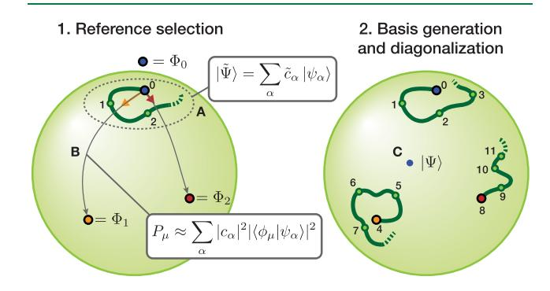
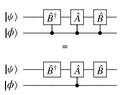
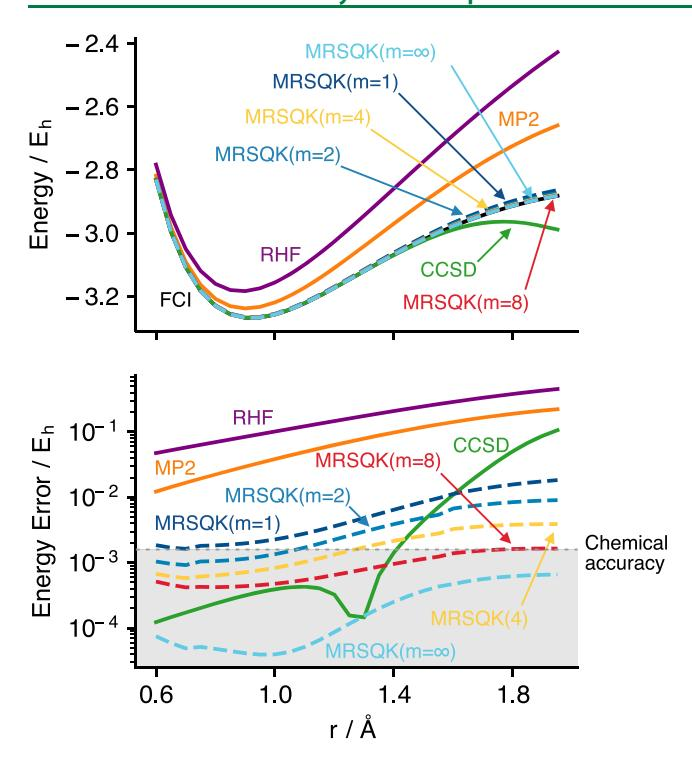
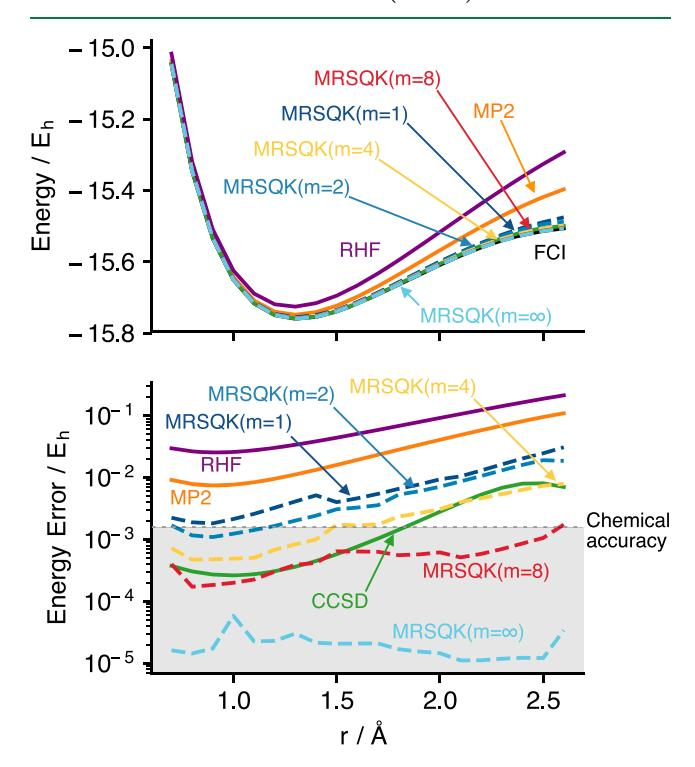

pubs.acs.org/JCTC Article

# A Multireference Quantum Krylov Algorithm for Strongly Correlated Electrons

Nicholas H. Stair, Renke Huang, and Francesco A. Evangelista\*

Cite This: J. Chem. Theory Comput. 2020, 16, 2236-2245

ACCESS

Metrics & More

Article Recommendations

3 Supporting Information

ABSTRACT: We introduce a multireference selected quantum Krylov (MRSQK) algorithm suitable for quantum simulation of many-body problems. MRSQK is a low-cost alternative to the quantum phase estimation algorithm that generates a target state as a linear combination of non-orthogonal Krylov basis states. This basis is constructed from a set of reference states via real-time evolution; thus, avoiding the numerical optimization of parameters. An efficient algorithm for the evaluation of the off-diagonal matrix elements of the overlap and Hamiltonian matrices is discussed and a selection procedure is introduced to identify a basis of orthogonal references that ameliorates the linear dependency problem.

Reference Selection Space Time Evolution Computation Diagonalization

Preliminary benchmarks on linear H6, H8, and BeH2 indicate that MRSQK can predict the energy of these systems accurately using very compact Krylov bases.

## 1. INTRODUCTION

Solving the electronic many-body Schrödinger equation for systems that display strong correlation effects is a major challenge in physics and quantum chemistry. Quantum computation offers a potential solution to the exponential scaling of the Hilbert space dimension with particle number. Recent advances in quantum hardware design, including an early demonstrations of quantum speedup, have motivated the development of new quantum algorithms that can be executed on so-called noisy intermediate-scale quantum (NISQ) devices, with less than 100 qubits and shallow circuits.

Algorithms based on quantum phase estimation (QPE),5,6 were the first proposed to compute the ground-state energies of Fermionic many-body systems.7 QPE was later applied to molecular problems8 and has been implemented on a photonic quantum device.9 Though QPE is well suited for Hamiltonian simulation on large-scale fault-tolerant quantum hardware, its application in the NISQ era presents several challenges due to the poor gate fidelity and the limited coherence time of devices available in the foreseeable future.10,11 As a result, hybrid quantum-classical algorithms requiring shallower circuits, such as the variational quantum eigensolver (VQE)12,13 and the quantum approximate optimization algorithm (QAOA)14 have recently received more attention.

In the VQE scheme, a complex trial wave function is optimized via an algorithm that subdivides the work between a classical and quantum computer. In this approach, the variational minimization of the energy is driven by a classical algorithm, while measurement of the energy and gradients is deployed to a quantum computer. VQE was originally

implemented with the unitary coupled cluster (UCC)15–20 ansatz truncated to single and double excitations. 12,13,21–24 More recently, several groups have studied alternative ansätze, including mean-field references, 25 UCC with general singles and doubles, 26 hardware-efficient parametrizations, 27 resource-efficient qubit-space UCC with two-qubit entanglers, 28,29 general UCC with adaptively selected unitaries, 30 and linear-depth Fermionic Gaussian reference states. 31 Efforts have also been made to extend the VQE algorithm to compute excited states 32–37 and approaches that combine variational methods and phase estimation have been suggested. 38,39

Notwithstanding the significant impact of VQE schemes, they have two principal drawbacks. First, VQE methods require measurement of the energy or energy gradients with respect to the variational parameters at each step of the optimization process. This results in a significant number of queries of the optimization algorithm to the quantum device. Second, the optimization process in VQE is challenging due to the high nonlinearity of the energy (considered as a function of the parameters), the intrinsic inexactness of the ansatz, 40 and stochastic errors that result from finite measurement and loss of fidelity. 41 As a consequence, the optimization process may

Received: November 12, 2019 Published: February 24, 2020

be slow to convergence and may reach a local minimum instead of the true ground state.

A third and emerging family of methods, which we refer to as Quantum Subspace Diagonalization (QSD) schemes, diagonalize the Hamiltonian in a general non-orthogonal basis of many-body states. 32,33,42-46 There is a long tradition of using such a strategy in quantum chemistry. 47-52 A natural way to extend it to quantum computing is to construct a basis of states and measure the corresponding matrix elements with a quantum device, and later solve the associated generalized eigenvalue problem via a classical computer. 32 Compared to a fully classical approach, QSD schemes can take advantage of the ability of quantum computers to store arbitrarily complex states.

QSD methods mainly differ in the way the many-body basis is generated. The quantum subspace expansion (QSE) method of McClean and co-workers, diagonalizes the Hamiltonian in the basis of states  $\hat{a}_i^{\dagger}\hat{a}_i|\Psi\rangle$ , where  $\Psi$  is a reference state prepared via VQE. 32,33,42 Matrix element of the Hamiltonian in this basis are obtained by measuring the three- and four-body density matrices. QSD approaches are particularly advantageous if the many-body basis is constructed as a Krylov space43 and does not require extensive parameter optimization. This is the case for the Quantum Lanczos (QLanczos) algorithm, 43 where the Hamiltonian is diagonalized in a basis of correlated states generated by imaginary-time propagation.53 This basis is obtained from a single reference state by sampling at regular intervals in imaginary time. In QLanczos, the imaginary-time propagator is written as a unitary operation times a normalization factor, and a linear approximation is employed to construct this representation. For each step in the imaginary-time propagation, a linear system of equations must be solved for classically, requiring the measurement of the entries of a matrix and a vector. Recently, a quantum equation-of-motion (QEOM) approach that employs a QSD schema for computing excited states was also explored.40

Despite their potential, QSD methods suffer from a series of practical issues, which are the focus of this work. The generalized eigenvalue problem associated with a given nonorthogonal basis requires the efficient evaluation of off-diagonal matrix elements of the form  $\langle \psi_\alpha|\hat{O}|\psi_\beta\rangle$ . While in the case of QSE and QLanczos these matrix elements are easily computed,  $^{32,43}$  in the general case their evaluation is more involved. Another important issue is the linear dependency of the basis generated in a QSD procedure. This issue introduces numerical instabilities in the generalized eigenvalue problem and is potentially amplified by poor gate fidelity and measurement errors. Bases generated by variational optimization and real or imaginary time propagation are all plagued (to various degrees) by linear dependencies.

In this work we formulate a QSD algorithm that addresses the two problems described above. First, we describe an efficient approach to evaluate the off-diagonal matrix elements required in QSD methods, with a cost that is essentially identical to that of computing expectation values. Second, to mitigate the linear dependency problem, we consider a multireference approach in which the Krylov space is constructed from an initial set of orthogonal references. These references are selected via a scheme that exploits quantum measurement to identify the most important determinants in a simple trial wave function. The resulting multireference selected quantum Krylov (MRSQK) method

(see Figure 1) is combined with basis generation via real-time propagation 43,45 and benchmarked on a series of problems involving strongly correlated electronic states.

Figure 1. Schematic illustration of the multireference selected quantum Krylov (MRSQK) algorithm. (A) An approximate real-time dynamics using a single Slater determinant reference ( $\Phi_0$ ) is used to generate a trial state ( $\tilde{\Psi}$ ). (B) Measurements of the determinants that comprise the trial state are used to determine the probability of hopping ( $P_\mu$ ) to other determinants. This information is employed to build two new reference states,  $\Phi_1$  and  $\Phi_2$ . (C) Finally, three real-time evolutions starting from the references ( $\Phi_0$ ,  $\Phi_1$ ,  $\Phi_2$ ) generate a set of 12 Krylov states  $\psi_{av}$  which are used to diagonalize the Hamiltonian and obtain the energy of the state  $\Psi$ .

While we were finalizing our manuscript, two papers appeared in preprint which are similar in spirit to our work. Parrish and McMahon45 developed a quantum filter diagonalization (QFD) formalism in which a basis of manybody states is generated via an approximate real-time dynamics. QFD was inspired by classical filter diagonalization54–57 as well as quantum time grid methods.58–61 In both our work and that of Parrish and McMahon, the many-body basis is generated from a set of guess states. QFD, for example, was applied to an eight-qubit ab initio exciton model in which the guess states were comprised of the ground state and all single exciton states.45 Our work may be viewed as a variant of QFD with selected references; however, a main difference is that in our approach the references are determined in an automated fashion using quantum measurement to determine important states. QFD and MRSQK also employ the same strategy for computing off-diagonal matrix elements (a modified Hadamard test).62 In this work we provide detailed quantum circuits to evaluate these quantities and show that the cost of this procedure is nearly identical to that of computing the more trivial diagonal matrix elements. Our work also has some overlap with a paper by Huggins et al.44 in which they propose a non-orthogonal VQE (NOVQE) scheme. In the NOVQE approach, the Krylov basis is generated from a set of non-orthogonal VQE states, namely k-fold products of unitary paired coupled cluster with generalized single and double excitations (k-UpCCGSD) employing a single Slater determinant reference. 63 Due to the variational optimization of each element of the many-body basis, the Krylov space generated in the NOVQE method converges to the ground state, which is likely to require a smaller number of basis states. In the NOVQE scheme, the authors propose to compute off-diagonal matrix elements via an algorithm that avoids controlled unitary operations, at the expense of requiring twice the number of qubits used for the Hadamard test.

# 2. THEORY

Consider a molecular Hamiltonian mapped to a set of qubits  $(\hat{H})$ ,

$$\hat{H} = E_0 + \sum_{l} h_l \hat{V}_l \tag{1}$$

where  $E_0$  is a scalar term, the index I runs over all the terms in the Hamiltonian,  $h_I$  is a matrix element, and  $\hat{V}_I$  is the corresponding operator. Each operator  $\hat{V}_I$  in  $\hat{H}$  is a tensor product of  $N_I$  Pauli operators (a Pauli string) that act on distinct qubits,  $\hat{V}_I = \bigotimes_{k=1}^{N_I} \sigma_{l_k}^{(j_k)}$ , where  $l_k \in \{X, Y, Z\}$  labels the Pauli operator type and  $j_k$  indicates the qubit upon which said operator is applied.

To define the MRSQK method, we start by introducing a d-dimensional basis of reference states,  $\mathcal{M}_0 = \{\Phi_I\}$ , where each  $\Phi_I$  is a linear combination of Slater determinants  $(\phi_\mu)$  with well-defined spin and spatial symmetry,

$$|\Phi_I\rangle = \sum_{\mu} d_{\mu I} |\phi_{\mu}\rangle \tag{2}$$

From this basis, we generate a non-orthogonal Krylov64,65 space,  $\mathcal{K}_s(\mathcal{M}_0, \hat{U}_n) = \{\psi_\alpha, \alpha = 1, ... N\}$ , by repeated application of a family of unitary operators  $\hat{U}_n$  (with n = 0, 1, ..., s) to all the elements of  $\mathcal{M}_0$ , for a total of s time steps. A generic element  $\psi_I^{(n)} \in \mathcal{K}$  is given by the action of  $\hat{U}_n$  on  $\Phi_b$ 

$$|\psi_{\alpha}\rangle \equiv |\psi_{I}^{(n)}\rangle = \hat{U}_{n}|\Phi_{I}\rangle \tag{3}$$

For convenience, we use the collective index  $\alpha = (I, n)$  to identify an element of the basis. The resulting Krylov space has dimension N = d(s + 1).

In MRSQK, a general state is written as a linear combination of the basis  $\{\psi_{\alpha}\}$  as

$$|\Psi\rangle = \sum_{\alpha} c_{\alpha} |\psi_{\alpha}\rangle = \sum_{I=1}^{d} \sum_{n=0}^{s} c_{I}^{(n)} \hat{U}_{n} |\Phi_{I}\rangle \tag{4}$$

Variational minimization of the energy of the state  $\Psi$  leads to the following generalized eigenvalue problem,

$$\mathbf{Hc} = \mathbf{Sc}E \tag{5}$$

where the elements of the overlap matrix (S) and Hamiltonian (H) are given by

$$S_{\alpha\beta} = \langle \psi_{\alpha} | \psi_{\beta} \rangle = \langle \Phi_{I} | \hat{U}_{m}^{\dagger} \hat{U}_{n} | \Phi_{J} \rangle \tag{6}$$

$$H_{\alpha\beta} = \langle \psi_{\alpha} | \hat{H} | \psi_{\beta} \rangle = \langle \Phi_{I} | \hat{U}_{m}^{\dagger} \hat{H} \hat{U}_{n} | \Phi_{J} \rangle \tag{7}$$

The formalism outlined above lends itself to a large number of quantum algorithms, depending on: (i) how the basis  $\mathcal{M}_0$  is selected, (ii) the particular choice of  $\hat{U}_n$ , and (iii) the quantum circuits used to evaluate S and H. In the following we describe the combination that defines our multireference selected quantum Krylov approach. We detail both the efficient algorithm used to evaluate off-diagonal overlap and Hamiltonian matrix elements and our selection approach to generate the basis of references.

**2.1. Choice of the Unitary Operators.** In choosing the family of unitary operators  $\hat{U}_n$  there are two primary criteria we aim to satisfy: (i) that it generates a basis that well describes the eigenstates of  $\hat{H}$  and (ii) that the corresponding quantum

circuit is inexpensive to evaluate. These requirements give considerable freedom, and a natural choice is a family of operators based on real-time evolution,  $\hat{U}_n = \exp(-it_n\hat{H})$ , where  $t_n = n\Delta t$  and  $\Delta t$  is a fixed time step.

In fact, it is possible to show that for small  $\Delta t$ , the basis of states  $\mathcal{K}_s(\Phi_I, \hat{U}_n)$  generated by real-time evolution spans a classical Krylov space. Consider a linear combination of the elements of  $\mathcal{K}_s(\Phi_I, \hat{U}_n)$  and expand the exponential into a Taylor series keeping terms up to order  $(\Delta t)^s$ :

$$|\psi\rangle = \sum_{n=0}^{s} c_{I}^{(n)} e^{-in\Delta t \hat{H}} |\Phi_{I}\rangle$$

$$= \sum_{k=0}^{s} \left( \sum_{n=0}^{s} \frac{(-in\Delta t)^{k}}{k!} c_{I}^{(n)} \right) \hat{H}^{k} |\Phi_{I}\rangle + O(\Delta t^{s+1})$$

$$= \sum_{k=0}^{s} \left( \sum_{n=0}^{s} M_{kn} c_{I}^{(n)} \right) \hat{H}^{k} |\Phi_{I}\rangle + O(\Delta t^{s+1})$$
(8)

The square matrix  $\mathbf{M}$  is invertible, and therefore, the coefficients  $c_l^{(n)}$  may be chosen to represent any combination of the classical Krylov basis  $\{\hat{H}^k|\Phi_l\}$ , with k=0,...,s, up to higher-order terms. This analysis shows that working with small time steps should be advantageous, as the quantum Krylov basis would reproduce the classical one. Indeed, this is what we find in numerical experiments. In practice, however, small time steps make the overlap matrix [eq 6] nearly singular, which consequently reduces the numerical stability of the generalized eigenvalue problem. In MRSQK this issue is ameliorated by the use of multiple references that are required to be orthogonal.

To realize the MRSQK method on a quantum computer, a quantum circuit is required that can approximate the time-evolution operator. The analysis presented above suggests that it is important that any approximation to the real-time evolution operator must be sufficiently accurate. Otherwise the approximate quantum Krylov basis will likely not span the classical Krylov basis of the exact Hamiltonian, and consequently slow down the convergence of the method. To approximate the real-time evolution one may follow standard approaches like the Trotter–Suzuki decomposition of employ a truncated Taylor series. In this work we employ the former methodology, and consider the m-Trotter number (step) approximation of non-commuting operators  $\hat{A}$  and  $\hat{B}$  given by

$$e^{\hat{A}+\hat{B}} \approx \left(e^{\hat{A}/m}e^{\hat{B}/m}\right)^m \tag{9}$$

which is exact in the limit of  $m\rightarrow\infty$ . When applied to the real-time propagator, this corresponds to the product

$$\hat{U}_{n} = \left(\prod_{l} \hat{U}_{n,l}(t_{n}/m)\right)^{m} = \left(\prod_{l} \exp(-it_{n}h_{l}/m\hat{V}_{l})\right)^{m}$$
(10)

As will be shown in section 4, low Trotter number approximations (m = 1, 2) yield large errors in the computation of the ground-state electronic energy.

**2.2. Efficient Evaluation of off-Diagonal Matrix Elements.** To efficiently measure the overlap and Hamiltonian matrix elements [eqs 6 and 7], we augment the circuit used to build the basis with an ancillary qubit and construct the state  $\frac{1}{\sqrt{2}}(|\psi_{\alpha}\rangle \otimes |0\rangle + |\psi_{\beta}\rangle \otimes |1\rangle)$ . We then obtain  $\langle \psi_{\alpha}|\psi_{\beta}\rangle$  by

measuring the expectation value of the operator  $2\sigma_+ = \sigma_X + i\sigma_Y$  on the ancilla qubit. To produce the state  $|\psi_{\alpha}\rangle$ , we introduce the unitary operator  $\hat{U}_{\alpha}$ , defined as

$$\hat{U}_{\alpha} = \hat{U}_{n}\hat{U}_{l} \tag{11}$$

where  $\hat{U}_I$  generates the reference state  $|\Phi_I\rangle$  from the zero state,  $|\overline{0}\rangle = |0\rangle$ . The circuit to measure off-diagonal matrix elements is shown in Figure 2. We note that the use of a modified

$$|\tilde{0}\rangle$$
  $|\hat{U}_{\alpha}|$   $|\hat{U}_{\beta}|$   $|\hat{U}_{\beta}|$   $|\hat{U}_{\beta}|$   $|\hat{U}_{\beta}|$   $|\hat{U}_{\beta}|$   $|\hat{U}_{\beta}|$   $|\hat{U}_{\beta}|$   $|\hat{U}_{\beta}|$   $|\hat{U}_{\beta}|$   $|\hat{U}_{\beta}|$   $|\hat{U}_{\beta}|$   $|\hat{U}_{\beta}|$   $|\hat{U}_{\beta}|$   $|\hat{U}_{\beta}|$   $|\hat{U}_{\beta}|$   $|\hat{U}_{\beta}|$   $|\hat{U}_{\beta}|$   $|\hat{U}_{\beta}|$   $|\hat{U}_{\beta}|$   $|\hat{U}_{\beta}|$   $|\hat{U}_{\beta}|$   $|\hat{U}_{\beta}|$   $|\hat{U}_{\beta}|$   $|\hat{U}_{\beta}|$   $|\hat{U}_{\beta}|$   $|\hat{U}_{\beta}|$   $|\hat{U}_{\beta}|$   $|\hat{U}_{\beta}|$   $|\hat{U}_{\beta}|$   $|\hat{U}_{\beta}|$   $|\hat{U}_{\beta}|$   $|\hat{U}_{\beta}|$   $|\hat{U}_{\beta}|$   $|\hat{U}_{\beta}|$   $|\hat{U}_{\beta}|$   $|\hat{U}_{\beta}|$   $|\hat{U}_{\beta}|$   $|\hat{U}_{\beta}|$   $|\hat{U}_{\beta}|$   $|\hat{U}_{\beta}|$   $|\hat{U}_{\beta}|$   $|\hat{U}_{\beta}|$   $|\hat{U}_{\beta}|$   $|\hat{U}_{\beta}|$   $|\hat{U}_{\beta}|$   $|\hat{U}_{\beta}|$   $|\hat{U}_{\beta}|$   $|\hat{U}_{\beta}|$   $|\hat{U}_{\beta}|$   $|\hat{U}_{\beta}|$   $|\hat{U}_{\beta}|$   $|\hat{U}_{\beta}|$   $|\hat{U}_{\beta}|$   $|\hat{U}_{\beta}|$   $|\hat{U}_{\beta}|$   $|\hat{U}_{\beta}|$   $|\hat{U}_{\beta}|$   $|\hat{U}_{\beta}|$   $|\hat{U}_{\beta}|$   $|\hat{U}_{\beta}|$   $|\hat{U}_{\beta}|$   $|\hat{U}_{\beta}|$   $|\hat{U}_{\beta}|$   $|\hat{U}_{\beta}|$   $|\hat{U}_{\beta}|$   $|\hat{U}_{\beta}|$   $|\hat{U}_{\beta}|$   $|\hat{U}_{\beta}|$   $|\hat{U}_{\beta}|$   $|\hat{U}_{\beta}|$   $|\hat{U}_{\beta}|$   $|\hat{U}_{\beta}|$   $|\hat{U}_{\beta}|$   $|\hat{U}_{\beta}|$   $|\hat{U}_{\beta}|$   $|\hat{U}_{\beta}|$   $|\hat{U}_{\beta}|$   $|\hat{U}_{\beta}|$   $|\hat{U}_{\beta}|$   $|\hat{U}_{\beta}|$   $|\hat{U}_{\beta}|$   $|\hat{U}_{\beta}|$   $|\hat{U}_{\beta}|$   $|\hat{U}_{\beta}|$   $|\hat{U}_{\beta}|$   $|\hat{U}_{\beta}|$   $|\hat{U}_{\beta}|$   $|\hat{U}_{\beta}|$   $|\hat{U}_{\beta}|$   $|\hat{U}_{\beta}|$   $|\hat{U}_{\beta}|$   $|\hat{U}_{\beta}|$   $|\hat{U}_{\beta}|$   $|\hat{U}_{\beta}|$   $|\hat{U}_{\beta}|$   $|\hat{U}_{\beta}|$   $|\hat{U}_{\beta}|$   $|\hat{U}_{\beta}|$   $|\hat{U}_{\beta}|$   $|\hat{U}_{\beta}|$   $|\hat{U}_{\beta}|$   $|\hat{U}_{\beta}|$   $|\hat{U}_{\beta}|$   $|\hat{U}_{\beta}|$   $|\hat{U}_{\beta}|$   $|\hat{U}_{\beta}|$   $|\hat{U}_{\beta}|$   $|\hat{U}_{\beta}|$   $|\hat{U}_{\beta}|$   $|\hat{U}_{\beta}|$   $|\hat{U}_{\beta}|$   $|\hat{U}_{\beta}|$   $|\hat{U}_{\beta}|$   $|\hat{U}_{\beta}|$   $|\hat{U}_{\beta}|$   $|\hat{U}_{\beta}|$   $|\hat{U}_{\beta}|$   $|\hat{U}_{\beta}|$   $|\hat{U}_{\beta}|$   $|\hat{U}_{\beta}|$   $|\hat{U}_{\beta}|$   $|\hat{U}_{\beta}|$   $|\hat{U}_{\beta}|$   $|\hat{U}_{\beta}|$   $|\hat{U}_{\beta}|$   $|\hat{U}_{\beta}|$   $|\hat{U}_{\beta}|$   $|\hat{U}_{\beta}|$   $|\hat{U}_{\beta}|$   $|\hat{U}_{\beta}|$   $|\hat{U}_{\beta}|$   $|\hat{U}_{\beta}|$   $|\hat{U}_{\beta}|$   $|\hat{U}_{\beta}|$   $|\hat{U}_{\beta}|$   $|\hat{U}_{\beta}|$   $|\hat{U}_{\beta}|$   $|\hat{U}_{\beta}|$   $|\hat{U}_{\beta}|$   $|\hat{U}_{\beta}|$   $|\hat{U}_{\beta}|$   $|\hat{U}_{\beta}|$   $|\hat{U}_{\beta}|$   $|\hat{U}_{\beta}|$   $|\hat{U}_{\beta}|$   $|\hat{U}_{\beta}|$   $|\hat{U}_{\beta}|$   $|\hat{U}_{\beta}|$   $|\hat{U}_{\beta}|$   $|\hat{U}_{\beta}|$   $|\hat{U}_{\beta}|$   $|\hat{U}_{\beta}|$   $|\hat{U}_{\beta}|$   $|\hat{U}_{\beta}|$   $|\hat{U}_{\beta}|$   $|\hat{U}_{$ 

**Figure 2.** General circuit for measuring non-hermitian operators of the form  $\langle \overline{0}|\hat{U}_{\alpha}^{\dagger}\hat{U}_{\beta}|\overline{0}\rangle$ . In this circuit, the final measurement corresponds to separate measurements of X and Y and the evaluation of the expectation value of  $2\sigma_{+} = X + iY = 2|0\rangle \langle 1|$ .

Hadamard test to measure off-diagonal matrix elements employed in this work and in ref 45, and the modified SWAP test used in ref 44, are particularly advantageous when the unitary operator  $\hat{U}_{\alpha}$  cannot be expanded as a small sum of polynomials of Pauli operators (which is the case for real-time dynamics). In the case of a Hadamard test, this advantage comes at the cost of using controlled versions of  $\hat{U}_{\alpha}$ , and consequently, deeper quantum circuits and the need to use an ancilla qubit. When the operator  $\hat{U}_{\alpha}$  can be written as a small sum of Pauli strings, e.g., in the case of single excitations out of a VQE reference, then it is more efficient to compute off-diagonal matrix elements by averaging over all the Pauli terms of the Hamiltonian and the excitation operators that compose the Krylov subspace, as is done in the original QSE approach.  $^{32}$ 

For  $\hat{U}_n$  constructed out of exponentials of Pauli strings, a crucial simplification may be employed that allows the efficient construction of the state  $\frac{1}{\sqrt{2}}(|\psi_{\alpha}\rangle\otimes|0\rangle+|\psi_{\beta}\rangle\otimes|1\rangle)$ . First, we start by representing the product of Pauli operators in each of terms  $\hat{V}_l$  as a unitarily transformed Pauli string consisting of operators in the Z basis,

$$\hat{V}_{l} = \bigotimes_{k=1}^{N_{l}} \sigma_{l_{k}}^{(j_{k})} = \mathcal{H}_{l} \bigotimes_{k=1}^{N_{l}} \sigma_{Z}^{(j_{k})} \mathcal{H}_{l}$$

$$\tag{12}$$

where  $\mathcal{H}_I$  is a product of single qubit gates that transform each  $\sigma_{l_k}^{(j_k)}$  to  $\sigma_Z^{(j_k)}$  71 Consequently, each term in  $\hat{U}_{n,I} = \exp(-it_nh_I\hat{V}_I)$  can be written as

$$\hat{U}_{n,l} = \mathcal{H}_l(e^{-it_n h_l \bigotimes_{k=1}^{N_l} \sigma_Z^{(i_k)}}) \mathcal{H}_l = \tilde{U}_{n,l} R_{z_{N_l}} (2t_n h_l) \tilde{U}_{n,l}$$
(13)

where in the second step we have used a well-known representation of the exponential of Pauli strings composed of CNOT gates (collected in  $\tilde{U}_{n,l}$ ) and a Z rotation on the  $N_l$  qubit  $(R_{z_{N_l}})$ .  $^{69,71}$  Using the following operator identity involving the controlled versions of generic unitary operators  $\hat{A}$  and  $\hat{B}$  (c- $\hat{A}$  and c- $\hat{B}$ , see Figure 3),

$$(c-\hat{B}^{\dagger})(c-\hat{A})(c-\hat{B}) = \hat{B}^{\dagger}(c-\hat{A})\hat{B}$$
(14)

we can rewrite the controlled unitary evolution operator  $(c-\tilde{U}_{n,l})$  required to evaluate overlaps as

$$c-\hat{U}_{n,l} = \tilde{U}_{n,l}^{\dagger} [c-R_{z_{N_{l}}}(2\theta_{n})] \tilde{U}_{n,l}$$
(15)

**Figure 3.** Circuit identity used to simplify the controlled version of  $\tilde{U}_{n,l}$  [eq 14].  $\psi$  is a multi-qubit register used to encode a quantum state, and the last qubit is an ancilla.

which requires only one extra controlled operation  $c-R_{z_{N_l}}(2\theta_n)$  at the center of the circuit (see Supporting Information, Figure SI1). Controlled unitaries evaluated in this way require at most  $2N_l$  single qubit gates,  $2N_l$  CNOT gates, and a controlled single-qubit gate.

Next, we discuss the implementation of the unitary  $\hat{U}_I$  that prepares reference states from  $|\overline{0}\rangle$ . When  $\Phi_I$  is a single Slater determinant,  $\hat{U}_I$  is a product of X gates. For multideterminantal references, one can apply the linear combination of unitaries (LCU) algorithm,  $^{72}$  or follow the procedure outlined by Tubman et al. This approach requires only one ancilla qubit and O(nL) one- or two-qubit gates, where n is the number of qubits and L the number of determinants in a particular reference. Alternatively, one may target references that are composed of a single configuration state function  $^{74,75}$  or two electron geminals.

It is easy to generalize these circuits to controlled versions; however, one may pay the penalty of increasing the number of two-qubit gates (after factoring three qubit control gates into two-qubit ones). This suggests that the references  $\Phi_I$  should be chosen to be compact multideterminantal wave functions, e.g., either single determinants or a small linear combinations of determinants.

Evaluation of the Hamiltonian matrix elements  $H_{\alpha\beta} = \sum_l h_l \langle \psi_\alpha | \hat{V}_l | \psi_\beta \rangle$  proceeds in an analogous way by computing each term  $\langle \psi_\alpha | \hat{V}_l | \psi_\beta \rangle$  individually. The circuit employed is analogous to the one in Figure 2 with the operator  $\hat{U}_\beta$  replaced by  $\hat{V}_l \hat{U}_\beta$ . Since each term  $\hat{V}_l$  contains only the product of one qubit operators, the corresponding controlled operator contains at most two qubit operators. The evaluation of S and H lends itself to a high degree of parallelism. As in VQE methods, evaluation of a single matrix element of H may be parallelized over terms in the Hamiltonian. In addition, in the MRSQK, one may parallelize over the N(N-1)/2 unique pairs of Krylov states  $\psi_\alpha/\psi_\beta$ . Note that techniques used to ameliorate finite measurement errors in VQE  $^{77-81}$  approaches can also be applied to MRSQK.

**2.3. Reference Selection.** A third important aspect of the MRSQK algorithm is the procedure to select the reference configurations. Our approach exploits quantum measurement to identify a set of configurations starting from a trial MRSQK wave function. Specifically, we first form and diagonalize the Hamiltonian in the Krylov space  $\mathcal{K}_s(\Phi_0, \hat{U}_n)$ , where  $\Phi_0$  is a single determinant (e.g., a closed-shell Hartree–Fock determinant). The resulting trial wave function  $\tilde{\Psi} = \sum_{\alpha} \psi_{\alpha} \tilde{c}_{\alpha}$  is used to construct a list of potential important determinants. Since the probability of measuring a determinant  $\phi_{\mu}$  is equal to  $P_{\mu} = |\langle \phi_{\mu} | \widetilde{\Psi} \rangle|^2$ , one can in principle form the state  $\widetilde{\Psi}$  on a quantum computer and directly measure the determinantal composition,

which in the Jordan–Wigner mapping amounts to measuring the expectation value of Z for all wave function qubits. In practice, we approximate  $P_{\mu}$  by measuring each element of the Krylov basis and estimating the total probability as a weighted sum over references via

$$P_{\mu} = |\sum_{\alpha} \langle \phi_{\mu} | \psi_{\alpha} \rangle c_{\alpha}|^{2} \approx \sum_{\alpha} |\langle \phi_{\mu} | \psi_{\alpha} \rangle|^{2} |c_{\alpha}|^{2}$$
(16)

Measurements are accumulated until we form a list of determinants of length equal to a small multiple of the number of references we aim to select (e.g., 2d). In principle only a small number of measurements are required because the values of  $P_{\mu}$  need only be qualitatively correct such that the determinants can be sorted. It should be noted, however, that using eq 16 as a criterion can lead to the overestimation of the importance of certain determinants due to neglected sign cancellation. A comparison of the approximate sampling based on eq 16 and the exact weight of determinants in the MRSQK wave function shows that the former method is sufficient to identify the most important determinants (see Supporting Information, Table S1). Alternatively, Ψ could be directly represented on a quantum computer via the linear combination of unitaries (LCU) algorithm, 72 so that determinants would be sampled directly with their correct probabilities.

Once formed, the list of potentially important determinants is augmented to guarantee that all spin arrangements of openshell determinants are included. Next, we diagonalize the Hamiltonian in this small determinant basis. At this stage we identify references in the following way: closed-shell determinants are considered individually, while open-shell determinants with the same spin occupation pattern are grouped together and their weight summed. Lastly, we select d 1 largest weighted references beyond the Hartree-Fock state. References composed of open-shell determinants are normalized to one using the determinant coefficients from the small classical CI. This procedure generates very compact reference states that can be used with the algorithm for computing off-diagonal matrix elements discussed in section 2.2. It is worth noting that the above procedure could also be generalized in such a way that important references are generated by an iterative algorithm that starts from a singledeterminant state. An adaptive strategy like this reduces the bias introduced by selecting a starting Slater determinant reference and may be advantageous if some of the important references are generated with low weights from a singledeterminant state.

2.4. Analysis of Computational Cost. The quantum computational cost of the MRSQK algorithm is dominated by the application of the Trotterized Hamiltonian circuits  $\hat{U}_n$ . The depth of these circuits scales at worst  $O(mK^4)$ , where m is the trotter number and K is the number of molecular orbitals. At the minimal Trotter number level (m = 1), the circuit depth for MRSQK is comparable to that of UCC with generalized singles and doubles (employing the same Trotter number), and far shallower than QPE. More importantly, the circuit depth of MRSQK is independent of size of the Krylov basis one wishes to generate, allowing for a flexible trade-off between quantum and classical cost. For example, in the NISQ device era, one may avoid larger circuit depths with MRSQK by employing a modest Trotter number, but still achieve a high degree of accuracy by building a larger Krylov space that will be diagonalized classically. In this way MRSQK has both the

advantage of selected CI to exploit wave function sparsity and the classical compression afforded by its quantum computational subroutines. This flexibility is a feature that distinguishes MRSQK from other QSD methods.

#### 3. COMPUTATIONAL DETAILS

The MRSQK method was implemented using both an exact second quantization formalism and a quantum computer simulator using the open-source package QForte.82 All calculations used restricted Hartree-Fock (RHF) orbitals generated with Psi483 using a minimal (STO-6G)84 basis. Molecular Hamiltonians for the hydrogen and BeH2 systems were translated to a qubit representation via the Jordan-Wigner transformation as implemented in OpenFermion85 with default term ordering. For all calculations, references in MRSQK were selected using initial QK calculations with  $s_0$  = 2 evolutions of the Hartree-Fock determinant and a time step of  $\Delta t = 0.25$  au. Parameters such as the time step  $(\Delta t)$  and number of evolutions per reference (s) used in MRSQK were chosen based on energy accuracy and numerical stability. We also note that we take the Trotter approximation with m = 100as a good approximation to the infinite *m* limit for the potential energy curves we plot. Adaptive derivative-assembled pseudo-Trotter ansatz variational quantum eigensolver (ADAPT- $VQE)^{30}$  calculations were performed with a in-house code provided by N. Mayhall.

# 4. NUMERICAL STUDIES AND DISCUSSION

We benchmark the performance and comparative numerical stability of the MRSQK algorithm with linear chains of six and eight hydrogen atoms, two canonical models for one-dimensional materials with correlation strength modulated by bond length. We utilize point-group symmetry, which results in a determinant space comprised of 200 and 2468 determinants for H6 and H8, respectively. We first consider H6 at a bond distance of 1.50 Å, which exhibits strong electron correlation, as indicated by the large correlation energy ( $E_{\rm corr} = -0.24681E_{\rm h}$ ) and the small weight of the Hartree–Fock determinant in the FCI expansion ( $|C_{\rm HF}|^2 = 0.634$ ).

In Table 1 we show a comparison of the energy and overlap matrix condition number for the single reference version of quantum Krylov (QK), taking only the HF determinant as a reference, and MRSQK as a function of the total number of basis states. For  $H_6$  we observe that in both the single and multireference cases, convergence to chemical accuracy (error less than 1 kcal mol-1 = 1.594 m $E_h$ ) is achieved with only 8 parameters, an order of magnitude smaller than the size of FCI space. For the case N = 12, MRSQK identifies the following three references

$$\begin{split} |\Phi_0\rangle &= |220200\rangle \\ |\Phi_1\rangle &= |200220\rangle \\ |\Phi_2\rangle &= -0.302|2\uparrow\uparrow\downarrow\downarrow0\rangle - 0.302|2\downarrow\downarrow\uparrow\uparrow\downarrow0\rangle \\ &+ 0.275|2\uparrow\downarrow\uparrow\downarrow0\rangle + 0.577|2\uparrow\downarrow\uparrow\uparrow0\rangle \\ &+ 0.577|2\downarrow\uparrow\uparrow\downarrow0\rangle + 0.275|2\downarrow\uparrow\downarrow\uparrow0\rangle \end{split}$$

where the orbitals are ordered according to  $(1a_g, 2a_g, 3a_g, 1b_{1\omega}, 2b_{1\omega}, 3b_{1\omega})$  in the  $D_{2h}$  point group. These references are comprised of two closed-shell and six open-shell determinants. If we perform a computation with a set of references consisting

Table 1. Ground-State Energies (in  $E_h$ ) of  $H_6$  and  $H_8$  at a Bond Distance of 1.5 Å Using Exact Time-Evolutiona

| N                              | $E_{\rm QK}$                   | $k(\mathbf{S}_{\text{QK}})$ | $E_{\rm MRSQK}$ | $k(S_{MRSQK})$       |  |  |  |  |  |  |
|--------------------------------|--------------------------------|-----------------------------|-----------------|----------------------|--|--|--|--|--|--|
| $H_6 (r_{HH} = 1.5 \text{ Å})$ |                                |                             |                 |                      |  |  |  |  |  |  |
| 4                              | -3.015510                      | $3.29 \times 10^{5}$        | -3.015510       | $3.29 \times 10^{5}$ |  |  |  |  |  |  |
| 8                              | -3.019768                      | $3.60 \times 10^{11}$       | -3.019301       | $4.86 \times 10^{5}$ |  |  |  |  |  |  |
| 12                             | -3.020172                      | $1.61 \times 10^{17}$       | -3.019696       | $9.39 \times 10^{5}$ |  |  |  |  |  |  |
| 16                             | -3.020192                      | $3.19 \times 10^{17}$       | -3.019835       | $5.68 \times 10^{6}$ |  |  |  |  |  |  |
| 20                             | -3.020198                      | $3.86 \times 10^{17}$       | -3.019929       | $6.23 \times 10^6$   |  |  |  |  |  |  |
| FCI                            | -3.020198                      |                             |                 |                      |  |  |  |  |  |  |
|                                |                                |                             |                 |                      |  |  |  |  |  |  |
|                                | $H_8 (r_{HH} = 1.5 \text{ Å})$ |                             |                 |                      |  |  |  |  |  |  |
| 4                              | -4.017108                      | $1.19 \times 10^{5}$        | -4.017108       | $1.19 \times 10^{5}$ |  |  |  |  |  |  |
| 8                              | -4.026563                      | $1.39 \times 10^{10}$       | -4.024268       | $1.50 \times 10^{5}$ |  |  |  |  |  |  |
| 12                             | -4.028000                      | $5.11 \times 10^{14}$       | -4.025894       | $2.00 \times 10^{5}$ |  |  |  |  |  |  |
| 16                             | -4.028096                      | $1.33 \times 10^{17}$       | -4.026042       | $2.51 \times 10^{5}$ |  |  |  |  |  |  |
| 20                             |                                |                             | -4.026387       | $4.27 \times 10^{5}$ |  |  |  |  |  |  |
| 24                             |                                |                             | -4.026457       | $4.44 \times 10^{5}$ |  |  |  |  |  |  |
| FCI                            | -4.028152                      |                             |                 |                      |  |  |  |  |  |  |

aEnergy and overlap condition number k(S) results are given for a single determinant (QK) using N Krylov basis states and  $\Delta t = 0.5$ . MRSQK results are given for N = d(s+1) Krylov basis states using three steps (s=3) and  $\Delta t = 0.5$  au. With N greater than 12 states, the condition number for QK does not grow larger than  $10^{18}$ . This is likely a result of limitations of double precision arithmetic.

of eight individual (uncontracted) determinants, the resulting Krylov space has dimension 32 and the corresponding energy is  $-3.019797E_{\rm h}$ , which is only 0.1 m $E_{\rm h}$  lower than the contracted result (-3.019696). Turning to H8, we find that the single-reference QK energy converges to chemical accuracy with only 12 parameters, 2 orders of magnitude fewer than FCI. For the same example, the MRSQK energy error is 1.06 kcal mol-1 with 24 parameters, only slightly higher than chemical accuracy.

The linear dependency of the basis for  $H_6$  and  $H_8$ —as measured by the condition number of the overlap matrix  $[k(\mathbf{S})]$ —is significantly more pronounced in the single reference QK than the MRSQK version. In the case of  $H_6$ , even with a small Krylov basis (8 elements), QK is potentially ill-conditioned  $[k(\mathbf{S}) = 3.60 \times 10^{11}]$ . In the case of 12 (or more) states, the QK eigenvalue problem is strongly ill-conditioned  $[k(\mathbf{S}) = 1.16 \times 10^{17}]$ , while MRSQK displays only a modest condition number,  $[k(\mathbf{S}) = 9.39 \times 10^5]$ . Importantly, QK becomes ill-conditioned before reaching chemical accuracy, whereas MRSQK does not, highlighting the importance of multireference approach for practical applications.

Next, we assess the errors introduced by approximating the real-time dynamics with a Trotter approximation. Table 2 shows the performance of MRSQK using various levels of Trotter approximation for H6 at a bond distance of 1.5 Å. While using exact time evolution affords the fastest energy convergence with respect to number of Krylov basis states, we find that chemical accuracy can still be achieved using a Trotterized exponential. For example, using a Trotter number m = 8, MRSQK gives an error of only 1.1 mEh with a basis of 20 Krylov states. In Table 2 we also show a comparison of MRSQK with selected configuration interaction (sCI) and the adaptive derivative-assembled pseudo-Trotter ansatz variational quantum eigensolver (ADAPT-VQE).30 For any Trotter number, MRSQK converges significantly faster than sCI and the ADAPT-VQE method. For example, even with the smallest Trotter number (m = 1) MRSQK with 20 Krylov states gives an error of 8.5 m $E_h$ , while a sCI wave function with 20 determinants yields an error of 58.4 m $E_h$  (see Table 2 for details of the determinant selection). In comparison, an ADAPT-VQE wave function with 20 parameters yields an error of 11.4 m $E_{\rm h}$ . These results demonstrate the ability of MRSQK to parametrize strongly correlated states efficiently using a small fraction of the variational degrees of freedom.

To illustrate the ability of MRSQK to determine accurate ground-state potential energy surfaces in the presence of strong correlation, we examine the dissociation of the H6 chain and linear BeH2. Figure 4 show the energy and error with respect to FCI for H6, using restricted Hartree-Fock (RHF), secondorder Møller-Plesset perturbation theory (MP2), coupled cluster with singles and doubles (CCSD), 89 and MRSQK with a Krylov basis of 20 states (s = 3, d = 5). With the onset of strong electron correlation, single-reference methods (RHF, MP2, CCSD) fail to capture the correct qualitative features of the potential energy curve. For example, CCSD produces very accurate results near the equilibrium geometry; however, it dips significantly below the FCI energy for bond distances greater than 1.5 Å. In contrast, MRSQK far outperforms CCSD even with the lowest Trotter number (m = 1) and chemically accurate MRSQK results are obtained with m = 8.

In Figure 5 we report the potential energy curve for the symmetric dissociation of linear BeH2. For this problem, the size of the determinant space is 169. Like H6, BeH2 is a challenging problem for single-reference methods, although CCSD shows smaller errors (less than 10 m $E_h$ ) throughout the entire curve. MRSQK computations on BeH2 employed 30 Krylov states generated by a space of six references and four time steps (s = 4). For this problem, we found that using a larger time step provides more accurate results, and therefore,

Table 2. Ground-State Energies (in  $E_h$ ) of  $H_6$  at a Bond Distance of 1.5 Å

| N   | $E_{\mathrm{MRSQK}}^{(m=\infty)}$ | $E_{\rm MRSQK}^{(m=8)}$ | $E_{\rm MRSQK}^{(m=4)}$ | $E_{\rm MRSQK}^{(m=2)}$ | $E_{\rm MRSQK}^{(m=1)}$ | $E_{\rm sCI}$ | $E_{\rm ADAPT-VQE}$ |
|-----|-----------------------------------|-------------------------|-------------------------|-------------------------|-------------------------|---------------|---------------------|
| 4   | -3.015510                         | -3.014138               | -3.009948               | -2.998858               | -2.982186               | -2.845002     | -2.906724           |
| 8   | -3.019301                         | -3.018341               | -3.015872               | -3.010035               | -3.001195               | -2.909404     | -2.983042           |
| 12  | -3.019696                         | -3.018808               | -3.016940               | -3.013425               | -3.008661               | -2.926337     | -2.995691           |
| 16  | -3.019835                         | -3.018888               | -3.017173               | -3.014253               | -3.010543               | -2.954587     | -3.002345           |
| 20  | -3.019929                         | -3.019054               | -3.017614               | -3.015311               | -3.011663               | -2.961772     | -3.008847           |
| FCI | -3.020198                         |                         |                         |                         |                         |               |                     |

"MRSQK results are given for N = d(s + 1) Krylov basis states using three steps (s = 3) and  $\Delta t = 0.5$  au. The quantity m indicates the Trotter number. For each value of N, selected configuration interaction (sCI) results were obtained using N determinants with the largest absolute coefficient in the FCI wave function. ADAPT-VQE results show the energy with N cluster amplitudes selected from the pool of spin-adapted particle-hole singles/doubles.

**Figure 4.** Potential energy curve (top) and error (bottom) for symmetric dissociation of linear  $H_6$  in a STO-6G basis. MRSQK computations use  $\Delta t = 0.5$  au, three time steps (s = 3), and five references (d = 5) corresponding to 20 Krylov basis states. The number of Trotter steps (m) is indicated in parentheses, while those from exact time evolution are labeled ( $m = \infty$ ).

**Figure 5.** Potential energy curve (top) and error (bottom) for symmetric dissociation of linear BeH2 in a STO-6G basis. MRSQK computations use  $\Delta t = 2$  au, four time steps (s = 4), and six references (d = 6) corresponding to 30 Krylov basis states. The number of Trotter steps (m) is indicated in parentheses, while those from exact time evolution are labeled ( $m = \infty$ ).

we report results using  $\Delta t=2$  au. In the case of no Trotter approximation  $(m=\infty)$ , the MRSQK error is less than 0.1 m $E_{\rm h}$  across the entire potential energy curve. The approximate MRSQK scheme based on four Trotter steps is already comparable in accuracy to CCSD, while using m=8 the error falls within chemical accuracy. By analyzing the error plot in the bottom half of Figure 5, we see that there are small discontinuities in the curve due to the selection of a different set of reference states. This problem, however, is common to all selected CI methodologies,  $^{90-94}$  as well as ADAPT-VQE. These discontinuities may be removed by employing references built from a fixed set of determinants.

### 5. CONCLUSIONS

In summary, the multireference selected quantum Krylovis a new quantum subspace diagonalization algorithm for solving the electronic Schrödinger equation on quantum devices. MRSQK diagonalizes the Hamiltonian in a basis of many-body states generated by real-time evolution of a set of orthogonal reference states. This approach has two major advantages: (i) it requires no variational optimization of classical parameters, (ii) it ameliorates the linear dependency problem that may plague other QSD methods. Benchmark computations on H6, H8, and BeH2 show that MRSQK with exact time-propagation converges rapidly to the exact energy using a number of Krylov states that is a small fraction of the full determinant space. When the real-time propagator is approximated via a Trotter decomposition, modest Trotter numbers m = 4, 8 are sufficient to ensure that truncation errors yield chemically accurate potential energy curves. We also report a comparison of the H6 energy converge using MRSQK, selected configuration interaction (sCI), and the state-of-the-art ADAPT-VQE algorithm. In comparing sCI and MRSQK, the significantly faster convergence of the latter method indicates that the Krylov basis efficiently captures the important multideterminantal features of the wave function. The comparison with ADAPT-VQE shows that MRSQK can achieve a compact representation of the wave function competitive even with an adaptive strategy that aims to minimize the number of unitary rotations.

Together, these advantages make MRSQK a promising tool for treating strongly correlated electronic systems with quantum computation. However, there are several aspects of the MRSQK that deserve more consideration. The current reference selection strategy may produce different sets of references as the molecular geometry is changed, which in turn causes small discontinuities in potential energy curves. Selection procedures that, e.g., identify references from a small fixed set of orbitals could be used to address this issue. In this work, we have selected fixed values for the time steps  $t_n$ . Schemes in which the time steps are treated as variational parameters may be able to represent states with a fewer number of Krylov states and are worth exploring. Another important aspect is improving the Trotter approximation to the real-time dynamics. Our results indicate that low Trotter number approximations (m = 1, 2) commonly used in other contexts introduce errors that are too large. It would be desirable to explore the implementation of real-time dynamics via alternative methods, e.g., truncated Taylor series.68 An interesting alternative is to follow the strategy of ref 95, which employs an unphysical dynamics generated by a simple function of the Hamiltonian. This dynamics still spans the

classical Krylov space and may be implemented with the same number of gates as a single Trotter number approximation.

#### ASSOCIATED CONTENT

#### Supporting Information

The Supporting Information is available free of charge at https://pubs.acs.org/doi/10.1021/acs.jctc.9b01125.

Quantum circuit diagram for the representation of the controlled unitary given in eq 15 and a comparison of the ground-state configuration interaction energy for the  $H_6$  chain at 1.5 Å using different reference selection strategies; single-point energy calculations for the dissociation of  $H_6$  and of BeH2 over a range of bond lengths using FCI, RHF, MP2, CCSD, and MRSQK (PDF)

#### AUTHOR INFORMATION

#### **Corresponding Author**

Francesco A. Evangelista – Department of Chemistry and Cherry Emerson Center for Scientific Computation, Emory University, Atlanta, Georgia 30322, United States;

orcid.org/0000-0002-7917-6652; Email: francesco.evangelista@emory.edu

#### Authors

Nicholas H. Stair – Department of Chemistry and Cherry Emerson Center for Scientific Computation, Emory University, Atlanta, Georgia 30322, United States

Renke Huang – Department of Chemistry and Cherry Emerson Center for Scientific Computation, Emory University, Atlanta, Georgia 30322, United States

Complete contact information is available at: https://pubs.acs.org/10.1021/acs.jctc.9b01125

#### Notes

The authors declare no competing financial interest.

### ACKNOWLEDGMENTS

The authors thank Dr. Mario Motta and Dr. Nathan Wiebe for helpful discussions. This work was supported by the U.S. Department of Energy under Award No. DE-SC0019374. N.H.S. was supported by a fellowship from The Molecular Sciences Software Institute under NSF grant ACI-1547580.

#### REFERENCES

- (1) Laughlin, R. B.; Pines, D. The theory of everything. *Proc. Natl. Acad. Sci. U. S. A.* **2000**, *97*, 28–31.
- (2) Feynman, R. P. Simulating physics with computers. *Int. J. Theor. Phys.* **1982**, *21*, 467–488.
- (3) Arute, F.; Arya, K.; Babbush, R.; Bacon, D.; Bardin, J. C.; Barends, R.; Biswas, R.; Boixo, S.; Brandão, F. G. S. L.; Buell, D. A.; Burkett, B.; Chen, Y.; Chen, Z.; Chiaro, B.; Collins, R.; Courtney, W.; Dunsworth, A.; Farhi, E.; Foxen, B.; Fowler, A.; Gidney, C.; Giustina, M.; Graff, R.; Guerin, K.; Habegger, S.; Harrigan, M. P.; Hartmann, M. J.; Ho, A.; Hoffmann, M.; Huang, T.; Humble, T. S.; Isakov, S. V.; Jeffrey, E.; Jiang, Z.; Kafri, D.; Kechedzhi, K.; Kelly, J.; Klimov, P. V.; Knysh, S.; Korotkov, A.; Kostritsa, F.; Landhuis, D.; Lindmark, M.; Lucero, E.; Lyakh, D.; Mandrà, S.; McClean, J. R.; McEwen, M.; Megrant, A.; Mi, X.; Michielsen, K.; Mohseni, M.; Mutus, J.; Naaman, O.; Neeley, M.; Neill, C.; Niu, M. Y.; Ostby, E.; Petukhov, A.; Platt, J. C.; Quintana, C.; Rieffel, E. G.; Roushan, P.; Rubin, N. C.; Sank, D.; Satzinger, K. J.; Smelyanskiy, V.; Sung, K. J.; Trevithick, M. D.; Vainsencher, A.; Villalonga, B.; White, T.; Yao, Z. J.; Yeh, P.; Zalcman, A.; Neven, H.; Martinis, J. M. Quantum supremacy using a

- programmable superconducting processor. *Nature* **2019**, *574*, 505–510
- (4) Preskill, J. Quantum Computing in the NISQ era and beyond. *Quantum* 2018, 2, 79.
- (5) Abrams, D. S.; Lloyd, S. Simulation of Many-Body Fermi Systems on a Universal Quantum Computer. *Phys. Rev. Lett.* **1997**, *79*, 2586–2589.
- (6) Abrams, D.; Lloyd, S. Quantum algorithm providing exponential speed increase for finding eigenvalues and eigenvectors. *Phys. Rev. Lett.* **1999**, 83, 5162–5165.
- (7) Ortiz, G.; Gubernatis, J. E.; Knill, E.; Laflamme, R. Quantum algorithms for fermionic simulations. *Phys. Rev. A: At., Mol., Opt. Phys.* **2001**. *64*. 022319.
- (8) Aspuru-Guzik, A.; Dutoi, A. D.; Love, P. J.; Head-Gordon, M. Simulated quantum computation of molecular energies. *Science* **2005**, 309, 1704–1707.
- (9) Lanyon, B. P.; Whitfield, J. D.; Gillett, G. G.; Goggin, M. E.; Almeida, M. P.; Kassal, I.; Biamonte, J. D.; Mohseni, M.; Powell, B. J.; Barbieri, M.; Aspuru-Guzik, A.; White, A. G. Towards quantum chemistry on a quantum computer. *Nat. Chem.* **2010**, *2*, 106.
- (10) McArdle, S.; Endo, S.; Aspuru-Guzik, A.; Benjamin, S.; Yuan, X. Quantum computational chemistry. arXiv:1808.10402v2 [quant-ph], 2018. https://arxiv.org/abs/1808.10402
- (11) Cao, Y.; Romero, J.; Olson, J. P.; Degroote, M.; Johnson, P. D.; Kieferová, M.; Kivlichan, I. D.; Menke, T.; Peropadre, B.; Sawaya, N. P. D.; Sim, S.; Veis, L.; Aspuru-Guzik, A. Quantum Chemistry in the Age of Quantum Computing. *Chem. Rev.* **2019**, *119*, 10856–10915.
- (12) Peruzzo, A.; McClean, J.; Shadbolt, P.; Yung, M.-H.; Zhou, X.-Q.; Love, P. J.; Aspuru-Guzik, A.; O'Brien, J. L. A variational eigenvalue solver on a photonic quantum processor. *Nat. Commun.* 2014, 5, 4213.
- (13) Yung, M. H.; Casanova, J.; Mezzacapo, A.; McClean, J.; Lamata, L.; Aspuru-Guzik, A.; Solano, E. From transistor to trappedion computers for quantum chemistry. *Sci. Rep.* **2015**, *4*, 3589.
- (14) Farhi, E.; Goldstone, J.; Gutmann, S. A Quantum Approximate Optimization Algorithm. *arXiv:1411.4028v1* [quant-ph], 2014. https://arxiv.org/abs/1411.4028
- (15) Kutzelnigg, W. In Methods of electronic structure theory; Schaefer, H. F., Ed.; Springer US: Boston, MA, 1977; pp 129–188.
- (16) Szalay, P. G.; Nooijen, M.; Bartlett, R. J. Alternative Ansatz in Single Reference Coupled-Cluster Theory. III. A Critical Analysis of Different Methods. *J. Chem. Phys.* **1995**, *103*, 281–298.
- (17) Taube, A. G.; Bartlett, R. J. New perspectives on unitary coupled-cluster theory. *Int. J. Quantum Chem.* **2006**, *106*, 3393.
- (18) Cooper, B.; Knowles, P. J. Benchmark studies of variational, unitary and extended coupled cluster methods. *J. Chem. Phys.* **2010**, 133, 234102.
- (19) Evangelista, F. A. Alternative single-reference coupled cluster approaches for multireference problems: The simpler, the better. *J. Chem. Phys.* **2011**, *134*, 224102.
- (20) Harsha, G.; Shiozaki, T.; Scuseria, G. E. On the difference between variational and unitary coupled cluster theories. *J. Chem. Phys.* **2018**, *148*, 044107.
- (21) McClean, J. R.; Romero, J.; Babbush, R.; Aspuru-Guzik, A. The theory of variational hybrid quantum-classical algorithms. *New J. Phys.* **2016**, *18*, 023023.
- (22) O'Malley, P. J. J.; Babbush, R.; Kivlichan, I. D.; Romero, J.; McClean, J. R.; Barends, R.; Kelly, J.; Roushan, P.; Tranter, A.; Ding, N.; Campbell, B.; Chen, Y.; Chen, Z.; Chiaro, B.; Dunsworth, A.; Fowler, A. G.; Jeffrey, E.; Lucero, E.; Megrant, A.; Mutus, J. Y.; Neeley, M.; Neill, C.; Quintana, C.; Sank, D.; Vainsencher, A.; Wenner, J.; White, T. C.; Coveney, P. V.; Love, P. J.; Neven, H.; Aspuru-Guzik, A.; Martinis, J. M. Scalable Quantum Simulation of Molecular Energies. *Phys. Rev. X* **2016**, *6*, 031007.
- (23) Romero, J.; Babbush, R.; McClean, J. R.; Hempel, C.; Love, P. J.; Aspuru-Guzik, A. Strategies for quantum computing molecular energies using the unitary coupled cluster ansatz. *Quantum Sci. Technol.* **2019**, *4*, 014008.

- (24) Barkoutsos, P. K.; Gonthier, J. F.; Sokolov, I.; Moll, N.; Salis, G.; Fuhrer, A.; Ganzhorn, M.; Egger, D. J.; Troyer, M.; Mezzacapo, A.; Filipp, S.; Tavernelli, I. Quantum algorithms for electronic structure calculations: particle/hole Hamiltonian and optimized wavefunction expansions. *Phys. Rev. A: At., Mol., Opt. Phys.* 2018, 98, 022322.
- (25) Ryabinkin, I. G.; Genin, S. N.; Izmaylov, A. F. Constrained Variational Quantum Eigensolver: Quantum Computer Search Engine in the Fock Space. *J. Chem. Theory Comput.* **2019**, *15*, 249–255.
- (26) Wecker, D.; Hastings, M. B.; Troyer, M. Progress towards practical quantum variational algorithms. *Phys. Rev. A: At., Mol., Opt. Phys.* **2015**, 92, 042303.
- (27) Kandala, A.; Mezzacapo, A.; Temme, K.; Takita, M.; Brink, M.; Chow, J. M.; Gambetta, J. M. Hardware-efficient variational quantum eigensolver for small molecules and quantum magnets. *Nature* **2017**, 549, 242–246.
- (28) Ryabinkin, I. G.; Yen, T.-C.; Genin, S. N.; Izmaylov, A. F. Qubit Coupled Cluster Method: A Systematic Approach to Quantum Chemistry on a Quantum Computer. *J. Chem. Theory Comput.* **2018**, *14*, 6317–6326.
- (29) Ryabinkin, I. G.; Genin, S. N. Iterative Qubit Coupled Cluster approach with efficient screening of generators. *J. Chem. Theory Comput.* **2020**, *16*, 1055–1063.
- (30) Grimsley, H. R.; Economou, S. E.; Barnes, E.; Mayhall, N. J. An adaptive variational algorithm for exact molecular simulations on a quantum computer. *Nat. Commun.* **2019**, *10*, 3007.
- (31) Dallaire-Demers, P.-L.; Romero, J.; Veis, L.; Sim, S.; Aspuru-Guzik, A. Low-depth circuit ansatz for preparing correlated fermionic states on a quantum computer. *Quantum Sci. Technol.* **2019**, *4*, 045005.
- (32) McClean, J. R.; Kimchi-Schwartz, M. E.; Carter, J.; de Jong, W. A. Hybrid quantum-classical hierarchy for mitigation of decoherence and determination of excited states. *Phys. Rev. A: At., Mol., Opt. Phys.* **2017**, 95, 042308.
- (33) Colless, J. I.; Ramasesh, V. V.; Dahlen, D.; Blok, M. S.; Kimchi-Schwartz, M. E.; McClean, J. R.; Carter, J.; de Jong, W. A.; Siddiqi, I. Computation of Molecular Spectra on a Quantum Processor with an Error-Resilient Algorithm. *Phys. Rev. X* **2018**, *8*, 011021.
- (34) Higgott, O.; Wang, D.; Brierley, S. Variational Quantum Computation of Excited States. *Quantum* **2019**, *3*, 156.
- (35) Nakanishi, K. M.; Mitarai, K.; Fujii, K. Subspace-search variational quantum eigensolver for excited states. *ar-Xiv:1810.09434v2* [quant-ph], 2018. https://arxiv.org/abs/1810.09434
- (36) Jouzdani, P.; Kostuk, M.; Bringuier, S. A Method of Determining Excited-States for Quantum Computation. ar-Xiv:1908.05238v1 [quant-ph], 2019. https://arxiv.org/abs/1908.05238
- (37) Parrish, R. M.; Hohenstein, E. G.; McMahon, P. L.; Martinez, T. J. Quantum Computation of Electronic Transitions Using a Variational Quantum Eigensolver. *Phys. Rev. Lett.* **2019**, *122*, 230401.
- (38) Santagati, R.; Wang, J.; Gentile, A. A.; Paesani, S.; Wiebe, N.; McClean, J. R.; Morley-Short, S.; Shadbolt, P. J.; Bonneau, D.; Silverstone, J. W.; Tew, D. P.; Zhou, X.; O'Brien, J. L.; Thompson, M. G. Witnessing eigenstates for quantum simulation of Hamiltonian spectra. *Sci. Adv.* **2018**, *4*, No. eaap9646.
- (39) Wang, D.; Higgott, O.; Brierley, S. Accelerated Variational Quantum Eigensolver. *Phys. Rev. Lett.* **2019**, 122, 140504.
- (40) Evangelista, F. A.; Chan, G. K.; Scuseria, G. E. Exact Parameterization of Fermionic Wave Functions via Unitary Coupled Cluster Theory. arXiv:1910.10130 [physics.chem-ph], 2019. https://arxiv.org/abs/1910.10130
- (41) Barkoutsos, P. K.; Nannicini, G.; Robert, A.; Tavernelli, I.; Woerner, S. Improving Variational Quantum Optimization using CVaR. arXiv:1907.04769v1 [quant-ph], 2019. https://arxiv.org/abs/1907.04769
- (42) Takeshita, T.; Rubin, N. C.; Jiang, Z.; Lee, E.; Babbush, R.; McClean, J. R. Increasing the representation accuracy of quantum

- simulations of chemistry without extra quantum resources. arXiv:1902.10679v2 [quant-ph], 2019. https://arxiv.org/abs/1902. 10679
- (43) Motta, M.; Sun, C.; Tan, A. T. K.; O'Rourke, M. J.; Ye, E.; Minnich, A. J.; Brandao, F. G. S. L.; Chan, G. K.-L. Determining eigenstates and thermal states on a quantum computer using quantum imaginary time evolution. *Nat. Phys.* **2020**, *16*, 231.
- (44) Huggins, W. J.; Lee, J.; Baek, U.; O'Gorman, B.; Whaley, K. B. A Non-Orthogonal Variational Quantum Eigensolver. ar-Xiv:1909.09114v1 [quant-ph], 2019. https://arxiv.org/abs/1909.
- (45) Parrish, R. M.; McMahon, P. L. Quantum Filter Diagonalization: Quantum Eigendecomposition without Full Quantum Phase Estimation. arXiv:1909.08925v1 [quant-ph], 2019. https://arxiv.org/abs/1909.08925
- (46) Ollitrault, P. J.; Kandala, A.; Chen, C.-F.; Barkoutsos, P. K.; Mezzacapo, A.; Pistoia, M.; Sheldon, S.; Woerner, S.; Gambetta, J.; Tavernelli, I. Quantum equation of motion for computing molecular excitation energies on a noisy quantum processor. arXiv:1910.12890 [quant-ph], 2019. https://arxiv.org/abs/1910.12890
- (47) Löwdin, P. O. On the non-orthogonality problem connected with the use of atomic wave functions in the theory of molecules and crystals. *J. Chem. Phys.* **1950**, *18*, 365–375.
- (48) King, H. F.; Stanton, R. E.; Kim, H.; Wyatt, R. E.; Parr, R. G. Corresponding Orbitals and the Nonorthogonality Problem in Molecular Quantum Mechanics. *J. Chem. Phys.* **1967**, *47*, 1936–1941.
- (49) Noodleman, L. Valence bond description of antiferromagnetic coupling in transition metal dimers. *J. Chem. Phys.* **1981**, 74, 5737–5743.
- (50) Voter, A. F.; Goddard, W. A., III The generalized resonating valence bond method: Barrier heights in the HF + D and HCl + D exchange reactions. *J. Chem. Phys.* **1981**, *75*, 3638–3639.
- (51) Malmqvist, P.-Å. Calculation of transition density matrices by nonunitary orbital transformations. *Int. J. Quantum Chem.* **1986**, *30*, 479–494.
- (52) Koch, H.; Dalgaard, E. Linear superposition of optimized nonorthogonal Slater determinants for singlet-states. *Chem. Phys. Lett.* **1993**, 212, 193–200.
- (53) McArdle, S.; Jones, T.; Endo, S.; Li, Y.; Benjamin, S. C.; Yuan, X. Variational ansatz-based quantum simulation of imaginary time evolution. *npj Quantum Inf.* **2019**, *5*, 75.
- (54) Neuhauser, D. Bound state eigenfunctions from wave packets: Time  $\rightarrow$  energy resolution. *J. Chem. Phys.* **1990**, 93, 2611–2616.
- (55) Neuhauser, D. Circumventing the Heisenberg principle: A rigorous demonstration of filter-diagonalization on a LiCN model. *J. Chem. Phys.* **1994**, *100*, 5076–5079.
- (56) Wall, M. R.; Neuhauser, D. Extraction, through filter-diagonalization, of general quantum eigenvalues or classical normal mode frequencies from a small number of residues or a short-time segment of a signal. I. Theory and application to a quantum-dynamics model. *J. Chem. Phys.* **1995**, *102*, 8011–8022.
- (57) Mandelshtam, V. A.; Taylor, H. S. A low-storage filter diagonalization method for quantum eigenenergy calculation or for spectral analysis of time signals. *J. Chem. Phys.* **1997**, *106*, 5085–5090.
- (58) Somma, R.; Ortiz, G.; Gubernatis, J. E.; Knill, E.; Laflamme, R. Simulating physical phenomena by quantum networks. *Phys. Rev. A: At., Mol., Opt. Phys.* **2002**, *65*, 042323.
- (59) O'Brien, T. E.; Tarasinski, B.; Terhal, B. Quantum phase estimation of multiple eigenvalues for small-scale (noisy) experiments. *New J. Phys.* **2019**, *21*, 023022.
- (60) Kyriienko, O. Quantum inverse iteration algorithm for nearterm quantum devices. *arXiv:1901.09988* [quant-ph], 2019. https://arxiv.org/abs/1901.09988
- (61) Somma, R. D. Quantum eigenvalue estimation via time series analysis. *arXiv*:1907.11748 [quant-ph], 2019. https://arxiv.org/abs/1907.11748
- (62) Aharonov, D.; Jones, V.; Landau, Z. A Polynomial Quantum Algorithm for Approximating the Jones Polynomial. *Algorithmica* **2009**, *55*, 395–421.

- (63) Lee, J.; Huggins, W. J.; Head-Gordon, M.; Whaley, K. B. Generalized Unitary Coupled Cluster Wave functions for Quantum Computation. *J. Chem. Theory Comput.* **2019**, *15*, 311–324.
- (64) Saad, Y. Iterative Methods for Sparse Linear Systems, 2nd ed.; Society for Industrial and Applied Mathematics, 2003.
- (65) Furche, F.; Krull, B. T.; Nguyen, B. D.; Kwon, J. Accelerating molecular property calculations with nonorthonormal Krylov space methods. *J. Chem. Phys.* **2016**, *144*, 174105.
- (66) Suzuki, M. On the convergence of exponential operators—the Zassenhaus formula, BCH formula and systematic approximants. *Commun. Math. Phys.* **1977**, *57*, 193–200.
- (67) Lloyd, S. Universal Quantum Simulators. Science 1996, 273, 1073-1078.
- (68) Berry, D. W.; Childs, A. M.; Cleve, R.; Kothari, R.; Somma, R. D. Simulating Hamiltonian Dynamics with a Truncated Taylor Series. *Phys. Rev. Lett.* **2015**, *114*, 090502.
- (69) Somma, R.; Ortiz, G.; Knill, E.; Gubernatis, J. Quantum simulations of physics problems. *Int. J. Quantum Inf.* **2003**, *1*, 189–206.
- (70) Hastings, M. B.; Wecker, D.; Bauer, B.; Troyer, M. Improving Quantum Algorithms for Quantum Chemistry. *Quantum Inf. Comput.* **2015**, *15*, 1–21.
- (71) Seeley, J. T.; Richard, M. J.; Love, P. J. The Bravyi-Kitaev transformation for quantum computation of electronic structure. *J. Chem. Phys.* **2012**, *137*, 224109.
- (72) Childs, A. M.; Wiebe, N. Hamiltonian Simulation Using Linear Combinations of Unitary Operations. *Quantum Inf. Comput.* **2012**, *12*, 901–924.
- (73) Tubman, N. M.; Mejuto-Zaera, C.; Epstein, J. M.; Hait, D.; Levine, D. S.; Huggins, W.; Jiang, Z.; McClean, J. R.; Babbush, R.; Head-Gordon, M. Postponing the orthogonality catastrophe: efficient state preparation for electronic structure simulations on quantum devices. *arXiv:1809.05523* [quant-ph], 2018. https://arxiv.org/abs/1809.05523
- (74) Sugisaki, K.; Yamamoto, S.; Nakazawa, S.; Toyota, K.; Sato, K.; Shiomi, D.; Takui, T. Quantum chemistry on quantum computers: A polynomial-time quantum algorithm for constructing the wave functions of open-shell molecules. *J. Phys. Chem. A* **2016**, *120*, 6459–6466.
- (75) Sugisaki, K.; Yamamoto, S.; Nakazawa, S.; Toyota, K.; Sato, K.; Shiomi, D.; Takui, T. Open shell electronic state calculations on quantum computers: A quantum circuit for the preparation of configuration state functions based on Serber construction. *Chem. Phys. Lett. X* **2019**, *1*, 100002.
- (76) Sugisaki, K.; Nakazawa, S.; Toyota, K.; Sato, K.; Shiomi, D.; Takui, T. Quantum Chemistry on Quantum Computers: A Method for Preparation of Multiconfigurational Wave Functions on Quantum Computers without Performing Post-Hartree–Fock Calculations. ACS Cent. Sci. 2019, 5, 167–175.
- (77) Izmaylov, A. F.; Yen, T.-C.; Ryabinkin, I. G. Revising the measurement process in the variational quantum eigensolver: is it possible to reduce the number of separately measured operators? *Chem. Sci.* **2019**, *10*, 3746–3755.
- (78) Izmaylov, A. F.; Yen, T.-C.; Lang, R. A.; Verteletskyi, V. Unitary partitioning approach to the measurement problem in the variational quantum eigensolver method. *arXiv:1907.09040* [quant-ph], 2019. https://arxiv.org/abs/1907.09040
- (79) Gokhale, P.; Angiuli, O.; Ding, Y.; Gui, K.; Tomesh, T.; Suchara, M.; Martonosi, M.; Chong, F. T. Minimizing state preparations in variational quantum eigensolver by partitioning into commuting families. arXiv:1907.13623 [quant-ph], 2019. https://arxiv.org/abs/1907.13623
- (80) Zhao, A.; Tranter, A.; Kirby, W. M.; Ung, S. F.; Miyake, A.; Love, P. Measurement reduction in variational quantum algorithms. arXiv:1908.08067 [quant-ph], 2019. https://arxiv.org/abs/1908.08067
- (81) Gokhale, P.; Chong, F. T.  $O(N^3)$  Measurement Cost for Variational Quantum Eigensolver on Molecular Hamiltonians.

- arXiv:1908.11857 [quant-ph], 2019. https://arxiv.org/abs/1908.
- (82) Stair, N. H.; Huang, R.; He, N.; Evangelista, F. A. QFORTE: A quantum computer simulator and algorithms library for molecular electronic structure.
- (83) Parrish, R. M.; Burns, L. A.; Smith, D. G.; Simmonett, A. C.; DePrince, A. E., III; Hohenstein, E. G.; Bozkaya, U.; Sokolov, A. Y.; Di Remigio, R.; Richard, R. M.; et al. Psi4 1.1: An open-source electronic structure program emphasizing automation, advanced libraries, and interoperability. *J. Chem. Theory Comput.* **2017**, *13*, 3185–3197
- (84) Hehre, W. J.; Stewart, R. F.; Pople, J. A. Self-Consistent Molecular-Orbital Methods. I. Use of Gaussian Expansions of Slater-Type Atomic Orbitals. *J. Chem. Phys.* **1969**, *51*, 2657–2664.
- (85) McClean, J. R.; Sung, K. J.; Kivlichan, I. D.; Cao, Y.; Dai, C.; Fried, E. S.; Gidney, C.; Gimby, B.; Gokhale, P.; Häner, T.; Hardikar, T.; Higgott, O.; Huang, C.; Izaac, J.; Jiang, Z.; Liu, X.; McArdle, S.; Neeley, M.; O'Brien, T.; O'Gorman, B.; Ozfidan, I.; Radin, M. D.; Romero, J.; Rubin, N.; Sawaya, N. P. D.; Setia, K.; Sim, S.; Steiger, D. S.; Steudtner, M.; Sun, Q.; Sun, W.; Wang, D.; Zhang, F.; Babbush, R. OpenFermion: The Electronic Structure Package for Quantum Computers. arXiv:1710.07629v5 [quant-ph], 2017. https://arxiv.org/abs/1710.07629
- (86) Motta, M.; Ceperley, D. M.; Chan, G. K.-L.; Gomez, J. A.; Gull, E.; Guo, S.; Jiménez-Hoyos, C. A.; Lan, T. N.; Li, J.; Ma, F.; et al. Towards the solution of the many-electron problem in real materials: equation of state of the hydrogen chain with state-of-the-art many-body methods. *Phys. Rev. X* 2017, 7, 031059.
- (87) Sinitskiy, A. V.; Greenman, L.; Mazziotti, D. A. Strong correlation in hydrogen chains and lattices using the variational two-electron reduced density matrix method. *J. Chem. Phys.* **2010**, *133*, 014104.
- (88) Stella, L.; Attaccalite, C.; Sorella, S.; Rubio, A. Strong electronic correlation in the hydrogen chain: A variational Monte Carlo study. *Phys. Rev. B: Condens. Matter Mater. Phys.* **2011**, 84, 245117.
- (89) Shavitt, I.; Bartlett, R. J. Many-body methods in chemistry and physics: MBPT and coupled-cluster theory; Cambridge University Press, 2009.
- (90) Huron, B.; Malrieu, J. P.; Rancurel, P. Iterative perturbation calculations of ground and excited state energies from multiconfigurational zeroth-order wavefunctions. *J. Chem. Phys.* **1973**, *58*, 5745.
- (91) Schriber, J. B.; Evangelista, F. A. Communication: An adaptive configuration interaction approach for strongly correlated electrons with tunable accuracy. *J. Chem. Phys.* **2016**, *144*, 161106.
- (92) Holmes, A. A.; Tubman, N. M.; Umrigar, C. J. Heat-Bath Configuration Interaction: An Efficient Selected Configuration Interaction Algorithm Inspired by Heat-Bath Sampling. *J. Chem. Theory Comput.* **2016**, *12*, 3674–3680.
- (93) Tubman, N. M.; Lee, J.; Takeshita, T. Y.; Head-Gordon, M.; Whaley, K. B. A deterministic alternative to the full configuration interaction quantum Monte Carlo method. *J. Chem. Phys.* **2016**, *145*, 044112.
- (94) Garniron, Y.; Scemama, A.; Loos, P.-F.; Caffarel, M. Hybrid stochastic-deterministic calculation of the second-order perturbative contribution of multireference perturbation theory. *J. Chem. Phys.* **2017**, *147*, 034101.
- (95) Poulin, D.; Kitaev, A.; Steiger, D. S.; Hastings, M. B.; Troyer, M. Quantum Algorithm for Spectral Measurement with a Lower Gate Count. *Phys. Rev. Lett.* **2018**, *121*, 010501.