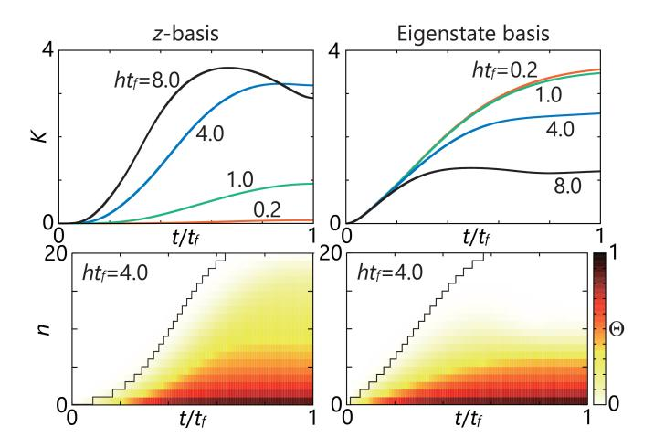
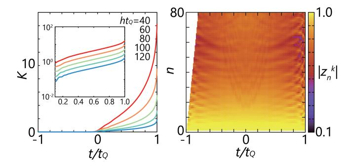
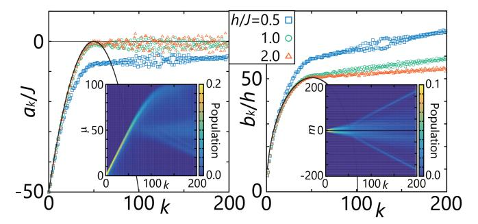

# Krylov Subspace Methods for Quantum Dynamics with Time-Dependent Generators

Kazutaka Takahashi 1,2 and Adolfo del Campo 1,3,4

1Department of Physics and Materials Science, University of Luxembourg, L-1511 Luxembourg, Luxembourg

2Department of Physics Engineering, Faculty of Engineering, Mie University, Mie 514–8507, Japan

3Donostia International Physics Center, E-20018 San Sebastián, Spain

4Theoretical Division, Los Alamos National Laboratory, Los Alamos, NM 87545, USA

Krylov subspace methods in quantum dynamics identify the minimal subspace in which a process unfolds. To date, their use is restricted to time evolutions governed by time-independent generators. We introduce a generalization valid for driven quantum systems governed by a time-dependent Hamiltonian that maps the evolution to a diffusion problem in a one-dimensional lattice with nearest-neighbor hopping probabilities that are inhomogeneous and time-dependent. This representation is used to establish a novel class of fundamental limits to the quantum speed of evolution and operator growth. We also discuss generalizations of the algorithm, adapted to discretized time evolutions and periodic Hamiltonians, with applications to many-body systems.

Introduction. The understanding of nonequilibrium quantum phenomena constitutes an open frontier of physics. Describing many-body quantum systems is challenging due to the large number of degrees of freedom involved. Approaches to reduce the complexity of the description are widely varied and involve approximation schemes such as effective theories and entanglement renormalization. Among them, Krylov subspace methods have long been recognized in applied mathematics for solving systems of linear algebraic equations [1] as well as in quantum physics to deal with systems with a large Hilbert space, ubiquitous in many-body problems [2, 3]. Their use in the latter context has received a boost of attention, given recent applications to the study of quantum complexity and quantum chaos [4-9], quantum algorithms [10–12], and quantum control [13, 14]. Krylov subspace methods have been developed for the evolution of operators [4–9], state vectors [8], density matrices [15], and Wigner functions [16], as well as to tackle both unitary and open quantum dynamics [17–19].

Despite this progress, state-of-the-art techniques using Krylov subspace methods are restricted to time-independent generators. A naive extension of the method to time-dependent generators violates the most striking feature of the Krylov method, that is, the picture of the one-dimensional spreading. We overcome this difficulty by introducing a Krylov algorithm adapted to time-dependent generators, making possible a novel characterization of operator growth and quantum evolution.

Krylov construction for time-dependent generators. We treat the Schrödinger equation,  $i\partial_t |\psi(t)\rangle = \hat{H}(t)|\psi(t)\rangle$ , governing the time evolution of the state vector  $|\psi(t)\rangle$  under the time-dependent Hamiltonian  $\hat{H}(t)$ . When the latter is time-independent, the state space is spanned by  $\{\hat{H}^k|\psi(0)\rangle\}_{k=0}^{\infty}$ , known as the Krylov space. An orthonormal basis can be constructed by the standard Gram–Schmidt procedure. This procedure brings the Hamiltonian to a tridiagonal form.

An efficient way to explore the time-dependent case can be found from the so-called t - t' formalism [20–23].

We introduce two different times, s and t, to define

$$|\psi(s,t)\rangle = e^{-is(\hat{H}(t)-i\partial_t)}|\phi(t)\rangle,\tag{1}$$

where  $|\phi(t)\rangle$  is an arbitrary vector with the constraint  $|\phi(0)\rangle = |\psi(0)\rangle$ . The actual time-evolved state is obtained by setting s=t as  $|\psi(t)\rangle = |\psi(t,t)\rangle$ . The operator  $\hat{H}(t)-i\partial_t$  is sometimes used in the context of Floquet theory [24, 25]. This representation motivates us to use the space  $\{(\hat{H}(t)-i\partial_t)^k|K_0(t)\}\}_{k=0}^{\infty}$ . For a normalized basis  $|K_0(t)\rangle$  with  $|K_0(0)\rangle = |\psi(0)\rangle$ , we produce a series of time-dependent orthonormal basis by

$$|K_{k+1}(t)\rangle b_{k+1}(t) = (\hat{H}(t) - i\partial_t)|K_k(t)\rangle -|K_k(t)\rangle a_k(t) - |K_{k-1}(t)\rangle b_k(t),$$
(2)

for k = 0, 1, ..., d - 2 with  $|K_{-1}(t)\rangle b_0(t) = 0$ . The time-dependent Lanczos coefficients  $\{a_k(t)\}_{k=0}^{d-1}$  and  $\{b_k(t)\}_{k=1}^{d-1}$  are given by

$$a_k(t) = \langle K_k(t) | (\hat{H}(t) - i\partial_t) | K_k(t) \rangle, \tag{3}$$

$$b_k(t) = \langle K_{k-1}(t) | (\hat{H}(t) - i\partial_t) | K_k(t) \rangle. \tag{4}$$

Here,  $a_k(t)$  is real by definition and the phase of  $|K_k(t)\rangle$  is chosen so that  $b_k(t)$  becomes nonnegative. The recurrence process halts when the possible basis vectors are exhausted, and we define the Krylov dimension d as the total number of the basis vec-The state vector is represented in the Krylov basis by the coherent quantum superposition  $|\psi(t)\rangle$  $\sum_{k=0}^{d-1} |K_k(t)\rangle \varphi_k(t)$ . The transformed state  $|\varphi(t)\rangle =$  $\sum_{k=0}^{d-1} |k\rangle \varphi_k(t) = (\varphi_0(t), \varphi_1(t), \dots, \varphi_{d-1}(t))^{\mathrm{T}}, \text{ satisfies}$  $i\partial_t |\varphi(t)\rangle = \hat{\mathcal{L}}(t)|\varphi(t)\rangle$  with the initial condition  $|\varphi(0)\rangle =$  $|0\rangle$ . The generator  $\hat{\mathcal{L}}(t)$  is written in a tridiagonal form as  $\hat{\mathcal{L}}(t) = \sum_{k=0}^{d-1} a_k(t) |k\rangle\langle k| + \sum_{k=1}^{d-1} b_k(t) (|k\rangle\langle k-1| + |k-1\rangle\langle k|)$ . Thus, the time evolution of the state can be described in terms of a single-particle hopping in a finite or semi-infinite chain, as in the time-independent case [2, 3]. The diagonal element  $a_k(t)$  represents the on-site potential at site k and the offdiagonal  $b_k(t)$  represents the hopping amplitude between k-1 and k.

The Krylov algorithm for the state involves diagonal components of the tridiagonal matrix denoted by  $a_k(t)$ . They can be eliminated by using the phase transformation  $|\tilde{K}_k(t)\rangle = |K_k(t)\rangle e^{-i\int_0^t ds \, a_k(s)}$ . Then, the tridiagonal matrix has complex elements  $\hat{\tilde{\mathcal{L}}}(t) = \sum_{k=1}^{d-1} (\tilde{b}_k(t)|k\rangle\langle k-1| + \tilde{b}_k^*(t)|k-1\rangle\langle k|)$  with  $\tilde{b}_k(t) = b_k(t)e^{i\int_0^t ds \, (a_k(s)-a_{k-1}(s))}$ . A different possibility is to use the density operator  $\hat{\rho}(t) = |\psi(t)\rangle\langle\psi(t)|$  [23].

The Krylov expansion is dependent on the choice of the initial basis. As in the time-independent case, it is natural to take  $|K_0(t)\rangle = |\psi(0)\rangle$ . The first component  $\varphi_0(t) = \langle \psi(0)|\psi(t)\rangle$  is equal to the survival amplitude. An alternative choice for the time-dependent case is the instantaneous ground state of the Hamiltonian,  $|\epsilon_0(t)\rangle$ , under the condition that the initial state is in the ground state. Then,  $\varphi_0(t) = \langle \epsilon_0(t)|\psi(t)\rangle$  represents the fidelity measuring how good the adiabatic approximation is.

One of the prominent features of the Krylov method is that some physical quantities are described only by the Lanczos coefficients. A typical example known for the time-independent Hamiltonian is the survival amplitude [4]. This property still holds in the time-dependent case, as we see from the relation  $\langle K_0(t)|\psi(s,t)\rangle = \langle 0|e^{-is(\hat{\mathcal{L}}(t)-i\partial_t)}|0\rangle$ . The right-hand side is represented by the Lanczos coefficients and their derivatives. We can find differential equations for the Lanczos coefficients if we know the overlap  $\langle K_0(t)|\psi(s,t)\rangle$ .

Quantum speed and propagation limits in Krylov space. A key advantage of the Krylov expansion is that, in any system, it renders the state evolution as a propagation in a one-dimensional space. The degree of the propagation can be measured by the spread complexity [4, 8]

$$K(t) = \sum_{k=0}^{d-1} k |\varphi_k(t)|^2.$$
 (5)

It can be regarded as the expectation value of the Krylov operator  $\hat{\mathcal{K}} = \sum_{k=0}^{d-1} k|k\rangle\langle k|$ . At early times of evolution, K(t) increases from the initial value K(0) = 0, and the growth rate is characterized by the Lanczos coefficients. We can use the Robertson uncertainty relation to obtain the dispersion bound [9] as  $|\partial_t K(t)| \leq 2\Delta L(t)\Delta K(t)$  where  $\Delta L(t) = [\langle \varphi(t)|\hat{\mathcal{L}}^2(t)|\varphi(t)\rangle - \langle \varphi(t)|\hat{\mathcal{L}}(t)|\varphi(t)\rangle^2]^{1/2}$  is the variance of  $\hat{\mathcal{L}}(t)$  with respect to  $|\varphi(t)\rangle$ , and  $\Delta K(t)$  is similarly defined for  $\hat{\mathcal{K}}$ . In contrast to the time-independent case [9],  $\Delta L(t)$  is not equal to  $b_1$ .

Since we can define the Krylov operator, we can derive the operator quantum speed limit for the Heisenberg operator [26]. Here, we are interested in a speed limit for the time-evolved state rather than the operator. In the standard formulation, one considers as a distance the Fubini–Study angle  $\Theta_{\rm FS}(t) = \arccos|\langle\psi(0)|\psi(t)\rangle|$  [27]. The minimum time for sweeping  $\Theta_{\rm FS}(t)$  is then lower bounded by the time-average energy variance [28–30]. To character-

ize the one-dimensional spreading, we define

$$\Theta_n(t) = \arccos\sqrt{P_n(t)},$$
 (6)

where  $n=0,1,\ldots,d-1$  and  $P_n(t)=\sum_{k=0}^n|\varphi_k(t)|^2$  is the probability for the time-evolved state to remain within the first n+1 sites of the Krylov chain. We have generally  $0=\Theta_{d-1}(t)\leq\Theta_{d-2}(t)\leq\cdots\leq\Theta_0(t)\leq\pi/2$ . When we set  $|K_0(t)\rangle=|\psi(0)\rangle,\,\Theta_0(t)$  is equal to  $\Theta_{\rm FS}(t)$ . The spread complexity is written as  $K(t)=\sum_{k=0}^{d-1}\sin^2\Theta_k(t)$ .

By using similar techniques to those in the derivation of the celebrated Mandelstam–Tamm time-energy uncertainty relation [27, 31], we can derive upper bounds to  $\Theta_n(t)$ . The time derivative of  $\Theta_n(t)$  leads to

$$|\partial_t \Theta_n(t)| \leq b_{n+1}(t) \sqrt{1 - \frac{\sin^2 \Theta_{n+1}(t)}{\sin^2 \Theta_n(t)}} \times \sqrt{1 - \frac{\cos^2 \Theta_{n-1}(t)}{\cos^2 \Theta_n(t)}}, \tag{7}$$

where  $n = 0, 1, \ldots, d - 2$  and  $\cos^2 \Theta_{-1}(t) = 0$  at n = 0 [23]. The equality holds when the even components  $\varphi_0(t), \varphi_2(t), \ldots$  are real and the odd components  $\varphi_1(t), \varphi_3(t), \ldots$  are purely imaginary. This is achieved when  $\hat{\mathcal{L}}(t)$  has sublattice symmetry, that is, the diagonal components of  $\hat{\mathcal{L}}(t)$  denoted by  $a_k(t)$  are equal to zero. In the Krylov lattice, the condition  $a_k(t) = 0$  indicates a vanishing on-site potential. Then, no potential disturbs the wavefunction, and its spreading is maximized.

We can further simplify the right-hand side of Eq. (7) by bounding it from above as  $|\partial_t \Theta_n(t)| \leq b_{n+1}(t)$ . This is a generalization of the standard Mandelstam–Tamm inequality addressing the non-escape probability  $P_n(t)$  instead of the survival probability  $|\langle \psi(0)|\psi(t)\rangle|^2$ . However, the bound cannot be tight except in the special case of a localized state  $|\varphi_k(t)| \sim \delta_{k,n}$ . By using  $\sin \Theta_{n+1}(t) \geq 0$  and  $\cos \Theta_n(t) \leq 1$ , we obtain tighter inequalities

$$|\partial_t \Theta_n(t)| \le b_{n+1}(t) \sin \Theta_{n-1}(t) \le b_{n+1}(t) \Theta_{n-1}(t).$$
 (8)

This bound is useful when n is close to the propagation front. The last inequality can be iterated to obtain

$$\Theta_n(t) \le \int_0^t ds \, b_{n+1}(s) \int_0^s ds_n \, b_n(s_n) \cdots \int_0^{s_2} ds_1 b_1(s_1).$$
(9)

When  $b_n(t)$  is independent of t,  $\Theta_n(t) \leq \exp[-(n+1)\ln((n+1)/vt)]$  for  $n \gg 1$  and  $v = (b_1b_2...b_{n+1})^{1/(n+1)}$  is interpreted as the speed of propagation. This propagation limit is closely related to the Lieb–Robinson bound [32, 33].

Examples with closed complexity algebra. The execution of the Krylov algorithm is rather involved due to the time-derivative operations. When the Hamiltonian has a tridiagonal form in a natural basis, and the initial

state is chosen properly, the original basis is equivalent to the Krylov basis up to a phase. Paradigmatic examples are given by the following three systems [23]: (i) single spin  $\hat{H}(t) = \boldsymbol{h}(t) \cdot \hat{\boldsymbol{S}}$ , (ii) harmonic oscillator with translation  $\hat{H}(t) = \frac{1}{2m}\hat{p}^2 + \frac{m\omega^2}{2}(\hat{x} - x_0(t))^2$ , (iii) harmonic oscillator with dilation  $\hat{H}(t) = \frac{1}{2m}\hat{p}^2 + \frac{m}{2}\omega^2(t)\hat{x}^2$ . Also, when we choose the instantaneous ground state as the initial basis, each of the Krylov basis elements is given by an instantaneous energy eigenstate. This is due to the property that the time-derivative operator in the instantaneous eigenstate basis is written in a tridiagonal form [23]. The time derivative of the eigenstate is closely related to the counterdiabatic term used in the method of shortcuts to adiabaticity [34–40]. Generally, when the initial Krylov basis is chosen as an instantaneous eigenstate  $|\epsilon_n(t)\rangle$ , the first Lanczos coefficient  $b_1(t)$  is given by the variance of the counterdiabatic term  $\hat{H}_{\rm CD}(t) = i \sum_{n} (1 - |\epsilon_n(t)\rangle \langle \epsilon_n(t)|) |\partial_t \epsilon_n(t)\rangle \langle \epsilon_n(t)|.$ 

Remarkably, in each case (i)-(iii), the diagonal Lanczos coefficient  $a_k(t)$  is linear in k and the offdiagonal part  $b_k(t)$  takes a form  $b_k(t) = b(t)c_k$ , where the time-independent part  $c_k$  is given by

$$c_k = \begin{cases} \sqrt{k(d-k)} & \text{for (i),} \\ \sqrt{k} & \text{for (ii),} \\ \sqrt{2k(2k-1)} & \text{for (iii).} \end{cases}$$
(10)

The linear form of  $a_k(t)$  reflects the property that these systems have constant eigenvalue spacing. In the time-independent case, the forms of  $c_k$  have been discussed as examples that give closed algebra of the Krylov operator  $\hat{\mathcal{K}}$  [7, 9]. When we consider the phase-transformed basis  $|\tilde{K}_k(t)\rangle$ , we have  $[\hat{\mathcal{K}},\hat{\mathcal{L}}(t)]=i\hat{\mathcal{J}}(t)$  and  $[\hat{\mathcal{J}}(t),\hat{\mathcal{K}}]=i\hat{\mathcal{L}}(t)$ , where  $\hat{\mathcal{J}}(t)=-i\sum_{k=1}^{d-1}(\tilde{b}_k(t)|k\rangle\langle k-1|-\tilde{b}_k^*(t)|k-1\rangle\langle k|)$  is interpreted as the current operator. The commutator of  $\hat{\mathcal{L}}(t)$  and  $\hat{\mathcal{J}}(t)$  generally gives a diagonal matrix. Closing of the algebra occurs for the above examples. In each case, we find a form  $[\hat{\mathcal{L}}(t),\hat{\mathcal{J}}(t)]=-i(\alpha(t)\hat{\mathcal{K}}+\gamma(t))$ . We have  $\alpha<0$  for (i),  $\alpha=0$  for (ii), and  $\alpha>0$  for (iii).

In the time-independent case of these systems, the Heisenberg representation of  $\hat{\mathcal{K}}$  is spanned by the identity operator,  $\hat{\mathcal{K}}$ , and  $\hat{\mathcal{J}}$ , and leads to the saturation of the operator quantum speed, maximizing the operator growth rate limit [26]. For the time-dependent case, the evolving state is extended to a higher dimensional space and no saturation occurs [23].

We show in Fig. 1 the spread complexity K(t) and  $\Theta_n(t)$  for a single spin Hamiltonian. We can consider two kinds of the Krylov basis: the fixed z-spin basis and the instantaneous eigenstate basis. When we consider slow driving, the spread complexity grows rapidly in the fixed basis and is small in the instantaneous basis. This behavior is reversed under a fast-driving scheme. The spread complexity and  $\Theta_n(t)$  in the instantaneous basis can be interpreted as a degree of nonadiabaticity.

Figure 1. Spreading in the Krylov space for the spin Hamiltonian  $\hat{H}(t) = h[\hat{S}^z \cos(\pi t/t_f) + \hat{S}^x \sin(\pi t/t_f)]$  with the spin quantum number S=10. The left panels are for the fixed z-basis and the right panels are for the instantaneous eigenstate basis. The upper panels represent the spread complexity K(t) for several values of  $ht_f$  and the lower panels represent  $\Theta_n(t)$  at  $ht_f=4.0$ . Each of the step-wise lines in the lower panels represents a boundary where the right-hand side of Eq. (9) reaches a threshold value  $\Theta_{\rm th}=0.1$ .

Discrete time evolution and the Arnoldi iteration. Next, we discuss the proposed algorithm for generic physical systems with discrete time evolution, e.g., with time step  $\Delta t$ . Such a scenario describes unitary quantum circuits and preserves the normalization of the time-evolving quantum state. At the kth step, the quantum state  $|\psi^k\rangle$  is propagated by the action of the unitary  $\hat{U}^k$ , as  $|\psi^{k+1}\rangle = \hat{U}^k|\psi^k\rangle$ . For non-Hermitian matrices, the Krylov basis set is constructed by the Arnoldi iteration procedure [3]. Its applications range from open quantum systems [19] to periodic systems [41–45], and unitary circuit dynamics [46]. The algorithm is adapted to the time-dependent case as

$$|K_{n+1}^{k+1}\rangle\sqrt{1-|z_n^k|^2} = \hat{U}^k|K_n^k\rangle - |f_n^{k+1}\rangle z_n^k,$$
 (11)

$$|f_n^{k+1}\rangle = -|f_{n-1}^{k+1}\rangle\sqrt{1-|z_{n-1}^k|^2} + |K_n^{k+1}\rangle(z_{n-1}^k)^*(12)$$

with  $n=0,1,\ldots,d-2$  and  $z_{-1}^k=1$  at n=0. The nth order Krylov basis  $|K_n^k\rangle$  is defined at  $n\leq k$  and satisfies the orthonormal condition at each k. We also use an auxiliary vector  $|f_n^k\rangle$  and a complex number  $z_n^k$  with  $|z_n^k|\leq 1$ . The operation  $\hat{U}^k|K_n^k\rangle$  produces the one-step forwarded basis  $|K_{n+1}^{k+1}\rangle$ , instead of  $|K_{n+1}^k\rangle$ . Then, by expanding the time-evolved state as  $|\psi^k\rangle=\sum_{n=0}^{\min(k,d-1)}|K_n^k\rangle\langle n|\varphi^k\rangle$ , we obtain the form  $|\varphi^{k+1}\rangle=\hat{U}^k|\varphi^k\rangle$  with  $|\varphi^0\rangle=|0\rangle$ . The matrix  $\hat{U}^k$  takes an upper Hessenberg form. Each component, Arnoldi coefficient, is written by using  $z_n^k$  [23].

For illustration, we consider the one-dimensional quan-

Figure 2. Spreading in Krylov space for the one-dimensional quantum Ising model. The left panel represents the spread complexity K(t) for N=24 and  $h\Delta t=0.1$ , as functions of discrete time  $t=-t_Q+k\Delta t$  with  $-t_Q\leq t\leq t_Q$ . The inset in the left panel represents the log scale plot. The right panel represents  $|z_n^k|$  with  $n\leq 80$  for N=24,  $ht_Q=30$ , and  $h\Delta t=0.1$ .

tum Ising model

$$\hat{H}(t) = -\frac{h}{2} \left( 1 - \frac{t}{t_Q} \right) \sum_{i=1}^{N} \hat{X}_i - \frac{h}{2} \left( 1 + \frac{t}{t_Q} \right) \sum_{i=1}^{N} \hat{Z}_i \hat{Z}_{i+1},$$
(13)

where the operators on the right-hand side represent the Pauli operators [23]. Starting from the ground state of the Hamiltonian at  $t=-t_Q$ , the system evolves until the final time  $t=t_Q$ . The energy gap between the ground state and the first excited state of the Hamiltonian at  $t=t_c=0$  goes to zero for  $N\to\infty$  and the corresponding static system undergoes a quantum phase transition [47].

Figure 2 shows the growth of the spread complexity. We take the instantaneous ground state as the initial basis. For driving with a large quench time  $t_Q$ , the spread complexity is negligibly small at  $t < t_c$  and starts growing around  $t = t_c$  when the critical point is crossed. After the crossing, we observe an approximate exponential growth of K(t) with respect to t and an exponential suppression of  $K(t = t_Q)$  with respect to  $t_Q$ . When the number of the iteration step n is small,  $|z_n^k|$  is close to unity, which means that the time evolution is described adiabatically. Once the state spreads over  $|K_n^k\rangle$  with higher n, small values of  $|z_n^k|$  enhance nonadiabatic transitions. Thus, we observe an effectively exponential growth of the spread complexity.

Periodically-driven systems. When the Hamiltonian  $\hat{H}(t)$  has a period  $T=2\pi/\Omega$ , we can apply the Floquet theorem [48, 49]. The Hilbert space is extended to the Floquet–Hilbert, or Sambe space [50], which changes the definition of the inner product to include the time average over the period [23]. The Krylov algorithm in Eq. (2) is applied to give  $|\psi(s,t)\rangle = \sum_{k=0}^{\infty} |K_k(t)\rangle\langle k|e^{-is\hat{\mathcal{L}}}|0\rangle$ . In this case, the tridiagonal matrix  $\hat{\mathcal{L}}$  is time-independent. The basis vectors are not orthogonal with each other in the usual sense, and the Krylov dimension is infinite even

Figure 3. The Lanczos coefficients for the Lipkin–Meshkov–Glick model. We take  $\Omega/J=0.1$  and N=100. The solid lines represent the static limit  $\Omega\to 0$ . The inset in the left panel is the population in the Hilbert space, and that in the right is the population in the Fourier space. We take h/J=2.0 in the insets.

for systems in finite Hilbert space. The time evolution by  $\hat{\mathcal{L}}$  corresponds to that by the Floquet Hamiltonian, and that of the Krylov basis represents the micromotion.

We treat as an example the Lipkin–Meshkov–Glick model [51]. The Krylov analysis for the time-independent case has been studied for operators [52] as well as for states [53, 54]. For the spin operator with S=N/2, we treat the Hamiltonian

$$\hat{H}(t) = -\frac{2J}{N}(\hat{S}^z)^2 - 2h\hat{S}^x \sin\Omega t,$$
 (14)

with the initial condition  $\hat{S}^z|\psi(0)\rangle = \frac{N}{2}|\psi(0)\rangle$ . We focus on a slow driving regime  $\Omega \ll J$  where the standard Floquet picture is not applicable [55]. The static properties at  $N \to \infty$  are described by the fixed-point analysis. For h < J,  $|\psi(0)\rangle$  corresponds to the stable ferromagnetic point. It turns into an unstable point for h > J, and a stable paramagnetic point appears.

In Fig. 3, we show the Lanczos coefficients. When the Krylov step k is smaller than N/2, the half of the Hilbert space dimension, the Lanczos coefficients are close to those at the limit  $\Omega \to 0$ . To observe how the spreading occurs in the Krylov space, we numerically calculate the population in the z-spin eigenstates  $|\mu\rangle$  with  $\hat{S}^z|\mu\rangle$  =  $\left(\frac{N}{2}-\mu\right)|\mu\rangle$  as  $\frac{1}{T}\int_0^T dt\,|\langle\mu|K_k(t)\rangle|^2$ , and the population in each Fourier component  $\left|\frac{1}{T}\int_0^T dt\,e^{im\Omega t}|K_k(t)\rangle\right|^2$ , respectively. For k < N/2, the spreading is in the direction of the Hilbert space and the spreading in the Fourier space is suppressed. When the step reaches the point  $k=N/2, b_k$  at  $\Omega \to 0$  turns into decreasing, which enhances the spreading in the Fourier space. We find that  $a_k$  is almost constant and  $b_k$  shows a slow linear growth. We also find a qualitative difference between the results at h < J and those at h > J. For h > J and k < N/2, the Lanczos coefficients rapidly converge to the static limit and are insensitive to the specific values of h.

Summary. We have generalized the Krylov subspace method for time evolutions involving a time-dependent

generator. The algorithm allows us to describe the dynamics of the state of the system, as spreading in a one-dimensional lattice and to derive universal bounds for operator growth, analogous to quantum speed limits and Lieb–Robinson bounds in Krylov space. The method is also flexibly generalized to treat time-discretized systems and periodic systems, making it possible to discuss the dynamical properties of many-body systems.

Acknowledgements. We thank Budhaditya Bhattacharjee, András Grabarits, and Aritra Kundu for stimulating discussions. ADC thanks the Los Alamos National Laboratory for its hospitality during the completion of this work. We acknowledge the financial support from the Luxembourg National Research Fund (FNR Grant No. 16434093). This project has received funding from the QuantERA II Joint Programme with co-funding from the European Union's Horizon 2020 research and innovation programme. KT further acknowledges support from JSPS KAKENHI Grants No. JP24K00547.

- [1] J. Liesen and Z. Strakos, *Krylov Subspace Methods: Principles and Analysis* (Oxford University Press, 2012).
- [2] G. M. V. Viswanath, The Recursion Method: Application to Many-Body Dynamics (Springer-Verlag, 1994).
- [3] P. Nandy, A. S. Matsoukas-Roubeas, P. Martínez-Azcona, A. Dymarsky, and A. del Campo, Quantum dynamics in krylov space: Methods and applications (2024), arXiv:2405.09628 [quant-ph].
- [4] D. E. Parker, X. Cao, A. Avdoshkin, T. Scaffidi, and E. Altman, A universal operator growth hypothesis, Phys. Rev. X 9, 041017 (2019).
- [5] J. L. F. Barbón, E. Rabinovici, R. Shir, and R. Sinha, On the evolution of operator complexity beyond scrambling, Journal of High Energy Physics 2019, 264 (2019).
- [6] E. Rabinovici, A. Sánchez-Garrido, R. Shir, and J. Sonner, Operator complexity: a journey to the edge of krylov space, Journal of High Energy Physics 2021, 62 (2021).
- [7] P. Caputa, J. M. Magan, and D. Patramanis, Geometry of krylov complexity, Phys. Rev. Research 4, 013041 (2022).
- [8] V. Balasubramanian, P. Caputa, J. M. Magan, and Q. Wu, Quantum chaos and the complexity of spread of states, Phys. Rev. D 106, 046007 (2022).
- [9] N. Hörnedal, N. Carabba, A. S. Matsoukas-Roubeas, and A. del Campo, Ultimate speed limits to the growth of operator complexity, Communications Physics 5, 207 (2022).
- [10] K. Bharti and T. Haug, Iterative quantum-assisted eigensolver, Phys. Rev. A 104, L050401 (2021).
- [11] C. L. Cortes and S. K. Gray, Quantum krylov subspace algorithms for ground- and excited-state energy estimation, Phys. Rev. A 105, 022417 (2022).
- [12] W. Kirby, M. Motta, and A. Mezzacapo, Exact and efficient Lanczos method on a quantum computer, Quantum 7, 1018 (2023).
- [13] K. Takahashi and A. del Campo, Shortcuts to adiabaticity in krylov space, Phys. Rev. X 14, 011032 (2024).
- [14] B. Bhattacharjee, A lanczos approach to the adiabatic

- gauge potential (2023), arXiv:2302.07228 [quant-ph].
- [15] P. Caputa, H.-S. Jeong, S. Liu, J. F. Pedraza, and L.-C. Qu, Krylov complexity of density matrix operators (2024), arXiv:2402.09522 [hep-th].
- [16] R. Basu, A. Ganguly, S. Nath, and O. Parrikar, Complexity growth and the krylov-wigner function (2024), arXiv:2402.13694 [hep-th].
- [17] A. Bhattacharya, P. Nandy, P. P. Nath, and H. Sahu, Operator growth and krylov construction in dissipative open quantum systems, Journal of High Energy Physics 2022, 81 (2022).
- [18] C. Liu, H. Tang, and H. Zhai, Krylov complexity in open quantum systems, Phys. Rev. Res. 5, 033085 (2023).
- [19] A. Bhattacharya, P. Nandy, P. P. Nath, and H. Sahu, On krylov complexity in open systems: an approach via bilanczos algorithm, Journal of High Energy Physics 2023, 66 (2023).
- [20] J. S. Howland, Stationary scattering theory for timedependent hamiltonians., Mathematische Annalen 207, 315 (1974).
- [21] U. Peskin and N. Moiseyev, The solution of the time-dependent Schrödinger equation by the (t,t') method: Theory, computational algorithm and applications, The Journal of Chemical Physics 99, 4590 (1993).
- [22] U. Peskin, R. Kosloff, and N. Moiseyev, The solution of the time dependent Schrödinger equation by the (t,t') method: The use of global polynomial propagators for time dependent Hamiltonians, The Journal of Chemical Physics 100, 8849 (1994).
- [23] Supplementary material.
- [24] G. Casati and L. Molinari, "Quantum Chaos" with Time-Periodic Hamiltonians, Progress of Theoretical Physics Supplement 98, 287 (1989).
- [25] M. Grifoni and P. Hänggi, Driven quantum tunneling, Physics Reports 304, 229 (1998).
- [26] N. Hörnedal, N. Carabba, K. Takahashi, and A. del Campo, Geometric Operator Quantum Speed Limit, Wegner Hamiltonian Flow and Operator Growth, Quantum 7, 1055 (2023).
- [27] L. Mandelstam and I. Tamm, The uncertainty relation between energy and time in non-relativistic quantum mechanics, in *Selected Papers*, edited by B. M. Bolotovskii, V. Y. Frenkel, and R. Peierls (Springer Berlin Heidelberg, Berlin, Heidelberg, 1991) pp. 115–123.
- [28] A. Uhlmann, An energy dispersion estimate, Physics Letters A 161, 329 (1992).
- [29] P. Pfeifer, How fast can a quantum state change with time?, Phys. Rev. Lett. 70, 3365 (1993).
- [30] A. del Campo, Probing quantum speed limits with ultracold gases, Phys. Rev. Lett. 126, 180603 (2021).
- [31] J. Anandan and Y. Aharonov, Geometry of quantum evolution, Phys. Rev. Lett. 65, 1697 (1990).
- [32] E. H. Lieb and D. W. Robinson, The finite group velocity of quantum spin systems, Communications in Mathematical Physics 28, 251 (1972).
- [33] C.-F. A. Chen, A. Lucas, and C. Yin, Speed limits and locality in many-body quantum dynamics, Reports on Progress in Physics 86, 116001 (2023).
- [34] M. Demirplak and S. A. Rice, Adiabatic population transfer with control fields, J. Phys. Chem. A 107, 9937 (2003).
- [35] M. Demirplak and S. A. Rice, Assisted adiabatic passage revisited, J. Phys. Chem. B 109, 6838 (2005).
- [36] M. V. Berry, Transitionless quantum driving, J. Phys. A:

- Math. Theor. 42, 365303 (2009).
- [37] X. Chen, A. Ruschhaupt, S. Schmidt, A. del Campo, D. Guéry-Odelin, and J. G. Muga, Fast optimal frictionless atom cooling in harmonic traps: Shortcut to adiabaticity, Phys. Rev. Lett. 104, 063002 (2010).
- [38] J. G. Muga, X. Chen, S. Ibáñez, I. Lizuain, and A. Ruschhaupt, Transitionless quantum drivings for the harmonic oscillator, Journal of Physics B: Atomic, Molecular and Optical Physics 43, 085509 (2010).
- [39] E. Torrontegui, S. Ibáñez, S. Martínez-Garaot, M. Modugno, A. del Campo, D. Guéry-Odelin, A. Ruschhaupt, X. Chen, and J. G. Muga, Chapter 2 shortcuts to adiabaticity, in *Advances in Atomic, Molecular, and Optical Physics*, Vol. 62, edited by E. Arimondo, P. R. Berman, and C. C. Lin (Academic Press, 2013) pp. 117 169.
- [40] D. Guéry-Odelin, A. Ruschhaupt, A. Kiely, E. Torrontegui, S. Martínez-Garaot, and J. G. Muga, Shortcuts to adiabaticity: Concepts, methods, and applications, Rev. Mod. Phys. 91, 045001 (2019).
- [41] D. J. Yates and A. Mitra, Strong and almost strong modes of floquet spin chains in krylov subspaces, Phys. Rev. B 104, 195121 (2021).
- [42] D. J. Yates, A. G. Abanov, and A. Mitra, Long-lived period-doubled edge modes of interacting and disorderfree floquet spin chains, Communications Physics 5, 43 (2022).
- [43] A. A. Nizami and A. W. Shrestha, Krylov construction and complexity for driven quantum systems, Phys. Rev. E 108, 054222 (2023).
- [44] H.-C. Yeh and A. Mitra, A universal model of floquet operator krylov space (2023), arXiv:2311.15116 [condmat.str-el].
- [45] A. A. Nizami and A. W. Shrestha, Spread complexity and quantum chaos for periodically driven spin-chains (2024), arXiv:2405.16182 [quant-ph].
- [46] P. Suchsland, R. Moessner, and P. W. Claeys, Krylov complexity and trotter transitions in unitary circuit dynamics (2023), arXiv:2308.03851 [quant-ph].
- [47] S. Sachdev, Quantum Phase Transitions (Cambridge University Press, 2011).
- [48] G. Floquet, Sur les équations différentielles linéaires à coefficients périodiques, Annales scientifiques de l'École Normale Supérieure 2e série, 12, 47 (1883).
- [49] J. H. Shirley, Solution of the schrödinger equation with a hamiltonian periodic in time, Phys. Rev. 138, B979 (1965).
- [50] H. Sambe, Steady states and quasienergies of a quantummechanical system in an oscillating field, Phys. Rev. A 7, 2203 (1973).
- [51] H. Lipkin, N. Meshkov, and A. Glick, Validity of many-body approximation methods for a solvable model: (i). exact solutions and perturbation theory, Nuclear Physics 62, 188 (1965).
- [52] B. Bhattacharjee, X. Cao, P. Nandy, and T. Pathak, Krylov complexity in saddle-dominated scrambling, Journal of High Energy Physics 2022, 10.1007/jhep05(2022)174 (2022).
- [53] M. Afrasiar, J. K. Basak, B. Dey, K. Pal, and K. Pal, Time evolution of spread complexity in quenched lipkin-meshkov-glick model, Journal of Statistical Mechanics: Theory and Experiment 2023, 103101 (2023).
- [54] P. H. S. Bento, A. del Campo, and L. C. Céleri, Krylov complexity and dynamical phase transition in the

- quenched lipkin-meshkov-glick model, Phys. Rev. B 109, 224304 (2024).
- [55] P. Weinberg, M. Bukov, L. D'Alessio, A. Polkovnikov, S. Vajna, and M. Kolodrubetz, Adiabatic perturbation theory and geometry of periodically-driven systems, Phys. Rep. 688, 1 (2017).

# Supplemental Material

#### t-t' FORMALISM AND KRYLOV METHOD

In the t-t' formalism, we define a two-time dependent state as in Eq. (1). The operator  $\hat{H}(t) - i\partial_t$  is written by the unitary time-evolution operator  $\hat{U}(t)$  for the Hamiltonian  $\hat{H}(t)$  as

$$\hat{H}(t) - i\partial_t = -\hat{U}(t)i\partial_t \hat{U}^{\dagger}(t). \tag{S1}$$

Then, we can write for  $|\phi(t)\rangle$  with  $|\phi(0)\rangle = |\psi(0)\rangle$  as

$$|\psi(s,t)\rangle = e^{-is(\hat{H}(t)-i\partial_t)}|\phi(t)\rangle = \hat{U}(t)e^{-s\partial_t}\hat{U}^{\dagger}(t)|\phi(t)\rangle = \hat{U}(t)\hat{U}^{\dagger}(t-s)|\phi(t-s)\rangle. \tag{S2}$$

Setting s = t, we find  $|\psi(t,t)\rangle = \hat{U}(t)|\psi(0)\rangle = |\psi(t)\rangle$ .

A different way to show that the operator  $e^{-is(\hat{H}(t)-i\partial_t)}$  is equivalent to the time evolution operator is to use the Lie-Trotter product formula as

$$e^{-is(\hat{H}(t)-i\partial_{t})} = \lim_{M \to \infty} \left( e^{-i\frac{s}{M}\hat{H}(t)} e^{-\frac{s}{M}\partial_{t}} \right)^{M}$$

$$= \lim_{M \to \infty} e^{-i\frac{s}{M}\hat{H}(t)} e^{-i\frac{s}{M}\hat{H}(t-s/M)} e^{-i\frac{s}{M}\hat{H}(t-2s/M)} \cdots e^{-i\frac{s}{M}\hat{H}(t-(M-1)s/M)} e^{-s\partial_{t}}.$$
(S3)

The last expression at s=t takes the form of the time-ordered product, except the last factor. The last factor brings  $|\phi(t)\rangle$  back to  $|\phi(0)\rangle = |\psi(0)\rangle$ . Thus, we can find the equivalence.

The two-time dependent state  $|\psi(s,t)\rangle$  is more complicated than the original state  $|\psi(t)\rangle$ . This can be understood by using an orthonormal complete set  $\{|n\rangle\}_{n=0,1,...}$  as

$$e^{-is(\hat{H}(t)-i\partial_t)}|0\rangle = \hat{U}(t)\hat{U}^{\dagger}(t-s)|0\rangle = \sum_{m}|n(t)\rangle\langle n(t-s)|0\rangle,$$
 (S4)

where  $|n(t)\rangle = \hat{U}(t)|n\rangle$ . This state generally contains contributions from all of n = 0, 1, ... and is simplified to  $|0(t)\rangle$  at s = t.

The time-evolution law of  $|\psi(s,t)\rangle$  is written as

$$i\partial_s |\psi(s,t)\rangle = (\hat{H}(t) - i\partial_t)|\psi(s,t)\rangle.$$
 (S5)

This equation can be solved if we can find the eigenstates and eigenvalues of  $\hat{H}(t) - i\partial_t$ . It is a formidable task and we can apply the Krylov algorithm to tridiagonalize the operator. By using the Krylov basis introduced in Eq. (2), we define

$$\hat{F}(t) = \sum_{k=0}^{d-1} |K_k(t)\rangle\langle k| = (|K_0(t)\rangle, |K_1(t)\rangle, \dots, |K_{d-1}(t)\rangle).$$
 (S6)

When the dimension of the Hilbert space is denoted by N,  $\hat{F}(t)$  is a  $N \times d$  matrix and satisfies  $\hat{F}^{\dagger}(t)\hat{F}(t) = \hat{I}_d$ , where  $\hat{I}_d$  is the identity operator in the d dimensional space. We note that  $\hat{F}(t)\hat{F}^{\dagger}(t)$  is not necessarily equal to the identity operator in the Hilbert space. Then, the definition of the basis vector leads to the relation

$$(\hat{H}(t) - i\partial_t)\hat{F}(t) = \hat{F}(t)(\hat{\mathcal{L}}(t) - i\partial_t). \tag{S7}$$

Expanding the state in the Krylov basis is equivalent to the transformation

$$|\psi(s,t)\rangle = \hat{F}(t)|\varphi(s,t)\rangle.$$
 (S8)

The transformed vector  $|\varphi(s,t)\rangle$  has the size of the Krylov dimension. It satisfies

$$i\partial_s |\varphi(s,t)\rangle = (\hat{\mathcal{L}}(t) - i\partial_t)|\varphi(s,t)\rangle,$$
 (S9)

with the initial condition  $|\varphi(0,t)\rangle = |0\rangle$ . The two-time state is written as

$$|\psi(s,t)\rangle = \hat{F}(t)e^{-is(\hat{\mathcal{L}}(t)-i\partial_t)}|0\rangle = \sum_{k=0}^{d-1} |K_k(t)\rangle\langle k|e^{-is(\hat{\mathcal{L}}(t)-i\partial_t)}|0\rangle.$$
 (S10)

#### KRYLOV METHOD FOR THE DENSITY OPERATOR

In the standard applications of the Krylov subspace method to quantum dynamics, it is common to resort to the Heisenberg picture and describe the time evolution of an operator rather, as opposed to describing the time evolution of the quantum state. The Heisenberg representation of a quantum operator  $\hat{X}$  evolving under a time-independent Hamiltonian  $\hat{H}$  is given by  $e^{i\hat{H}t}\hat{X}e^{-i\hat{H}t}$ . In the time-dependent case, we cannot apply the same method as the time-evolution operator requires time-ordering given the noncommutative property  $[\hat{H}(t), \hat{H}(t')] \neq 0$ .

However, treating the density operator  $\hat{\rho}(t)$  is still possible. The density operator satisfies the von Neumann equation,

$$i\partial_t \hat{\rho}(t) = [\hat{H}(t), \hat{\rho}(t)].$$
 (S11)

We can use the recurrence relation

$$b_{k+1}(t)\hat{O}_{k+1}(t) = (\hat{\mathcal{L}}_H(t) - i\partial_t)\hat{O}_k(t) - b_k(t)\hat{O}_{k-1}(t), \tag{S12}$$

where  $\hat{\mathcal{L}}_H(t)(\cdot) = [\hat{H}(t), (\cdot)]$ . The Lanczos coefficients are given by  $b_k(t) = (\hat{O}_{k-1}(t), (\hat{\mathcal{L}}_H(t) - i\partial_t)\hat{O}_k(t))$  with a properly-defined inner product  $(\hat{A}, \hat{B})$  for an arbitrary set of operators  $\hat{A}$  and  $\hat{B}$ .

When the density operator is expanded as

$$\hat{\rho}(t) = \sum_{k=0}^{d-1} \varphi_k(t) \hat{O}_k(t), \tag{S13}$$

the vector  $|\varphi(t)\rangle = \sum_{k=0}^{d-1} |k\rangle \varphi_k(t)$  satisfies  $i\partial_t |\varphi(t)\rangle = \hat{\mathcal{L}}(t)|\varphi(t)\rangle$  with

$$\hat{\mathcal{L}}(t) = \sum_{k=1}^{d-1} b_k(t)(|k\rangle\langle k-1| + |k-1\rangle\langle k|) = \begin{pmatrix} 0 & b_1(t) & 0 & & & \\ b_1(t) & 0 & b_2(t) & & & \\ 0 & b_2(t) & 0 & & & \\ & & & \ddots & & \\ & & & 0 & b_{d-1}(t) \\ & & & b_{d-1}(t) & 0 \end{pmatrix}.$$
(S14)

The diagonal components are absent in the present case, and the coefficient  $b_k(t)$  is different from the corresponding one  $b_k(t)$  for the state  $|\psi(t)\rangle$ . We further note that  $\hat{O}_k(t)$  is neither Hermitian nor positive definite. Since the density operator satisfies the normalization condition  $\operatorname{Tr} \hat{\rho}(t) = 1$ , we have several additional conditions, such as  $\sum_{k=0}^{d-1} \varphi_k(t) \operatorname{Tr} \hat{O}_k(t) = 1$ .

#### KRYLOV SPEED LIMIT INEQUALITY

To derive Eq. (7), we start by evaluating the time derivative of the angle defined in Eq. (6), which yields the identity relation

$$-2\partial_{t}\Theta_{n}(t)\sin\Theta_{n}(t)\cos\Theta_{n}(t) = -i\sum_{k=0}^{n} \left( \langle \varphi(t)|k\rangle\langle k|\hat{\mathcal{L}}(t)|\varphi(t)\rangle - \langle \varphi(t)|\hat{\mathcal{L}}(t)|k\rangle\langle k|\varphi(t)\rangle \right)$$

$$= -ib_{n+1}(t)\left( \langle \varphi(t)|n\rangle\langle n+1|\varphi(t)\rangle - \langle \varphi(t)|n+1\rangle\langle n|\varphi(t)\rangle \right)$$

$$= -2b_{n+1}(t)\operatorname{Im}\varphi_{n}(t)\varphi_{n+1}(t), \tag{S15}$$

and the inequality

$$\begin{aligned} |\partial_t \Theta_n(t)| \sin \Theta_n(t) \cos \Theta_n(t) &\leq b_{n+1}(t) |\varphi_n(t)| |\varphi_{n+1}(t)| \\ &= b_{n+1}(t) \sqrt{\sin^2 \Theta_n(t) - \sin^2 \Theta_{n+1}(t)} \sqrt{\cos^2 \Theta_n(t) - \cos^2 \Theta_{n-1}(t)}. \end{aligned}$$
(S16)

The equality holds when  $\varphi_n(t)\varphi_{n+1}(t)$  is pure imaginary. This condition is satisfied when  $a_k(t) = 0$ . In that case, the equation for  $\varphi_n(t)$  reads

$$i\partial_t \varphi_n(t) = b_n(t)\varphi_{n-1}(t) + b_{n+1}(t)\varphi_{n+1}(t). \tag{S17}$$

This equation can be solved with the initial condition  $\varphi_n(0) = \delta_{n,0}$ . The even components  $\varphi_0(t), \varphi_2(t), \ldots$  are real and the odd components  $\varphi_1(t), \varphi_3(t), \ldots$  are pure imaginary. Thus, we obtain Eq. (7).

#### SOLVABLE EXAMPLES

### Single spin

We treat the single spin system, generally written as

$$\hat{H}(t) = h(t)\boldsymbol{n}(t) \cdot \boldsymbol{S}. \tag{S18}$$

 $\hat{\mathbf{S}} = (\hat{S}^x, \hat{S}^y, \hat{S}^z)$  represents the spin operator with  $\hat{\mathbf{S}}^2 = S(S+1)$ . The applied external field is characterized by the absolute value h(t) and the direction  $\mathbf{n}(t) = (\sin \theta(t) \cos \varphi(t), \sin \theta(t) \sin \varphi(t), \cos \theta(t))$ . The Hilbert space is generally spanned by the eigenstates of  $\hat{S}^z$  satisfying

$$\hat{S}^z|m\rangle = m|m\rangle,\tag{S19}$$

with  $m = -S, -S + 1, \dots, S$ . We set  $\hat{H}(0) = h(0)\hat{S}^z$  and the initial state as  $|\psi(0)\rangle = |S\rangle$ .

Fixed z-basis

In the fixed z-basis, the Hamiltonian is represented in a tridiagonal form, which means that we can naturally obtain a Krylov basis. When the initial basis is set as  $|K_0(t)\rangle = |S\rangle$ , we obtain

$$(\hat{H}(t) - i\partial_t)|K_0(t)\rangle = \hat{H}(t)|S\rangle = Sh(t)\cos\theta(t)|S\rangle + \frac{1}{2}\sqrt{2S}h(t)\sin\theta(t)e^{i\varphi(t)}|S - 1\rangle.$$
 (S20)

This gives

$$a_0(t) = Sh(t)\cos\theta(t),\tag{S21}$$

$$b_1(t) = \frac{\sqrt{2S}}{2}h(t)\sin\theta(t),\tag{S22}$$

$$|K_1(t)\rangle = e^{i\varphi(t)}|S-1\rangle. \tag{S23}$$

In a similar way, we can calculate the higher-order contributions. The point in the present example is that the Hamiltonian is written in terms of three kinds of operators and we can generally write its action in a given state  $|m\rangle$  as

$$\hat{H}(t)|m\rangle = h \left[ S^z \cos \theta + \frac{1}{2} \left( S^+ e^{-i\varphi} + S^- e^{i\varphi} \right) \right] |m\rangle 
= h m \cos \theta |m\rangle + \frac{h}{2} e^{-i\varphi} \sqrt{(S-m)(S+m+1)} |m+1\rangle + \frac{h}{2} e^{i\varphi} \sqrt{(S+m)(S-m+1)} |m-1\rangle. \quad (S24)$$

The state vector  $|m\rangle$  is time-independent, and taking the time derivative to the state vector does not give any contribution. As a result, we obtain

$$|K_k(t)\rangle = e^{ik\varphi(t)}|S-k\rangle \qquad (k=0,1,\ldots,2S),$$
 (S25)

$$a_k(t) = (S - k)h(t)\cos\theta(t) + k\dot{\varphi}(t)$$
  $(k = 0, 1, \dots, 2S),$  (S26)

$$b_k(t) = \frac{1}{2}h(t)\sin\theta(t)\sqrt{k(d-k)} \qquad (k = 1, \dots, 2S),$$
 (S27)

where the dot denotes the time derivative. The Krylov dimension is equal to the Hilbert space dimension, i.e., d = 2S + 1.

Instantaneous eigenstate basis

The instantaneous eigenstates of the Hamiltonian are given by the eigenstates of rotated- $\hat{S}^z$  satisfying

$$\hat{R}(t)\hat{S}^z\hat{R}^{\dagger}(t)|m(t)\rangle = m|m(t)\rangle,\tag{S28}$$

with  $m = -S, -S + 1, \dots, S$ . The rotation operator  $\hat{R}(t)$  is written as

$$\hat{R}(t) = \exp\left(-i\theta(t)\hat{\mathbf{S}} \cdot \mathbf{e}_{\varphi}(t)\right),\tag{S29}$$

with  $e_{\varphi}(t) = (-\sin \varphi(t), \cos \varphi(t), 0).$ 

We set the initial Krylov basis as

$$|K_0(t)\rangle = |S(t)\rangle. \tag{S30}$$

We apply  $\hat{H}(t) - i\partial_t$  to this basis. The action of the Hamiltonian only gives an eigenvalue, and we need to consider the time derivative of the instantaneous eigenstates. The time derivative is closely related to the counterdiabatic term [34–36, 39, 40]. Generally, for possible instantaneous eigenstates  $|m(t)\rangle$ , we can write

$$i\partial_t |m(t)\rangle = \hat{H}_{\rm CD}(t)|m(t)\rangle + |m(t)\rangle i\langle m(t)|\dot{m}(t)\rangle.$$
 (S31)

In the present case, the counterdiabatic term  $\hat{H}_{CD}(t)$  is given by [36]

$$\hat{H}_{CD}(t) = \boldsymbol{n}(t) \times \dot{\boldsymbol{n}}(t) \cdot \hat{\boldsymbol{S}}, \tag{S32}$$

and we have

$$i\partial_{t}|m(t)\rangle = -\frac{i}{2}(\dot{\theta}(t) - i\dot{\varphi}(t)\sin\theta(t))e^{-i\varphi(t)}\sqrt{(S-m)(S+m+1)}|m+1(t)\rangle + \frac{i}{2}(\dot{\theta}(t) + i\dot{\varphi}(t)\sin\theta(t))e^{i\varphi(t)}\sqrt{(S+m)(S-m+1)}|m-1(t)\rangle - m\dot{\varphi}(t)(1-\cos\theta(t))|m(t)\rangle.$$
(S33)

Comparing this to the recurrence relation of the Krylov basis, we obtain

$$|K_k(t)\rangle = (-i)^k e^{ik(\varphi(t) + \varphi_0(t))} |S - k(t)\rangle \qquad (k = 0, 1, \dots, 2S),$$
 (S34)

$$a_k(t) = (S - k)[h(t) + \dot{\varphi}(t)(1 - \cos\theta(t))] + k(\dot{\varphi}(t) + \dot{\phi}_0(t)) \qquad (k = 0, 1, \dots, 2S), \tag{S35}$$

$$b_k(t) = \frac{1}{2} \sqrt{\dot{\theta}^2(t) + \dot{\varphi}^2(t) \sin^2 \theta(t)} \sqrt{k(d-k)} \qquad (k = 1, \dots, 2S),$$
 (S36)

where d = 2S + 1 represents the Krylov dimension and

$$e^{i\phi_0(t)} = \frac{\dot{\theta}(t) + i\dot{\varphi}(t)\sin\theta(t)}{\sqrt{\dot{\theta}^2(t) + \dot{\varphi}^2(t)\sin^2\theta(t)}}.$$
 (S37)

## Harmonic oscillator with translation

We consider a one-dimensional single-particle in a harmonic oscillator potential. The center of the potential is changed as a function of time keeping the potential shape invariant. The Hamiltonian is given by

$$\hat{H}(t) = \frac{1}{2m}\hat{p}^2 + \frac{m\omega^2}{2}(\hat{x} - x_0(t))^2.$$
 (S38)

We set  $x_0(0) = 0$  and choose the initial state as the ground state of  $\hat{H}(0)$ .

Fixed eigenstate basis

The Hamiltonian is written as

$$\hat{H}(t) = \left(\hat{a}^{\dagger}\hat{a} + \frac{1}{2}\right)\omega - \sqrt{\frac{m\omega}{2}}\omega x_0(t)(\hat{a} + \hat{a}^{\dagger}) + \frac{m\omega^2}{2}x_0^2(t). \tag{S39}$$

Here, we define the lowering operator

$$\hat{a} = \sqrt{\frac{m\omega}{2}}\hat{x} + \frac{i}{\sqrt{2m\omega}}\hat{p},\tag{S40}$$

and the raising operator  $\hat{a}^{\dagger}$ . They give  $\hat{a}|n\rangle = \sqrt{n}|n-1\rangle$  and  $\hat{a}^{\dagger}|n\rangle = \sqrt{n+1}|n+1\rangle$  for the number state  $|n\rangle$  satisfying  $\hat{a}^{\dagger}\hat{a}|n\rangle = n|n\rangle$ .

The number state basis  $\{|n\rangle\}$  allows us to write the Hamiltonian in a tridiagonalized form. When we set  $|K_0\rangle = |0\rangle$ , we obtain

$$|K_k(t)\rangle = \left(-\frac{\dot{x}_0(t)}{|\dot{x}_0(t)|}\right)^k |k\rangle \qquad (k = 0, 1, \dots), \tag{S41}$$

$$a_k(t) = \left(k + \frac{1}{2}\right)\omega + \frac{m\omega^2}{2}x_0^2(t) \qquad (k = 0, 1, \dots),$$
 (S42)

$$b_k(t) = \sqrt{\frac{m\omega}{2}}\omega |x_0(t)|\sqrt{k} \qquad (k = 1, 2, \dots).$$
 (S43)

Instantaneous eigenstate basis

The Hamiltonian can also be written with respect to the operator at each time defined as

$$\hat{a}(t) = \sqrt{\frac{m\omega}{2}}(\hat{x} - x_0(t)) + \frac{i}{\sqrt{2m\omega}}\hat{p}.$$
 (S44)

We obtain

$$\hat{H}(t) = \left(\hat{a}^{\dagger}(t)\hat{a}(t) + \frac{1}{2}\right)\omega,\tag{S45}$$

and the instantaneous eigenstates are given by  $|n(t)\rangle$  with  $n=0,1,\ldots$ , where

$$\hat{a}(t)|n(t)\rangle = \sqrt{n}|n-1(t)\rangle,\tag{S46}$$

$$\hat{a}^{\dagger}(t)|n(t)\rangle = \sqrt{n+1}|n+1(t)\rangle. \tag{S47}$$

The time derivative of the instantaneous eigenstate is written as in Eq. (S31). The counterdiabatic term in the present case is given by [38]

$$\hat{H}_{CD}(t) = \dot{x}_0(t)\hat{p} = -i\sqrt{\frac{m\omega}{2}}\dot{x}_0(t)(\hat{a}(t) - \hat{a}^{\dagger}(t)).$$
 (S48)

This has a tridiagonal form in the instantaneous eigenstate basis. When we set  $|K_0(t)\rangle = |0(t)\rangle$ , we obtain

$$|K_k(t)\rangle = \left(-i\frac{\dot{x}_0(t)}{|\dot{x}_0(t)|}\right)^k |k(t)\rangle \qquad (k = 0, 1, \dots), \tag{S49}$$

$$a_k(t) = \left(k + \frac{1}{2}\right)\omega \qquad (k = 0, 1, \dots),\tag{S50}$$

$$b_k(t) = \sqrt{\frac{m\omega}{2}} |\dot{x}_0(t)| \sqrt{k} \qquad (k = 1, 2, \dots).$$
 (S51)

## Harmonic oscillator with expansion

Let us again consider a Harmonic oscillator system. We set  $x_0(t) = 0$  and make the frequency  $\omega$  a time-dependent function. The Hamiltonian is given by

$$\hat{H}(t) = \frac{1}{2m}\hat{p}^2 + \frac{m}{2}\omega^2(t)\hat{x}^2.$$
 (S52)

The initial state is set as the ground state of the initial Hamiltonian.

 $Fixed\ eigenstate\ basis$ 

We write the Hamiltonian in terms of the annihilation operator at t=0:

$$\hat{a} = \sqrt{\frac{m\omega(0)}{2}}\hat{x} + \frac{i}{\sqrt{2m\omega(0)}}\hat{p}.$$
 (S53)

We obtain

$$\hat{H}(t) = \frac{\omega^2(t) + \omega^2(0)}{2\omega(0)} \left( \hat{a}^{\dagger} \hat{a} + \frac{1}{2} \right) + \frac{\omega^2(t) - \omega^2(0)}{4\omega(0)} \left( (\hat{a}^{\dagger})^2 + \hat{a}^2 \right).$$
 (S54)

Since the last term lowers or raises the state by two, the Krylov basis is given by  $|2k\rangle$ . When we set  $|K_0(t)\rangle = |0\rangle$ , we obtain

$$|K_k(t)\rangle = \left(\frac{\omega^2(t) - \omega^2(0)}{|\omega^2(t) - \omega^2(0)|}\right)^k |2k\rangle \qquad (k = 0, 1, ...),$$
 (S55)

$$a_k(t) = \left(2k + \frac{1}{2}\right) \frac{\omega^2(t) + \omega^2(0)}{2\omega(0)} \qquad (k = 0, 1, \dots),$$
 (S56)

$$b_k(t) = \frac{|\omega^2(t) - \omega^2(0)|}{4\omega(0)} \sqrt{2k(2k-1)} \qquad (k = 1, 2, \dots).$$
 (S57)

Instantaneous eigenstate basis

The Hamiltonian is written with respect to the operator

$$\hat{a}(t) = \sqrt{\frac{m\omega(t)}{2}}\hat{x} + \frac{i}{\sqrt{2m\omega(t)}}\hat{p}.$$
 (S58)

The counterdiabatic term is given by [38]

$$\hat{H}_{CD}(t) = i \frac{\dot{\omega}(t)}{4\omega(t)} (\hat{a}^2(t) - (\hat{a}^\dagger)^2(t)). \tag{S59}$$

When we set  $|K_0(t)\rangle = |0(t)\rangle$ , we obtain

$$|K_k(t)\rangle = \left(i\frac{\dot{\omega}(t)}{|\dot{\omega}(t)|}\right)^k |2k(t)\rangle \qquad (k=0,1,\ldots),$$
 (S60)

$$a_k(t) = \left(2k + \frac{1}{2}\right)\omega(t) \qquad (k = 0, 1, \dots),$$
 (S61)

$$b_k(t) = \frac{|\dot{\omega}(t)|}{4\omega(t)} \sqrt{2k(2k-1)} \qquad (k=1,2,\dots).$$
 (S62)

#### COMPLEXITY ALGEBRA

#### Closed algebra

For a given set of Lanczos coefficients, we can discuss the complexity algebra. By using the phase transformation mentioned in the main body, we change the generator  $\hat{\mathcal{L}}(t)$  as

$$\hat{\tilde{\mathcal{L}}}(t) = \begin{pmatrix}
0 & b_1(t)e^{i\delta_1(t)} & 0 \\
b_1(t)e^{-i\delta_1(t)} & 0 & b_2(t)e^{i\delta_2(t)} \\
0 & b_2(t)e^{-i\delta_2(t)} & 0 \\
& & \ddots
\end{pmatrix},$$
(S63)

where  $\delta_k(t) = -\int_0^t ds \, (a_k(s) - a_{k-1}(s))$ . The corresponding current operator is given by

$$\hat{\tilde{\mathcal{J}}}(t) = -i \begin{pmatrix} 0 & -b_1(t)e^{i\delta_1(t)} & 0 \\ b_1e^{-i\delta_1(t)} & 0 & -b_2(t)e^{i\delta_2(t)} \\ 0 & b_2(t)e^{-i\delta_2(t)} & 0 \\ & & \ddots \end{pmatrix}.$$
 (S64)

As we show in the main body, these operators are related to each other by the commutator with the complexity operator

$$\hat{\mathcal{K}} = \begin{pmatrix} 0 & 0 & 0 \\ 0 & 1 & 0 \\ 0 & 0 & 2 \\ & & \ddots \end{pmatrix}. \tag{S65}$$

The spread complexity is written as  $K(t) = \langle \varphi(t) | \hat{\mathcal{K}} | \varphi(t) \rangle$ . We have

$$[\hat{\mathcal{K}}, \hat{\mathcal{L}}(t)] = i\hat{\mathcal{J}}(t), \tag{S66}$$

$$[\hat{\tilde{\mathcal{J}}}(t),\hat{\mathcal{K}}] = i\hat{\tilde{\mathcal{L}}}(t). \tag{S67}$$

These relations hold generally. Furthermore, in the three systems studied in the previous sections, the commutator of  $\hat{\mathcal{L}}$  and  $\hat{\mathcal{J}}$  takes the form

$$[\hat{\hat{\mathcal{L}}}(t), \hat{\hat{\mathcal{J}}}(t)] = -i(\alpha(t)\hat{\mathcal{K}} + \gamma(t)). \tag{S68}$$

These commutation relations are not enough to describe the time evolution of the spread complexity as knowledge of the time dependence of the Lanczos coefficients is additionally required. The equation is simplified when we impose

$$b_k(t) = b(t)c_k, (S69)$$

$$\delta_1(t) = \delta_2(t) = \delta_3(t) = \dots =: \delta(t). \tag{S70}$$

These conditions are satisfied in all the examples described in the previous section. For example, for the single spin Hamiltonian in the instantaneous eigenstate basis, we can write

$$\alpha(t) = -\left(\dot{\theta}^2(t) + \dot{\varphi}^2(t)\sin^2\theta(t)\right),\tag{S71}$$

$$\gamma(t) = -S\alpha(t),\tag{S72}$$

$$b(t) = \frac{1}{2}\sqrt{-\alpha(t)},\tag{S73}$$

$$c_k = \sqrt{k(d-k)},\tag{S74}$$

$$\dot{\delta}(t) = h(t) - \dot{\varphi}(t)\cos\theta(t) - \dot{\varphi}_0(t). \tag{S75}$$

In the remaining part of the present section, we treat this case.

#### Time evolution of Heisenberg operators

We consider the Heisenberg representation of three operators

$$\hat{\hat{\mathcal{L}}}^{H}(t) = \hat{\hat{\mathcal{U}}}^{\dagger}(t)\hat{\hat{\mathcal{L}}}(t)\hat{\hat{\mathcal{U}}}(t), \tag{S76}$$

$$\hat{\tilde{\mathcal{J}}}^{H}(t) = \hat{\tilde{\mathcal{U}}}^{\dagger}(t)\hat{\tilde{\mathcal{J}}}(t)\hat{\tilde{\mathcal{J}}}(t), \tag{S77}$$

$$\hat{\tilde{\mathcal{K}}}^{\mathrm{H}}(t) = \hat{\tilde{\mathcal{U}}}^{\dagger}(t)\hat{\mathcal{K}}\hat{\tilde{\mathcal{U}}}(t), \tag{S78}$$

where  $\hat{\tilde{\mathcal{U}}}(t)$  is the unitary time-evolution operator satisfying

$$i\partial_t \hat{\hat{\mathcal{U}}}(t) = \hat{\hat{\mathcal{L}}}(t)\hat{\hat{\mathcal{U}}}(t),$$
 (S79)

with  $\hat{\mathcal{U}}(0) = 1$ . The spread complexity is written as  $K(t) = \langle \varphi(t) | \hat{\mathcal{K}} | \varphi(t) \rangle = \langle 0 | \hat{\mathcal{K}}^{\mathrm{H}}(t) | 0 \rangle$ . We apply the time derivative operator to these operators. Due to the above-mentioned structure of the Lanczos coefficients,  $\hat{\mathcal{J}}(t)$  is obtained from the time derivative of  $\hat{\mathcal{L}}(t)$  and vice versa:

$$\partial_t \hat{\tilde{\mathcal{L}}}(t) = \frac{\dot{b}(t)}{b(t)} \hat{\tilde{\mathcal{L}}}(t) + \dot{\delta}(t) \hat{\tilde{\mathcal{J}}}(t), \tag{S80}$$

$$\partial_t \hat{\tilde{\mathcal{J}}}(t) = \frac{\dot{b}(t)}{b(t)} \hat{\tilde{\mathcal{J}}}(t) - \dot{\delta}(t) \hat{\tilde{\mathcal{L}}}(t). \tag{S81}$$

We have

$$\partial_{t} \begin{pmatrix} \hat{\tilde{\mathcal{L}}}^{H}(t) \\ \hat{\tilde{\mathcal{J}}}^{H}(t) \\ \hat{\tilde{\mathcal{K}}}^{H}(t) \end{pmatrix} = \begin{pmatrix} \frac{\dot{b}(t)}{\dot{b}(t)} & \dot{\delta}(t) & 0 \\ -\dot{\delta}(t) & \frac{\dot{b}(t)}{\dot{b}(t)} & \alpha(t) \\ 0 & 1 & 0 \end{pmatrix} \begin{pmatrix} \hat{\tilde{\mathcal{L}}}^{H}(t) \\ \hat{\tilde{\mathcal{J}}}^{H}(t) \\ \hat{\tilde{\mathcal{K}}}^{H}(t) \end{pmatrix} + \gamma(t) \begin{pmatrix} 0 \\ 1 \\ 0 \end{pmatrix}.$$
 (S82)

The current is written by the time derivative of the Krylov complexity as  $\hat{\hat{\mathcal{J}}}^{H}(t) = \partial_{t}\hat{\hat{\mathcal{K}}}^{H}(t)$ . This relation comes from the commutation relation in Eq. (S66) and holds generally.

We consider the simplest case for the single spin system

$$\theta(t) = \omega t, \quad \varphi(t) = 0, \quad \dot{h}(t) = 0.$$
 (S83)

The differential equation

$$\partial_{t} \begin{pmatrix} \hat{\tilde{\mathcal{L}}}^{H}(t) \\ \hat{\tilde{\mathcal{J}}}^{H}(t) \\ \hat{\tilde{\mathcal{K}}}^{H}(t) \end{pmatrix} = \begin{pmatrix} 0 & h & 0 \\ -h & 0 & -\omega^{2} \\ 0 & 1 & 0 \end{pmatrix} \begin{pmatrix} \hat{\tilde{\mathcal{L}}}^{H}(t) \\ \hat{\tilde{\mathcal{J}}}^{H}(t) \\ \hat{\tilde{\mathcal{K}}}^{H}(t) \end{pmatrix} + S\omega^{2} \begin{pmatrix} 0 \\ 1 \\ 0 \end{pmatrix}, \tag{S84}$$

is solved analytically as

$$\hat{\mathcal{K}}^{H}(t) = -\frac{h\left[1 - \cos\left(\sqrt{h^{2} + \omega^{2}}t\right)\right]}{h^{2} + \omega^{2}}\hat{\mathcal{L}}(0) + \frac{\sin\left(\sqrt{h^{2} + \omega^{2}}t\right)}{\sqrt{h^{2} + \omega^{2}}}\hat{\mathcal{J}}(0) + \frac{h^{2} + \omega^{2}\cos\left(\sqrt{h^{2} + \omega^{2}}t\right)}{h^{2} + \omega^{2}}\hat{\mathcal{K}} + S\frac{\omega^{2}\left[1 - \cos\left(\sqrt{h^{2} + \omega^{2}}t\right)\right]}{h^{2} + \omega^{2}}, \tag{S85}$$

and

$$\hat{\tilde{\mathcal{J}}}^{H}(t) = \partial_t \hat{\tilde{\mathcal{K}}}^{H}(t), \tag{S86}$$

$$\hat{\tilde{\mathcal{L}}}^{H}(t) = h(\hat{\tilde{\mathcal{K}}}^{H}(t) - \hat{\mathcal{K}}) + \hat{\mathcal{L}}(0). \tag{S87}$$

The spread complexity is given by

$$K(t) = S \frac{\omega^2 \left[ 1 - \cos \left( \sqrt{h^2 + \omega^2} t \right) \right]}{h^2 + \omega^2}.$$
 (S88)

# Operator quantum speed limit

In [26], the operator quantum speed limit was derived. When the formula is applied to the complexity operator  $\hat{\mathcal{K}}$ , we can write

$$\arccos\left(\frac{\operatorname{Tr}\hat{\mathcal{K}}\hat{\mathcal{U}}^{\dagger}(t)\hat{\mathcal{K}}\hat{\mathcal{U}}(t)}{\operatorname{Tr}\hat{\mathcal{K}}^{2}}\right) \leq \int_{0}^{t} ds \sqrt{\frac{\operatorname{Tr}\hat{\mathcal{J}}^{2}(s)}{\operatorname{Tr}\hat{\mathcal{K}}^{2}}},\tag{S89}$$

where

$$\hat{\hat{\mathcal{K}}} = \hat{\mathcal{K}} - \frac{1}{d} \operatorname{Tr} \hat{\mathcal{K}}. \tag{S90}$$

This speed limit relation makes sense when d is finite. In the single spin case, we can write

$$\arccos\left(\frac{\operatorname{Tr}\hat{\mathcal{K}}\hat{\mathcal{U}}^{\dagger}(t)\hat{\mathcal{K}}\hat{\mathcal{U}}(t)}{\operatorname{Tr}\hat{\mathcal{K}}^{2}}\right) \leq \int_{0}^{t} ds \sqrt{\dot{\theta}^{2}(s) + \dot{\varphi}^{2}(s)\sin^{2}\theta(s)}. \tag{S91}$$

In the time-dependent case, the equality condition is not satisfied. For example, when we use Eq. (S83), we obtain

$$\arccos\left(\frac{h^2 + \omega^2 \cos(\sqrt{h^2 + \omega^2}t)}{h^2 + \omega^2}\right) \le \omega t. \tag{S92}$$

The equality is satisfied only in the trivial case h = 0.

#### KRYLOV METHOD FOR DISCRETE-TIME SYSTEMS

#### Time evolution operator

In the discrete-time case, the Krylov basis is produced by the Arnoldi iteration procedure. Then, by using the Arnoldi coefficients, we can consider the time evolution of the transformed state as  $|\varphi^k\rangle = \hat{\mathcal{U}}^{k-1}|\varphi^{k-1}\rangle$ , with  $|\varphi^0\rangle = |0\rangle$ . The Arnoldi procedure is shown in the main body. Here, we show how to construct  $\hat{\mathcal{U}}^k$  in the iteration procedure. We decompose the operator as

$$\hat{\mathcal{U}}^{k-1} = \sum_{l=0}^{\min(k-1,d-1)} |u_l^{k-1}\rangle\langle l|, \tag{S93}$$

to write

$$|\varphi^k\rangle = \hat{\mathcal{U}}^{k-1}|\varphi^{k-1}\rangle = \sum_{l=0}^{\min(k-1,d-1)} |u_l^{k-1}\rangle \varphi_l^{k-1}.$$
 (S94)

We produce the first vector from the Arnoldi procedure, as

$$|u_0^{k-1}\rangle = |0\rangle z_0^{k-1} + |1\rangle \sqrt{1 - |z_0^{k-1}|^2}.$$
 (S95)

Then, a perpendicular vector is defined as an auxiliary vector:

$$|v_0^{k-1}\rangle = -|0\rangle\sqrt{1 - |z_0^{k-1}|^2} + |1\rangle(z_0^{k-1})^*.$$
(S96)

We repeat the same procedure with

$$|u_l^{k-1}\rangle = |v_{l-1}^{k-1}\rangle z_l^{k-1} + |l+1\rangle \sqrt{1 - |z_l^{k-1}|^2},$$
 (S97)

$$|v_l^{k-1}\rangle = -|v_{l-1}^{k-1}\rangle\sqrt{1-|z_l^{k-1}|^2} + |l+1\rangle(z_l^{k-1})^*, \tag{S98}$$

for  $l = 1, 2, \dots, d - 2$ . Finally, for l = d - 1, we use

$$|u_{d-1}^{k-1}\rangle = |v_{d-2}^{k-1}\rangle.$$
 (S99)

By completing this procedure, we can obtain all components of  $\hat{\mathcal{U}}^{k-1}.$ 

The first three vectors are written explicitly as

$$\hat{\mathcal{U}} = \begin{pmatrix}
z_0 & -\sqrt{1-|z_0|^2} z_1 & \sqrt{1-|z_0|^2} \sqrt{1-|z_1|^2} z_2 & \cdots \\
\sqrt{1-|z_0|^2} & z_0^* z_1 & -z_0^* \sqrt{1-|z_1|^2} z_2 & \cdots \\
0 & \sqrt{1-|z_1|^2} & z_1^* z_2 & \cdots \\
0 & 0 & \sqrt{1-|z_2|^2} & \cdots \\
\vdots & \vdots & \vdots & \ddots
\end{pmatrix},$$
(S100)

which satisfies  $\hat{\mathcal{U}}^{\dagger}\hat{\mathcal{U}} = 1$ .

## One-dimensional quantum Ising model

We apply the discrete-time formalism to the one-dimensional quantum Ising model in Eq. (13). It is well known that the model is integrable, and it can be written as a free-fermion Hamiltonian, as described, e.g., in [47]. The system is shown to be equivalent to the sum of independent two-level systems. We assume N is even and impose the periodic boundary condition  $\hat{Z}_{N+1} = \hat{Z}_1$ . When the discrete-time is denoted as  $t = -t_Q + k\Delta t$  with k = 0, 1, ..., M, the final time is given by  $t_Q = M\Delta t/2$ . The effective Hamiltonian is written as

$$\hat{H}^k = \sum_{n=1}^{N/2} \left( -\epsilon_n^k \hat{Z}^n + v_n^k \hat{X}^n \right),$$
 (S101)

where  $\hat{Z}^n$  and  $\hat{X}^n$  are Pauli operators at each site n, and

$$\epsilon_n^k = 2h\sqrt{\left(1 - \frac{2k}{M}\right)^2 + 4\left(1 - \frac{k}{M}\right)\frac{k}{M}\sin^2\frac{p_n}{2}},$$
(S102)

$$v_n^k = -\frac{h^2 \sin p_n}{t_Q(\epsilon_n^k)^2},\tag{S103}$$

$$p_n = \frac{\pi}{2N}(2n - 1). \tag{S104}$$

The initial state is set as  $|\psi(0)\rangle = \otimes_n |0\rangle_n$ . At k = M/2 and  $N \to \infty$ , we find  $\epsilon_n^k \to 0$ , which denotes the quantum phase transition for the corresponding static system.

We apply the unitary time-evolution operator in the Arnoldi iteration procedure at each step. It is written as

$$\hat{U}^k = \prod_{n=1}^{N/2} \left[ \cos(h_n^k \Delta t) - i \left( \hat{Z}^n \frac{\epsilon_n^k}{h_n^k} + \hat{X}^n \frac{v_n^k}{h_n^k} \right) \sin(h_n^k \Delta t) \right], \tag{S105}$$

where  $h_n^k = [(\epsilon_n^k)^2 + (v_n^k)^2]^{1/2}$ .

### Full orthogonalization procedure

The Arnoldi iteration procedure described in the main body involves large numerical errors and we use the full orthogonalization [6]. For a given initial basis  $|K_0^k\rangle$  at each time step k and a given set of the Krylov basis  $|K_n^{k-1}\rangle$   $(n=0,1,\ldots,k-1)$  at k-1, we produce the set at the next step k as

$$|K_n^k\rangle\sqrt{1-|z_{n-1}^{k-1}|^2} = \hat{U}^k|K_{n-1}^{k-1}\rangle - \sum_{m=0}^{n-1}|K_m^k\rangle\langle K_m^k|\hat{U}^k|K_{n-1}^{k-1}\rangle \qquad (n=1,2,\ldots,k).$$
 (S106)

The time-evolved state  $|\psi^k\rangle$  is calculated independently as  $|\psi^k\rangle = \hat{U}^{k-1}|\psi^{k-1}\rangle$ , and we take the overlap  $\langle n|\varphi^k\rangle = \langle K_n^k|\psi^k\rangle$  to calculate the spread complexity.

## KRYLOV METHOD FOR PERIODIC SYSTEMS

#### Time evolution in extended space

We consider a periodic Hamiltonian satisfying  $\hat{H}(t) = \hat{H}(t+T)$ . It can be decomposed as

$$\hat{H}(t) = \sum_{m = -\infty}^{\infty} \hat{H}_m e^{-im\Omega t}, \tag{S107}$$

where  $\Omega = 2\pi/T$ . Although  $|\psi(t)\rangle$  is not necessarily a periodic function,  $|\psi(s,t)\rangle$  in Eq. (1) is periodic in t if we choose  $|\phi(t)\rangle$  as a periodic state, and we can write

$$|\psi(s,t)\rangle = \sum_{m=-\infty}^{\infty} |\psi_m(s)\rangle e^{-im\Omega t}.$$
 (S108)

The initial condition  $|\psi(0,t)\rangle = |\phi(t)\rangle$  gives us the relation

$$|\phi(t)\rangle = \sum_{m=-\infty}^{\infty} |\psi_m(0)\rangle e^{-im\Omega t}.$$
 (S109)

Furthermore, setting t = 0, we obtain

$$|\psi(0)\rangle = \sum_{m=-\infty}^{\infty} |\psi_m(0)\rangle. \tag{S110}$$

A possible simplest choice is

$$|\psi_m(0)\rangle = |\psi(0)\rangle \delta_{m,0},\tag{S111}$$

which corresponds to choosing  $|\phi(t)\rangle = |\psi(0)\rangle$ .

By using the periodicity with respect to t, we consider the Fourier decomposition in Eq. (S108). The transformed state satisfies

$$i\partial_s |\psi_m(s)\rangle = \sum_{n=-\infty}^{\infty} (\hat{H}_{m-n} - \delta_{m,n} m\Omega) |\psi_n(s)\rangle.$$
 (S112)

According to the standard procedure, we extend the Hilbert space to the Hilbert–Floquet, or Sambe, space. We define the state vector in the extended space as

$$|\Psi(s)\rangle\rangle = \sum_{m} |\psi_{m}(s)\rangle \otimes |m\rangle = \begin{pmatrix} \vdots \\ |\psi_{1}(s)\rangle \\ |\psi_{0}(s)\rangle \\ |\psi_{-1}(s)\rangle \\ \vdots \end{pmatrix}, \tag{S113}$$

and the inner product  $\langle \langle \Psi'(s) | \Psi(s) \rangle \rangle = \sum_m \langle \psi'_m(s) | \psi_m(s) \rangle$  is naturally defined from this representation. The Schrödinger equation reads

$$i\partial_s |\Psi(s)\rangle\rangle = (\hat{\mathcal{H}} - \hat{\mathcal{M}}\Omega)|\Psi(s)\rangle\rangle,$$
 (S114)

where

$$\hat{\mathcal{H}} - \hat{\mathcal{M}}\Omega = \begin{pmatrix} \ddots & \ddots & \ddots & & \\ \ddots & \hat{H}_0 - \Omega & \hat{H}_1 & \hat{H}_2 & & \\ \ddots & \hat{H}_{-1} & \hat{H}_0 & \hat{H}_1 & \ddots & \\ & \hat{H}_{-2} & \hat{H}_{-1} & \hat{H}_0 + \Omega & & \\ & \ddots & \ddots & \ddots & \ddots \end{pmatrix}.$$
(S115)

In this infinite Hamiltonian matrix, the (m, n)-block is given by  $\hat{H}_{m-n} - \delta_{m,n} m\Omega$ . The initial condition corresponding to Eq. (S111) is given by

$$|\Psi(0)\rangle\rangle = \begin{pmatrix} \vdots \\ 0 \\ |\psi(0)\rangle \\ 0 \\ \vdots \end{pmatrix}. \tag{S116}$$

Since the effective Hamiltonian in the extended space is independent of s, we can apply the standard Krylov method for time-independent generators. We set the initial basis as the initial state:

$$|K_0\rangle\rangle = |\Psi(0)\rangle\rangle. \tag{S117}$$

Then, higher-order basis elements are constructed through the recurrence relation

$$|K_{k+1}\rangle\langle b_{k+1} = (\hat{\mathcal{H}} - \hat{\mathcal{M}}\Omega)|K_k\rangle\langle -|K_k\rangle\langle a_k - |K_{k-1}\rangle\langle b_k,$$
(S118)

where  $a_k = \langle \langle K_k | (\hat{\mathcal{H}} - \hat{\mathcal{M}}\Omega) | K_k \rangle \rangle$  and  $b_k = \langle \langle K_{k-1} | (\hat{\mathcal{H}} - \hat{\mathcal{M}}\Omega) | K_k \rangle \rangle$ .

Suppose that we can find the Krylov basis and that the number of the basis elements, the Krylov dimension, is given by d. Then, using the matrix  $\hat{F} = (|K_0\rangle\rangle, |K_1\rangle\rangle, \dots, |K_{d-1}\rangle\rangle$ , the effective Hamiltonian is transformed as

$$(\hat{\mathcal{H}} - \hat{\mathcal{M}}\Omega)\hat{F} = \hat{F}\hat{\mathcal{L}},\tag{S119}$$

where

$$\hat{\mathcal{L}} = \begin{pmatrix} a_0 & b_1 & 0 & & & & \\ b_1 & a_1 & b_2 & & & & \\ 0 & b_2 & a_2 & & & & \\ & & & \ddots & & & \\ & & & a_{d-2} & b_{d-1} \\ & & & b_{d-1} & a_{d-1} \end{pmatrix}, \tag{S120}$$

and the state is written as

$$|\Psi(s)\rangle\rangle = \hat{F}|\Phi(s)\rangle = \sum_{k=0}^{d-1} |K_k\rangle\rangle\Phi_k(s). \tag{S121}$$

Note that  $|\Phi(s)\rangle = \sum_{k=0}^{d-1} |k\rangle \Phi_k(s)$  follows the Schrödinger equation with the generator  $\hat{\mathcal{L}}$  and is written as

$$|\Phi(s)\rangle = e^{-is\hat{\mathcal{L}}}|0\rangle,\tag{S122}$$

with the initial condition

$$|0\rangle = |\Phi(0)\rangle = \begin{pmatrix} 1\\0\\\vdots\\0 \end{pmatrix}. \tag{S123}$$

Now, we go back to the original Hilbert space. The state  $|\psi(s,t)\rangle$  is generally written as

$$|\psi(s,t)\rangle = \hat{\mathcal{I}}e^{-i\hat{\mathcal{M}}\Omega t}\hat{F}e^{-i\hat{\mathcal{L}}s}|0\rangle = \sum_{k=0}^{d-1}\hat{\mathcal{I}}e^{-i\hat{\mathcal{M}}\Omega t}|K_k\rangle\rangle\langle k|e^{-is\hat{\mathcal{L}}}|0\rangle, \tag{S124}$$

where

$$\hat{\mathcal{I}} = (\hat{I}_N, \hat{I}_N, \dots). \tag{S125}$$

When the state is written in the standard Krylov form

$$|\psi(s,t)\rangle = \sum_{k=0}^{d-1} |K_k(t)\rangle \Phi_k(s) = \sum_{k=0}^{d-1} |K_k(t)\rangle \langle k|e^{-is\hat{\mathcal{L}}}|0\rangle, \tag{S126}$$

the basis  $|K_k(t)\rangle$  is defined as

$$|K_k(t)\rangle = \sum_m e^{-im\Omega t} \langle m|K_k\rangle\rangle,$$
 (S127)

and satisfies the orthonormal relation

$$\frac{1}{T} \int_0^T dt \, \langle K_k(t) | K_l(t) \rangle = \delta_{k,l}. \tag{S128}$$

This condition corresponds to extending the Hilbert space. States  $|\psi\rangle e^{-im\Omega t}$  with  $m=0,\pm 1,\ldots$  are distinguished with each other.

### Lipkin-Meshkov-Glick model

As an example, we consider the Hamiltonian in Eq. (14). The effective Hamiltonian is given by

$$\hat{\mathcal{H}} - \hat{\mathcal{M}}\Omega = \begin{pmatrix} \ddots & \ddots & \ddots & & \\ \ddots & \hat{H}_0 - \Omega & -i\hat{P} & 0 & & \\ \ddots & i\hat{P} & \hat{H}_0 & -i\hat{P} & \ddots & \\ & 0 & i\hat{P} & \hat{H}_0 + \Omega & & \\ & \ddots & \ddots & \ddots & \ddots \end{pmatrix}, \tag{S129}$$

where

$$\hat{H}_0 = -\frac{2J}{N}(\hat{H})^2,\tag{S130}$$

$$\hat{P} = h\hat{S}^x. \tag{S131}$$

The explicit form of the Hamiltonian is denoted by using a fixed basis. We use the z-basis set  $\{|\mu\rangle\}_{\mu=0,1,...,N}$  satisfying

$$\hat{S}^{z}|\mu\rangle = \left(\frac{N}{2} - \mu\right)|\mu\rangle. \tag{S132}$$

When the initial state is given by  $|0\rangle$ , we choose the first Krylov basis as

$$|K_0\rangle\rangle = |\mu = 0\rangle \otimes |m = 0\rangle. \tag{S133}$$

We expand each basis as

$$|K_k\rangle\rangle = \sum_{\mu=0}^{N} \sum_{m=-\infty}^{\infty} |\mu\rangle \otimes |m\rangle f_k(\mu, m).$$
 (S134)

Then, the recurrence relation is written as

$$b_{k+1}f_{k+1}(\mu,m) = \left[ -\frac{NJ}{2} \left( 1 - \frac{2\mu}{N} \right)^2 - m\Omega - a_k \right] f_k(\mu,m) - b_k f_{k-1}(\mu,m)$$

$$-\frac{i\hbar}{2} \sqrt{\mu(N+1-\mu)} \left[ f_k(\mu-1,m+1) - f_k(\mu-1,m-1) \right]$$

$$-\frac{i\hbar}{2} \sqrt{(\mu+1)(N-\mu)} \left[ f_k(\mu+1,m+1) - f_k(\mu+1,m-1) \right]. \tag{S135}$$

The Lanczos coefficients are determined from the orthonormality condition

$$\sum_{\mu=0}^{N} \sum_{m=-\infty}^{\infty} f_k^*(\mu, m) f_l(\mu, m) = \delta_{k,l}.$$
 (S136)

When the modulated field is changed from  $\sin \Omega t$  to  $\cos \Omega t$  in Eq. (14), the recurrence relation is slightly modified as

$$b_{k+1}f_{k+1}(\mu,m) = \left[ -\frac{NJ}{2} \left( 1 - \frac{2\mu}{N} \right)^2 - m\Omega - a_k \right] f_k(\mu,m) - b_k f_{k-1}(\mu,m)$$

$$-\frac{h}{2} \sqrt{\mu(N+1-\mu)} \left[ f_k(\mu-1,m+1) + f_k(\mu-1,m-1) \right]$$

$$-\frac{h}{2} \sqrt{(\mu+1)(N-\mu)} \left[ f_k(\mu+1,m+1) + f_k(\mu+1,m-1) \right]. \tag{S137}$$

We confirm that the result of the Lanczos coefficients is basically unchanged.