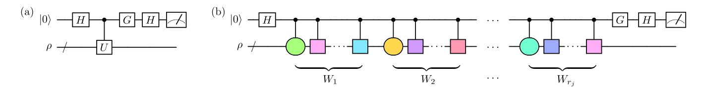
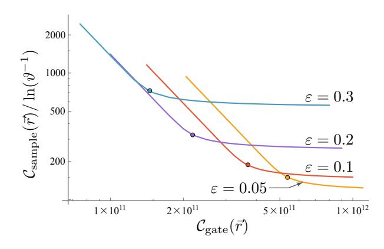

## A randomized quantum algorithm for statistical phase estimation

Kianna Wan,1,2 Mario Berta,1,3,4 and Earl T. Campbell5

1 AWS Center for Quantum Computing, Pasadena, USA

2 Stanford Institute for Theoretical Physics, Stanford University, Stanford, USA

3 Institute for Quantum Information and Matter,
California Institute of Technology, Pasadena, USA

4 Department of Computing, Imperial College London, London, UK

5 AWS Center for Quantum Computing, Cambridge, UK

Phase estimation is a quantum algorithm for measuring the eigenvalues of a Hamiltonian. We propose and rigorously analyse a randomized phase estimation algorithm with two distinctive features. First, our algorithm has complexity independent of the number of terms L in the Hamiltonian. Second, unlike previous L-independent approaches, such as those based on qDRIFT, all sources of error in our algorithm can be suppressed by collecting more data samples, without increasing the circuit depth.

Quantum computers can be used to simulate dynamics and learn the spectra of quantum systems, such as interacting particles comprising complex molecules or materials, described by some Hamiltonian H. Phase estimation [1] on the unitary  $U=e^{iHt}$  efficiently solves the common spectral problem of computing ground state energies, whenever we can efficiently prepare a trial state with non-trivial (not exponentially small) overlap  $\eta$  with the ground state. Each run of standard phase estimation returns a single eigenvalue, with precision and success probability dependent on the number of times U is used.

Recently, statistical approaches to phase estimation have been proposed [2-4], where each run uses only a few ancillae and shorter circuits than standard phase estimation. As such, statistical phase estimation may be better suited to early fault-tolerant quantum computers that are qubit- and depth-limited. However, in these approaches, a single run gives a sample of an estimator of  $\langle U^j \rangle$  for some runtime j, which alone is not enough to infer spectral properties. Multiple runs with different values of j are needed, and statistical analysis gives spectral information with a confidence that increases with the amount of data obtained. These runs could be massively parallelized across multiple quantum computers. Interestingly, the approach of Lin & Tong [4] is not only statistical in its analysis, but also generates the runtimes j, and therefore the circuits, from a random ensemble.

The cost of phase estimation—statistical or standard—typically depends on the Hamiltonian sparsity L, the number of terms in the Hamiltonian when decomposed in a suitable basis, such as the Pauli basis. Simple schemes based on implementing U using Trotter formulae have  $\mathcal{O}(L)$  gate complexity [5–9]. This can be prohibitive for the electronic structure problem in chemistry and materials science, where we typically have  $L = \mathcal{O}(N^4)$  for an N-orbital problem [10]. This increases to  $L = \mathcal{O}(N^6)$  when using transcorrelated orbitals [11, 12] to better resolve electron-electron interactions. Interestingly, sublinear non-Clifford complexity  $\mathcal{O}(\sqrt{L}+N)$  is possible by employing an efficient data-lookup oracle [13, 14]

in qubitization-based implementations of phase estimation [15–18]. However, these approaches require  $\mathcal{O}(\sqrt{L})$  ancillae, which increases the qubit cost from  $\mathcal{O}(N)$  to  $\mathcal{O}(N^2)$ , or even  $\mathcal{O}(N^3)$  in the transcorrelated setting.

Heuristic truncation and low-rank factorisations have been proposed to decrease the sparsity L [16–18] of the electronic structure Hamiltonian. As an alternative approach, randomized compilation [19–21] has been rigorously shown to enable phase estimation with gate complexity that is independent of L for any Hamiltonian. A weakness of these randomized algorithms is a systematic error in energy estimates that can only be suppressed by increasing gate complexity, leading to high gate counts per run (cf. [18, Appendix D]).

Here, we overcome this difficulty by combining the statistical approach of Lin & Tong [4] with a novel random compilation of each  $U^{j}$  instance, that has parallels to both the qDRIFT random compiler [19] and the linear combinations of unitaries (LCU) method [22, 23]. Our algorithm for phase estimation is doubly randomized in that we randomly sample j, then approximate  $U^{j}$  using a random gate sequence. Unlike in any previous approach, all errors can be expressed in terms of statistical noise that is suppressed by collecting more data samples. This allows for a trade-off between the gate complexity per sample and the number of samples required. We explore this trade-off and show how to efficiently minimise the total complexity using convex optimization techniques. In contrast, qDRIFT approximates U up to some systematic error (measured by the diamond norm) that cannot be mitigated by increasing the number of samples.

Applied to ground state energy estimation, we can tune the gate vs. sample trade-off to yield the following complexities. Given a Hamiltonian as a linear combination of Pauli operators with total weight  $\lambda$ , and an ansatz state with overlap at least  $\eta$  with the ground space, we can choose to sample from  $\widetilde{\mathcal{O}}(\eta^{-2})$  randomly compiled quantum circuits, where  $\widetilde{\mathcal{O}}(\cdot)$  hides polylogarithmic factors. Each circuit uses one ancilla and at most  $\widetilde{\mathcal{O}}(\lambda^2\Delta^{-2})$  single-qubit Pauli rotations to estimate the ground state

energy to within additive error  $\Delta$ .

Problem setting. We assume that the Hamiltonian H is specified as a linear combination of n-qubit Pauli operators  $P_{\ell}$ :

$$H = \sum_{\ell=1}^{L} \alpha_{\ell} P_{\ell}, \quad \text{with } \lambda := \sum_{\ell=1}^{L} |\alpha_{\ell}|. \tag{1}$$

This form can always be achieved, and is particularly natural for many physical systems of interest, such as fermionic Hamiltonians [24–28]. Note that the spectral norm ||H|| obeys the generally loose bound  $||H|| < \lambda$ . We consider the following problem of coarsely determining whether an ansatz state  $\rho$  has overlap with eigenstates of H with eigenvalues below some threshold: Given a threshold X, precision  $\Delta > 0$ , and overlap parameter  $\eta > 0$ , we seek to decide if (A)  $\operatorname{tr}[\rho \Pi_{\leq X-\Delta}] < \eta$  or (B)  $\operatorname{tr}[\rho\Pi_{\leq X+\Delta}] > 0$ , where  $\Pi_{\leq x}$  denotes the projector onto the eigenspaces of H with eigenvalues at most x. Both of these statements can simultaneosly be true, in which case it suffices to output either A or B. We refer to this problem as eigenvalue thresholding, and its solution will later allow us to estimate the ground state energy, given a suitable ansatz  $\rho$ .

Cumulative distribution function. Similarly to [4], we define the cumulative distribution function (CDF) associated with the Hamiltonian H and ansatz state  $\rho$  as

$$C(x) := \operatorname{tr}\left[\rho \Pi_{\leq x/\tau}\right],$$
 (2)

where  $\tau \coloneqq \frac{\pi}{2\lambda + \Delta}$  is a normalisation factor. We can write C(x) as the convolution  $(\Theta * p)(x)$  of the Heaviside function  $\Theta(\cdot)$  and the probability density function  $p(\cdot)$  corresponding to  $\tau H$  and  $\rho$ :

$$C(x) = \int_{-\pi/2}^{\pi/2} dy \, p(y) \Theta(x - y), \tag{3}$$

noting that p(x) is supported within  $x \in (-\frac{\pi}{2}, \frac{\pi}{2})$  since  $\tau ||H|| \le \tau \lambda < \frac{\pi}{2}$ . Eigenvalue thresholding then reduces to the following problem regarding the CDF.

**Problem 1:** For given  $x \in [-\tau\lambda, \tau\lambda]$  and  $\delta > 0$ , determine whether

$$C(x-\delta) < \eta \quad \text{or} \quad C(x+\delta) > 0,$$
 (4)

outputting either statement if both are true.

In particular, solving Problem 1 for  $x = \tau X$  and  $\delta = \tau \Delta$  solves eigenvalue thresholding.2

Algorithm overview. To solve Problem 1, we will construct an approximation  $\widetilde{C}(\cdot)$  to the CDF  $C(\cdot)$  satisfying

$$C(x - \delta) - \varepsilon \le \widetilde{C}(x) \le C(x + \delta) + \varepsilon$$
 (5)

for relevant values of x,  $\delta$ , and  $\varepsilon$ . Observe that for  $\varepsilon \in (0, \eta/2)$ ,  $\widetilde{C}(x) < \eta - \varepsilon$  would imply the first case of Eq. (4), while  $\widetilde{C}(x) > \varepsilon$  would imply the second case. Hence, it suffices to estimate  $\widetilde{C}(x)$ .

Our algorithm is based on expressing  $\widetilde{C}(x)$  in terms of a linear combination of computationally simple unitaries, obtained via a two-step construction. First, we develop an improved Fourier series approximation to the Heaviside function (Lemma 1). Second, we combine this with a novel decomposition of the time evolution operators (Lemma 2) in the relevant Fourier series. Randomly sampling unitaries from our decomposition and estimating their expectation values using Hadamard tests (Fig. 1(a)) will give estimates for  $\widetilde{C}(x)$ , allowing us to solve Problem 1 with high probability.

Fourier series approximation. Following Lin & Tong [4], which uses ideas similar to those in [31, 32], we obtain an approximate CDF  $\widetilde{C}(\cdot)$  by replacing  $\Theta(\cdot)$  in Eq. (3) with a finite Fourier series approximation thereof. As in [30, 33] and related works, we need a Fourier series with small approximation error on  $|x| \in [\delta, \pi - \delta]$  for fixed  $\delta > 0$ , small total weight of Fourier coefficients, and small maximal "time" parameter |t| in the  $e^{itx}$  terms. We explicitly construct such a Fourier series by converting suitable Chebyshev approximations to the error function (see Supplemental Materials Sec. A for proofs and explicit constant factors), establishing that:

**Lemma 1.** For any  $\varepsilon > 0$  and  $\delta \in (0, \pi/2)$ , there exists a Fourier series  $F(x) = \sum_{j \in S_1} F_j e^{ijx}$  with  $S_1 := \{0\} \cup \{\pm (2j+1)\}_{j=0}^d$  and  $d = \mathcal{O}(\delta^{-1} \log(\varepsilon^{-1}))$ , that satisfies

1. 
$$|F(x) - \Theta(x)| \le \varepsilon \quad \forall x \in [-\pi + \delta, -\delta] \cup [\delta, \pi - \delta],$$

2. 
$$-\varepsilon \le |F(x)| \le 1 + \varepsilon \quad \forall x \in \mathbb{R}$$
,

3. 
$$\mathcal{F} := \sum_{j \in S_1} |F_j| = \mathcal{O}(\log d)$$
.

This improves on the Fourier approximation of Lin & Tong, which has  $d = \mathcal{O}(\delta^{-1}\log(\delta^{-1}\varepsilon^{-1}))$  [4, Lemma 6]. As such, Lemma 1 also improves the asymptotic complexity of their phase estimation algorithm. Using the Fourier series  $F(\cdot)$  of Lemma 1, we obtain the approximate CDF

$$\widetilde{C}(x) := \int_{-\pi/2}^{\pi/2} dy \, p(y) F(x - y) = \sum_{j \in S_1} F_j e^{ijx} \operatorname{tr}[\rho e^{i\widehat{H}t_j}]$$
(6)

where  $t_j := -j\tau\lambda$  and  $\hat{H} := H/\lambda$ , which for any  $\delta \in (0, \tau\Delta]$  indeed satisfies the guarantees in Eq. (5) (see Supplemental Materials Sec. B).

&lt;sup>1 This will enable us to replace  $\Theta(x)$  with a periodic function that is a good approximation only within  $x \in (-\pi, \pi)$ .

&lt;sup>2 Solving Problem 1 with these parameter values also solves the "eigenvalue threshold problem" [29, 30], which, unlike eigenvalue thresholding, is a promise problem and consequently cannot be used as a subroutine for phase estimation in the same manner.

FIG. 1. (a) Hadamard test on  $\rho$  and U: setting  $G = \mathbbm{1}$  (resp.  $G = S^{\dagger} := |0\rangle\langle 0| - i|1\rangle\langle 1|$ ) and associating the measurement outcomes  $(|0\rangle, |1\rangle)$  with (+1, -1) produces an unbiased estimator for  $\text{Re}(\text{tr}[\rho U])$  (resp.  $\text{Im}(\text{tr}[\rho U])$ ). (b) Schematic depiction of the randomly compiled circuits in our algorithm. For  $\hat{H} = \sum_{\ell} p_{\ell} P_{\ell}$ , the squares represent Pauli operators randomly drawn from  $\{P_{\ell}\}_{\ell}$  according to  $\{p_{\ell}\}_{\ell}$ , while circles denote multi-qubit Pauli rotations; see the proof of Lemma 2 for details. The number of Pauli operators appearing in each  $W_{i}$  is random, and will be zero with high probability.

LCU decomposition of time evolution operators. Instead of directly implementing the time evolution operators  $e^{i\hat{H}t_j}$  from Eq. (6) in Hadamard tests, as considered by [4], we further decompose each of these terms into a specific linear combination of unitaries (LCU).

**Lemma 2.** Let  $\hat{H} = \sum_{\ell} p_{\ell} P_{\ell}$  be a Hermitian operator that is specified as a convex combination of Pauli operators. For any  $t \in \mathbb{R}$  and  $r \in \mathbb{N} := \{1, 2, \dots\}$ , there exists a linear decomposition

$$e^{i\hat{H}t} = \sum_{k \in S_2} b_k U_k$$

for some index set  $S_2$ , real numbers  $b_k > 0$ , and unitaries  $U_k$ , such that

$$\sum_{k \in S_2} b_k \le \exp(t^2/r),$$

and for all  $k \in S_2$ , the non-Clifford cost of controlled- $U_k$  is that of r controlled single-qubit Pauli rotations.

This decomposition is conceptually different from previous LCU methods, cf. [23] and references therein. The purpose of Lemma 2 is to allow for a trade-off between the sample complexity and gate complexity of our algorithm. Specifically, as shown later, the sample complexity depends on the total weight  $\sum_{k \in S_2} b_k$  of the coefficients in our decomposition. Since this weight is bounded by  $\exp(t^2/r)$ , we can reduce the sample complexity by increasing r, at the cost of increasing the gate complexity per sample, and vice versa.

To prove Lemma 2, we write  $e^{i\hat{H}t} = (e^{i\hat{H}t/r})^r$  and Taylor-expand each  $e^{i\hat{H}t/r} = \mathbb{1} + i\hat{H}t/r + \mathcal{O}((t/r)^2)$ . We then pair up consecutive terms in this expansion, which differ in phase by i. Since  $\hat{H}$  is a convex combination of Pauli operators, this gives rise to convex combinations of multi-qubit Pauli rotations, e.g., the leading term is

$$\mathbb{1} + i\hat{H}t/r = \sum_{\ell} p_{\ell}(\mathbb{1} + iP_{\ell}t/r) \propto \sum_{\ell} p_{\ell}e^{i\theta P_{\ell}}$$
 (7)

with  $\theta := \arccos \sqrt{1 + (t/r)^2}$ . The higher-order terms contain additional Pauli operators, as illustrated in

Fig. 1(b). The controlled version of each Pauli rotation can be implemented using a controlled single-qubit rotation, along with Clifford gates. Hence, each controlled- $U_k$  requires a total of r controlled single-qubit rotations. Explicit forms for the higher-order terms and proof details are given Supplemental Materials Sec. C.

Our statistical algorithm for Problem 1. We apply Lemma 2 to decompose each  $e^{i\hat{H}t_j}$  in Eq. (6) as  $e^{i\hat{H}t_j} = \sum_{k \in S_2} b_k^{(j)} U_k^{(j)}$ . We choose a positive integer  $r_j$  for each  $j \in S_1$ , and define the corresponding "runtime vector"  $\vec{r} = (r_j)_j \in \mathbb{N}^{S_1}$ . This leads to the final decomposition

$$\widetilde{C}(x) = \sum_{(j,k)\in S_1\times S_2} \underbrace{F_j e^{ijx} b_k^{(j)}}_{=: a_{jk}} \operatorname{tr}[\rho U_k^{(j)}]$$
(8)

with total weight

$$\mathcal{A}(\vec{r}) := \sum_{(j,k) \in S_1 \times S_2} |a_{jk}| \le \sum_{j \in S_1} |F_j| \exp(t_j^2/r_j).$$
 (9)

As a simple example,

$$r_j = \lceil 2t_j^2 \rceil \quad \forall j \in S_1 \quad \text{gives} \quad \mathcal{A}(\vec{r}) \le \sqrt{e}\mathcal{F}.$$
 (10)

Recall that we can solve Problem 1 by determining if  $\widetilde{C}(x) < \eta - \varepsilon$  or  $\widetilde{C}(x) > \varepsilon$ . To estimate  $\widetilde{C}(x)$ , we sample (j,k) from  $S_1 \times S_2$  with probability proportional to  $|a_{jk}|$ , and perform a Hadamard test on  $\rho$  and  $U_k^{(j)}$ , obtaining an estimate  $m_{jk}$  for  $\mathrm{tr}[\rho U_k^{(j)}]$ . Then,  $z_{jk} \coloneqq \mathcal{A}(\vec{r})e^{i\arg(a_{jk})}m_{jk}$  is an unbiased estimate of  $\widetilde{C}(x)$ . Letting  $\overline{Z}$  denote the random variable obtained by taking the average of  $\mathcal{C}_{\mathrm{sample}}$  such estimates, it follows from Hoeffding's inequality that guessing  $\widetilde{C}(x) < \eta - \varepsilon$  if  $\mathrm{Re}[\overline{Z}] < \eta/2$  and  $\widetilde{C}(x) > \varepsilon$  if  $\mathrm{Re}[\overline{Z}] \ge \eta/2$  gives a correct answer with probability at least  $1 - \vartheta$  provided that  $\mathcal{C}_{\mathrm{sample}} \ge 4\mathcal{A}(\vec{r})^2(\eta/2 - \varepsilon)^{-2}\ln(\vartheta^{-1})$ . Thus, we arrive at Algorithm 1, our algorithm for solving Problem 1, and hence eigenvalue thresholding.

## Algorithm 1 algorithm for Problem 1

**Problem inputs:** a Hamiltonian  $H = \sum_{\ell=1}^{L} \alpha_{\ell} P_{\ell}$  with  $\alpha_{\ell} > 0$  and  $\lambda := \sum_{\ell=1}^{L} \alpha_{\ell}$ , an ansatz state  $\rho$ , a precision parameter  $\Delta > 0$ ;  $\tau := \frac{\pi}{2\lambda + \Delta}$ .

**Algorithm parameters:** real numbers  $x \in [-\tau\lambda, \tau\lambda]$ ,  $\delta \in (0, \tau\Delta]$ ,  $\eta \in (0, 1]$ , and  $\varepsilon \in (0, \eta/2)$ , a probability  $\vartheta$ .

**Output:** 0 if  $C(x - \delta) < \eta$ , 1 if  $C(x + \delta) > 0$ , and either 0 or 1 if both are true (where  $C(\cdot)$  is the CDF defined in Eq. (2)) with probability of error at most  $\vartheta$ .

- 1: Compute the coefficients  $\{F_j\}_{j\in S_1}$  of the Fourier series from Lemma 1 with approximation parameters  $\delta$  and  $\varepsilon$ . Set  $t_j \leftarrow -j\lambda\tau \ \forall j \in S_1$ .
- 2: Choose a runtime vector  $\vec{r} \in \mathbb{N}^{S_1}$  (using e.g., Eq. (10) or Eq. (13)), and apply Lemma 2 to obtain the decomposition in Eq. (8), with total weight  $\mathcal{A}(\vec{r})$  as in Eq. (9).

$$C_{\text{sample}}(\vec{r}) \leftarrow \left[ \left( \frac{2\mathcal{A}(\vec{r})}{\eta/2 - \varepsilon} \right)^2 \ln \frac{1}{\vartheta} \right].$$
 (11)

- 4: For  $i = 1, \ldots, C_{\text{sample}}(\vec{r})$ :
- 5: Sample a unitary  $U_k^{(j)}$  from Eq. (8).
- 6: Perform a Hadamard test with inputs  $\rho$  and  $U_k^{(j)}$ , obtaining an estimate  $m_i$  of  $\operatorname{tr}[\rho U_k^{(j)}]$ .
- 7:  $z_i \leftarrow \mathcal{A}(\vec{r})e^{i(\arg(F_j)+jx)}m_i$
- 8:  $\overline{z} \leftarrow \sum_{i} z_i / C_{\text{sample}}(\vec{r})$ . If  $\text{Re}(\overline{z}) < \eta/2$ , return 0. Else, return 1

Complexity. The Hadamard test in Step 6 is the only quantum step and involves two circuits on n+1 qubits, for an n-qubit Hamiltonian H. The expected number of controlled Pauli rotations per circuit is

$$C_{\text{gate}}(\vec{r}) := \frac{1}{\mathcal{A}(\vec{r})} \sum_{(j,k) \in S_1 \times S_2} |a_{jk}| r_j.$$
 (12)

Step 6 is repeated  $C_{\text{sample}}(\vec{r})$  times, so the expected total non-Clifford complexity is  $2C_{\text{sample}}(\vec{r}) \cdot C_{\text{gate}}(\vec{r})$ .

It remains to specify how to choose the runtime vector  $\vec{r} \in \mathbb{N}^{S_1}$ . For example, we could aim to minimise the total complexity

$$\underset{\vec{r}}{\operatorname{arg\,min}} \ \mathcal{C}_{\operatorname{sample}}(\vec{r}) \cdot \mathcal{C}_{\operatorname{gate}}(\vec{r}). \tag{13}$$

Prima facie this is a high-dimensional optimisation problem, as  $|S_1| = \mathcal{O}(\delta^{-1}\log(\epsilon^{-1}))$  from Lemma 1. However, differentiating with respect to  $\vec{r}$ , one sees that the argmin is effectively described by a single free parameter. Therefore, optimizing the runtime vector is reducible to an efficiently solvable one-dimensional problem, and this further holds when minimising  $\mathcal{C}_{\text{sample}}$  subject to constraints on  $\mathcal{C}_{\text{gate}}$  (see Supplemental Materials Sec. D). Moreover, if one is exclusively interested in asymptotic complexities, the simple choice for  $\vec{r}$  in Eq. (10) already gives

$$C_{\text{sample}}(\vec{r}) = \mathcal{O}\left(\frac{1}{\eta^2}\log^2\left(\frac{1}{\delta}\log\frac{1}{\eta}\right)\log\frac{1}{\vartheta}\right) = \widetilde{\mathcal{O}}\left(\frac{1}{\eta^2}\right)$$
(14)

and 
$$C_{\text{gate}}(\vec{r}) = \mathcal{O}\left(\frac{1}{\delta^2}\log^2\frac{1}{\eta}\right) = \widetilde{\mathcal{O}}\left(\frac{1}{\delta^2}\right),$$
 (15)

since  $\mathcal{A}(\vec{r}) \leq \sqrt{e}\mathcal{F}$  and  $\mathcal{C}_{\text{gate}}(\vec{r}) \leq \max_{j \in S_1} r_j = 2[(2d+1)\tau\lambda]^2$  for this choice, with  $\mathcal{F}$  and d given by Lemma 1 and picking  $\varepsilon = \text{const.} \times \eta$  in Algorithm 1. Note that the worst-case gate complexity thus has the same scaling as that in Eq. (15) for the expected gate complexity  $\mathcal{C}_{\text{gate}}(\vec{r})$ . Hence, we arrive at a total complexity  $\widetilde{\mathcal{O}}(\delta^{-2}\eta^{-2})$ . For eigenvalue thresholding, one would choose  $\delta = \tau \Delta$ , in which case  $\delta^{-1} = \mathcal{O}(\lambda/\Delta)$ .

Ground state energy estimation. Under appropriate assumptions on the Hamiltonian H and ansatz state  $\rho$ , our method for estimating the CDF can be adapted to perform phase estimation. Specifically, eigenvalues of H correspond to the locations of jump discontinuities in C(x), and we can estimate these locations given sufficient knowledge about the overlap of  $\rho$  with relevant eigenspaces. For simplicity, we restrict ourselves to the problem of estimating the ground state energy  $[H]_{\min}$ , which only requires the standard promise that  $\mathrm{tr}[\rho\Pi_{\min}] \geq \eta$  for some  $\eta > 0$ , where  $\Pi_{\min}$  denotes the projector onto the ground space of H.

The analysis in [4, Section 5] shows that by solving Problem 1 for  $s = \mathcal{O}(\log(\delta^{-1}))$  different values of x determined in a fashion similar to binary search, one can find an  $x^*$  such that  $C(x^* - \delta) < \eta$  and  $C(x^* + \delta) > 0$ , which implies that  $|x^* - \tau[H]_{\min}| \leq \delta$ . Hence, if we take  $\delta = \tau \Delta$ , then  $x^*/\tau$  would give an estimate of the ground state energy to within additive error  $\Delta$ . We use Algorithm 1 to solve Problem 1, noting that we can reuse the samples collected in Step 6 for all of the different x values, with only a small overhead in the sample complexity. Namely, since Algorithm 1 errs with probability at most  $\vartheta$  for any x, choosing  $\vartheta = \xi/s$  would ensure, by the union bound, that the ground state is successfully estimated with probability at least  $1 - \xi$ .

Theorem 1. For any n-qubit Hamiltonian H of the form in Eq. (1), let  $\rho$  be a state that has overlap  $\operatorname{tr}[\rho\Pi_{\min}] \geq \eta$  with the ground space of H. Then, the ground state energy of H can be estimated to within additive error  $\Delta$  with probability at least  $1 - \xi$  using  $\mathcal{O}\left(\frac{1}{\eta^2}\log^2\left(\frac{\lambda}{\Delta}\log\frac{1}{\eta}\right)\log\left(\frac{1}{\xi}\log\frac{\lambda}{\Delta}\right)\right)$  quantum circuits on n+1 qubits. Each circuit uses one copy of  $\rho$  and at most  $\mathcal{O}\left(\frac{\lambda^2}{\Delta^2}\log^2\frac{1}{\eta}\right)$  single-qubit Pauli rotations.

Thus, our quantum complexities are independent of the Hamiltonian sparsity L, at the price of the quadratic dependence  $\widetilde{\mathcal{O}}(\lambda^2 \Delta^{-2} \eta^{-2})$  for the total gate count. This is in contrast to standard results on phase estimation (see e.g., [18, Table I]).

Comparisons. Conventional phase estimation algorithms depend on the sparsity L, which is especially prohibitive for chemistry Hamiltonians. Several algorithms [16–18] have used heuristic truncation policies to

justify eliminating certain terms from the Hamiltonians, thereby reducing L. While supporting numerics were presented, these truncations are not rigorous. Moreover, it was also assumed that only a single run of the algorithm suffices. In practice, a single sample might return an incorrect result due to imperfect overlap with the ground-state ( $\eta < 1$ ), inherent failure probabilities of phase estimation, or quantum error correction failure events. In contrast, our algorithm is rigorous; we use no Hamiltonian truncation, and upper-bound the number of samples needed in terms of  $\eta$  and the target success probability.3

Hydrogen chains. As a benchmark system for assessing the scaling of quantum algorithms applied to quantum chemistry, we discuss hydrogen chains [18, 34]. Using the best value  $\lambda \sim \mathcal{O}(N^{1.34})$  given in [34], our algorithm scales as  $\widetilde{\mathcal{O}}(N^{2.68}/\Delta^2)$ . For comparison, the scaling of qubitization is  $\widetilde{\mathcal{O}}(N^{3.34}/\Delta)$  without truncation, and with heuristic truncations,  $\widetilde{\mathcal{O}}(N^{2.3}/\Delta)$  for the sparse method of [16] and  $\widetilde{\mathcal{O}}(N^{2.1}/\Delta)$  for the tensor hypercontraction approach of [18]. Hence, for constant  $\Delta$ , qubitization gives a better scaling than our algorithm if the proposed truncation schemes are accurate. However, we emphasize that our rigorous analysis does not make use of heuristic strategies for truncation of Hamiltonian terms [16–18] and that qubitization uses considerably more logical ancillae. Finally, if we are interested in extensive properties where  $\Delta \propto N$ , then our approach scales as  $\widetilde{\mathcal{O}}(N^{0.68})$ , outperforming all qubitization algorithms.

FeMoco. We estimate the costs of our algorithm applied to the Li et al. FeMoco Hamiltonian [35], another popular benchmark for which there have been several state-of-the-art resource studies [16–18]. We consider chemical accuracy  $\Delta=0.0016$  Hartree, and use  $\lambda=1511$  Hartree, obtained using the bounds in [34]. We present our results in Fig. 2, illustrating the trade-off between the the expected number of gates per circuit and the number of samples required. Since the Hamiltonian from [35] has 152 spin orbitals, each circuit uses 153 qubits.

We have presented our gate counts as  $C_{\rm gate}$  controlled Pauli rotations, but asymptotically our circuits can typically be realised using  $\sim 2\mathcal{C}_{\rm gate}$  Toffoli gates. For modest system sizes and modest number of logical ancilla ( $\sim 40$ ), the Toffoli count is  $\sim 6\mathcal{C}_{\rm gate}$  (see Supplemental Materials Sec. F). The FeMoco resource estimate for the qDRIFT random compiler combined with phase estimation in [18, Appendix D] arrived at  $10^{16}$  Toffoli gates per sample, which is about  $10^4$  times larger than  $2\mathcal{C}_{\rm gate}$  from the results in Fig. 2. Moreover, our rigorous analysis will likely be loose and overestimate resources; for instance, more aggressive—though heuristic—Hamiltonian

FIG. 2. Log-log plot of  $C_{\text{sample}}(\vec{r})/\ln(\vartheta^{-1})$  vs.  $C_{\text{gate}}(\vec{r})$ , for  $\lambda=1511$  (FeMoco [34, 35]),  $\Delta=0.0016$  (chemical accuracy),  $\eta=1$ , and  $\varepsilon\in\{0.05,0.1,0.2,0.3\}$ , for various choices of the optimized runtime vector  $\vec{r}$ . Dots indicate the values that minimise the total expected complexity  $2C_{\text{sample}} \cdot C_{\text{gate}}$ , while curves are obtained by fixing  $C_{\text{gate}}$  and minimising  $C_{\text{sample}}$ . To calculate the number of samples needed to guarantee an overall failure probability of  $\leq \xi$  for ground state energy estimation (Theorem 1), one would multiply the y-axis by  $\ln(\vartheta^{-1}) = \mathcal{O}\left(\log(\xi^{-1}) + \log\log(\delta^{-1})\right)$  (see [4] for the explicit constants). As an example,  $\xi=0.1$  would give a multiplier of approximately 6.

rescaling is justifiable and can further reduce costs (see Supplemental Materials Sec. G).

Acknowledgements. We thank Sam McArdle for helpful discussions, especially with regard to calculations for the quantum chemistry examples, and Fernando Brandão for discussions and support throughout this project.

- A. Y. Kitaev, A. Shen, M. N. Vyalyi, and M. N. Vyalyi, Classical and quantum computation (American Mathematical Soc., 2002).
- [2] T. E. O'Brien, B. Tarasinski, and B. M. Terhal, Quantum phase estimation of multiple eigenvalues for small-scale (noisy) experiments, New Journal of Physics 21, 023022 (2019).
- [3] A. Dutkiewicz, B. M. Terhal, and T. E. O'Brien, Heisenberg-limited quantum phase estimation of multiple eigenvalues with a single control qubit, arXiv preprint arXiv:2107.04605 (2021).
- [4] L. Lin and Y. Tong, Heisenberg-limited ground state energy estimation for early fault-tolerant quantum computers, arXiv preprint arXiv:2102.11340 (2021).
- [5] D. Poulin, M. B. Hastings, D. Wecker, N. Wiebe, A. C. Doherty, and M. Troyer, The Trotter step size required for accurate quantum simulation of quantum chemistry, Quantum Information & Computation 15, 361 (2015).
- [6] R. Babbush, J. McClean, D. Wecker, A. Aspuru-Guzik, and N. Wiebe, Chemical basis of Trotter-Suzuki errors in quantum chemistry simulation, Physical Review A 91, 022311 (2015).
- [7] I. D. Kivlichan, C. Gidney, D. W. Berry, N. Wiebe, J. McClean, W. Sun, Z. Jiang, N. Rubin, A. Fowler,

&lt;sup>3 We neglect quantum error correction failure events, though these can easily be suppressed to lower levels than other failure modes.

- A. Aspuru-Guzik, et al., Improved fault-tolerant quantum simulation of condensed-phase correlated electrons via trotterization, Quantum 4, 296 (2020).
- [8] E. T. Campbell, Early fault-tolerant simulations of the Hubbard model, arXiv preprint arXiv:2012.09238 (2020).
- [9] S. McArdle, E. Campbell, and Y. Su, Exploiting fermion number in factorized decompositions of the electronic structure Hamiltonian, arXiv preprint arXiv:2107.07238 (2021).
- [10] T. Helgaker, P. Jorgensen, and J. Olsen, Molecular electronic-structure theory (John Wiley & Sons, 2014).
- [11] M. Motta, T. P. Gujarati, J. E. Rice, A. Kumar, C. Masteran, J. A. Latone, E. Lee, E. F. Valeev, and T. Y. Takeshita, Quantum simulation of electronic structure with transcorrelated Hamiltonian: increasing accuracy without extra quantum resources, Physical Chemistry Chemical Physics 22, 24270 (2020).
- [12] S. McArdle and D. P. Tew, Improving the accuracy of quantum computational chemistry using the transcorrelated method, arXiv preprint arXiv:2006.11181 (2020).
- [13] R. Babbush, C. Gidney, D. W. Berry, N. Wiebe, J. Mc-Clean, A. Paler, A. Fowler, and H. Neven, Encoding electronic spectra in quantum circuits with linear T complexity, Physical Review X 8, 10.1103/physrevx.8.041015 (2018).
- [14] G. H. Low, V. Kliuchnikov, and L. Schaeffer, Trading T-gates for dirty qubits in state preparation and unitary synthesis, arXiv preprint arXiv:1812.00954 (2018).
- [15] R. Babbush, D. W. Berry, J. R. McClean, and H. Neven, Quantum simulation of chemistry with sublinear scaling in basis size, npj Quantum Information 5, 1 (2019).
- [16] D. W. Berry, C. Gidney, M. Motta, J. R. McClean, and R. Babbush, Qubitization of arbitrary basis quantum chemistry leveraging sparsity and low rank factorization, Quantum 3, 208 (2019).
- [17] V. von Burg, G. H. Low, T. Häner, D. S. Steiger, M. Reiher, M. Roetteler, and M. Troyer, Quantum computing enhanced computational catalysis, Physical Review Research 3, 033055 (2021).
- [18] J. Lee, D. W. Berry, C. Gidney, W. J. Huggins, J. R. Mc-Clean, N. Wiebe, and R. Babbush, Even more efficient quantum computations of chemistry through tensor hypercontraction, PRX Quantum 2, 030305 (2021).
- [19] E. Campbell, Random compiler for fast Hamiltonian simulation, Physical Review Letters 123, 070503 (2019).
- [20] I. D. Kivlichan, C. E. Granade, and N. Wiebe, Phase estimation with randomized Hamiltonians, arXiv preprint arXiv:1907.10070 (2019).
- [21] Y. Ouyang, D. R. White, and E. T. Campbell, Compilation by stochastic Hamiltonian sparsification, Quantum

- 4, 235 (2020).
- [22] A. M. Childs and N. Wiebe, Hamiltonian simulation using linear combinations of unitary operations, Quantum Information & Computation 12 (2012).
- [23] D. W. Berry, A. M. Childs, R. Cleve, R. Kothari, and R. D. Somma, Simulating Hamiltonian dynamics with a truncated Taylor series, Physical Review Letters 114, 090502 (2015).
- [24] P. Jordan and E. Wigner, Über das Paulische Äquivalenzverbot, Zeitschrift für Physik 47, 631 (1928).
- [25] F. Verstraete and J. I. Cirac, Mapping local Hamiltonians of fermions to local Hamiltonians of spins, Journal of Statistical Mechanics: Theory and Experiment 2005, P09012 (2005).
- [26] J. T. Seeley, M. J. Richard, and P. J. Love, The Bravyi-Kitaev transformation for quantum computation of electronic structure, The Journal of Chemical Physics 137, 224109 (2012).
- [27] V. Havlíček, M. Troyer, and J. D. Whitfield, Operator locality in the quantum simulation of fermionic models, Physical Review A 95, 10.1103/physreva.95.032332 (2017).
- [28] C. Derby, J. Klassen, J. Bausch, and T. Cubitt, Compact fermion to qubit mappings, Physical Review B 104, 10.1103/physrevb.104.035118 (2021).
- [29] J. M. Martyn, Z. M. Rossi, A. K. Tan, and I. L. Chuang, A grand unification of quantum algorithms, arXiv preprint arXiv:2105.02859 (2021).
- [30] A. Gilyén, Y. Su, G. H. Low, and N. Wiebe, Quantum singular value transformation and beyond: exponential improvements for quantum matrix arithmetics, in *Pro*ceedings of the 51st Annual ACM SIGACT Symposium on Theory of Computing (2019) pp. 193–204.
- [31] R. Somma, G. Ortiz, J. E. Gubernatis, E. Knill, and R. Laflamme, Simulating physical phenomena by quantum networks, Physical Review A 65, 10.1103/physreva.65.042323 (2002).
- [32] R. D. Somma, Quantum eigenvalue estimation via time series analysis, New Journal of Physics 21, 123025 (2019).
- [33] J. van Apeldoorn, A. Gilyén, S. Gribling, and R. de Wolf, Quantum sdp-solvers: Better upper and lower bounds, Quantum 4, 230 (2020).
- [34] E. Koridon, S. Yalouz, B. Senjean, F. Buda, T. E. O'Brien, and L. Visscher, Orbital transformations to reduce the 1-norm of the electronic structure Hamiltonian for quantum computing applications, Physical Review Research 3, 033127 (2021).
- [35] Z. Li, J. Li, N. S. Dattani, C. J. Umrigar, and G. K.-L. Chan, The electronic complexity of the ground-state of the femo cofactor of nitrogenase as relevant to quantum simulations, The Journal of Chemical Physics 150, 024302 (2019).