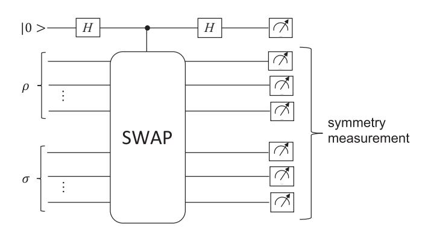
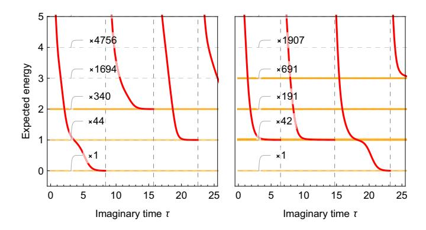
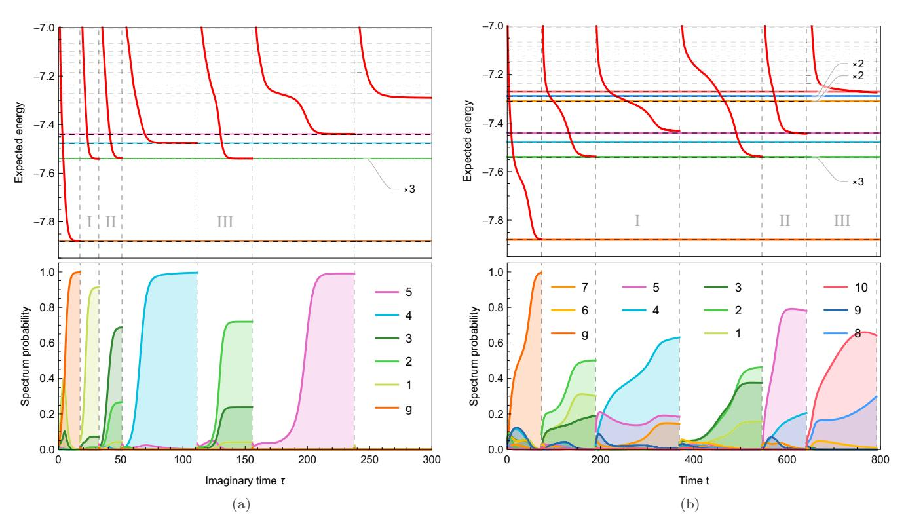
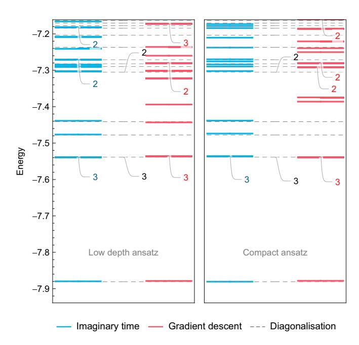
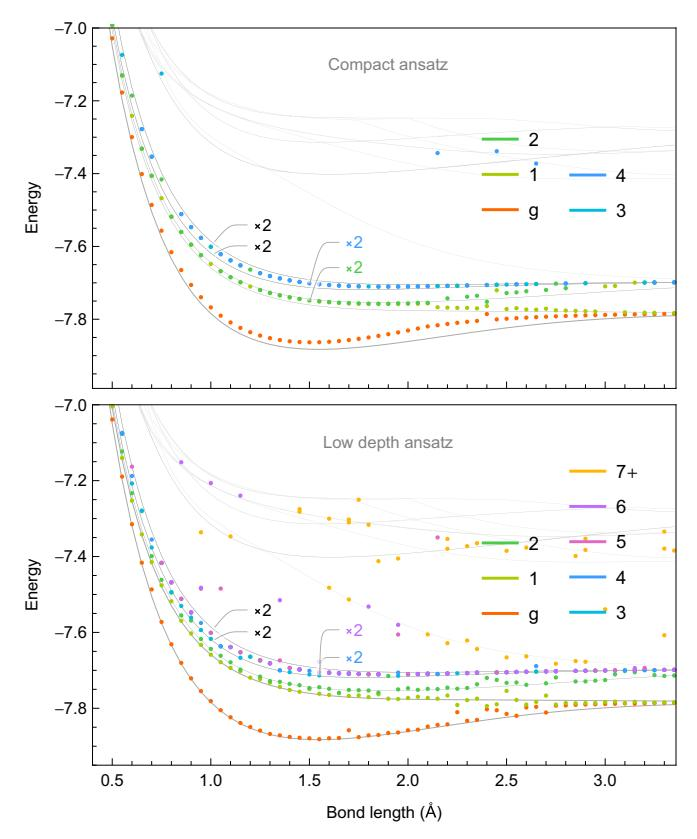
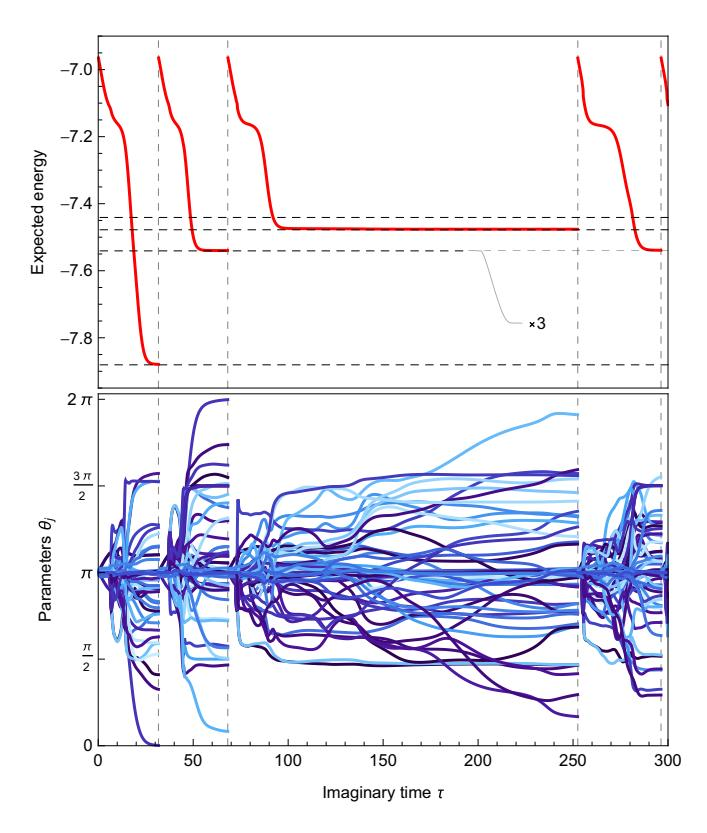
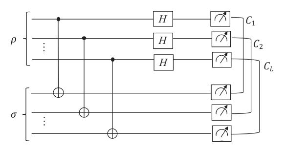

### Variational quantum algorithms for discovering Hamiltonian spectra

Tyson Jones,\*,† Suguru Endo,\*,‡ Sam McArdle, Xiao Yuan, and Simon C. Benjamin Department of Materials, University of Oxford, Parks Road, Oxford OX1 3PH, United Kingdom

(Received 1 February 2019; published 6 June 2019)

Calculating the energy spectrum of a quantum system is an important task, for example to analyze reaction rates in drug discovery and catalysis. There has been significant progress in developing algorithms to calculate the ground state energy of molecules on near-term quantum computers. However, calculating excited state energies has attracted comparatively less attention, and it is currently unclear what the optimal method is. We introduce a low depth, variational quantum algorithm to sequentially calculate the excited states of general Hamiltonians. Incorporating a recently proposed technique [O. Higgott, D. Wang, and S. Brierley, arXiv:1805.08138], we employ the low depth swap test to energetically penalize the ground state, and transform excited states into ground states of modified Hamiltonians. We use variational imaginary time evolution as a subroutine, which deterministically propagates toward the target eigenstate. We discuss how symmetry measurements can mitigate errors in the swap test step. We numerically test our algorithm on Hamiltonians which encode 3SAT optimization problems of up to 18 qubits, and the electronic structure of the lithium hydride molecule. As our algorithm uses only low depth circuits and variational algorithms, it is suitable for use on near-term quantum hardware.

DOI: 10.1103/PhysRevA.99.062304

#### I. INTRODUCTION

Many physical properties of a quantum system are determined primarily by its energy spectrum. Diagonalization of the Hamiltonian allows one to calculate various expectation values and correlation functions [1]. For example, the energy spectra of molecules inform their dynamics and therefore an understanding of such spectra is vital for molecular design [2]. But diagonalizing the Hamiltonians of quantum systems on a classical machine is an often intractable task. The exponentially growing cost of storing and operating upon the quantum system makes diagonalizing large systems prohibitively expensive. This precludes, for example, the study of complicated compounds [3].

It is widely believed that quantum computers will make these classically intractable molecular simulations possible [4]. This was formalized by Aspuru-Guzik et al., who suggested using the adiabatic state preparation and phase estimation algorithms to find the ground state energy of molecules [5]. Such a method necessitated deep quantum circuits and therefore long coherence times. The recently proposed variational quantum eigensolver (VQE) circumvents these requirements, exchanging them for an increased number of circuit repetitions [6,7]. To date, there have been several proof-of-principle experiments which have applied the VQE to find the ground state energy of small molecules [6,8–11].

Published by the American Physical Society under the terms of the Creative Commons Attribution 4.0 International license. Further distribution of this work must maintain attribution to the author(s) and the published article's title, journal citation, and DOI.

Other variational algorithms have been introduced which can simulate the real [12] or imaginary [13] time dynamics of quantum systems. In particular, it was shown that imaginary time evolution can be used as an alternative to the VQE to find the ground state of molecular Hamiltonians.

While the ground state problem has received significant attention, the problem of finding the excited states of molecular systems has experienced comparatively less development. This is despite its particular importance in analyzing chemical reactions, which is a vital ingredient in the quest to discover new drugs and industrial catalysts [14].

There have thus far been a handful of proposals for calculating excited states, all based on the VQE, such as the quantum subspace expansion method [15,16] and the von Neumann entropy method [17]. These methods require either many measurements, or deep quantum circuits, for instance to perform quantum phase estimation.

In this work, we propose a variational algorithm which uses imaginary time evolution to sequentially calculate the energy levels of a Hamiltonian. The algorithm makes use of the shallow swap test [18,19] to evaluate the overlap of two input wave functions [20]. We first use imaginary time evolution to target the ground state of the Hamiltonian. Using the shallow swap test, we can energetically penalize the ground state wave function, then discover the other eigenstates through repeated evolution and penalization. This method makes use of only shallow circuits, at the cost of additional measurements.

A recent work by Higgott et al. [20] introduces the use of the swap test with the VQE to discover the energy eigenstates of the diatomic hydrogen molecule. Here, we contrast the performance of methods based on direct descent with our imaginary time approach, finding that the former is prone to becoming stuck in nonphysical local minima of the parameter space [13,21]. This may render them unsuitable for probing the full spectra of bigger systems. We numerically demonstrate this for a six-qubit molecular Hamiltonian.

\*These authors contributed equally to this work.

†tyson.jones@materials.ox.ac.uk

‡suguru.endo@materials.ox.ac.uk

Conversely, we find that when evolution is restricted to a submanifold of the full Hilbert space, variational imaginary time evolution tends to converge to energy eigenstates of the Hamiltonian, regardless of the initial state. This is a crucial mechanism exploited by our algorithm to reliably penalize and discover the physical energy spectrum. We test our method on Hamiltonians which encode the Boolean satisfiability problem (3SAT), and to find the electronic spectrum of the lithium hydride (LiH) molecule.

### II. IMAGINARY TIME EVOLUTION

Our algorithm makes use of variational imaginary time evolution, to be performed by a hybrid quantum-classical machine. We briefly outline the procedure below. See Ref. [13] for a more detailed discussion.

For a time-independent Hamiltonian, H, the normalized imaginary time evolution is given by

$$|\psi(\tau)\rangle = \frac{e^{-H\tau}|\psi(0)\rangle}{\sqrt{\langle\psi(0)|e^{-2H\tau}|\psi(0)\rangle}},\tag{1}$$

which is the solution of the imaginary time Schrödinger equation

$$\frac{d|\psi(\tau)\rangle}{d\tau} = (H - \langle H(\tau)\rangle)|\psi(\tau)\rangle,\tag{2}$$

where  $\langle H(\tau) \rangle = \langle \psi(\tau) | H | \psi(\tau) \rangle$ . Forgoing normalization, a general state  $| \psi \rangle = \sum_j c_j | e_j \rangle$  evolves in imaginary time like

$$|\psi(\tau)\rangle \sim \sum_{j} c_{j} e^{-E_{j}\tau} |e_{j}\rangle,$$
 (3)

where the probability of energy eigenstates  $|e_j\rangle$  decay exponentially with their energies  $E_j$ . Provided that  $|\psi(\tau)\rangle$  has a nonzero overlap with the ground state  $|g\rangle$ , it can be verified that  $\lim_{\tau\to\infty}|\psi(\tau)\rangle=|g\rangle$ . While nonunitary imaginary time evolution cannot be directly implemented on a quantum computer, it can be simulated using a hybrid quantum-classical algorithm. The state  $|\psi(\tau)\rangle$  is approximated by a parametrized trial state  $|\varphi(\theta_1(\tau),\ldots,\theta_M(\tau))\rangle:=|\varphi(\vec{\theta}(\tau))\rangle$ , and its evolution determined by the evolution of  $\vec{\theta}(\tau)$ . The trial state is produced by an *Ansatz* quantum circuit  $|\varphi(\vec{\theta}(\tau))\rangle=U(\theta_M)U(\theta_{M-1})\ldots U(\theta_1)|\vec{0}\rangle$ , where  $U(\theta_k(\tau))$  is in practice a single- or two-qubit gate.

The evolution of the parameters  $\vec{\theta}(\tau)$  under imaginary time evolution is given by

$$\sum_{i} \mathcal{M}_{ij} \dot{\theta}_{j} = \mathcal{V}_{i}, \tag{4}$$

where

$$\mathcal{M}_{ij} = \operatorname{Re}\left(\frac{\partial \langle \varphi(\vec{\theta}(\tau))|}{\partial \theta_i} \frac{\partial |\varphi(\vec{\theta}(\tau))\rangle}{\partial \theta_j}\right),$$

$$\mathcal{V}_i = \operatorname{Re}\left(\langle \varphi(\vec{\theta}(\tau))|H \frac{\partial |\varphi(\vec{\theta}(\tau))\rangle}{\partial \theta_i}\right). \tag{5}$$

These elements are obtained by the quantum processor using the shallow quantum circuit shown in Appendix A. The classical processor can then update the parameters using the Euler update rule

$$\vec{\theta}(\tau + \delta \tau) = \vec{\theta}(\tau) + \delta \tau \mathcal{M}^{-1} \mathcal{V}. \tag{6}$$

If the *Ansatz* is sufficiently powerful, repeatedly constructing and solving this linear equation will evolve the system to a state close to the ground, which we denote as  $|\tilde{g}\rangle$ . We monitor convergence by the change in the parameters, and halt when  $\|\Delta\vec{\theta}(\tau)\| = \|\delta\tau \mathcal{M}^{-1}\mathcal{V}\| \approx 0$ . The expected energy of a converged state is easily evaluated using a polynomial number of simple Pauli operators [6].

With a less powerful *Ansatz*, imaginary time evolution may fail to reach the ground state, but tends to converge to a higher excited eigenstate of the Hamiltonian. We do not presently provide a proof of this, though this behavior is seen consistently in our numerical simulations.

# III. EVALUATION OF THE ENERGY SPECTRUM OF THE HAMILTONIAN USING IMAGINARY TIME EVOLUTION

We now describe how to evaluate the excited states of the Hamiltonian. Having found an approximate ground state  $|\tilde{g}\rangle$ , we can construct a modified Hamiltonian

$$H' = H + \alpha |\tilde{g}\rangle \langle \tilde{g}|, \tag{7}$$

which, for sufficiently large  $\alpha \in \mathbb{R}$ , no longer has ground state  $|g\rangle$ . Instead, the first excited state  $|e_1\rangle$  of H becomes the ground state of H', and  $|\tilde{g}\rangle$  is now an excited state of H' with energy increased by  $\alpha$ , which will decay exponentially faster in imaginary time. The rest of the spectrum, orthogonal to  $|\tilde{g}\rangle$ , is unaffected. A system evolving under H' in imaginary time will then approach  $|e_1\rangle$  instead. This state can in turn be excited, and the system evolved under Hamiltonian

$$H'' = H + \alpha |\tilde{g}\rangle \langle \tilde{g}| + \alpha |\tilde{e_1}\rangle \langle \tilde{e_1}| \tag{8}$$

to reach the next excited state of the original Hamiltonian. We can repeat this process by preparing the effective Hamiltonian  $H + \alpha |\tilde{g}\rangle\langle \tilde{g}| + \sum_{j=1}^N \alpha |\tilde{e}_j\rangle\langle \tilde{e}_j|$  to obtain the (N+1)th excited state  $|\tilde{e}_{N+1}\rangle$ . In principle, we can obtain the complete energy spectrum, including a count of the degeneracies, so long as  $\alpha$  is kept greater than the gap between ground and the highest state sought. Note the order of the discovered and subsequently excited eigenstates is unimportant.

In practice we do not directly modify the Hamiltonian, as doing so would require full tomography of the state vector, which is exponentially costly. Instead, we modify the imaginary time evolution equations to describe the evolution under the modified Hamiltonian, H'. We replace  $\mathcal{V}$  by

$$\mathcal{V}_{i} = \operatorname{Re}\left(\frac{\partial \langle \varphi(\vec{\theta}(\tau))|}{\partial \theta_{i}} H | \varphi(\vec{\theta}(\tau)) \rangle + \alpha \frac{\partial \langle \varphi(\vec{\theta}(\tau))|}{\partial \theta_{i}} | \tilde{g} \rangle \langle \tilde{g} | \varphi(\vec{\theta}(\tau)) \rangle\right),$$
(9)

and so on to excite all discovered eigenstates by  $\alpha$ .

These additional terms to  $V_i$  can be evaluated using the low depth swap test circuit [18,19], outlined in Appendix B. We use the swap test to evaluate terms  $|\langle \varphi(\theta_i + \delta\theta_i)|\tilde{g}\rangle|^2$  and  $|\langle \varphi|\tilde{g}\rangle|^2$ , and then approximate

$$\operatorname{Re}\left(\frac{\partial \langle \varphi |}{\partial \theta_{i}} | \tilde{g} \rangle \langle \tilde{g} | \varphi \rangle\right)$$

$$= \frac{1}{2} \frac{\partial}{\partial \theta_{i}} |\langle \varphi | \tilde{g} \rangle|^{2} \simeq \frac{1}{2} \frac{|\langle \varphi (\theta_{i} + \delta \theta_{i}) | \tilde{g} \rangle|^{2} - |\langle \varphi | \tilde{g} \rangle|^{2}}{\delta \theta_{i}} \quad (10)$$

for some sufficiently small  $\delta\theta_i$ 

FIG. 1. Using symmetry measurements to detect and mitigate errors in the conventional swap test.

There is no requirement that each discovered eigenstate is excited by the same amount in the modified Hamiltonian. We may vary  $\alpha$  for each excited state. In that scenario, one can add

$$\sum_{i}^{N} \alpha_{j} \operatorname{Re} \left( \frac{\partial \langle \varphi(\vec{\theta}(\tau)) |}{\partial \theta_{i}} | \tilde{e_{j}} \rangle \langle \tilde{e_{j}} | \varphi(\vec{\theta}(\tau)) \rangle \right)$$
(11)

to  $V_i$  in Eq. (5) to emulate a Hamiltonian with energy eigenvalues  $\{E_1 + \alpha_1, \ldots, E_N + \alpha_N\}$ . Ideally, the hyperparameter  $\alpha$  should be chosen to be as large as the gap between the ground and highest excited state sought, so that eigenstates are not rediscovered. This gap can often be *a priori* estimated for quantum chemistry Hamiltonians using efficient classical methods [22]. Otherwise, one could simply increase  $\alpha$  on the fly: If a new state of energy  $E_j + \alpha$  is discovered and is suspected to be a rediscovery of state  $E_j$ , simply discard this state and enlarge  $\alpha$ . If this new state was a legitimate eigenstate, it will be rediscovered. Since it only appears in the classical calculations,  $\alpha$  can be changed at any stage during the algorithm.

## IV. ERROR MITIGATION

We raise the possibility of applying error mitigation to our algorithm, through a simple error detection routine. Instead of using the low depth swap test described above, we can also use the conventional swap test (Fig. 1 [23]). The depth of this circuit grows linearly with the number of qubits used. The conventional swap test calculates the overlap between the two states by measuring an ancilla. However, no measurements are performed on the register qubits, and so any information we gain from them is, in a sense, free. We consider the input states as  $|g\rangle$ ,  $|e\rangle$ . After the conventional swap test circuit, the register is left in the state

$$|\phi_{\rm r}^{\pm}\rangle = \frac{1}{\sqrt{2}}(|g\rangle|e\rangle \pm |e\rangle|g\rangle),$$
 (12)

where the sign is determined by the measurement result of the ancilla qubit. The state  $|\phi_r^{\pm}\rangle$  will be invariant under a symmetry S, if both  $|g\rangle$  and  $|e\rangle$  are also invariant under S. If we make a measurement of this symmetry on the register, we will be able to detect errors which break this symmetry. We can then discard those results for which we detect an error.

In the case of molecular Hamiltonians, we are often interested in ground and excited states which conserve the number of electrons in the molecule. If we use an Ansatz which conserves the number of electrons (such as the unitary coupled cluster Ansatz [24]), then a measurement of the electron number operator,  $\hat{N}_e$ , on the output state of the swap test should give the total number of electrons. If it does not, then an error has occurred, and we can discard the measurement. This method can thus mitigate the effect of single-qubit bit-flip errors, and certain combinations of two-qubit errors. This error mitigation method can also be applied to the method developed in Ref. [20].

Moreover, our algorithm is compatible with the other error mitigation techniques proposed in Refs. [25,26]. We do not test these strategies in the present work.

#### V. NUMERICAL SIMULATIONS

We numerically simulate our algorithm with several Hamiltonians and several *Ansätze*. Each time, our initial parameter values are random, and parameters are rerandomized when we excite states in the Hamiltonian. We employ Tikhonov regularization when updating the parameters to ensure smoothness. We elaborate on these details and further describe our numerical methods in Appendix D.

The choice of *Ansatz* is very important in variational simulation, and in this work, we explore the use of two. We try the recently proposed *low depth* circuit *Ansatz* [27] which is chemically motivated and was found to outperform the unitary coupled cluster ansatz for the molecule cyclobutadiene. We also employ the *Ansatz* recently used in Ref. [13] to find the ground state with imaginary time, which we refer to as the *compact Ansatz*. Both *Ansätze* scale linearly with the number of qubits, and can be considered hardware efficient [13,27].

We task our algorithm with finding the spectra of simple Hamiltonians which encode the 3SAT optimization problem, and more complicated Hamiltonians which encode the electronic structure of LiH. We describe their structure below (see Appendix C for a detailed description of their construction). The 3SAT Hamiltonians are diagonal in the classical basis:

$$H = \sum_{j} n_{j} |j\rangle\langle j|, \tag{13}$$

where  $n_j$  is the number of 3SAT clauses violated by the jth classical state when treated as a Boolean assignment. This yields equally spaced, highly degenerate spectra. This Hamiltonian can be decomposed into a number of terms polynomial in the number of 3SAT clauses and efficiently measured on a quantum computer, as outlined in Appendix C. We stress, however, that we do not present our method as an efficient 3SAT solver, and in general, the spectra of 3SATs are uninteresting. Instead, we merely use 3SATs to construct diagonal Hamiltonians of up to 18 qubits with structured spectra, to be discovered by our method as a preliminary test.

The LiH spectrum, however, is interesting, and its Hamiltonian can be simplified by employing various physical approximations; we do this to reduce the full 12-qubit Hamiltonian to 10- and 6-qubit representations.

FIG. 2. The expected energy as variational imaginary time evolution discovers some low-lying states of 18 Boolean (left) and 16 Boolean (right) 3SAT Hamiltonians, using the compact *Ansatz* (with 126 and 112 parameters, respectively). Vertical dashed lines indicate iterations when the Hamiltonian was excited and the parameters rerandomized. Horizontal dashed and colored lines indicate the true eigenvalues and those found by our method, respectively. Labels indicate the degeneracies of the states.

Molecular Hamiltonians can be written as a linear combination of products of local Pauli operators,

$$H = \sum_{j}^{M} h_j \prod_{i} \sigma_i^j, \tag{14}$$

where  $\sigma_i^j$  represents one of I,  $\sigma^x$ ,  $\sigma^y$  or  $\sigma^z$ , i denotes which qubit the operator acts on, and j denotes which term in the Hamiltonian we apply. For example,

$$H = h_0 I + h_1 X_0 Y_1 Z_5 + h_2 Z_0 Y_3 Y_5 + \cdots$$
 (15)

We compare the spectrum reported by our simulated method with the eigenvalues of these Hamiltonians as found by exact numerical diagonalization.

In Fig. 2, we present a simulation of our method exploring the simple spectrum of some 3SAT problems. The vertical axis is the expected energy  $\langle \varphi(\vec{\theta}(\tau))|H|\varphi(\vec{\theta}(\tau))\rangle$  of the *Ansatz* state, which we note is not necessary to monitor experimentally. The expected energy monotonically decays under imaginary time evolution until the system converges into an eigenstate, which is subsequently excited. It is interesting to note that the ground state is not necessarily discovered first, as demonstrated by the 16-qubit (right) simulation in Fig. 2, where ground is the *third* state discovered.

For the more complicated reduced six-qubit LiH Hamiltonian, we show that the variational imaginary time evolution successfully discovers eigenstates in Fig. 3(a). In contrast, Fig. 3(b) reveals gradient descent converging to noneigenstates which when subsequently excited, modify the Hamiltonian in a nontrivial way. This leads to errors in the discovered spectrum, shown in Fig. 4.

FIG. 3. Variational simulations discovering then exciting several low-lying energy eigenstates of the reduced six-qubit LiH Hamiltonian, using the low depth *Ansatz* with 56 parameters. The top plot shows the expected energy in red, as the states reached at the vertical dashed lines are excited in the Hamiltonian. Horizontal dashed and colored lines indicate the true and discovered energy eigenvalues, respectively. The bottom plot shows the population of the eigenstates as found by numerically diagonalizing the Hamiltonian. The spectrum discovered in the long term is included in Fig. 4. (a) Imaginary time. Regions I, II, and III converge to orthogonal superpositions of the three degenerate first-excited states, which are themselves eigenstates. (b) Gradient descent. The green (labeled 1, 2, and 3), orange (labeled 6 and 7), and blue (labeled 8 and 9) states are degenerate. Regions I, II, and III show gradient descent converging to noneigenstates.

FIG. 4. The 6-qubit LiH spectra discovered by a single process of parameter evolution using imaginary time and gradient descent, compared to that found by direct numerical diagonalization of the Hamiltonian. The low depth and compact *Ansätze* use 56 and 42 parameters, respectively. The low depth *Ansatz* simulations extend those in Figs. 3(a) and 3(b). Energies closer than  $5 \times 10^{-3}$  apart are combined and their degeneracy labeled.

We next task our method with finding several of the lowest-lying states of the physical 10-qubit LiH Hamiltonian as a function of the bond length. The results for both *Ansätze* are shown in Fig. 5. The compact *Ansatz* with 70 parameters shows reasonable agreement with the true sepctrum, despite generating only a small submanifold of the full 210 Hilbert space. The smooth deviation of the lowest discovered energy with the true ground energy may result from the *Ansatz*'s inability to generate the ground state. The low depth ansatz with 145 parameters shows a marked improvement in accuracy, and a better discovery of the degenerate energy eigenvalues.

Both *Ansätze* show decreased accuracy around bond length  $l \approx 2.5$  Å. This was also seen in recent variational eigensolver experiments [8], and attributed to the insufficient power of the low depth *Ansatz* to generate these particularly highly entangled eigenstates [6].

#### VI. DISCUSSION

In this article, we have proposed a variational algorithm for a hybrid quantum-classical computer to discover the spectra of Hamiltonians. Our algorithm can also offer a route to enhancing the performance of the ground state solver in Ref. [13] since it can eliminate low-lying states once found, thus "clearing the way" for a successful identification of the true ground state. We tested our method on SAT and LiH Hamiltonians, using two different *Ansätze*, and successfully obtained estimates of the excitation spectra. In our simulations we rarely saw variational imaginary time evolution converging to noneigenstates. In contrast, gradient descent

FIG. 5. The lowest-lying states discovered by imaginary time evolution of the ten-qubit LiH Hamiltonian over varying bond length. The gray lines indicate the true spectrum as found by diagonalization, and the line labels indicate degeneracy in both the true and discovered states. The compact *Ansatz* is used with 70 parameters and for 10 000 iterations at every bond length. The low depth *Ansatz* uses 145 parameters for 40 000 iterations.

was prone to becoming stuck in local minima which when excited, caused errors in the reported spectrum.

Our results suggest a number of directions for fruitful future research. For instance, how should the necessary ability to accurately generate the energy eigenstates inform the design of the *Ansatz*? And, how faithfully must the variational evolution simulate the true imaginary time evolution in order to converge to the lowest-lying states?

There are also questions concerning the classical component of the hybrid algorithm. For example, we might seek a fuller understanding of the relationship between the numerical solving algorithm employed by the classical processor and the consequential convergence of variational imaginary time evolution. We elaborate upon this in Appendix D.

A final topic to mention is the challenge of *predicting* the number of iterations necessary to converge to an eigenstate; Fig. 6 demonstrates an anomalous simulation where, despite the energy stabilizing to an eigenvalue, the parameters continued to change.

Our method is not limited to exciting eigenstates; we can excite states for which the generating parameters are *a priori* known. This could be applied to eliminate unwanted subspaces from the searched spectrum, such as those which break symmetries or indicate error. Furthermore, our algorithm can

FIG. 6. An example of variational imaginary time evolution whereby energy plateaued during a stage of continued parameter change. This is the low depth *Ansatz* of 56 parameters exploring the reduced six-qubit LiH Hamiltonian, without parameter rerandomization.

be adapted to modify Hamiltonians in real-time variational simulation [12]. Discovered eigenstates can be excited by different amounts to modulate their new energies, for instance to create or remove energy degeneracies, or create time dependence in the spectrum. Updating the linear equations in variational simulation by the procedure outlined in this work will then effectively simulate the real-time dynamics under the modified Hamiltonian. We leave exploring these extensions for a future work.

### ACKNOWLEDGMENTS

This work was supported by the EPSRC National Quantum Technology Hub in Networked Quantum Information Technologies. The authors acknowledge the use of the University of Oxford Advanced Research Computing (ARC) facility. X.Y. acknowledges support from BP plc. T.J. thanks the Clarendon Fund for their support. S.E. is supported by Japan Student Services Organization (JASSO) Student Exchange Support Program (Graduate Scholarship for Degree Seeking Students).

# APPENDIX A: QUANTUM CIRCUITS TO OBTAIN THE ELEMENTS OF ${\mathcal M}$ AND ${\mathcal V}$

Here we denote the full *Ansatz* unitary as  $\mathcal{U} := U_M(\theta_M)U_{M-1}(\theta_{M-1})\dots U_1(\theta_1)$ , where  $U_j$  is the *Ansatz*'s jth parametrized gate. Let  $\mathcal{U}_{k,i}$  denote a modification of  $\mathcal{U}$  where

$$(|0\rangle + e^{i\phi} |1\rangle)/\sqrt{2} - H$$

$$|0\rangle - V$$

FIG. 7. A quantum circuit which evaluates  $\operatorname{Re}(e^{i\phi}\langle \bar{0}|V|\bar{0}\rangle)$ . H is the Hadamard gate. The first qubit is measured in the computational  $\{|0\rangle, |1\rangle\}$  basis, and the average value  $\langle Z\rangle$  (Pauli) of the second qubit equals  $\operatorname{Re}(e^{i\phi}\langle \bar{0}|V|\bar{0}\rangle)$ .

a new gate  $G_{k,i}$  is inserted before the *i*th gate. That is,

$$U_{k,i} := U_M(\theta_M) \dots U_i(\theta_i) G_{k,i} U_{i-1}(\theta_{i-1}) \dots U_1(\theta_1).$$
 (A1)

We then assume that the derivative  $\frac{\partial |\varphi(\vec{\theta}(\tau))\rangle}{\partial \theta_i}$  can be expressed as

$$\frac{\partial |\varphi(\vec{\theta}(\tau))\rangle}{\partial \theta_i} = \sum_{k} h_{k,i} \mathcal{U}_{k,i} |\bar{0}\rangle \tag{A2}$$

for some family of complex scalars  $h_{k,i}$ . We can then express

$$\mathcal{M}_{i,j} = \operatorname{Re}\left(\sum_{k,l} h_{k,i}^* h_{l,j} \langle \bar{0} | \mathcal{U}_{l,i}^{\dagger} \mathcal{U}_{l,j} | \bar{0} \rangle\right), \tag{A3}$$

$$\mathcal{V}_{i} = \operatorname{Re}\left(\sum_{k,\alpha} h_{k,i}^{*} f_{\alpha} \langle \bar{0} | \mathcal{U}_{k,i}^{\dagger} P_{\alpha} \mathcal{U} | \bar{0} \rangle\right), \tag{A4}$$

where we have expanded the Hamiltonian as a sum of Pauli operators,  $H = \sum_{\alpha} f_{\alpha} P_{\alpha}$ . Each term in Eq. (A4) can be expressed in the form  $c \operatorname{Re}(\langle \bar{0} | e^{i\phi} V | \bar{0} \rangle)$  where V is a unitary operator which can be evaluated by using the quantum circuit in Fig. 7.

In reality, far simpler circuits than this controlled *V* circuit need be implemented. For more detail, refer to Ref. [13].

# APPENDIX B: OVERLAP CALCULATION BY USING SHALLOW QUANTUM CIRCUIT

Reference [19] introduces an algorithm for calculating the overlap of two wave functions using shallow, constant depth circuits. Interestingly, this algorithm was rediscovered using machine learning [18]. We briefly outline the algorithm below, which is visualized in Fig. 8. Let  $\rho$  and  $\sigma$  denote the two input states, each of L qubits. We pair each qubit of  $\rho$  with one of  $\sigma$ , applying a controlled-NOT gate between them; controlled on  $\rho$  and targeting  $\sigma$ . Next, Hadamard gates are applied transversally to the qubits of  $\rho$ . We then measure observable

FIG. 8. Schematic of the shallow swap test circuit from Ref. [19]. This circuit evaluates the overlap of two input density matrices  $\rho$  and  $\sigma$ .

 $\bigotimes_{n=1}^{L} C_n$  where

$$C_{n} = |0\rangle\langle 0|_{\rho}^{n} \otimes |0\rangle\langle 0|_{\sigma}^{n} + |1\rangle\langle 1|_{\rho}^{n} \otimes |0\rangle\langle 0|_{\sigma}^{n} + |0\rangle\langle 0|_{\rho}^{n} \otimes |1\rangle\langle 1|_{\sigma}^{n} - |1\rangle\langle 1|_{\rho}^{n} \otimes |1\rangle\langle 1|_{\sigma}^{n}.$$
(B1)

Here,  $|0\rangle\langle 0|_{\rho}^{n}$  projects the *n*th qubit of  $\rho$  onto the classical 0 state, and similarly for  $\sigma$  and the 1 state.

Measuring  $\bigotimes_{n=1}^{L} C_n$  is accomplished with post processing, by first measuring each of  $C_n$ . If  $C_n$  is measured as  $|1\rangle\langle 1|_{\rho}^n \otimes |1\rangle\langle 1|_{\sigma}^n$ , we assign  $c_n = -1$ , assigning  $c_n = 1$  for all other outcomes. The result of observable  $\bigotimes_{n=1}^{L} C_n$  is then  $\prod_{n=1}^{L} c_n$ . By repeating this process and averaging over the results, we can evaluate the overlap function  $\text{Tr}(\rho\sigma)$ .

### APPENDIX C: HAMILTONIAN CONSTRUCTION

#### 1. 3SAT

The Boolean satisfiability problem involves finding a satisfying assignment of variables constrained in a propositional formula. For 3SAT, this formula is a set of clauses, each consisting of three terms, which are variables with or without negation. A clause is satisfied by containing at least one true term, and every clause must be simultaneously satisfied to satisfy the formula. Finding a satisfying assignment is NPcomplete [28]. We restrict ourselves to 3SAT problems with a single satisfying solution, and map each Boolean variable to one qubit; the qubit's 1 and 0 classical states correspond to true and false assignments of the variable. We build a diagonal Hamiltonian from a 3SAT formula by treating each computational basis state as a Boolean assignment and energetically penalizing it by the number of clauses it fails to satisfy. In this Hamiltonian, the ground state is the unique solution with zero energy, and the highly degenerate excited spectrum has integer energies.

This Hamiltonian can be efficiently realized on a quantum computer using a number of operators which grows linearly with the number of clauses in the 3SAT problem. Notate a given 3SAT clause featuring Boolean variables a, b, c (mapped to qubits  $q_a, q_b, q_c$ ) as  $(n_a a \vee n_b b \vee n_c c)$ , where  $n_j = -1$  indicates the jth variable is presented in negated form (otherwise  $n_j = 1$ ). The unique Boolean assignment which fails this clause is  $a = (1 - n_a)/2$  (and similarly for b and c), corresponding to the state  $\bigotimes_{j \in \{a,b,c\}} |(1 - n_j)/2\rangle_{q_j}$ . The Hamiltonian terms corresponding to this clause are

$$H_j = \bigotimes_{j \in \{a,b,c\}} |(1 - n_j)/2\rangle \langle (1 - n_j)/2|_{q_j}$$
 (C1)

$$= \frac{1}{2^3} \left( 1 + \sum_{j} n_j Z_j + \sum_{j,k} n_k Z_j Z_k + \prod_{j} n_j Z_j \right), \quad (C2)$$

where all sums and products iterate  $\{a, b, c\}$  and  $Z_j$  notates Pauli-Z acting on qubit  $q_j$ .

### 2. LiH

We consider the LiH molecule in both a reduced and full spin-orbital basis. We work in the STO-3G basis in which LiH has 12 spin orbitals:  $2 \times (\{1S\}^H + \{1S, 2P_x, 2P_y, 2P_z\}^{Li})$ . These 12 orbitals can be mapped to 10 qubits by restriction

to nonionic states with four electrons. For some tests, we additionally reduce LiH to six qubits in a reduced-spin orbital basis which has a qualitatively different (and nonphysical) spectrum to that in the full basis, though remains interesting for testing our method.

We reduce the number of active orbitals by first transforming to the natural molecular orbital basis. These are the orbitals which diagonalize the single-particle reduced density matrix (1-RDM). We then consider those orbitals with occupation close to unity as being filled, and those orbitals with occupation close to zero as being empty. We can then remove the corresponding fermionic operators from the Hamiltonian. This process is described in greater detail in Refs. [9,13]. We then transform our (optionally reduced) fermionic Hamiltonian into a qubit Hamiltonian, using the Bravyi-Kitaev transform [29]. In our six- and ten-qubit simulations, we have removed two qubits using conservation of electron number and spin [8,30]. All of these steps were carried out using OPENFERMION [31], an electronic structure package for quantum computational chemistry.

# APPENDIX D: IMPLEMENTATION OF NUMERICAL SIMULATIONS

We simulate the variational imaginary time evolution quantum circuits using the Quantum Exact Simulation Toolkit (QUEST) [32]. Direct diagonalization of the considered Hamiltonians is performed with GSL, which employs a complex form of the symmetric bidiagonalization and QR reduction method [33,34].

### 1. Parameter evolution

We first choose initial parameter values  $\vec{\theta}_0$  which produce a highly excited state in the *Ansatz* circuit. The choice is arbitrary, since random parameters are likely to produce a superposition state with a high expected energy according to the variational principle; our simulations choose  $\vec{\theta}_0$  uniformly randomly in  $[0,2\pi)$ . These are fed to an *Ansatz* circuit simulated in QUEST, and the resulting state vector used to populate  $\mathcal{M}$  and  $\mathcal{V}$  matrices, which are then fed to GNU Scientific Library (GSL) numerical solving routines [33]. We then update the parameters under the variational imaginary time evolution described in Eqs. (5) and (6).

In general, Eq. (6) can be ill-posed, and direct inversion of  $\mathcal{M}$  is numerically unstable. We instead, after populating  $\mathcal{M}$  and  $\mathcal{V}$  at every time step, update the parameters under Tikhonov regularization, which minimizes

$$\|\mathcal{V} - \mathcal{M}\dot{\vec{\theta}}\|^2 + \lambda \|\dot{\vec{\theta}}\|^2, \tag{D1}$$

where the Tikhonov parameter  $\lambda$  can be varied to trade off accuracy against keeping  $\dot{\theta}$  small and the parameter evolution smooth. Our simulations estimate an ideal  $\lambda$  at each timestep by selecting the corner of a three-point L-curve [33,34], though we constrain the value to lie within [10-4, 10-2]. This is because too large a  $\lambda$  over-restricts the change in the parameters in an iteration and was seen to lead to eventual convergence to noneigenstates. Meanwhile, no regularization ( $\lambda=0$ ) saw residuals in  $\mathcal{M}^{-1}$  disrupt the monotonic decrease in energy.

Still, using Tikhonov regularization affords us a larger time step than other tested methods, which included lower-upper (LU) decomposition, least-squares minimization, singular value decomposition (SVD), and truncated SVD. Our simulations typically employ a time step of  $\delta \tau = 10^{-1}$ . We suspect the largest stable time step possible relates to the greatest energy eigenstate with non-negligible probability in the initial *Ansatz* state.

We continue simulating in imaginary time until detecting convergence by a change in the parameters smaller than some threshold for several iterations, typically  $\|\Delta\vec{\theta}\| < 10^{-2}$  for three. The parametrized state is then assumed an eigenstate and has its state vector recorded, to be subsequently excited in the Hamiltonian through modifying  $\mathcal V$  via Eq. (9) every time step thereafter. At this point, we reset the parameters to their initial values, restoring the original excited state (or one now of greater energy), and then resume imaginary time evolution.

### 2. Populating ${\mathcal M}$ and ${\mathcal V}$

To save time, our code simulates only the ansatz and Hamiltonian circuits, using several shorcuts to avoid direct simulation of all circuits involved in populating  $\mathcal{M}$  and  $\mathcal{V}$ . Firstly, we calculate each  $\partial |\varphi(\vec{\theta}(\tau))\rangle/\partial \theta_i$  term by a fourth-order central finite-difference approximation with a step size of  $\Delta \theta_i = 10^{-5}$ , in lieu of simulating the circuits shown in Appendix A. Full simulation of these subcircuits is performed in Ref. [13].

 ${\cal M}$  is then populated by the inner product of these terms, and  ${\cal V}$  via their inner product with the state vector produced by simulating the Hamiltonian circuit on the *Ansatz*. Excitations in  ${\cal V}$  are introduced merely by the inner product of these terms and the recorded state vectors of the discovered eigenstates, in lieu of simulating the swap test circuits described in Appendix B. Our simulations typically excited the eigenstates by  $\alpha \sim 10$ , comparable to the gap between the ground and the highest considered excited state of the system.

- [1] H. Lin, J. Gubernatis, H. Gould, and J. Tobochnik, Comput. Phys. 7, 400 (1993).
- [2] M. De Vivo, M. Masetti, G. Bottegoni, and A. Cavalli, J. Med. Chem. 59, 4035 (2016).
- [3] L. Thøgersen and J. Olsen, Chem. Phys. Lett. **393**, 36 (2004).
- [4] A. Aspuru-Guzik, R. Lindh, and M. Reiher, ACS Cent. Sci. 4, 144 (2018).
- [5] A. Aspuru-Guzik, A. D. Dutoi, P. J. Love, and M. Head-Gordon, Science 309, 1704 (2005).
- [6] A. Peruzzo, J. McClean, P. Shadbolt, M.-H. Yung, X.-Q. Zhou, P. J. Love, A. Aspuru-Guzik, and J. L. O'Brien, Nat. Commun. 5, 4213 (2014).
- [7] J. R. McClean, J. Romero, R. Babbush, and A. Aspuru-Guzik, New J. Phys. 18, 023023 (2016).
- [8] A. Kandala, A. Mezzacapo, K. Temme, M. Takita, M. Brink, J. M. Chow, and J. M. Gambetta, Nature (London) 549, 242 (2017).
- [9] C. Hempel, C. Maier, J. Romero, J. McClean, T. Monz, H. Shen, P. Jurcevic, B. Lanyon, P. Love, R. Babbush, A. Aspuru-Guzik, R. Blatt, and C. Roos, Phys. Rev. X 8, 031022 (2018).
- [10] P. J. J. O'Malley, R. Babbush, I. D. Kivlichan, J. Romero, J. R. McClean, R. Barends, J. Kelly, P. Roushan, A. Tranter, N. Ding, B. Campbell, Y. Chen, Z. Chen, B. Chiaro, A. Dunsworth, A. G. Fowler, E. Jeffrey, E. Lucero, A. Megrant, J. Y. Mutus, M. Neeley, C. Neill, C. Quintana, D. Sank, A. Vainsencher, J. Wenner, T. C. White, P. V. Coveney, P. J. Love, H. Neven, A. Aspuru-Guzik, and J. M. Martinis, Phys. Rev. X 6, 031007 (2016).
- [11] Y. Wang, F. Dolde, J. Biamonte, R. Babbush, V. Bergholm, S. Yang, I. Jakobi, P. Neumann, A. Aspuru-Guzik, J. D. Whitfield *et al.*, ACS Nano **9**, 7769 (2015).
- [12] Y. Li and S. C. Benjamin, Phys. Rev. X 7, 021050 (2017).
- [13] S. McArdle, T. Jones, S. Endo, Y. Li, S. Benjamin, and X. Yuan, arXiv:1804.03023.
- [14] M. Reiher, N. Wiebe, K. M. Svore, D. Wecker, and M. Troyer, Proc. Natl. Acad. Sci. USA 114, 7555 (2017).

- [15] J. R. McClean, M. E. Kimchi-Schwartz, J. Carter, and W. A. de Jong, Phys. Rev. A 95, 042308 (2017).
- [16] J. I. Colless, V. V. Ramasesh, D. Dahlen, M. S. Blok, M. E. Kimchi-Schwartz, J. R. McClean, J. Carter, W. A. de Jong, and I. Siddiqi, Phys. Rev. X 8, 011021 (2018).
- [17] R. Santagati, J. Wang, A. A. Gentile, S. Paesani, N. Wiebe, J. R. McClean, S. Morley-Short, P. J. Shadbolt, D. Bonneau, J. W. Silverstone, D. P. Tew, X. Zhou, J. L. O'Brien, and M. G. Thompson, Sci. Adv. 4, eaap9646 (2018).
- [18] L. Cincio, Y. Suba, A. T. Sornborger, and P. J. Coles, New J. Phys. 20, 113022 (2018).
- [19] J. Carlos, Garcia-Escartin, and P. Chamorro-Posada, Phys. Rev. A 87, 052330 (2013).
- [20] O. Higgott, D. Wang, and S. Brierley, arXiv:1805.08138 (2018).
- [21] D. Wecker, M. B. Hastings, and M. Troyer, Phys. Rev. A 92, 042303 (2015).
- [22] T. Helgaker, P. Jorgensen, and J. Olsen, Molecular Electronic-Structure Theory (Wiley, New York, 2014).
- [23] M. A. Nielsen and I. L. Chuang, *Quantum Computation and Quantum Information* (Cambridge University Press, Cambridge, 2002).
- [24] J. Romero, R. Babbush, J. R. McClean, C. Hempel, P. J. Love, and A. Aspuru-Guzik, Quantum Sci. Technol. 4, 014008 (2019).
- [25] S. Endo, S. C. Benjamin, and Y. Li, Phys. Rev. X 8, 031027 (2018).
- [26] K. Temme, S. Bravyi, and J. M. Gambetta, Phys. Rev. Lett. 119, 180509 (2017).
- [27] P.-L. Dallaire-Demers, J. Romero, L. Veis, S. Sim, and A. Aspuru-Guzik, arXiv:1801.01053.
- [28] R. M. Karp, Reducibility among combinatorial problems, in Complexity of Computer Computations: Proceedings of a Symposium on the Complexity of Computer Computations, edited by R. E. Miller, J. W. Thatcher, and J. D. Bohlinger (Springer US, Boston, MA, 1972), pp. 85–103.

- [29] J. T. Seeley, M. J. Richard, and P. J. Love, J. Chem. Phys. 137, 224109 (2012).
- [30] S. Bravyi, J. M. Gambetta, A. Mezzacapo, and K. Temme, arXiv:1701.08213.
- [31] J. R. McClean, I. D. Kivlichan, D. S. Steiger, Y. Cao, E. S. Fried, C. Gidney, T. Häner, V. Havlíček, Z. Jiang, M. Neeley *et al.*, arXiv:1710.07629.
- [32] T. Jones, A. Brown, I. Bush, and S. Benjamin, arXiv:1802.08032.
- [33] Contributors and GSL Project, GSL–GNU scientific library–GNU project–free software foundation (FSF), http://www.gnu.org/software/gsl/ (2010).
- [34] G. Golub and C. V. Loan, *Matrix Computations* (Cambridge University Press, Cambridge, 1999), p. 556.