### Real- and Imaginary-Time Evolution with Compressed Quantum Circuits

Sheng-Hsuan Lin<sup>®</sup>, <sup>1,\*</sup> Rohit Dilip<sup>®</sup>, <sup>1,2</sup> Andrew G. Green, <sup>3</sup> Adam Smith<sup>®</sup>, <sup>1</sup> and Frank Pollmann<sup>1,2</sup> <sup>1</sup>Department of Physics, TFK, Technische Universität München, James-Franck-Straße 1, Garching D-85748, Germany

(Received 14 September 2020; revised 16 December 2020; accepted 18 February 2021; published 15 March 2021)

The current generation of noisy intermediate-scale quantum computers introduces new opportunities to study quantum many-body systems. In this paper, we show that quantum circuits can provide a dramatically more efficient representation than current classical numerics of the quantum states generated under nonequilibrium quantum dynamics. For quantum circuits, we perform both real- and imaginary-time evolution using an optimization algorithm that is feasible on near-term quantum computers. We benchmark the algorithms by finding the ground state and simulating a global quench of the transverse-field Ising model with a longitudinal field on a classical computer. Furthermore, we implement (classically optimized) gates on a quantum processing unit and demonstrate that our algorithm effectively captures real-time evolution.

DOI: 10.1103/PRXQuantum.2.010342

#### I. INTRODUCTION

Ground states of strongly correlated systems and their quantum dynamics far from equilibrium present important problems in understanding quantum matter. In both cases, we often rely upon numerical tools to unravel the emergent physics. Our most general tool is exact diagonalization (ED), which is limited in its scope because it requires storing an exponential number of parameters with respect to the system size [1]. Besides ED, one can efficiently find the ground states or simulate dynamics of one-dimensional local gapped Hamiltonians using matrixproduct state (MPS) techniques, such as the density matrix renormalization group (DMRG) algorithm and the timeevolving block-decimation (TEBD) algorithm [2,3]. However, for generic systems, the rapid growth of entanglement under far-from-equilibrium dynamics severely limits the accessible time scales due to the cost of storing or sampling the state. For systems without the infamous sign problem, quantum Monte Carlo techniques represent a powerful tool [1,4]. Importantly, many physically interesting systems fall outside the scope of these modern numerical methods and new approaches are needed to tackle these.

Published by the American Physical Society under the terms of the Creative Commons Attribution 4.0 International license. Further distribution of this work must maintain attribution to the author(s) and the published article's title, journal citation, and

Universal quantum computers have become an increasingly feasible setting for simulating quantum dynamics [5,6]. Current noisy intermediate-scale quantum (NISQ) devices contain of order 50 qubits and give access to hundreds of quantum gate operations [7]. NISO devices have potentially a fundamental advantage over classical numerics—the physical resources required to process quantum states grow linearly, not exponentially, with the system size. It has been shown recently that such a quantum advantage requires a decrease in the current noise rate by about an order of magnitude [8,9]. Although the noise precludes implementing many quantum algorithms, it is believed that the simulation of quantum systems and dynamics may be one of the most powerful uses of NISQ quantum computers before scalable error correction is implemented. Indeed, there have already been several works demonstrating the use of quantum computers for this purpose that have benchmarked the currently available devices [10–16]. These works demonstrate that it may be possible to study classically inaccessible systems on near-term generations of quantum computers. Algorithms that offer methods to study quantum systems using NISQ devices are thus of significant interest.

Experimental advances in quantum computation technology have also raised several fundamental questions about the relationship between complexity and entanglement of physically relevant quantum states [17]. In classical algorithms, especially tensor network methods, the entanglement is a good proxy for the difficulty of representing a state. For a quantum circuit, however, these

<sup>&</sup>lt;sup>2</sup>Munich Center for Quantum Science and Technology (MCQST), Schellingstr. 4, München D-80799, Germany <sup>3</sup> London Centre for Nanotechnology, University College London, Gordon Street, London WC1H 0AH, United Kingdom

<sup>\*</sup>shenghsuan.lin@tum.de

measures are relatively independent; one can have states with high entanglement but low complexity. This distinction between complexity and entanglement means we can roughly divide the states in the Hilbert space into three categories. (i) The low-entangled and low-complexity states can be efficiently simulated on both classical and quantum devices, for example, the ground states of local gapped Hamiltonians. (ii) The highly entangled and highcomplexity states occupy the majority of the full Hilbert space. Such states are not physical because they can only be produced after an exponentially long time [18]. (iii) The remaining highly entangled and low-complexity states can be simulated efficiently on quantum but not classical devices. We refer to the latter partition of the Hilbert space as the "complexity window" [19]. The identification of these classes of states is a major problem in quantum complexity and is of importance for understanding quantum supremacy [7].

In this work, we focus on the class of states generated under time evolution (which is known to fall in the third category) by studying a class of quantum circuits motivated by the representation of matrix-product states. For a given amount of entanglement, we see the quantum circuits requires exponentially fewer parameters than the matrix-product states, which agrees with the picture we describe. While these states mark the limit of current classical numerical methods, quantum simulators and computers may allow us to study these physically interesting states in this complexity window.

The structure of this paper is as follows. We demonstrate that the ansatz states are a good approximation for the states obtained during time evolution in Sec. II by comparing with classical numerics. In Sec. III, we consider a variational time evolution algorithm for general quantum circuits for both real- and imaginary-time evolution. In Sec. III C, we classically optimize the gates, then implement the compression directly on a quantum processing unit (QPU). We conclude, in Sec. IV, by noting several future avenues of exploration using the techniques developed in this work.

### II. COMPRESSED CIRCUITS

Although entanglement is a good proxy for the difficulty of representing a state using an MPS ansatz, the light cone determined by a time evolution under a local Hamiltonian enforces a particularly simple entanglement pattern that can, in principle, be captured with fewer parameters. We use an ansatz where sequential quantum circuits represent our states. These circuits consist of a set of two qubit gates  $\{U_i\}$  that are applied sequentially as shown in Fig. 1(a). The circuit is said to be of order M when there are M "layers" of gates. The total depth of this circuit is 2(M-1)+N-1, which scales linearly in both the system size N and with the order M. We emphasize that the

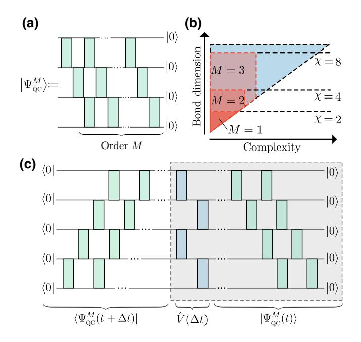

FIG. 1. (a) We parameterize an order-M variational ansatz with M layers of gates. (b) We show the region of the Hilbert space accessible by our ansatz, which corresponds to states with high entanglement but (by definition) low complexity. Each circuit order spans a submanifold of a larger MPS manifold with bond dimension  $\chi$ . (c) To perform time evolution, we prepare a state  $|\Psi^M_{QC}(t)\rangle$ , then apply a Trotterized time evolution to obtain  $|\Psi^M_{QC}(t+\Delta t)\rangle$ . By variationally optimizing each of the gates, we find an optimal representation of the time-evolved state within the submanifold defined by our variational ansatz.

algorithms we present in this work are independent of the choice of ansatz, though different ansatz may describe different classes of states. For instance, in contrast to the more commonly studied brickwall (checkerboard) circuit structure [20,21], the sequential ansatz can have correlations over arbitrary length scales even at the lowest order M. This means that an order M=1 sequential ansatz can represent states like a GHZ state, which is not possible for a brickwall (checkerboard) type of circuit with the same number of gates. For this reason, we study the sequential ansatz. For the definition and comparison with the brickwall circuit ansatz, see Appendix A.

We note that the states defined by these quantum circuits form a submanifold of matrix-product states with bond dimension  $\chi=2^M$ . In the case of M=1, the quantum circuit is exactly equivalent to an MPS of bond dimension  $\chi=2$  (see Appendix B). However, for M>1, these quantum circuits have exponentially fewer parameters than a generic matrix-product state in canonical form with bond dimension  $2^M$ . In other words, these quantum circuits describe states with high entanglement but low complexity, which—as we demonstrate below—encompass time-evolved states. Note that this reduction of parameters does not necessarily translate into a sparse representation when

converted into MPS form. Furthermore, although we still store the parameters of our circuit classically, if we were to process the state classically (such as in the computation of an observable), this would still scale exponentially with the entanglement in the state.

To test this class of quantum circuit ansatz, we first consider far-from-equilibrium dynamics of a global quantum quench. Crucially, such dynamics is typically accompanied by fast ballistic growth of entanglement, which puts midto-long time dynamics out of reach for numerics beyond small systems. Concretely, we consider dynamics under the Hamiltonian

$$\hat{H} = -J \left[ \sum_{j=1}^{N-1} \hat{\sigma}_{j}^{x} \hat{\sigma}_{j+1}^{x} + \sum_{j=1}^{N} g \hat{\sigma}_{j}^{z} + \sum_{j=1}^{N} h \hat{\sigma}_{j}^{x} \right], \quad (1)$$

which is a quantum Ising spin chain on N sites with both transverse (g) and longitudinal (h) fields. For the special case h=0, the model is integrable. We consider a global quantum quench protocol with polarized initial state  $|\Psi\rangle = |\cdots\uparrow\uparrow\uparrow\cdots\rangle$  at time t=0. Our goal is then to accurately approximate the state  $|\Psi(t)\rangle = e^{-i\hat{H}t}|\Psi\rangle$ , at (real or imaginary) time t after the quantum quench.

#### A. Efficient representation of quantum states

We now demonstrate the representation power of the quantum circuit ansatz by comparing it with classical numerics using MPS. We first perform the time evolution using fourth-order Trotterized TEBD [3] for N=31 with maximum bond dimension  $\chi=1024$  and step size  $\tau=0.01$  to obtain quasiexact approximation of the state

 $|\Psi(t)\rangle$ . This bond dimension ensures that our results are close to exact for all considered time scales. We then take the MPS at a selection of times, which we denote  $|\Psi_{\text{MPS}}(t)\rangle$ , and find the optimal quantum circuit of order M, which we denote  $|\Psi_{\text{QC}}^{M}(t)\rangle$ . The state represented by the quantum circuit is implicitly parameterized by a set of two-qubit unitaries  $\{U_i(t)\}$ . We perform an optimization over the unitaries in our quantum circuit to find the state with maximum fidelity

$$\mathcal{F} = |\langle \Psi_{\text{OC}}^{M}(t) | \Psi_{\text{MPS}}(t) \rangle|^{2}. \tag{2}$$

This is done by iteratively by updating each  $U_i(t)$  using a polar decomposition [22] (see Appendix C for more details).

In Fig. 2 we show the fidelity of the quantum state obtained from the quantum circuit ansatz as well as the half-chain von Neumann entanglement entropy, S. Data is shown for a range of values of the longitudinal field h = 0, 0.1, 0.5, 0.9045. The parameters g = 1.4, h = 0.9045 are chosen such that the dynamics of the system are expected to be chaotic and hard to simulate due to fast scrambling [23,24]. The accuracy of the approximation decreases with time as correlations build throughout the system, but improves as the order M is increased. For a given order M, this data also shows that the circuit more accurately captures the state for weaker h, indicating an increase in the complexity of the simulation for larger h.

Figure 2 also shows the growth of entanglement. We find that the ansatz easily captures the rapid ballistic growth of entanglement for small h. As we increase h, we find that the growth of entanglement slows down. This indicates that

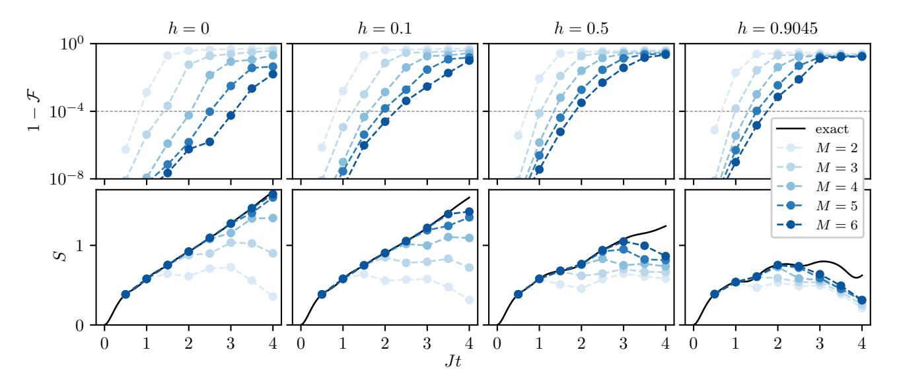

FIG. 2. Quantum circuit representation of order M of quantum states generated under nonequilibrium dynamics. The Hamiltonian is given in Eq. (1) for a chain of length N=31 with transverse field g=1.4 and data shown for h=0,0.1,0.5,0.9045. Top row shows the fidelity  $\mathcal{F}$  defined in Eq. (2), compared with MPS with bond dimension  $\chi=1024$ . The bottom row shows the half chain von Neumann entanglement entropy S for the quantum circuit.

the practical complexity of the quantum states increases with h whereas the growth of entanglement decreases, thus partially closing the still exponentially large complexity window.

From this data we can compare the number of parameters required to achieve a given accuracy using our quantum circuits with those needed for an MPS. For a given order M we find the time  $t^*$  up to which the fidelity is greater than  $\mathcal{F} = 1 - 10^{-4}$ , indicated by the gray dashed line in Fig. 2. In Fig. 3, we plot the number of parameters in the quantum circuits and the MPS as a function of the reachable time  $t^*$ . This figure shows that the number of parameters in our quantum circuit ansatz scales linearly with the reachable time  $t^*$ , in stark contrast to the exponential growth in parameters for the MPS. Note that the circuit depth of a fully Trotterized time evolution also scales linearly with time [25,26] and has for sufficiently small time steps an error for local observables that is independent of system size as well as simulation time [27]. However, we find that the compressed circuit generally performs better while the quantitative improvement over

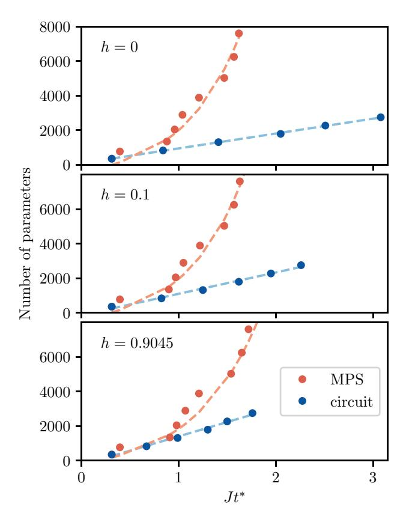

FIG. 3. Comparison of the number of parameters and the accessible time  $t^*$ . This time  $t^*$  corresponds to the time at which the fidelity  $\mathcal{F}$  drops below  $1-10^{-4}$ . Data shown for MPS and our quantum circuit ansatz for three values of the longitudinal field h. The dashed lines correspond to exponential (MPS) and linear (circuit) fits, respectively. See Appendix F for more details.

the fully Trotterized time evolution depends on the model parameters—this reduction of circuit depth is particularly valuable for current NISQ devices on which Trotterized time evolution is very challenging [12].

We stress that the linear scaling of the number of parameters persists across the different values of h. The additional complexity for large values of h appears as a change in the gradient of the linear scaling. These results demonstrate that the complexity of the quantum state grows linearly in time, while the MPS ansatz requires a number of parameters that grow exponentially in time due to the linear growth of entanglement. For all values of h we can see that the quantum circuit has an exponential advantage over MPS in terms of the number of parameters required. Even for short times of  $\mathcal{O}(1)$  in the coupling J, we require fewer parameters to accurately represent the state with a quantum circuit than with an MPS.

## III. VARIATIONAL TIME-EVOLUTION ALGORITHM

Having confirmed the representation power of our ansatz, we now demonstrate how to implement time evolution restricted to the states defined by our ansatz. This, in turn, demonstrates that the optimization of the quantum circuit can be performed on a quantum device using hybrid quantum-optimization algorithms. This potentially enables the simulation of dynamics beyond the reach of classical numerical methods, which are limited by the cost of storing the quantum state.

Our algorithm for time evolution is shown schematically in Fig. 1(c). Given the quantum circuit at time t, we apply a second-order Trotterized approximation  $\hat{V}(\Delta t) = e^{-i\hat{H}_{\text{even}}\Delta t/2} e^{-i\hat{H}_{\text{odd}}\Delta t} e^{-i\hat{H}_{\text{even}}\Delta t/2}$  to the time evolution operator  $e^{-i\hat{H}\Delta t}$ . We then find the state  $|\Psi_{\text{QC}}^M(t+\Delta t)\rangle$  that maximizes fidelity

$$\mathcal{F} = |\langle \Psi_{\text{QC}}^{M}(t + \Delta t) | \hat{V}(\Delta t) | \Psi_{\text{QC}}^{M}(t) \rangle|^{2}.$$
 (3)

That is, we iteratively optimize over the set of two-site unitary gates  $\{U_i(t+\Delta t)\}$  that define the state  $|\Psi_{\rm QC}^M(t+\Delta t)\rangle$ . To carry out the optimization as a hybrid quantum-classical algorithm, one measures the fidelity on quantum devices and performs the optimization classically. The fidelity or overlap can be measured by the setup as in Fig. 1(c) or by the swap test [28,29]. The optimizations for fidelity or overlap find direct application in targeting excited states and have been realized on quantum devices in recent works [30,31]. Moreover, we expect the recent advance in new approaches for overlap measurement [32–34] and in optimization algorithms [35–40] could be applied effectively for our algorithm. We leave this for future work. In this work, we simulate the algorithm classically and perform the optimization similarly to that in the previous

section, where we update each  $U_i$  iteratively using a polar decomposition.

#### A. Real-time evolution

In Fig. 4 we show the local magnetization and the half-chain entanglement entropy simulated using our quantum time-evolution algorithm. We consider the same quantum quench protocol as above with h = 0.1. Importantly, this case is nonintegrable and has a fast linear growth of entanglement under the nonequilibrium dynamics.

Our results show that we are able to accurately capture the magnetization for times that scale linearly with the order M. Here it is important to note that the time evolution is performed entirely within the submanifold of circuits defined by our ansatz with a fixed order. We additionally find that we are able to capture the linear growth of entanglement using these quantum circuits and that the saturation of the entanglement depends linearly on the order M. In contrast, the corresponding MPS representation has an exponentially large bond dimension requiring  $\mathcal{O}(2^M)$  parameters.

We emphasize that this time evolution algorithm is different from the time-dependent variational principle (TDVP) algorithm simulating time evolution with a quantum circuit proposed in Refs. [13,14]. In those approaches, one solves the TDVP equations approximately by stochastic sampling, i.e., measurement, and performs finite time

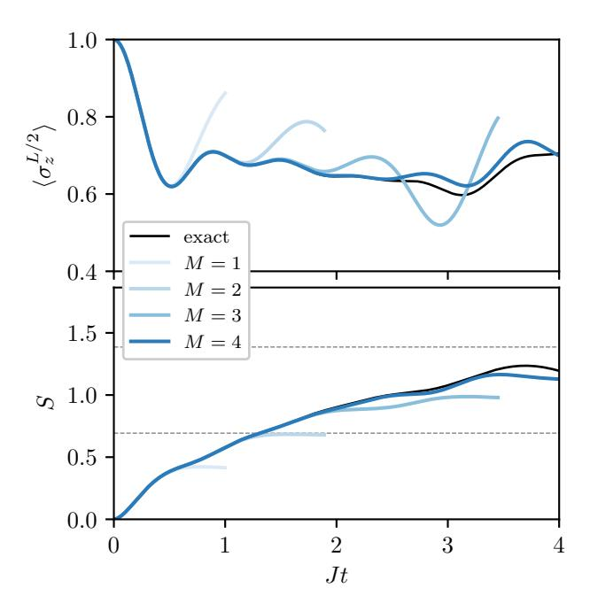

FIG. 4. Time evolution algorithm restricted to the quantum circuit ansatz for different orders M. We use g=1.4 and h=0.1, with N=11 sites. In the top panel we show the magnetization on the central sites, and in the bottom panel we show the half-chain von Neumann entanglement entropy S. See Appendix  $\mathbb C$  for more details.

stepping by numerical integration [41]. In the present algorithm, we first perform finite time stepping by Trotterization, and then try to find the optimal states within the submanifold defined by our ansatz. This is much closer to the time-dependent Density Matrix Renormalization Group [42,43] or TEBD [44,45] algorithms, but also has similarities with the imaginary time-dependent variational principle inspired algorithm proposed in Ref. [46]. This optimization algorithm for the time evolution is similar to the one used for the multiscale entanglement renormalization ansatz (MERA) [47], and in the context of the symmetry-preserving ansatz [48].

The problem of efficiently optimizing a variational ansatz is one that is common to many current hybrid quantum-classical algorithms [49,50]. The primary requirement to implement our algorithm is the capability to evaluate fidelities, at which point one can classically optimize the unitaries. This general scheme has been applied in various other cases—for example, in variational quantum eigensolvers [49], where the cost function being optimized is the expectation value of a Hamiltonian [49]. In this paper, we perform the optimization classically to avoid problems such as barren plateaux [51]. However, as previous studies have demonstrated the capability to compute fidelities [28,29], this algorithm can be directly implemented as a hybrid quantum-classical algorithm.

### B. Imaginary-time evolution

We can also apply this time evolution algorithm to find ground states using imaginary-time evolution. In this section, we first explicitly show how one can embed the required nonunitary operators in unitary gates using an ancilla qubit and postselection [52]. Second, we demonstrate that our ansatz can effectively converge to the ground state under imaginary-time evolution.

One can formally write down the exact imaginary-time evolution procedure  $|\mathrm{GS}\rangle = \lim_{\tau \to \infty} e^{-\hat{H}\tau} |\psi_0\rangle$ , where  $\tau$  is real. This is equivalent to evolving in imaginary time  $(t \to -i\tau)$  and corresponds to acting on the state with a nonunitary operator, which becomes a projector onto the ground state in the limit  $\tau \to \infty$ . We perform imaginary-time evolution analogously to our real-time evolution algorithm, where we sequentially compress the state back onto our ansatz as in Eq. (3) but now with  $\hat{V}(\Delta\tau) = e^{-\hat{H}\Delta\tau}$ . Similarly to real-time evolution,  $\hat{V}(\Delta\tau)$  can be approximated by a product of two-qubit nonunitary gates using Trotterization.

To perform imaginary-time evolution, we are therefore required to implement nonunitary gates on the quantum computer. We achieve this by embedding the nonunitary gate in a unitary gate acting on one extra ancilla qubit. For a generic nonunitary operator A acting on N qubits, we

define a unitary (N + 1)-unitary  $V_A$  by

$$V_A = \begin{pmatrix} sA & B \\ C & D \end{pmatrix}. \tag{4}$$

The strategy we employ is to find a block C and a scaling factor s that ensures the first  $2^N$  columns of  $V_A$  are mutually orthonormal, which guarantees unitarity. The remaining columns can be fixed using a QR decomposition. We explicitly show the full embedding procedure in Appendix D. Note that if we were to implement a full Trotter step for each optimization step, as we did previously for realtime evolution, we would require a linear number of ancilla qubits resulting in an exponential cost due to postselection. Instead, one should apply and optimize the state for each two-qubit gate in the Trotterized time evolution separately. In this case, the total number of measurements required across all Trotterized gates in a single time step scales only linearly with system size. Furthermore, the successful rate of postselection is controlled by the step size  $\Delta \tau$ . In the small  $\Delta \tau$  limit, the failure rate is linear in  $\Delta \tau$ . This suggests the imaginary-time evolution has complexity scaling linearly in both the system size and also the imaginary time evolved. See Appendix E.

To benchmark how well our ansatz can approximate the true ground state, we directly minimize the energy

$$E = \langle \Psi_{\text{OC}}^{M} | \hat{H} | \Psi_{\text{OC}}^{M} \rangle. \tag{5}$$

This procedure is similar to a variational quantum eigensolver (VQE) [49], where the parameters encoding the quantum state are iteratively adjusted to minimize the energy. We perform the procedure on a classical computer where it is intended to benchmark our imaginary-time evolution algorithm, where we consider the energy in Eq. (5) to be the best achievable by our chosen ansatz, shown as dashed lines in Fig. 5. Instead of using gradient-descent methods, we iteratively replace the unitaries using polar decomposition, see Appendix C.

In Fig. 5, we show the results of our imaginary-time evolution. These show that we can successfully converge to the optimal energy attainable with this ansatz. As expected, the results for M=1 match those from DMRG with bond dimension  $\chi=2$  due to the equivalence between the circuit and MPS representation. Note that while a modest MPS bond dimension  $\chi=4$  performs better than our ansatz for M=2,3, we still achieve errors well below the threshold of current NISQ hardware, which validates this approach as a method for finding ground states on a quantum device.

We note that an alternative approach to imaginary-time evolution was taken in the Quantum Imaginary Time Evolution algorithm [53–55]. There it was noted that if enough information about the initial state is known, a nonunitary gate can be replaced by a unitary one without the use of

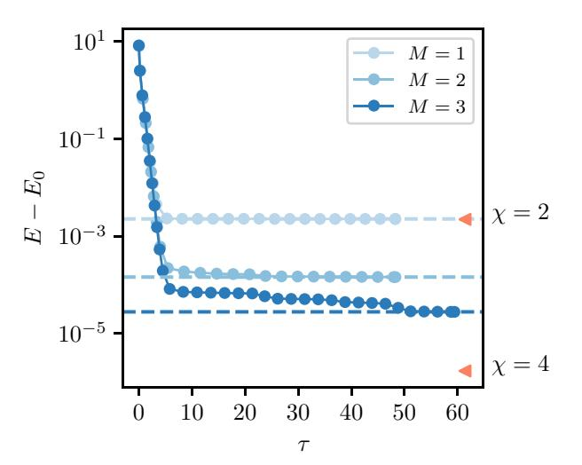

FIG. 5. We perform imaginary-time evolution for circuits of order M=1,2,3 for the quantum Ising model with  $N=31,g=1.2,\ h=0.1$ . To find the optimal performance of our ansatz, we perform a procedure similar to VQE, where we iteratively optimize the expectation value of the Hamiltonian in Eq. (1) for our ansatz. For these depths, our imaginary-time evolution algorithm successfully converges to the optimal point, depicted by the dashed lines. The  $\chi=4$  line indicates the ground-state energy of an MPS with bond dimension 4 found using DMRG. To achieve a better accuracy we successively decrease the time step  $\Delta \tau$  after achieving convergence for the previous step size.

ancillas. However, to get closer to the ground state requires state-dependent unitary operators with increasingly large support. In contrast, our algorithm requires a fixed set of local gates that can be repeatedly applied to reach later times, much like the TEBD algorithm for MPS [44]. While the approximation step is stochastic on a quantum computer, the overall procedure deterministically converges to the ground state. The choice of ansatz is also completely flexible. Viewing the procedure as a sequential compression in this way raises an interesting comparison with the compression of a tensor network to form a MERA and the emerging view of learning with tensor networks as a procedure of compression [56,57].

### C. Simulation on QPU

While our algorithms are designed for near-term quantum computers, the noise and coherence times of currently available devices place strong limits on what can be achieved. However, we are able to demonstrate parts of the algorithm on a quantum computer by delegating more of the algorithm to the classical computer. Here we classically optimize the time-evolved states  $|\Psi^{M}_{QC}(t)\rangle$ , then construct and measure the corresponding state on a QPU, namely the five-qubit IBM-Q device codenamed Bogota [58,59]. This process allows us to access times on the QPU that are inaccessible using standard Trotterized evolution techniques.

Concretely, we consider the following quantum quench setup on N = 5 qubits. We initialize the system in the product state  $|--+++\rangle$ , i.e., a domain wall in the x basis, and evolve with the Hamiltonian (1) with g = 0.25, h = 0.2. For this range of parameters and initial state the dynamics is dominated by the motion of a single mobile domain wall and so can be well approximated by an order M = 1 circuit. The longitudinal field, h, leads to a linearly confining potential between domain walls, and in the case of a single domain wall corresponds to a linear background potential leading to Wannier-Stark localization [60]. In Fig. 6(a), our ED results show the characteristic periodic melting and revival of the domain wall.

In Fig. 6 we show the results of constructing and measuring our compressed quantum state on the IBM QPU compared with ED results. Here we optimize the set of gates  $\{U_i(t)\}$  on a classical computer, which is then fed to the QPU to create the quantum state. The measurement of the magnetization in the x basis closely matches the

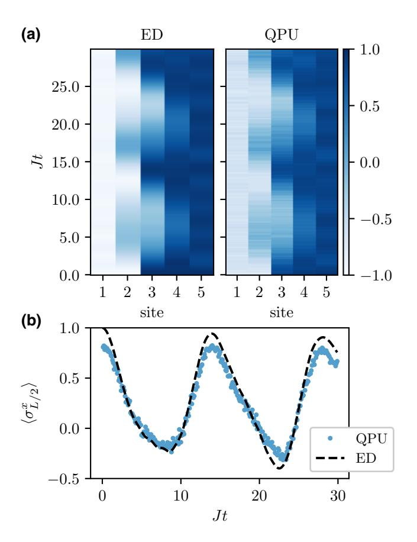

FIG. 6. We show the benchmark result for L=5. Quenched dynamics from a product state with a single domain wall and Hamiltonian parameters g=0.25, h=0.2. (a) The  $\langle \sigma^x \rangle$  expectation values over the full system from ED simulation and measurements on the time-evolved states prepared on QPU. (b) The  $\langle \sigma_{L/2}^x \rangle$  expectation value on the central qubit measured on the QPU and compared with ED. The data displayed is averaged over ten different circuit realizations (see Appendix G).

exact results. In particular, the spatial distribution of the magnetization [Fig. 6(a)] show the periodic spreading and reconstitution of the domain wall. Furthermore, the magnetization on the central spin, shown in Fig. 6(b), accurately and quantitatively matches the ED simulation for long times, which are not limited to the range we have considered. These time scales are currently inaccessible using a naive Trotterized evolution on this quantum device, which would require a circuit depth of  $\mathcal{O}(t)$ .

#### IV. DISCUSSION

In this paper, we show that physically relevant quantum states, namely ground states and those arising under nonequilibrium dynamics, can be efficiently represented using a sequential quantum circuit ansatz. This ansatz describes a "sparse" representation spanning a corner of the larger MPS manifold. For time evolution, the time scales that we can reach scale linearly with the number of parameters in the circuit, representing an exponential advantage over existing classical methods. This suggests that even within the class of MPS defined by a fixed bond dimension, there exist a range of physical states for which our ansatz is a more efficient representation than an MPS. To exploit the representation power, we use a time evolution algorithm for a general quantum circuit ansatz that can be implemented natively on existing quantum computers. Importantly, the quantum circuit ansatz is flexible and is not restricted to the one used in this paper. Using nearterm devices this may provide access to nonequilibrium dynamics beyond the reach of current classical algorithms. Finally, we show that this time evolution algorithm can also be applied in imaginary time to obtain ground states on a quantum computer.

The optimization procedure that we use [22]—fidelity maximization using a polar decomposition—may have other potential applications. For instance, instead of considering the compression of states, one can consider the compression of unitaries. This technique can be applied to approximate a multiqubit unitary by a series of two-qubit unitaries, or to compress a deep quantum circuit. Both of these are particularly important for current NISQ devices.

Our procedure is also a potential practical tool for studying quantum complexity. Quantum state complexity is an intriguing research field, but is difficult to study numerically. Previous results primarily focus on noninteracting systems [61–63]. By using states acquired from procedures such as TEBD and DMRG, and approximating them using a chosen ansatz and polar decomposition methods, one can concretely probe the complexity of generic classes of states (such as quantum scar states and many-body localized states) that were previously difficult to analyze. Additionally, the window between complexity and entanglement is of significant interest. In particular, Ref. [19] uses a random unitary circuit model for time evolution

to demonstrate that even when the growth of entanglement saturates for a finite system, the complexity of the quantum states continues to grow linearly in time over far longer time scales. This highlights a large window between maximally entangled states and maximally complex states. Our work shows that this window appears to shrink for nonintegrable systems (see Fig. 2). The techniques developed in this paper open the opportunity to directly study complexity windows in concrete systems.

The algorithms studied in this work open up several intriguing generalizations. First, one could apply the algorithm to study short time dynamics for higherdimensional systems, which are generally difficult problems for classical numerics. Applied directly on a quantum computer, this algorithm offers a tractable way to study higher-dimensional systems at large system sizes and to probe physics that manifests only at higher dimensions. Moreover, the algorithms considered are agnostic to the specific ansatz used. It is an interesting question to compare how an ansatz with a different entanglement pattern performs. For instance, in Ref. [64] quantum circuits containing entangling gates acting over the full system are considered and optimized to represent time-evolved states by a reinforcement learning approach, which is complementary to our approach. Additionally, quantum circuits inspired by matrix-product states have shown promise for solving nonlinear Schrödinger equations [65,66]. Similar analyses for various ansatz structures could shed light on the deeper relationship between entanglement and complexity.

### **ACKNOWLEDGMENTS**

This work is supported by the European Research Council (ERC) under the European Union's Horizon 2020 research and innovation program (Grant Agreement No. 771537). A.G.G. is supported by the EPSRC. F.P. acknowledges the support of the Deutsche Forschungsgemeinschaft (DFG, German Research Foundation) under Germany's Excellence Strategy EXC-2111-390814868. S.L. and F.P. are supported by the DFG TRR80. We acknowledge the use of IBM Quantum services for this work within the lecture course "Quantum Computing with Superconducting Qubits: architecture and algorithms" by Stefan Filipp at which the QPU results were obtained. The views expressed are those of the authors, and do not reflect the official policy or position of IBM or the IBM Quantum team.

#### APPENDIX A: TYPES OF ANSATZ

Quantum circuits with low depth can have different structures and will by definition represent low complexity quantum states. In Fig. 7, we show two possible ansatz—a sequential circuit and a brickwall (checkerboard) circuit. The brickwall circuit strictly limits the possible

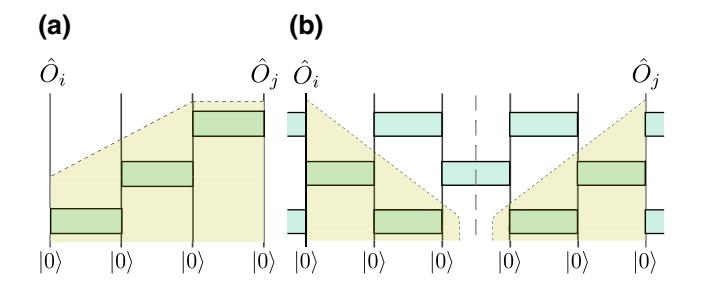

FIG. 7. Consider the correlation for  $\langle \hat{O}_i \hat{O}_j \rangle - \langle \hat{O}_i \rangle \langle \hat{O}_j \rangle$ . (a) The sequential circuit can have nonzero correlation throughout the entirety of the system. (b) The correlation in a brickwall (checkerboard) circuit is 0 if the backward light cones do not cross an input qubit.

correlations because two qubits are only correlated if their reversed light cones coincide. If the light cones do not coincide, the correlations should be zero, i.e.,  $\langle \hat{O}_i \hat{O}_j \rangle = \langle \hat{O}_i \rangle \langle \hat{O}_j \rangle$ . More precisely, each layer of the brickwall circuit is a locality preserving unitary operator that creates only correlations locally. This contrasts with the sequential circuit, which allows correlations between qubits over arbitrary length scales. For this reason, we expect that a different ansatz will capture slightly different states.

Although, sequential circuits could represent states having correlation of arbitrary length scale, e.g. GHZ state, sequential circuits cannot support the long-range decay of generic correlators, but only a special subset.

# APPENDIX B: MATRIX-PRODUCT STATES AS QUANTUM CIRCUITS

In this section, we describe an exact mapping between an MPS of bond dimension  $\chi$  and a sequential quantum circuit with (n+1)-site unitaries, where  $n = \log_2 \chi$ . Given such an exact equivalence, one can approximate (n+1)-site unitaries with two-site unitaries to arbitrary precision. This results in the ansatz we consider in the main text, which corresponds to the "sparse" matrix-product states. More generally speaking, one can always rewrite isometric tensor network states as quantum circuits [67].

An MPS in right canonical form is given as

$$|\psi\rangle = \sum_{\{i_{l}\}} \sum_{\{\alpha_{l}\}} B_{\alpha_{0}\alpha_{1}}^{[1]i_{1}} B_{\alpha_{1}\alpha_{2}}^{[2]i_{2}} \cdots B_{\alpha_{N-1}\alpha_{N}}^{[N]i_{N}} |i_{1}i_{2}i_{3}\cdots i_{N}\rangle,$$
 (B1)

where  $\{i\}$  are indices representing physical degrees of freedom and  $\{\alpha\}$  are virtual indices, which encode entanglement. The rank of the virtual indices correspond to the size of the gates in the quantum circuit representation, as we show below. The right orthogonality condition

$$\sum_{i_{k},\alpha_{k}} B_{\alpha_{k-1}\alpha_{k}}^{[k]i_{k}} \left( B_{\alpha_{k-1}'\alpha_{k}}^{[k]i_{k}} \right)^{*} = \delta_{\alpha_{k-1},\alpha_{k-1}'}$$
 (B2)

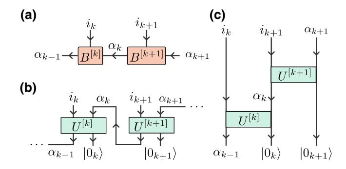

FIG. 8. (a) Two tensors in right orthogonal form. (b) A right orthogonal MPS can be directly mapped to a quantum circuit. (c) The corresponding quantum circuit, where the gates act sequentially from the first to the last qubit.

indicates each individual tensor  $B^{[k]}$  is an isometry mapping from  $|\alpha_{k-1}\rangle \to |\alpha_k, i_k\rangle$ . Any isometry can always be rewritten as a unitary acting on a normalized state  $|0_k\rangle$ , i.e.,

$$B^{[k]} = U^{[k]}|0_k\rangle,$$
 (B3)

$$B_{\alpha_{k-1}\alpha_k}^{[k]i_k} = \langle \alpha_k, i_k | U^{[k]} | 0_k, \alpha_{k-1} \rangle, \tag{B4}$$

where the state  $|0_k\rangle$  would have dimension  $\dim(|0_k\rangle) = \chi_k \times \dim(|i_k\rangle)/\chi_{k-1}$ . We assume  $\dim(|0_k\rangle)$  to be an integer without loss of generality since we can always enlarge the bond dimension to match this condition. One can easily verify the equivalence by substituting Eq. (B4) into Eq. (B2).

Once the connection between the isometries  $B^{[k]}$  and unitaries  $U^{[k]}$  acting on a state  $|0_k\rangle$  is established, we can rewrite the right canonical MPS as a quantum circuit with a set of corresponding gates  $\{U^{[k]}\}$  acting on the initial state  $|0\rangle^{\otimes N}$  (see Fig. 8). As expected, the dimension of the final state is the same as the initial state, because the virtual indices  $\{\alpha\}$  are internally contracted.

For spin-1/2 systems, the physical dimension is d=2 and we have a standard quantum circuit operating with qubits. If the MPS consists of tensors  $B^{[k]}$  with bond dimension  $\chi = \dim(\alpha_{k-1}) = \dim(\alpha_k) = 2^n$ , where  $n \in \mathbb{N}$ , then the corresponding unitaries act on (n+1) qubits. As a result, an MPS with maximum bond dimension  $\chi$  is equivalent to a quantum circuit defined by unitaries acting on maximally  $\log_2 \chi + 1$  sites sequentially. These unitaries can then be further decomposed into a series of sequential 2-site unitaries where the number of required two-site unitaries scales polylogarithmically with respect to the inverse of the desired error.

Moreover, an MPS of bond dimension  $\chi=2$  maps exactly to our circuit ansatz of order 1. Note that this is particular to our ansatz; the commonly studied brickwall circuit structure with two layers, which has the same number of two-site gates, can be mapped to an MPS of bond dimension  $\chi=2$  but cannot represent states having correlations of arbitrary length scales, for example, the

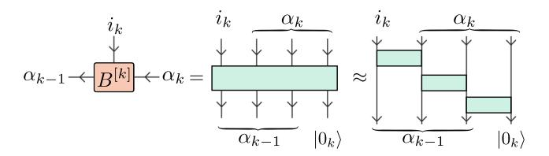

FIG. 9. An MPS tensor can be exactly represented as a unitary over some number of qubits, which can then be approximated as a series of two-qubit gates.

GHZ state. The above connection between matrix-product states and quantum circuits is well known in the community [68–70] and was recently applied in several works [20,46,71–73].

Our order-M circuit ansatz permits a sparse representation of MPS of bond dimension  $2^M$ . The sparsity of the representation comes from replacing the (M+1)-site unitary with a sequence of two-site unitaries. See Fig. 9. Repeating such a replacement, one arrives at a circuit with a pattern as in Fig. 1(a).

## APPENDIX C: CLASSICAL SIMULATION ALGORITHMS FOR QUANTUM CIRCUITS

In this section, we describe two algorithms. The first algorithm maximizes the fidelity between two states defined by a set of unitaries, similar to the known Evenbly-Vidal algorithm [22]. The second algorithm uses the first algorithm to perform time evolution restricted to the space defined by the ansatz under consideration.

To maximize the fidelity  $\mathcal{F} = |\langle \Psi_{\text{target}} | \Psi_{\text{QC}}^M \rangle|^2$ , we iteratively optimize the fidelity with respect to each gate  $U_{i,j}$ , while keeping the remaining gates fixed. Note that the double indices (i,j) refer to order and site, respectively, whereas in the main text we group the indices into a single index.

We first rewrite the overlap between the target state  $|\Psi_{\rm target}\rangle$  and the order-M circuit  $|\Psi_{\rm QC}^M\rangle$  in the following form:

$$\begin{split} & \langle \Psi_{\text{target}} | \Psi_{\text{QC}}^{M} \rangle \\ &= \langle \Psi_{\text{target}} | \prod_{i=1}^{M} \prod_{j=1}^{N-1} U_{i,j} | \Psi_{\text{product state}} \rangle \\ &= \underbrace{\langle \Psi_{\text{target}} | U_{M,N-1} U_{M,N-2} \dots U_{i,j} \dots U_{1,2} U_{1,1} | \Psi_{\text{product state}} \rangle}_{\langle \phi |} \\ &= \langle \phi | U_{i,j} | \psi \rangle \\ &= \text{Tr} \left[ | \psi \rangle \langle \phi | U_{i,j} \right] \\ &= \text{Tr} \left[ E U_{i,j} \right] \end{split}$$

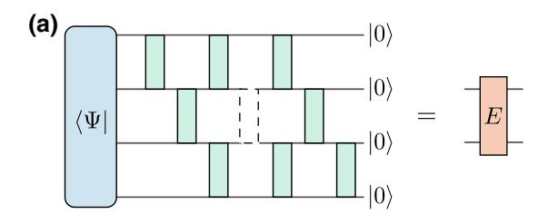

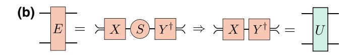

FIG. 10. (a) The environment tensor is constructed by excluding the pertinent unitary from the overall contraction and viewing the resulting tensor network as a four-index tensor. (b) To update  $U_{i,j}$ , we perform a polar decomposition of the environment tensor.

where  $U_{i,j}$  is the unitary to optimize and E is the environment matrix as shown in Fig. 10(a).

The fidelity  $\mathcal{F} = |\langle \Psi_{\text{target}} | \Psi_{\text{QC}}^M \rangle|^2 = \text{Re} \left[ \langle \phi | U_{i,j} | \psi \rangle \right]^2$  is equal to the square of the real part of the overlap. This is because any global phase offset can always be compensated by absorbing a single site rotation into the two-site unitary. The solution to the unitary maximizing  $\text{Re} \left[ \langle \phi | U_{i,j} | \psi \rangle \right]$  is known; for  $E = X \Sigma Y^{\dagger}$ , the optimal  $U_{i,j}$  is given by  $YX^{\dagger}$  as in Fig. 10(b).

To obtain the optimal circuit, we iterate through all of the gates and update each gate with the exact solution of the local optimization problem. Given a maximal iteration number  $N_{\text{iter}}$ , absolute convergence error  $\epsilon_a$ , and relative convergence error  $\epsilon_r$ , the algorithm is described in Algorithm 1.

**Algorithm 1:** Maximizing overlap

```
Input : |\Psi_{\text{target}}\rangle, |\Psi_{\text{QC}}\rangle, N_{\text{iter}}, \epsilon_a, \epsilon_r

Output: A set of \{U_{i,j}\} maximizing \langle \Psi_{\text{target}}|\Psi_{\text{QC}}^M(\{U_{i,j}\})\rangle, \epsilon
\nidx = 0, \epsilon_0 = inf;

while idx < N_{\text{iter}} and \epsilon_{idx} > \epsilon_a and \Delta \epsilon > \epsilon_r do
\nidx = idx + 1;

for ( i = 1; i < M; i = i + 1) {

| for ( j = 1; j < N - 1; j = j + 1) {
| Construct environment matrix E;
| E = X \Sigma Y^{\dagger};
| Update U_{i,j} \leftarrow Y X^{\dagger};
| }
| }
| \epsilon_{\text{idx}} = 1 - \langle \Psi_{\text{target}}|\Psi_{\text{OC}}^M\rangle^2;
```

We use standard tensor network techniques to construct the environment tensor and truncated singular values less

 $\Delta \epsilon = |\epsilon_{\rm idx} - \epsilon_{\rm idx-1}|/|\epsilon_{\rm idx-1}|$ 

end

than  $10^{-14}$ . The algorithm is made significantly less expensive by caching and updating the environments to avoid recomputing the entire environment from scratch during each new iteration. For our computations,  $N_{\text{iter}} = 10^5$ ,  $\epsilon_a = 10^{-12}$ ,  $\epsilon_r = 10^{-4}$ .

We now introduce our second algorithm, which performs time evolution directly on the manifold defined by our ansatz. To time evolve a state  $|\Psi(t)\rangle$ , we maximize the fidelity  $\mathcal{F}=|\langle \Psi(t+\Delta t)|\hat{V}(\Delta t)|\Psi(t)\rangle|^2$ , where our unitaries parameterize  $|\Psi(t+\Delta t)\rangle$  and  $\hat{V}(\Delta t)$  is a single Trotterized time step. In this way, we can iteratively evolve forward in time from an initial state. The overall algorithm for time evolution is given as in Algorithm 2

```
Algorithm 2: Algorithm for Time Evolution
```

```
Input : H, |\Psi^{M}_{\mathrm{Qc}}(0)\rangle, t_{\mathrm{end}}, \Delta t

Output: The set of gates \{U_{i,j}(t_{\mathrm{end}})\} for the state |\Psi^{M}_{\mathrm{QC}}(t_{\mathrm{end}})\rangle, Overall error 1-\mathcal{E}

\mathcal{E}=1.;

for ( t=0; t< t_{\mathrm{end}}; t=t+\Delta t ) \{

(1) Prepare the state |\Psi^{M}_{\mathrm{QC}}(t)\rangle from the set of gates \{U_{i,j}(t)\};

(2) Apply time evolution gates and obtain |\Psi^{M}_{\mathrm{QC}}(t+\Delta t)\rangle;

(3) Find the new set of gates \{U_{i,j}(t+\Delta t)\} best representing the state |\Psi^{M}_{\mathrm{QC}}(t+\Delta t)\rangle by Alg.1;

(4) \mathcal{E}=\mathcal{E}\times\mathcal{F};
```

There are two primary sources of error in our algorithm: the Trotterization error and the projection error. The Trotterization error arises from approximating the true time-evolution operator by a series of two-site gates. This can be made arbitrarily small by decreasing  $\Delta t$  or by taking higher-order Trotter decompositions. The projection error arises from projecting the time-evolved state back onto the manifold of circuits of order M. This error is affected by the chosen ansatz and limits the time to which one can simulate within a given error threshold.

We can estimate the total error by monitoring the fidelity at the end of each optimization  $\prod_i \mathcal{F}_i$ . This total error estimate is accurate as long as the Trotterization error remains

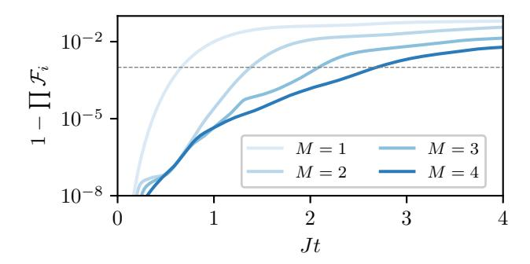

FIG. 11. Approximation error of time evolution algorithm restricted to the quantum circuit ansatz for different M.

small and if  $\mathcal{F}_i$  is close to 1 at each step. As an example, in Fig. 11 we show the error estimates for the simulation performed in Fig. 4. We see that the time when the error crosses the threshold matches the time when  $\langle \sigma_z \rangle$  starts to deviate.

#### APPENDIX D: NONUNITARY GATES

In this section we describe a procedure to embed an arbitrary nonunitary N-qubit operator A in an (N+1)-qubit unitary gate. We consider the first of these (N+1) qubits to be an ancilla qubit that we initialize in the  $|0\rangle$  state and project into the state  $|0\rangle$  by postselection. Our claim is that there exists a unitary of the form

$$U_A = \begin{pmatrix} sA & B \\ C & D \end{pmatrix}, \tag{D1}$$

where  $s^{-2}$  is the maximum eigenvalue of  $A^{\dagger}A$  (or equivalently  $AA^{\dagger}$ ). We note that the matrices  $A^{\dagger}A$  and  $AA^{\dagger}$  have real and non-negative spectra. This follows from a singular value decomposition, i.e.,  $A = U\Sigma V^{\dagger}$  with U, V unitary and  $\Sigma$  non-negative real and diagonal, and so  $A^{\dagger}A = V(\Sigma^2)V^{\dagger}$  and  $AA^{\dagger} = U(\Sigma^2)U^{\dagger}$ . Our goal is to show that for any  $A \neq 0$ , although this case can also be included) we can find the  $2^N \times 2^N$  matrices, B, C, and D such that  $U_A$  is unitary.

Our approach is the following. We first note that  $U_A$  being unitary is equivalent to the statement that the columns of  $U_A$  form an orthonormal basis of  $\mathbb{C}^{2^{N+1}}$ . We then use this to find a block C and a scaling factor s consistent with this, i.e., such that the first  $2^N$  columns of  $U_A$  are orthonormal. Given A, C, and s we can then use a QR decomposition to easily find S and S are explained below.

Let us denote the columns of A and C by  $a_j$  and  $c_j$ , respectively, e.g.,  $[C]_{ij} = [c_j]_i$ . For  $U_A$  to be unitary C and s must satisfy

$$C^{\dagger}C = \mathbb{1} - s^2 A^{\dagger}A, \qquad CC^{\dagger} = \mathbb{1} - s^2 A A^{\dagger}.$$
 (D2)

In terms of the column vectors, these can be written as

$$c_i \times c_j + s^2 a_i \times a_j = \delta_{ij}$$
. (D3)

For i = j this is a statement that the first  $2^N$  columns of  $U_A$  are normalized, and for  $i \neq j$  it is the statement that these columns are mutually orthogonal.

Next we note that if C satisfies Eq. (D2), then we have the singular value decomposition  $C = U\tilde{\Sigma}V^{\dagger}$ , where U and V are the same unitaries as in the SVD of  $A = U\Sigma V^{\dagger}$ . This implies that

$$C^{\dagger}C = V\tilde{\Sigma}^2 V^{\dagger}, \quad CC^{\dagger} = U\tilde{\Sigma}^2 U^{\dagger}.$$
 (D4)

Since both  $\Sigma^2$  and  $\tilde{\Sigma}^2$  must be non-negative, we have only a solution to Eq. (D2) if  $s^{-2}$  is greater than the largest

eigenvalue of  $A^{\dagger}A$  (all of which are non-negative), and so we set  $s^{-2}$  equal to the largest eigenvalue. We therefore have that  $\tilde{\Sigma}^2 = 1 - s^2 \Sigma^2$ , with our choice of s ensuring that  $\tilde{\Sigma}$  is real and non-negative.

Finally, given A and C, we can find the blocks B and D using QR decomposition. Namely, let us construct the matrix

$$\tilde{U}_A = \begin{pmatrix} sA & \tilde{B} \\ C & \tilde{D} \end{pmatrix}, \tag{D5}$$

where  $\tilde{B}$  and  $\tilde{D}$  are random matrices, then by QR decomposition

$$\tilde{U}_A = U_A R,$$
 (D6)

where  $U_A$  is the unitary in Eq. (D2) and R is an upper triangular matrix. Since the first  $2^N$  columns of  $\tilde{U}_A$  are orthonormal they will be untouched by the QR-decomposition algorithm.

## APPENDIX E: COST OF THE IMAGINARY-TIME EVOLUTION

In our imaginary-time evolution algorithm we make use of an ancilla qubit to implement the nonunitary gates. This approach is therefore probabilistic in the sense that there is a probability that the ancilla qubit is measured in the state |1⟩ and the corresponding measurement of the fidelity must be disregarded. It is therefore important to analyze the probability of the failure of the algorithm and how the resources required scale with system size and simulation time.

We are interested in using the imaginary-time evolution algorithm to simulate the evolution with respect to a Hamiltonian  $H = \sum_i h_i$ , where  $h_i$  have a finite nontrivial support. Note that we typically are interested in the case when  $h_i$  are also local since most quantum-computer architectures have a local connectivity structure. If we have long-range connectivity in the quantum computer, or are able to accommodate the linear cost of using swap gates, then the locality can be relaxed so long as the terms act on a finite number of qubits. Note that the circuit depth generically scales exponentially with the nontrivial support of  $h_i$ .

In the Trotterized evolution, the nonunitary gates we wish to implement are of the form  $A=e^{-\Delta \tau h_i}$ . Taking into account the scaling factor s, we wish to embed the matrix  $sA=e^{-\Delta \tau (h_i-E_{i,\min})}$ , where  $E_{i,\min}$  is the smallest eigenvalue of  $h_i$ . The probability P(0) that we measure the ancilla in the state  $|0\rangle$  is dependent on the state of the physical qubits, i.e.,

$$P(0) = \text{Tr}\left[\rho s^2 A^{\dagger} A\right] = \text{Tr}\left[\rho e^{-2\Delta\tau (h_i - E_{i,\text{min}})}\right], \quad (E1)$$

$$P(1) = \operatorname{Tr}\left[\rho(\mathbb{1} - s^2 A^{\dagger} A)\right] = \operatorname{Tr}\left[\rho(\mathbb{1} - e^{-2\Delta\tau(h_i - E_{i,\min})})\right], \tag{E2}$$

where  $\rho = |\psi\rangle\langle\psi|$  is the density matrix of the physical state. However, in the worst case scenario, the probability of success is  $e^{-2\Delta\tau(E_{i,\max}-E_{i,\min})}$ . We can choose to scale the Hamiltonian such that maximum bandwidth of the terms  $h_i$  is 1, that is we scale the total Hamiltonian such that

$$\max_{i} \left( E_{i,\text{max}} - E_{i,\text{min}} \right) = 1. \tag{E3}$$

This scaling of the Hamiltonian can be incorporated into  $\Delta \tau$ . Indeed,  $\Delta \tau$  should be specified relative to the maximum energy density of the Hamiltonian. Given this natural scaling of the Hamiltonian, the worst case probability of success for any of the gates in the Trotterization is  $e^{-2\Delta \tau}$ , which depends only on  $\Delta \tau$  and not on the system size and can be made arbitrarily close to 1.

To measure the fidelity with a certain statistical accuracy we thus need to measure a number of shots proportional to  $e^{2\Delta\tau}$ . Furthermore, at any step, we can determine the statistical accuracy of our observables by counting the number of times the ancilla qubit is in the  $|0\rangle$  state and perform more measurements if necessary without the need

to restart the algorithm. We are able to do this because we optimize and store the state ansatz after applying each of the gates in the Trotter evolution. Therefore, despite the probabilistic nature of the algorithm, the total cost of the simulation scales linearly with system size and with the total simulation time.

### APPENDIX F: DETAILED DATA FOR PARAMETER COUNTING

In this section, we include the data corresponding to parameter counts required to achieve a fixed fidelity as a function of time for matrix-product states [Fig. 12(a)] and quantum circuits [Fig. 12(b)].

We observe that a complex isometric matrix  $W \in \mathbb{C}^{n \times p}$ ,  $n \geq p$ , satisfying the isometric condition  $W^\dagger W = \mathbb{1}$  has  $2np - p^2$  real independent parameters since the isometric condition imposes  $p^2$  independent real-valued constraints. To count the number of parameters for an MPS, we first put the MPS into canonical form and then sum up the number of parameters in each isometric tensor.

When counting the number of parameters of an order-M ansatz, because the circuit starts from a fixed initial state ( $|000\cdots00\rangle$ ), there are redundant degrees of freedom. If we consider a gate acting on a fixed qubit in matrix form,

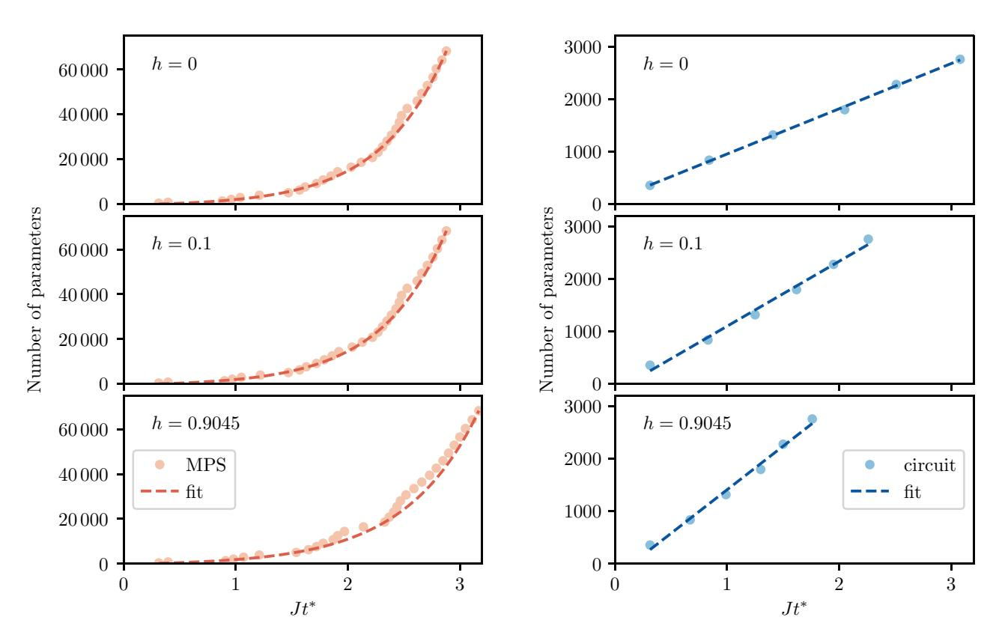

FIG. 12. (a) We fit the MPS data with  $f(Jt^*) = ae^{bJt^*} + c$  and obtain the (a)–(c) parameters for h = 0, (540, 1.69, -910), h = 0.1, (506, 1.71, -836), and h = 0.9045, (559, 1.52, -711), respectively. Note that we fit only the data points with bond dimension being power of 2, i.e.,  $\chi = 2^n$ ,  $n \in \mathbb{Z}^+$ . (b) We fit the quantum-circuit data with  $f(Jt^*) = a \times (Jt^*) + b$  and obtain (a),(b) parameters for each case, h = 0, (861, 91), h = 0.1, (1236, -138), and h = 0.9045, (1659, -251), respectively.

the columns that do not correspond to the fixed qubit are irrelevant. The very first gate in the first layer, which acts on two fixed qubits, will have  $2d^2 - 1 = 7$  parameters. All the other gates in the first layer act only on one fixed qubit, and thus have  $2d^3 - d^2 = 12$  parameters. The gates in all other layers have  $2^4 = 16$  parameters.

Proceeding with this counting, the number of parameters of a bond dimension  $\chi=2$  MPS matches our order M=1 ansatz, while a two-layer brickwall quantum circuit has fewer parameters. This confirms the result in Appendix B.

## APPENDIX G: RANDOMIZED CIRCUITS FOR OPU MEASUREMENT

The quantum circuit considered in this paper is described by a series of two-site gates  $\{U_i\}$ . When the quantum circuit is implemented on a QPU, the two-site gates are decomposed into a series of finitely many gates selected from some universal gate set. A small perturbation of a two-site gate may lead to a large perturbation in the decomposition. These differences translate into large fluctuations in the measured observables due to the imperfections in the QPU.

To compensate for this problem, we average over the gauge freedom in a quantum circuit. Given the two-site gates  $\{U_i\}$  describing the quantum states, there are gauge degrees of freedom to insert identities described by random unitaries and their complex conjugates. For example, if  $U_iU_{i+1}$  act consecutively on the same qubit, we can insert the random single-site unitary V and its complex conjugate as

$$U_{i+1}U_i = U_{i+1}V^{\dagger}VU_i = W_{i+1}W_i$$
 (G1)

and obtain the two-site gates  $W_{i+1}W_i$  describing the same operation. To average over the gauge degrees of freedom, we average measurement outcomes corresponding to circuits differing by the insertion of random unitaries and their conjugates. This procedure mitigates the previously mentioned error to a certain extent.

- [1] Anders W. Sandvik: in *AIP Conference Proceedings* (American Institute of Physics, 2010), Vol. 1297, p. 135.
- [2] Steven R. White, Density Matrix Formulation for Quantum Renormalization Groups, Phys. Rev. Lett. **69**, 2863 (1992).
- [3] Ulrich Schollwöck, The density-matrix renormalization group in the age of matrix product states, Ann. Phys. **326**, 96 (2011).
- [4] Giuseppe Carleo and Matthias Troyer, Solving the quantum many-body problem with artificial neural networks, Science 355, 602 (2017).
- [5] Nathan Wiebe, Dominic W. Berry, Peter Høyer, and Barry C. Sanders, Simulating quantum dynamics on a quantum computer, J. Phys. A: Math. Theor. 44, 445308 (2011).
- [6] Richard P. Feynman, Simulating physics with computers, Int. J. Theor. Phys. 21, 467 (1982).

- [7] Frank Arute, Kunal Arya, Ryan Babbush, Dave Bacon, Joseph C. Bardin, Rami Barends, Rupak Biswas, Sergio Boixo, Fernando G. S. L. Brandao, David A. Buell, *et al.*, Quantum supremacy using a programmable superconducting processor, Nature **574**, 505 (2019).
- [8] Yiqing Zhou, E. Miles Stoudenmire, and Xavier Waintal, What Limits the Simulation of Quantum Computers? Phys. Rev. X 10, 041038 (2020).
- [9] Daniel Stilck Franca and Raul Garcia-Patron, Limitations of optimization algorithms on noisy quantum devices, arXiv:2009.05532 (2020).
- [10] Esteban A. Martinez, Christine A. Muschik, Philipp Schindler, Daniel Nigg, Alexander Erhard, Markus Heyl, Philipp Hauke, Marcello Dalmonte, Thomas Monz, Peter Zoller, et al., Real-time dynamics of lattice gauge theories with a few-qubit quantum computer, Nature 534, 516 (2016).
- [11] Henry Lamm and Scott Lawrence, Simulation of Nonequilibrium Dynamics on a Quantum Computer, Phys. Rev. Lett. 121, 170501 (2018).
- [12] Adam Smith, M. S. Kim, Frank Pollmann, and Johannes Knolle, Simulating quantum many-body dynamics on a current digital quantum computer, npj Quantum Inf. 5, 106 (2019).
- [13] Ying Li and Simon C. Benjamin, Efficient Variational Quantum Simulator Incorporating Active Error Minimization, Phys. Rev. X 7, 021050 (2017).
- [14] Sam McArdle, Tyson Jones, Suguru Endo, Ying Li, Simon C. Benjamin, and Xiao Yuan, Variational ansatz-based quantum simulation of imaginary time evolution, npj Quantum Inf. 5, 1 (2019).
- [15] Xiaosi Xu, Jinzhao Sun, Suguru Endo, Ying Li, Simon C. Benjamin, and Xiao Yuan, Variational algorithms for linear algebra, arXiv:1909.03898 (2019).
- [16] Marcello Benedetti, Mattia Fiorentini, and Michael Lubasch, Hardware-efficient variational quantum algorithms for time evolution, arXiv:2009.12361 (2020).
- [17] There are several measures for quantum-state complexity. Broadly, the quantum complexity of a state  $|\Psi\rangle$  is viewed as the minimum size of a quantum circuit over some universal gate set required to map a state  $|0\rangle^{\otimes m}$  to  $|\tilde{\Psi}\rangle$  within some error  $\epsilon$  of  $|\Psi\rangle$ .
- [18] David Poulin, Angie Qarry, Rolando Somma, and Frank Verstraete, Quantum Simulation of Time-Dependent Hamiltonians and the Convenient Illusion of Hilbert Space, Phys. Rev. Lett. 106, 170501 (2011).
- [19] Fernando G. S. L. Brandão, Wissam Chemissany, Nicholas Hunter-Jones, Richard Kueng, and John Preskill, Models of quantum complexity growth, arXiv:1912.04297 (2019).
- [20] Sarang Gopalakrishnan and Austen Lamacraft, Unitary circuits of finite depth and infinite width from quantum channels, Phys. Rev. B **100**, 064309 (2019).
- [21] A. V. Uvarov, A. S. Kardashin, and J. D. Biamonte, Machine learning phase transitions with a quantum processor, Phys. Rev. A **102**, 012415 (2020).
- [22] Glen Evenbly and Guifré Vidal, Algorithms for entanglement renormalization, Phys. Rev. B **79**, 144108 (2009).
- [23] J. Karthik, Auditya Sharma, and Arul Lakshminarayan, Entanglement, avoided crossings, and quantum chaos in an ising model with a tilted magnetic field, Phys. Rev. A 75, 022304 (2007).

- [24] Hyungwon Kim and David A. Huse, Ballistic Spreading of Entanglement in a Diffusive Nonintegrable System, Phys. Rev. Lett. 111, 127205 (2013).
- [25] Jeongwan Haah, Matthew Hastings, Robin Kothari, and Guang Hao Low, in 2018 IEEE 59th Annual Symposium on Foundations of Computer Science (FOCS) (IEEE, Paris, France, 2018), p. 350.
- [26] Andrew M. Childs and Yuan Su, Nearly Optimal Lattice Simulation by Product Formulas, Phys. Rev. Lett. 123, 050503 (2019).
- [27] Markus Heyl, Philipp Hauke, and Peter Zoller, Quantum localization bounds trotter errors in digital quantum simulation, Sci. Adv. 5, eaau8342 (2019).
- [28] Harry Buhrman, Richard Cleve, John Watrous, and Ronald de Wolf, Quantum Fingerprinting, Phys. Rev. Lett. 87, 167902 (2001).
- [29] Daniel Gottesman and Isaac Chuang, Quantum digital signatures, quant-ph/0105032 (2001).
- [30] Oscar Higgott, Daochen Wang, and Stephen Brierley, Variational quantum computation of excited states, Quantum 3, 156 (2019).
- [31] Tyson Jones, Suguru Endo, Sam McArdle, Xiao Yuan, and Simon C. Benjamin, Variational quantum algorithms for discovering hamiltonian spectra, Phys. Rev. A 99, 062304 (2019).
- [32] Lukasz Cincio, Yiğit Subaşı, Andrew T. Sornborger, and Patrick J. Coles, Learning the quantum algorithm for state overlap, New J. Phys. 20, 113022 (2018).
- [33] Marco Cerezo, Alexander Poremba, Lukasz Cincio, and Patrick J. Coles, Variational quantum fidelity estimation, Quantum 4, 248 (2020).
- [34] Marco Fanizza, Matteo Rosati, Michalis Skotiniotis, John Calsamiglia, and Vittorio Giovannetti, Beyond the Swap Test: Optimal Estimation of Quantum State Overlap, Phys. Rev. Lett. 124, 060503 (2020).
- [35] Kosuke Mitarai, Makoto Negoro, Masahiro Kitagawa, and Keisuke Fujii, Quantum circuit learning, Phys. Rev. A 98, 032309 (2018).
- [36] Ryan Sweke, Frederik Wilde, Johannes Meyer, Maria Schuld, Paul K. Fährmann, Barthélémy Meynard-Piganeau, and Jens Eisert, Stochastic gradient descent for hybrid quantum-classical optimization, arXiv:1910.01155 (2019).
- [37] Javier Gil Vidal and Dirk Oliver Theis, Calculus on parameterized quantum circuits, arXiv:1812.06323 (2018).
- [38] Ken M. Nakanishi, Keisuke Fujii, and Synge Todo, Sequential minimal optimization for quantum-classical hybrid algorithms, Phys. Rev. Res. 2, 043158 (2020).
- [39] Robert M. Parrish, Joseph T. Iosue, Asier Ozaeta, and Peter L. McMahon, A Jacobi diagonalization and Anderson acceleration algorithm for variational quantum algorithm parameter optimization, arXiv:1904.03206 (2019).
- [40] Mateusz Ostaszewski, Edward Grant, and Marcello Benedetti, Quantum circuit structure learning, arXiv:1905. 09692 (2019).
- [41] A similar argument applies to equations resulting from the Dirac-Frenkel variational principle and the McLachlan variational principle.
- [42] Steven R. White and Adrian E. Feiguin, Real-Time Evolution Using the Density Matrix Renormalization Group, Phys. Rev. Lett. 93, 076401 (2004).

- [43] Andrew John Daley, Corinna Kollath, Ulrich Scholl-wöck, and Guifré Vidal, Time-dependent density-matrix renormalization-group using adaptive effective hilbert spaces, J. Stat. Mech.: Theory Exp. 2004, P04005 (2004).
- [44] Guifré Vidal, Efficient Classical Simulation of Slightly Entangled Quantum Computations, Phys. Rev. Lett. 91, 147902 (2003).
- [45] Guifré Vidal, Efficient Simulation of One-Dimensional Quantum Many-Body Systems, Phys. Rev. Lett. 93, 040502 (2004).
- [46] Fergus Barratt, James Dborin, Matthias Bal, Vid Stojevic, Frank Pollmann, and Andrew G. Green, Parallel quantum simulation of large systems on small quantum computers, arXiv:2003.12087 (2020).
- [47] Matteo Rizzi, Simone Montangero, and Guifre Vidal, Simulation of time evolution with multiscale entanglement renormalization ansatz, Phys. Rev. A 77, 052328 (2008).
- [48] Matthew Otten, Cristian L. Cortes, and Stephen K. Gray, Noise-resilient quantum dynamics using symmetry-preserving ansatzes, arXiv:1910.06284 [quant-ph] (2019).
- [49] Alberto Peruzzo, Jarrod McClean, Peter Shadbolt, Man-Hong Yung, Xiao-Qi Zhou, Peter J. Love, Alán Aspuru-Guzik, and Jeremy L. O'brien, A variational eigenvalue solver on a photonic quantum processor, Nat. Commun. 5, 4213 (2014).
- [50] Jarrod R. McClean, Jonathan Romero, Ryan Babbush, and Alán Aspuru-Guzik, The theory of variational hybrid quantum-classical algorithms, New J. Phys. 18, 023023 (2016).
- [51] Jarrod R. McClean, Sergio Boixo, Vadim N. Smelyanskiy, Ryan Babbush, and Hartmut Neven, Barren plateaus in quantum neural network training landscapes, Nat. Commun. 9, 1 (2018).
- [52] Norbert Schuch, Michael M. Wolf, Frank Verstraete, and J. Ignacio Cirac, Computational Complexity of Projected Entangled Pair States, Phys. Rev. Lett. **98**, 140506 (2007).
- [53] Mario Motta, Chong Sun, Adrian T. K. Tan, Matthew J. O'Rourke, Erika Ye, Austin J. Minnich, Fernando G. S. L. Brandão, and Garnet Kin-Lic Chan, Determining eigenstates and thermal states on a quantum computer using quantum imaginary time evolution, Nat. Phys. 16, 205 (2020).
- [54] Kübra Yeter-Aydeniz, Raphael C. Pooser, and George Siopsis, Practical quantum computation of chemical and nuclear energy levels using quantum imaginary time evolution and lanczos algorithms, npj Quantum Inf. 6, 1 (2020).
- [55] Kok Chuan Tan, Fast quantum imaginary time evolution, arXiv:2009.12239 (2020).
- [56] Glen Evenbly and Guifre Vidal, Tensor Network Renormalization Yields the Multiscale Entanglement Renormalization Ansatz, Phys. Rev. Lett. **115**, 200401 (2015).
- [57] Edwin Stoudenmire and David J. Schwab, in Advances in Neural Information Processing Systems (Curran Associates, Inc., 2016), p. 4799.
- [58] Gadi Aleksandrowicz *et al.*, Qiskit: An Open-source Framework for Quantum Computing (2019). doi:10.5281/ZENODO.2562110.
- [59] IBM Quantum team. ibmq\_bogota v1.0.0, (2020).
- [60] Gregory H. Wannier, Dynamics of band electrons in electric and magnetic fields, Rev. Mod. Phys. **34**, 645 (1962).

- [61] Katharine Hyatt, James R. Garrison, and Bela Bauer, Extracting Entanglement Geometry from Quantum States, Phys. Rev. Lett. 119, 140502 (2017).
- [62] Fangli Liu, Seth Whitsitt, Jonathan B. Curtis, Rex Lundgren, Paraj Titum, Zhi-Cheng Yang, James R. Garrison, and Alexey V. Gorshkov, Circuit complexity across a topological phase transition, Phys. Rev. Res. 2, 013323 (2020).
- [63] Zijian Xiong, Dao-Xin Yao, and Zhongbo Yan, Nonanalyticity of circuit complexity across topological phase transitions, Phys. Rev. B **101**, 174305 (2020).
- [64] Adrien Bolens and Markus Heyl, Reinforcement learning for digital quantum simulation, arXiv:2006.16269 (2020).
- [65] Michael Lubasch, Pierre Moinier, and Dieter Jaksch, Multigrid renormalization, J. Comput. Phys. **372**, 587 (2018).
- [66] Michael Lubasch, Jaewoo Joo, Pierre Moinier, Martin Kiffner, and Dieter Jaksch, Variational quantum algorithms for nonlinear problems, Phys. Rev. A 101, 010301 (2020).
- [67] Michael P. Zaletel and Frank Pollmann, Isometric Tensor Network States in two Dimensions, Phys. Rev. Lett. **124**, 037201 (2020).

- [68] Christian Schön, Enrique Solano, Frank Verstraete, J. Ignacio Cirac, and Michael M. Wolf, Sequential Generation of Entangled Multiqubit States, Phys. Rev. Lett. 95, 110503 (2005).
- [69] C. Schön, K. Hammerer, Michael M. Wolf, J. Ignacio Cirac, and E. Solano, Sequential generation of matrix-product states in cavity qed, Phys. Rev. A 75, 032311 (2007).
- [70] Mari-Carmen Banuls, David Pérez-García, Michael M. Wolf, Frank Verstraete, and J. Ignacio Cirac, Sequentially generated states for the study of two-dimensional systems, Phys. Rev. A 77, 052306 (2008).
- [71] Adam Smith, Bernhard Jobst, Andrew G. Green, and Frank Pollmann, Crossing a topological phase transition with a quantum computer, arXiv:1910.05351 (2019).
- [72] Shi-Ju Ran, Efficient encoding of matrix product states into quantum circuits of one-and two-qubit gates, arXiv:1908.07958 (2019).
- [73] Zhi-Yuan Wei, Daniel Malz, Alejandro González-Tudela, and J. Ignacio Cirac, Generation of photonic matrix product states with a rydberg-blockaded atomic array, arXiv:2011.03919 (2020).