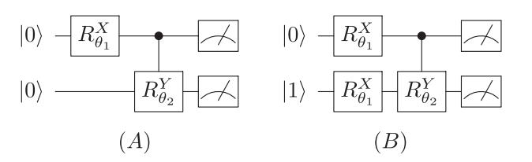
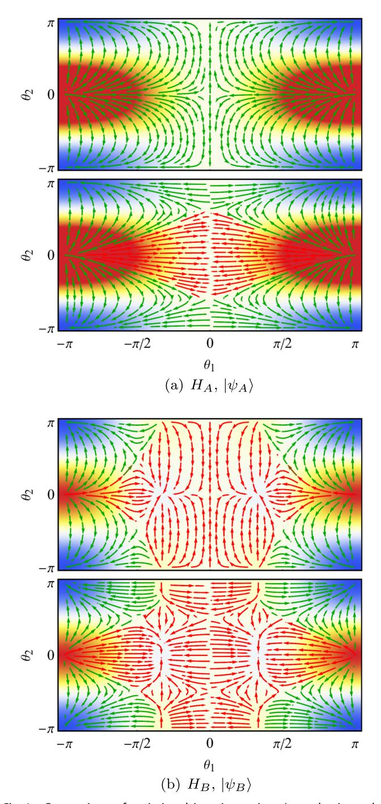
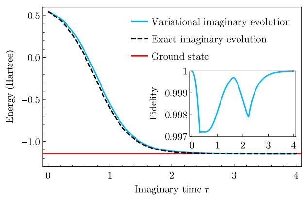
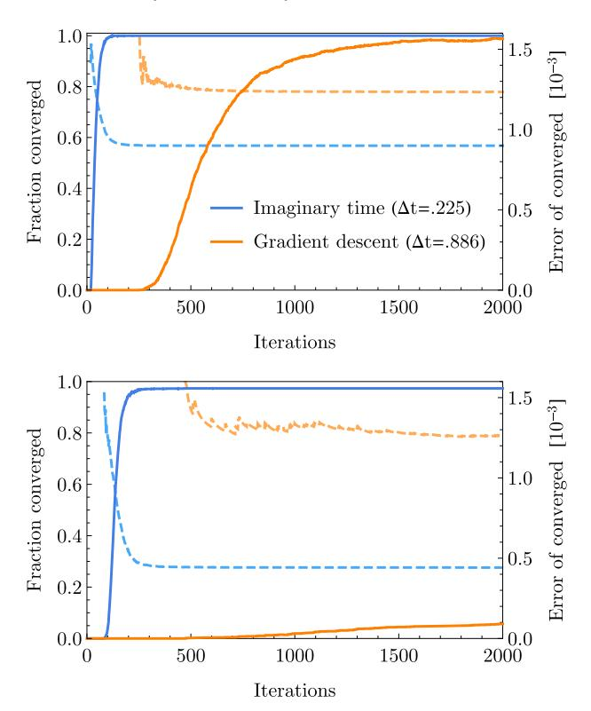
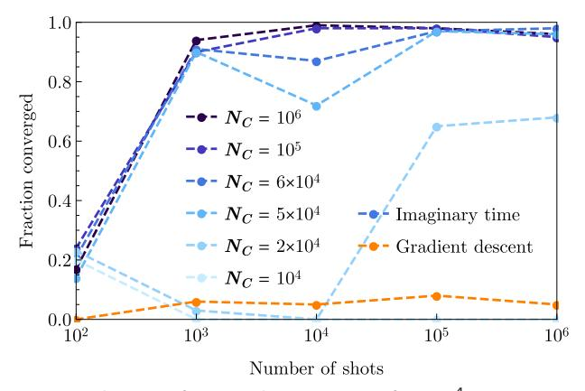

# ARTICLE

# Variational ansatz-based quantum simulation of imaginary time evolution

Sam McArdle1, Tyson Jones1, Suguru Endo1, Ying Li2, Simon C. Benjamin 60 and Xiao Yuan 60

Imaginary time evolution is a powerful tool for studying quantum systems. While it is possible to simulate with a classical computer, the time and memory requirements generally scale exponentially with the system size. Conversely, quantum computers can efficiently simulate quantum systems, but not non-unitary imaginary time evolution. We propose a variational algorithm for simulating imaginary time evolution on a hybrid quantum computer. We use this algorithm to find the ground-state energy of many-particle systems; specifically molecular hydrogen and lithium hydride, finding the ground state with high probability. Our method can also be applied to general optimisation problems and quantum machine learning. As our algorithm is hybrid, suitable for error mitigation and can exploit shallow quantum circuits, it can be implemented with current quantum computers.

npj Quantum Information (2019)5:75; https://doi.org/10.1038/s41534-019-0187-2

### INTRODUCTION

Imaginary time is an unphysical, yet powerful, mathematical concept. It has been utilised in numerous physical domains, including quantum mechanics, statistical mechanics and cosmology. Often referred to as performing a 'Wick rotation', replacing real time with imaginary time connects Euclidean and Minkowski space,2 quantum and statistical mechanics3 and static problems to problems of dynamics.4 In quantum mechanics, propagating a wavefunction in imaginary time enables: the study of finite temperature properties, 5-7 finding the ground-state wavefunction and energy (such as in density matrix renormalisation group),8–11 and simulating real-time dynamics (such as time-dependent Hartree). 12,13 For a system with Hamiltonian, H, evolving in real time, t, the propagator is given by  $e^{-iHt}$ . The corresponding propagator in imaginary time,  $\tau = it$ , is given by  $e^{-H\tau}$ ; a non-unitary operator.

Using a classical computer, we can simulate imaginary time evolution by evaluating the propagator and applying it to the system wavefunction. There also exist various related classical methods, such as quantum Monte Carlo 14,15 and density matrix renormalisation group 16,17 for solving different problems. However, because the dimension of the wavefunction grows exponentially with the number of particles, classical simulation of many-body quantum systems is generally hard.18 While efficient variational trial states have been developed for a number of applications, 19 powerful trial wavefunctions typically require classical computational resources which scale exponentially with the system size.

Quantum computing can naturally and efficiently store manybody quantum states, and hence is suitable for simulating quantum systems.20 We can map the system Hamiltonian to a qubit Hamiltonian, and simulate real-time evolution (as described by the Schrödinger equation) by realising the corresponding unitary evolution with a quantum circuit.21 Using Trotterization,2 the real-time propagator can be decomposed into a sequence of single- and two-qubit gates.23 The ability to represent the realtime propagator with a sequence of gates stems from its unitarity. In contrast, because the imaginary time operator is non-unitary, it is not straightforward to decompose it into a sequence of unitary gates using Trotterization, and thus directly realise it with a quantum circuit. As a result, alternative methods are required to implement imaginary time evolution using a quantum computer.

Classically, we can simulate real (imaginary) time evolution of parametrised trial states by repeatedly solving the (Wick rotated) Schrödinger equation over a small timestep, and updating the parameters for the next timestep.8,9,11,24–27 This method has recently been extended to quantum computing, where it was used to simulate real-time dynamics.28 Closely related are the variational quantum eigensolver (VQE)29–35 and the quantum approximate optimisation algorithm (QAOA),36 which update the parameters using a classical optimisation routine, to find the minimum energy eigenvalue of a given Hamiltonian. As 'hybrid quantum-classical methods', these algorithms use a small quantum computer to carry out a classically intractable subroutine, and a classical computer to solve the higher-level problem. The quantum subroutine may only require a small number of qubits and a low-depth circuit, presenting a potential use for noisy intermediate-scale quantum hardware.

In this paper, we propose a method to simulate imaginary time evolution on a quantum computer, using a hybrid quantumclassical variational algorithm. The proposed method thus combines the power of quantum computers to efficiently represent many-body quantum states, with classical computers' ability to simulate arbitrary (including unphysical) processes. We discuss using this method to find the ground-state energy of many-body quantum systems, and to solve optimisation problems. We then numerically test the performance of our algorithm at finding the ground-state energy of both the hydrogen molecule (H2) and lithium hydride (LiH). We compare our results for LiH to those obtained using the VQE with gradient descent. As our

These authors contributed equally: Sam McArdle, Tyson Jones

Published online: 06 September 2019

Received: 10 December 2018 Accepted: 5 August 2019

&lt;sup>1Department of Materials, University of Oxford, Parks Road, Oxford OX1 3PH, UK and 2Graduate School of China Academy of Engineering Physics, Beijing 100193, China Correspondence: Xiao Yuan (xiao.yuan.ph@gmail.com)

algorithm only requires a low-depth circuit, it can be realised with current and near-term quantum processors.

#### **RESULTS**

Variational imaginary time evolution

We focus on many-body systems that are described by Hamiltonians  $H=\sum_i \lambda_i h_i$ , with real coefficients,  $\lambda_i$ , and observables,  $h_i$ , that are tensor products of Pauli matrices. We assume that the number of terms in this Hamiltonian scales polynomially with the system size, which is true for many physical systems, such as molecules or the Fermi-Hubbard model. Given an initial state  $|\psi\rangle$ , the normalised imaginary time evolution is defined by

$$|\psi(\tau)\rangle = A(\tau)e^{-H\tau}|\psi(0)\rangle,\tag{1}$$

where  $A(\tau)=1/\sqrt{\langle \psi(0)|e^{-2H\tau}|\psi(0)\rangle}$  is a normalisation factor. In the instance that the initial state is a maximally mixed state, the state at time  $\tau$  is a thermal or Gibbs state  $\rho_{T=1/\tau}=e^{-H\tau}/\text{Tr}[e^{-H\tau}]$ , with temperature  $T=1/\tau$ . When the initial state has a non-zero overlap with the ground state, the state at  $\tau\to\infty$  is the ground state of H. Equivalently, the Wick rotated Schrödinger equation is,

$$\frac{\partial |\psi(\tau)\rangle}{\partial \tau} = -(H - E_{\tau})|\psi(\tau)\rangle, \tag{2}$$

where the term  $E_{\tau} = \langle \psi(\tau)|H|\psi(\tau)\rangle$  results from enforcing normalisation. Even if  $|\psi(\tau)\rangle$  can be represented by a quantum computer, the non-unitary imaginary time evolution cannot be naively mapped to a quantum circuit.

In our variational method, instead of directly encoding the quantum state  $|\psi(\tau)\rangle$  at time  $\tau,$  we approximate it using a parametrised trial state  $|\phi(\vec{\theta}(\tau))\rangle$ , with  $\vec{\theta}(\tau)=(\theta_1(\tau),\theta_2(\tau),\ldots,\theta_N(\tau)).$  This stems from the intuition that the physically relevant states are contained in a small subspace of the full Hilbert space. The trial state is referred to as the ansatz. In condensed matter physics and computational chemistry, a wide variety of ansätze have been proposed for both classical and quantum variational methods.  $^{11,20,39,40}$ 

Using a quantum circuit, we prepare the trial state,  $|\phi(\vec{\theta})\rangle$ , by applying a sequence of parametrised unitary gates,  $V(\vec{\theta}) = U_N(\theta_N) \dots U_k(\theta_k) \dots U_1(\theta_1)$  to our initial state,  $|\overline{0}\rangle$ . We express this as  $|\phi(\vec{\theta})\rangle = V(\vec{\theta})|\overline{0}\rangle$  and remark that  $V(\vec{\theta})$  is also referred to as the ansatz. We refer to all possible states that could be created by the circuit V as the 'ansatz space'. Here,  $U_k(\theta_k)$  is the  $k^{\text{th}}$  unitary gate, controlled by parameter  $\theta_k$ , and the gate can be regarded as a single- or two-qubit gate.

To simulate the imaginary time evolution of the trial state, we use McLachlan's variational principle, 41,42

$$\delta \|(\partial/\partial \tau + H - E_{\tau})|\psi(\tau)\rangle\| = 0, \tag{3}$$

where  $\|\rho\|=\text{Tr}[\sqrt{\rho\rho^{\dagger}}]$  denotes the trace norm of a state. By replacing  $|\psi(\tau)\rangle$  with  $|\phi(\tau)\rangle=|\phi(\vec{\theta}(\tau))\rangle$ , we effectively project the desired imaginary time evolution onto the manifold of the ansatz space. The evolution of the parameters is obtained from the resulting differential equation

$$\sum_{j} A_{ij} \dot{\theta}_{j} = C_{i}, \tag{4}$$

where

$$A_{ij} = \Re\left(\frac{\partial \langle \phi(\tau)| \frac{\partial |\phi(\tau)\rangle}{\partial \theta_i}}{\partial \theta_i}\right)$$

$$C_i = \Re\left(-\sum_{\alpha} \lambda_{\alpha} \frac{\partial \langle \phi(\tau)|}{\partial \theta_i} h_{\alpha} |\phi(\tau)\rangle\right),$$
(5)

and  $h_a$  and  $\lambda_a$  are the Pauli terms and coefficients of the Hamiltonian, as described above. The derivation of Eq. (4) can be found in the Supplementary Materials. As both  $A_{ii}$  and  $C_i$  are real,

the derivative  $\dot{\theta}_j$  is also real, as required for parametrising a quantum circuit. Interestingly, although the average energy term  $E_{\tau}$  appears in Eq. (2), it does not appear in Eq. (4). This is because the ansatz applied maintains normalisation, as it is composed of unitary operators.

Imaginary time evolution with quantum circuits

By following a similar method to that introduced in ref., 28 we can efficiently measure  $A_{ij}$  and  $C_i$  using a quantum computer. We assume that the derivative of a unitary gate  $U_i(\theta_i)$  can be expressed as  $\partial U_i(\theta_i)/\partial \theta_i = \sum_k f_{k,i} U_i(\theta_i) \sigma_{k,i}$ , with unitary operator  $\sigma_{k,i}$ . The derivative of the trial state is given by  $\partial |\phi(\tau)\rangle/\partial \theta_i = \sum_k f_{k,i} \tilde{V}_{k,i} |\overline{0}\rangle$ , with  $\tilde{V}_{k,i} = U_N(\theta_N) \dots U_{i+1}(\theta_{i+1}) \quad U_i(\theta_i) \sigma_{k,i} \dots U_1(\theta_1)$ . There are typically only one or two terms resulting from each derivative. As an example, when  $U_i(\theta_i)$  is a single-qubit rotation  $R_z(\theta_i) = e^{-i\theta_i\sigma_z/2}$ , the derivative  $\partial U_i(\theta_i)/\partial \theta_i = -i/2 \times \sigma_z e^{-i\theta_i\sigma_z/2}$ . The coefficients  $A_{ij}$  and  $C_i$  are given by

$$A_{ij} = \Re\left(\sum_{k,l} f_{k,l}^* f_{l,j} \langle \overline{0} | \tilde{V}_{k,l}^{\dagger} \tilde{V}_{l,j} | \overline{0} \rangle\right),$$

$$C_i = \Re\left(\sum_{k,a} f_{k,j}^* \lambda_a \langle \overline{0} | \tilde{V}_{k,j}^{\dagger} h_a V | \overline{0} \rangle\right).$$
(6)

All of these terms are of the form  $a\Re\left(e^{i\theta}\langle\overline{0}|U|\overline{0}\rangle\right)$  and can be evaluated using the circuits shown in the Supplementary Materials.

With  $A(\tau)$  and  $\vec{C}(\tau)$  at time  $\tau$ , the imaginary time evolution over a small interval  $\delta \tau$  can be simulated by evaluating  $\vec{\theta}(\tau) = A^{-1}(\tau) \cdot \vec{C}(\tau)$ , and using a suitable update rule, such as the Euler method.

$$\vec{\theta}(\tau + \delta \tau) \simeq \vec{\theta}(\tau) + \vec{\theta}(\tau)\delta \tau = \vec{\theta}(\tau) + A^{-1}(\tau) \cdot \vec{C}(\tau)\delta \tau. \tag{7}$$

By repeating this process  $N_T = \tau_{\text{total}}/\delta \tau$  times, we can simulate imaginary time evolution over a duration  $\tau_{\text{total}}$ . Often, the satisfying parameter evolution is not unique and Eq. (4) is underdetermined. In that case, we can employ truncated singular value decomposition to approximately invert A, or Tikhonov regularisation to additionally constrain the parameters to vary smoothly. We elaborate upon these strategies in the Supplementary Materials.

A limitation of our variational method is that the ansatz may not be able to faithfully describe all states on the desired trajectory, much like its real-time counterpart.28 Even though such states lie in a small subspace of the full Hilbert space,38 it is difficult to prove that they can be generated by a given ansatz, despite promising numerical results.28 However, our numerical results are similarly promising for imaginary time, and demonstrate it to be a robust routine for energy minimisation. Moreover, we believe that when tasked with finding the ground state using imaginary time evolution, a small deviation from the true evolution is less problematic than when trying to simulate real-time evolution. This is because imaginary time evolution always drives a state towards the ground state (or one of the lowest eigenstates), whereas the real-time evolution of two closely separated states may be very different. Consequently, as long as errors due to an imperfect ansatz do not cause the simulation to become trapped in local minima, we do not mind if the evolution deviates from the path of true imaginary time evolution, as ultimately, it will still be driven towards the ground state. Nevertheless, designing ansätze that are well suited to imaginary time evolution is an interesting open problem.

Ground-state energy via imaginary time evolution

We apply our method to the problem of finding the ground-state energy of a many-body Hamiltonian, H. As with the VQE, our goal is to find the values of the parameters,  $\vec{\theta}$ , which minimise the expectation value of the Hamiltonian

$$E_{\min} = \min_{\vec{\theta}} \langle \phi(\vec{\theta}) | H | \phi(\vec{\theta}) \rangle,$$
 (8)

where  $|\phi(\vec{\theta})\rangle = V(\vec{\theta})|\overline{0}\rangle$  is our variational trial state. The VQE solves this problem by using a quantum computer to construct a good ansatz and measure the expectation value of the Hamiltonian, and a classical optimisation routine to obtain new values of the parameters. In order to preserve the exponential speedup of the VQE over classical methods, the trial state is constructed using a number of parameters that scales polynomially with the system size. However, because we may need to consider many possible values for each parameter, the total size of the parameter space still scales exponentially with the system size. Moreover, many optimisation algorithms, such as gradient descent, are liable to becoming trapped in local minima. This combination can make the classical optimisation step of the VQE very difficult.  $^{43}$ 

As described above, if the initial state has a non-zero overlap with the ground state, true propagation in imaginary time will evolve the system into the ground state, in the limit that  $\tau \to \infty$ . Classically, this has been leveraged as a powerful tool to find the ground-state energy of quantum systems.8,9,11 Using our method, we can efficiently simulate ansatz-based imaginary time evolution to find the ground state, using a quantum computer. In the numerical simulations described below, we use the Euler method to solve differential equations, which corresponds to the update rule for the parameters shown in Eq. (7). We prove in the Supplementary Materials that when  $\delta \tau$  is sufficiently small, the average energy of the trial state,  $E(\tau) = \langle \phi(\tau) | H | \phi(\tau) \rangle$ , always decreases when following the Euler update rule:  $E(\tau + \delta \tau) \leq E(\tau)$ .

In this work, we consider gradient descent, a canonical classical optimisation method

$$\vec{\theta}(\tau + \delta \tau) = \vec{\theta}(\tau) + \vec{G}(\tau)\delta \tau = \vec{\theta}(\tau) + \vec{C}(\tau)\delta \tau, \tag{9}$$

where  $\vec{G}(\tau) = -\nabla E(\tau)$  is the gradient of  $E(\tau)$  and  $\vec{C}(\tau) \equiv -\nabla E(\tau)$  is the same vector in Eq. (4). Classical optimisation methods only consider information about the average energy, and not about the ansatz itself, which is encoded in the matrix A, used only in variational imaginary time evolution.

## Toy example

Here, we present two simple toy examples which highlight the difference between variational imaginary time evolution and gradient descent for finding the ground-state energy of Hamiltonians. Consider the following Hamiltonians

$$H_{A} = \begin{pmatrix} 1 & 0 & 0 & 0 \\ 0 & 2 & 0 & 0 \\ 0 & 0 & 3 & 0 \\ 0 & 0 & 0 & 0 \end{pmatrix}, \quad H_{B} = \begin{pmatrix} 1 & 0 & 0 & 0 \\ 0 & 1 & 0 & 0 \\ 0 & 0 & 2 & 0 \\ 0 & 0 & 0 & 0 \end{pmatrix}$$
(10)

with ansätze

$$|\psi_A(\theta_1, \theta_2, \theta_3)\rangle = e^{i\theta_3} C R_Y^{0,1}(\theta_2) R_Y^0(\theta_1) |00\rangle, \tag{11}$$

$$|\psi_{R}(\theta_{1}, \theta_{2}, \theta_{3})\rangle = e^{i\theta_{3}} CR_{V}^{0,1}(\theta_{2})R_{V}^{0}(\theta_{1})R_{V}^{1}(\theta_{1})|01\rangle,$$
 (12)

prepared by circuits ((A) and (B), respectively).

Here,  $CR_Y^{0,1}$  is a controlled Y rotation with control qubit 0 and target qubit 1,  $R_X^q(\theta_1)$  is a rotation of qubit q around the x-axis, and the rotation about the j-axis is  $R_{\sigma_j}(\theta) = e^{-i\theta\sigma_j/2}$  with Pauli matrices  $\sigma_j$ . Note that  $\theta_3$  is a fictitious parameter which corresponds to the global phase. This is present only so that the evolution of the other parameters are not constrained to produce an oscillating global phase in time, as recently studied in ref.  $^{44}$ .

We study the ability of variational imaginary time and gradient descent to navigate the energy landscapes of the toy systems *A* and *B*, and present the results in Fig. 1. Figure 1a shows imaginary time robustly discovering the global minima of the energy landscape of system *A*, while gradient descent becomes trapped in local minima. Figure 1b shows imaginary time performing comparably with gradient descent for system *B*, despite it being only slightly more complicated than system *A*. This shows that it is still possible for imaginary time evolution to become trapped in local minima, when the ansatz is not sufficiently powerful for certain Hamiltonians.

# Simulation of H2 and LiH

We use our method to find the ground-state energy of the H2 and LiH molecules in their minimal spin-orbital basis sets. We map the molecular fermionic Hamiltonians to qubit Hamiltonians using the procedure described in the Supplementary Materials. The H2 Hamiltonian acts on two gubits, and considers the space of two electrons in four spin-orbitals. The LiH Hamiltonian acts on eight gubits, and considers an active space of two electrons in eight spin-orbitals. There are numerous possible choices for the ansatz circuit; we use a universal ansatz for  $H_2^{29}$  and an ansatz inspired by the low-depth circuit ansatz45 for LiH, as shown in the Supplementary Materials. The simulation results for H2 are shown in Fig. 2. We have used a universal ansatz, which is capable of representing all states along the imaginary time trajectory to confirm that our method can recover true imaginary time evolution, when the ansatz is sufficiently powerful. We attribute deviation from the true evolution to the use of an Euler update rule, and finite step size. Our simulations were able to converge to the ground state in all trials.

We compare the LiH results to those obtained using the VQE, with gradient descent as the classical optimisation routine. We use the low-depth circuit ansatz shown in the Supplementary Materials for our simulation, with 137 parameters. This is approximately a quarter of the number needed in a universal ansatz. We consider starting from a good initial state (the Hartree–Fock state for LiH), and also random initial states. We believe that the latter simulations provide a more thorough test of both methods.

We use the maximum stable step size  $\delta r$  for each method such that energy monotonically decreases in the first 200 iterations. The stable timestep for imaginary time was 0.225, and for gradient descent it was 0.886. Figure 3 shows the imaginary time method outperforming gradient descent. It is able to locate the ground state more quickly, and accurately. This advantage is most noticeable for the case of random start states, where the obtained convergence rate is significantly higher than gradient descent. This may be most relevant for solving optimisation problems using the QAOA algorithm, where it is often harder to motivate a good initial starting state.

It is natural to question whether the resource requirements of variational imaginary time evolution are comparable with those of gradient descent. We assess this by performing a simple resource estimation, and by examining its sensitivity to shot noise and to gate errors within the quantum computer. At each iteration, populating the gradient vector requires  $\mathcal{O}(N_C N_H N_p)$  measurements, where  $N_C$  is the number of measurements required to ascertain a Hamiltonian term to the required precision,  $N_H$  is the number of terms in the Hamiltonian, and  $N_P$  is the number of

**Fig. 1** Comparison of variational imaginary time (top plot in each panel) and gradient descent (bottom plot in each panel) discovering the ground state in toy systems A (top panel) and B (bottom panel). The background colour indicates the energy  $\langle \psi(\theta_1,\ \theta_2,\ \theta_3)|H|\psi(\theta_1,\ \theta_2,\ \theta_3)\rangle$  with red and blue corresponding to the global maximum and ground-state energies, respectively. The arrows indicate the trajectories of the methods, and are coloured green if they converge to the true ground state, and red otherwise

parameters used in the ansatz. For imaginary time, the total cost is  $\mathcal{O}(N_C N_H N_p + N_p^2 N_A)$ , where  $N_A$  is the number of measurements required to ascertain an element of the A matrix to the required precision. Sensible ansätze typically have fewer parameters  $N_p$  than there are Hamiltonian terms  $N_H$  (in our LiH simulations,  $N_p = 137$  and  $N_H = 181$ ). If the number of Hamiltonian terms is considerably larger than the number of parameters used, then

**Fig. 2** Simulations of  $H_2$  with random initial parameters and timestep  $\delta \tau = 0.01$ . The red line is the exact ground-state energy. The dashed black line is the exact imaginary time evolution. The blue line is the variational imaginary time evolution. The inset plot shows the fidelity of variational imaginary time to true imaginary time evolution. Here we consider an internuclear distance of R = 0.75 Å. The inset plot and main plot share the same *x*-axis label

**Fig. 3** Noise-free simulations of LiH at an internuclear distance of R=1.45 Å. Simulations in the top plot begin in a small random perturbation (of at most,  $\Delta\theta_j=\pi/50$ ) from the Hartree–Fock state. Simulations in the bottom plot begin with uniformly random parameters. The solid lines (against the left axis) indicate the fraction of 1280 simulations which, by the given iteration, have converged to within 1 mHartree of the true ground state. The dashed lines (against the right axis) indicate the average proximity to the true ground state of only the so-far converged simulations. Imaginary time and gradient descent use their maximum stable timesteps

the additional cost  $\mathcal{O}(N_p^2N_A)$  of imaginary time can be dominated by the cost of calculating the gradient vector. While this is not true for our LiH simulations, we find that it is possible to further reduce the cost of imaginary time by using fewer measurements for each term in the A matrix than for each element of the gradient vector

**Fig. 4** Simulations of LiH in the presence of a  $10^{-4}$  error rate per gate and varying amounts of shot noise. Each point indicates the fraction of 100 trials which, after 2000 iterations from uniformly random initial parameter states, finished within 1 mHartree of the true ground state of LiH. For imaginary time (the blue lines), the horizontal axis indicates the number of shots  $N_A$  used in sampling each element of the coefficient matrix A, every iteration. The number of shots  $N_C$  used in measuring each Hamiltonian term in each element of the gradient vector, as employed by imaginary time evolution, is varied between the blue lines. For gradient descent, the horizontal axis is  $N_C$ 

 $(N_A \ll N_C)$ , while still maintaining imaginary time's superior performance. We demonstrate this in Fig. 4, where we vary the number of measurements used to populate A, and simulate the methods under the effect of decoherence. The results show that imaginary time can perform significantly better than gradient descent under the presence of noise, even when significantly fewer measurements are made. However, if the gradient is not known to sufficient accuracy  $(N_C < 2 \times 10^4)$ , the reliability of imaginary time evolution cannot be improved by increasing  $N_A$ , and can even perform less effectively than gradient descent. Combined with imaginary time's faster convergence and the tendency of gradient-based methods to become trapped in local minima, we expect finding the ground state to require substantially fewer measurements using imaginary time than gradient descent.

## DISCUSSION

In this work, we have proposed a method to efficiently simulate imaginary time evolution using hybrid quantum-classical computing. We have applied our method to finding the ground-state energy of quantum systems, and have tested its performance on  $\rm H_2$  and LiH. As imaginary time evolution outperformed gradient descent at this task, we believe our method provides a competitive alternative to conventional classical optimisation routines. We will examine this further in future work. We expect that our method would also be suitable for solving general optimisation problems, in conjunction with the QAOA, especially given its performance with randomly chosen initial states.

Our method can also be used to prepare a thermal (Gibbs) state,  $\rho_T = e^{-H/T}/\text{Tr}[e^{-H/T}]$  of Hamiltonian H at temperature T. Sampling from a Gibbs distribution is an important aspect of many machine-learning algorithms, and so we believe that our method is applicable to problems in quantum machine learning. Moreover, while previous methods to prepare the Gibbs state  $^{46,47}$  require long gate sequences (and hence, fault tolerance), our method can be implemented using a shallow circuit. Our algorithm can also be combined with recently proposed error mitigation techniques,  $^{28,48-50}$  and so is suitable for current quantum hardware.

Although exact imaginary time evolution deterministically propagates a good initial state to the ground state in the limit

that  $\tau \to \infty$ , our variational method may still converge to higherenergy states, if the chosen ansatz is not sufficiently powerful. In future work, we will investigate how our method may be optimally applied to a variety of tasks in chemistry, optimisation and machine learning. This will include developing suitable ansätze for a range of problems.

## **DATA AVAILABILITY**

The data that support the findings of this study are available from the corresponding author upon reasonable request.

#### **CODE AVAILABILITY**

The code that supports the findings of this study are available from the corresponding author upon reasonable request.

#### **ACKNOWLEDGEMENTS**

This work was supported by BP plc and by the EPSRC National Quantum Technology Hub in Networked Quantum Information Technology (EP/M013243/1). Y.L. is supported by National Natural Science Foundation of China (Grant no. 1187505) and NSAF (Grant no. U1730449). S.B. and Y.L. thank Sergey Bravyi for suggesting an investigation into the imaginary time variant of the algorithm in Ref. 28. S.E. is supported by Japan Student Services Organization (JASSO) Student Exchange Support Program (Graduate Scholarship for Degree Seeking Students).

### **AUTHOR CONTRIBUTIONS**

S.M. and X.Y. conceived the idea, developed the theory and wrote the paper. T.J., S.M. and X.Y. carried out the numerical simulation. S.E. and Y.L. contributed to the theory. S.B. and X.Y. supervised the project. All authors discussed the results and contributed to the writing of the paper.

## ADDITIONAL INFORMATION

**Supplementary Information** accompanies the paper on the *npj Quantum Information* website (https://doi.org/10.1038/s41534-019-0187-2).

Competing interests: The authors declare no competing interests.

**Publisher's note:** Springer Nature remains neutral with regard to jurisdictional claims in published maps and institutional affiliations.

## **REFERENCES**

- Wick, G. C. Properties of bethe-salpeter wave functions. Phys. Rev. 96, 1124–1134 (1954).
- 2. Poincaré, M. H. Sur la dynamique de l'électron. *Rend. del. Circolo Mat. di Palermo* (1884–1940) **21**. 129–175 (1906).
- Sakurai, J. J. & Napolitano, J. Modern Quantum Mechanics (Cambridge University Press, 2017).
- 4. Baez, J. C. & Pollard, B. S. Quantropy. Entropy 17, 772–789 (2015).
- Verstraete, F., García-Ripoll, J. J. & Cirac, J. I. Matrix product density operators: simulation of finite-temperature and dissipative systems. *Phys. Rev. Lett.* 93, 207204 (2004).
- Zwolak, M. & Vidal, G. Mixed-state dynamics in one-dimensional quantum lattice systems: a time-dependent superoperator renormalization algorithm. *Phys. Rev. Lett.* 93, 207205 (2004).
- Wolf, F. A., Go, A., McCulloch, I. P., Millis, A. J. & Schollwöck, U. Imaginary-time matrix product state impurity solver for dynamical mean-field theory. *Phys. Rev. X* 5, 041032 (2015).
- Lehtovaara, L., Toivanen, J. & Eloranta, J. Solution of time-independent schrödinger equation by the imaginary time propagation method. *J. Comput. Phys.* 221, 148–157 (2007).
- Kraus, C. V. & Cirac, J. I. Generalized hartree-fock theory for interacting fermions in lattices: numerical methods. *New J. Phys.* 12, 113004 (2010).
- McClean, J. R. & Aspuru-Guzik, A. Compact wavefunctions from compressed imaginary time evolution. *RSC Adv.* 5, 102277–102283 (2015a).
- Shi, T., Demler, E. & Cirac, J. I. Variational study of fermionic and bosonic systems with non-gaussian states: Theory and applications. *Ann. Phys.* 390, 245–302 (2018).

- **n**pj
  - McClean, J. R., Parkhill, J. A. & Aspuru-Guzik, A. Feynman's clock, a new variational principle, and parallel-in-time quantum dynamics. *PNAS* 110, E3901–E3909 (2013).
  - McClean, J. R. & Aspuru-Guzik, A. Clock quantum Monte Carlo technique: an imaginary-time method for real-time quantum dynamics. *Phys. Rev. A* 91, 012311 (2015b).
  - Al-Saidi, W. A., Zhang, S. & Krakauer, H. Auxiliary-field quantum monte carlo calculations of molecular systems with a gaussian basis. J. Chem. Phys. 124, 224101 (2006).
  - Motta, M. & Zhang, S. Ab initio computations of molecular systems by the auxiliary-field quantum monte carlo method. Wiley Interdiscip. Rev.: Comput. Mol. Sci. 8, e1364 (2018).
  - Chan, G. K.-L. & Sharma, S. The density matrix renormalization group in quantum chemistry. Annu. Rev. Phys. Chem. 62, 465–481 (2011).
  - Stoudenmire, E. M. & White, S. R. Sliced basis density matrix renormalization group for electronic structure. *Phys. Rev. Lett.* 119, 046401 (2017).
  - Feynman, R. P. Simulating physics with computers. Int. J. Theor. Phys. 21, 467–488 (1982).
  - Dalfovo, F., Giorgini, S., Pitaevskii, L. P. & Stringari, S. Theory of bose-einstein condensation in trapped gases. *Rev. Mod. Phys.* 71, 463–512 (1999).
  - Georgescu, I. M., Ashhab, S. & Nori, F. Quantum simulation. Rev. Mod. Phys. 86, 153–185 (2014).
  - Nielsen, M. A. & Chuang, I. L. Quantum Computation and Quantum Information. Cambridge Series on Information and the Natural Sciences, https://books.google.co. uk/books?id=aai-P4V9GJ8C (Cambridge University Press, New York, 2000).
  - Trotter, H. F. On the product of semi-groups of operators. Proc. Am. Math. Soc. 10, 545–551 (1959).
  - Abrams, D. S. & Lloyd, S. Simulation of many-body fermi systems on a universal quantum computer. *Phys. Rev. Lett.* 79, 2586–2589 (1997).
  - Jackiw, R. & Kerman, A. Time-dependent variational principle and the effective action. Phys. Lett. A 71, 158–162 (1979).
  - Kramer, P. A review of the time-dependent variational principle. J. Phys.: Conf. Ser. 99, 01 (2009).
  - Haegeman, J. et al. Time-dependent variational principle for quantum lattices. Phys. Rev. Lett. 107, 070601 (2011).
  - Ashida, Y., Shi, T., Bañuls, M. C., Cirac, J. I. & Demler, E. Variational principle for quantum impurity systems in and out of equilibrium: application to kondo problems. Preprint at https://arxiv.org/pdf/1802.03861 (2018).
  - Li, Y. & Benjamin, S. C. Efficient variational quantum simulator incorporating active error minimization. *Phys. Rev. X* 7, 021050 (2017).
  - Peruzzo, A. et al. A variational eigenvalue solver on a photonic quantum processor. Nat. Commun. 5, 4213 (2014).
  - Wang, Y. et al. Quantum simulation of helium hydride cation in a solid-state spin register. ACS Nano 9, 7769–7774 (2015).
  - 31. O'Malley, P. J. J. et al. Scalable quantum simulation of molecular energies. *Phys. Rev. X* **6**, 031007 (2016).
  - Shen, Y. et al. Quantum implementation of the unitary coupled cluster for simulating molecular electronic structure. *Phys. Rev. A* 95, 020501 (2017).
  - 33. McClean, J. R., Romero, J., Babbush, R. & Aspuru-Guzik, A. The theory of variational hybrid quantum-classical algorithms. *New J. Phys.* **18**, 023023 (2016).
  - 34. Paesani, S. et al. Experimental bayesian quantum phase estimation on a silicon photonic chip. *Phys. Rev. Lett.* **118**, 100503 (2017).

- Kandala, A. et al. Hardware-efficient variational quantum eigensolver for small molecules and quantum magnets. *Nature* 549, 242 (2017).
- 36. Farhi, E., Goldstone, J. & Gutmann, S. A quantum approximate optimization algorithm. Preprint at https://arxiv.org/pdf/1411.4028 (2014).
- Preskill, J. Quantum computing in the NISQ era and beyond. Quantum 2, 79 (2018).
- Poulin, D., Qarry, A., Somma, R. & Verstraete, F. Quantum simulation of timedependent hamiltonians and the convenient illusion of hilbert space. *Phys. Rev. Lett.* 106, 170501 (2011).
- Verstraete, F., Murg, V. & Cirac, J. I. Matrix product states, projected entangled pair states, and variational renormalization group methods for quantum spin systems. Adv. Phys. 57, 143–224 (2008).
- Whaley, K. B., Dinner, A. R. & Rice, S. A. Quantum Information and Computation for Chemistry (John Wiley & Sons, 2014).
- 41. McLachlan, A. D. A variational solution of the time-dependent schrodinger equation. *Mol. Phys.* **8**, 39–44 (1964).
- Broeckhove, J., Lathouwers, L., Kesteloot, E. & Van Leuven, P. On the equivalence of time-dependent variational principles. Chem. Phys. Lett. 149, 547–550 (1988).
- 43. Wecker, D., Hastings, M. B. & Troyer, M. Progress towards practical quantum variational algorithms. *Phys. Rev. A* **92**, 042303 (2015).
- 44. Yuan, X., Endo, S., Zhao, Q., Benjamin, S. & Li, Y. Theory of variational quantum simulation. E-prints at http://arxiv.org/abs/1812.08767 (2018).
- Dallaire-Demers, P.-L., Romero, J., Veis, L., Sim, S. & Aspuru-Guzik, A. Low-depth circuit ansatz for preparing correlated fermionic states on a quantum computer. Preprint at https://arxiv.org/pdf/1801.01053 (2018).
- Temme, K., Osborne, T. J., Vollbrecht, K. G., Poulin, D. & Verstraete, F. Quantum metropolis sampling. *Nature* 471, 87 (2011).
- Riera, A., Gogolin, C. & Eisert, J. Thermalization in nature and on a quantum computer. Phys. Rev. Lett. 108, 080402 (2012).
- 48. Temme, K., Bravyi, S. & Gambetta, J. M. Error mitigation for short-depth quantum circuits. *Phys. Rev. Lett.* **119**, 180509 (2017).
- Endo, S., Benjamin, S. C. & Li, Y. Practical quantum error mitigation for near-future applications. *Phys. Rev. X* 8, 031027 (2018).
- McArdle, S., Yuan, X. & Benjamin, S. Error mitigated digital quantum simulation. Phys. Rev. Lett. 122 180501 (2019).

Open A

**Open Access** This article is licensed under a Creative Commons Attribution 4.0 International License, which permits use, sharing,

adaptation, distribution and reproduction in any medium or format, as long as you give appropriate credit to the original author(s) and the source, provide a link to the Creative Commons license, and indicate if changes were made. The images or other third party material in this article are included in the article's Creative Commons license, unless indicated otherwise in a credit line to the material. If material is not included in the article's Creative Commons license and your intended use is not permitted by statutory regulation or exceeds the permitted use, you will need to obtain permission directly from the copyright holder. To view a copy of this license, visit http://creativecommons.org/licenses/by/4.0/.

© The Author(s) 2019