# Quantum Computation of Finite-Temperature Static and Dynamical Properties of Spin Systems Using Quantum Imaginary Time Evolution

Shi-Ning Sun®, Mario Motta®, Ruslan N. Tazhigulov®, Adrian T.K. Tan, Garnet Kin-Lic Chan, and Austin J. Minnich1,†

(Received 9 September 2020; accepted 28 November 2020; published 1 February 2021)

Developing scalable quantum algorithms to study finite-temperature physics of quantum many-body systems has attracted considerable interest due to recent advancements in quantum hardware. However, such algorithms in their present form require resources that exceed the capabilities of current quantum computers except for a limited range of system sizes and observables. Here, we report calculations of finite-temperature properties, including energy, static and dynamical correlation functions, and excitation spectra of spin systems with up to four sites on five-qubit IBM Quantum devices. These calculations are performed using the quantum imaginary time evolution (QITE) algorithm and made possible by several algorithmic improvements, including a method to exploit symmetries that reduces the quantum resources required by QITE, circuit optimization procedures to reduce circuit depth, and error-mitigation techniques to improve the quality of raw hardware data. Our work demonstrates that the ansatz-independent QITE algorithm is capable of computing diverse finite-temperature observables on near-term quantum devices.

DOI: 10.1103/PRXQuantum.2.010317

#### I. INTRODUCTION

Quantum computers have long been considered as a potential tool to simulate quantum many-body systems [1–3]. While near-term quantum devices have made rapid progress in simulating ground-state properties [4–10] and dynamics [11–15], the study of finite-temperature physics on quantum computers is less understood [16]. Early works on digital quantum simulation of finite-temperature physical systems involved thermalizing the quantum simulator by coupling to a bath comprised of ancilla qubits [17–19] or sampling thermal states using quantum versions of the Metropolis algorithm [20,21]. These schemes require prohibitively large numbers of qubits and deep circuits and are hence out of reach for near-term quantum devices.

Published by the American Physical Society under the terms of the Creative Commons Attribution 4.0 International license. Further distribution of this work must maintain attribution to the author(s) and the published article's title, journal citation, and DOI. More practical variational algorithms have been proposed in recent years, such as protocols to construct thermofield double states [22–24] and machine-learning-based methods to construct Gibbs states [25–29]. However, the accuracy of these variational schemes depends on the quality of the ansatz. While other nonvariational alternatives exist, they are subject to various assumptions. For example, the minimal effective Gibbs ansatz [30] algorithm generates a minimal ensemble of pure states but presumes the eigenstate thermalization hypothesis.

Recently, the quantum imaginary time evolution (QITE) algorithm was introduced [31]. Compared to variational-based algorithms of imaginary time evolution on quantum computers [32–34], QITE is ansatz independent. The QITE algorithm approximates imaginary time evolution with unitary operators over a domain of qubits and is able to reach the ground states of certain systems with a few sites. QITE can also be used to calculate finite-temperature quantities, for instance by combining with sampling techniques such as the minimal entangled typical thermal states (METTS) algorithm [35,36], together denoted as the quantum METTS (QMETTS) algorithm. However, the original work on QITE [31] focused on the general formalism, while reduction and optimization of quantum resources were not thoroughly investigated. Subsequent

&lt;sup>1Division of Engineering and Applied Science, California Institute of Technology, Pasadena, California 91125, USA

&lt;sup>2IBM Quantum, IBM Research Almaden, San Jose, California 95120, USA

&lt;sup>3 Division of Chemistry and Chemical Engineering, California Institute of Technology, Pasadena, California 91125. USA

\*gkc1000@gmail.com †aminnich@caltech.edu

development of QITE [37–40] proposed several variations of the original algorithm, but the practical evaluation of finite-temperature properties on existing quantum devices remains largely unaddressed.

Here, we report QITE-based calculations of finitetemperature static and dynamical properties of onedimensional spin systems with up to four sites on five-qubit IBM Quantum devices. The computed observables include finite-temperature energy, static and dynamical correlation functions, and excitation spectra. These calculations are made possible by several algorithmic improvements. First, we exploit symmetries in the spin Hamiltonians to reduce the number of Pauli strings in the QITE unitaries, thus reducing the overall required quantum resources. Second, circuit optimization procedures, including gate decomposition and circuit recompilation, are used to further reduce circuit depth. Third, error-mitigation techniques, namely postselection, readout error mitigation and phase-and-scale correction, are used to improve the quality of raw hardware data. Our work demonstrates that with efficient use of quantum resources and effective error-mitigation strategies, the ansatz-independent QITE algorithm is capable of computing diverse finite-temperature observables on near-term quantum devices.

This paper is organized as follows. In Sec. II we review the QITE algorithm and propose a quantum circuit to evaluate finite-temperature dynamical correlation functions. In Sec. III we introduce the algorithmic improvements, including Pauli string reduction, circuit optimization, and error mitigation that enables us to obtain accurate results from hardware. Section IV presents the results of our two-site and four-site calculations. Finally, we conclude and suggest directions for future studies in Sec. V.

## II. THEORY

#### A. Quantum imaginary time evolution (QITE)

We begin by reviewing the QITE algorithm in the context of a general Trotterization scheme of the imaginary-time propagator. Consider imaginary time evolution on N qubits under a Hamiltonian  $\hat{H} = \sum_{m=1}^M \hat{h}[m]$ , where each  $\hat{h}[m]$  acts on a local set of qubits. Since the local terms  $\hat{h}[m]$  are not commutative, we need to Trotterize the imaginary-time propagator  $e^{-\beta \hat{H}}$  by grouping local terms  $\hat{h}[m]$  into Trotter terms  $\hat{H}[l]$  such that each  $\hat{H}[l]$  is a sum of local terms  $\hat{h}[m]$  and  $\hat{H} = \sum_{l=1}^L \hat{H}[l]$ . For example, for a two-local Hamiltonian where each local term  $\hat{h}[m]$  acts on qubits m-1 and m, setting  $L=2,\hat{H}[1]=\sum_{m=1}^{\lceil M/2 \rceil} \hat{h}[2m-1]$  and  $\hat{H}[2]=\sum_{m=1}^{\lfloor M/2 \rceil} \hat{h}[2m]$  corresponds to the even-odd Trotterization used in one-dimensional tensor network calculations of quantum many-body systems [41]. We consider first-order Trotterization [42] of the

full imaginary time propagator  $e^{-\beta \hat{H}}$ :

$$e^{-\beta \hat{H}} = \left(\prod_{l=1}^{L} e^{-\Delta \tau \hat{H}[l]}\right)^{n_{\beta}} + \mathcal{O}(\Delta \tau^{2}), \tag{1}$$

where  $n_{\beta}$  is the number of imaginary time steps and  $\Delta \tau = \beta/n_{\beta}$ .

The QITE algorithm approximates each imaginary time propagator  $e^{-\Delta \tau \hat{H}[l]}$  by a unitary operator

$$e^{-i\Delta\tau \hat{G}[l]} = e^{-i\Delta\tau \sum_{\mu} x[l]_{\mu} \sigma_{\mu}}.$$
 (2)

where  $x[I]_{\mu}$  are real coefficients and  $\sigma_{\mu}$  are Pauli strings. Here we use the notation  $\sigma_0 = I$ ,  $\sigma_x = X$ ,  $\sigma_y = Y$ ,  $\sigma_z = Z$  to denote the identity and the Pauli matrices, so that each Pauli string can be written in the form  $\sigma_{\mu} = \bigotimes_{j=0}^{N-1} \sigma_{\mu_j}$ , where  $\sigma_{\mu_j}$  acts on qubit j and  $\mu_j \in \{0, x, y, z\}$ . The Pauli strings  $\sigma_{\mu}$  are chosen from the set

$$\mathcal{P}_{\hat{H}[I]} = \bigcup_{\hat{h}[m] \in \hat{H}[I]} \mathcal{P}_{\hat{h}[m]},\tag{3}$$

where  $\mathcal{P}_{\hat{h}[m]}$  is the set of all Pauli strings over a domain of D qubits larger than or equal to the support of  $\hat{h}[m]$ . To apply the QITE unitaries, without an efficient decomposition scheme each unitary needs to be further Trotterized as

$$e^{-i\Delta\tau \hat{G}[I]} = \prod_{\mu} e^{-i\Delta\tau x[I]_{\mu}\sigma_{\mu}} + \mathcal{O}(\Delta\tau^2). \tag{4}$$

The coefficient vector x[I] is found by minimizing the square of the difference between the unitarily evolved state  $e^{-i\Delta\tau\hat{G}[I]}|\Psi\rangle$  and the imaginary time-evolved state  $c[I]^{-1/2}e^{-\Delta\tau\hat{H}[I]}|\Psi\rangle$ , where  $c[I]=\|e^{-\Delta\tau\hat{H}[I]}|\Psi\rangle\|^2$ . This minimization results in a linear system

$$A[l]x[l] = b[l], (5)$$

where

$$A[l]_{\mu\nu} = \operatorname{Re} \langle \Psi | \sigma_{\mu} \sigma_{\nu} | \Psi \rangle, \tag{6}$$

$$b[l]_{\mu} = \frac{\operatorname{Im} \langle \Psi | e^{-\Delta \tau \hat{H}[l]} \sigma_{\mu} | \Psi \rangle}{\Delta \tau c[l]^{1/2}}.$$
 (7)

In our implementation, we expand the exponential  $e^{-\Delta \tau \hat{H}[I]}$  in b[I] and c[I] to second order in  $\Delta \tau$ :

$$b[l]_{\mu} = \frac{\operatorname{Im} \langle \Psi | (-\hat{H}[l] + \Delta \tau \hat{H}[l]^2) \sigma_{\mu} | \Psi \rangle}{c[l]^{1/2}} + \mathcal{O}(\Delta \tau^2),$$
(8)

$$c[l] = \langle \Psi | 1 - 2\Delta \tau \hat{H}[l] + 2\Delta \tau^2 \hat{H}^2[l] | \Psi \rangle + \mathcal{O}(\Delta \tau^3). \tag{9}$$

To construct the linear systems, given the terms in Eqs. (6), (8), and (9) we measure operators of the form

$$\sigma_{\mu}\sigma_{\nu}$$
,  $\hat{H}[l]\sigma_{\mu}$ ,  $\hat{H}[l]^{2}\sigma_{\mu}$ ,  $\hat{H}[l]$ ,  $\hat{H}[l]^{2}$ . (10)

The QITE algorithm is carried out by iterating the procedure of constructing the circuit from the QITE unitaries obtained at the previous imaginary time steps, measuring the operators in Eq. (10), constructing the linear system in Eq. (5), solving for x[I], and propagating the state with the new unitary  $e^{-i\Delta\tau \hat{G}[I]}$ .

## B. Finite-temperature dynamical correlation functions

Finite-temperature static observables have been previously computed on quantum hardware using the QMETTS algorithm by averaging over the observable evaluated from each METTS sample state [31]. In this work, we show that finite-temperature dynamical observables, in particular finite-temperature dynamical correlation functions, can be computed using a similar averaging procedure as for finite-temperature static observables.

On quantum computers, dynamical correlation functions can be calculated using the circuit reported in Refs. [43, 44]; this circuit has been recently used to compute the neutron scattering cross section [14] and magnon spectra [15] on quantum hardware. To obtain finite-temperature dynamical correlation functions, we insert the QITE circuit into the dynamical correlation function circuit, resulting in the circuit shown in Fig. 1. The ancilla qubit is initialized in  $|0\rangle$  and the system qubits are initialized in  $|\Psi\rangle$ . Define  $|\Psi(\tau)\rangle = e^{-\tau \hat{H}} |\Psi\rangle / ||e^{-\tau \hat{H}} |\Psi\rangle ||$  as the state initialized in  $|\Psi\rangle$  and evolved to imaginary time  $\tau$ , and  $|\Phi(\tau)\rangle$  as the QITE-evolved state that approximates  $|\Psi(\tau)\rangle$ . Let subscript a (s) denote quantities on the ancilla qubit (system qubits). To evaluate finite-temperature observables at an inverse temperature  $\beta$ , we evolve the initial state by QITE to  $\beta/2$  so that the joint ancilla-system density operator

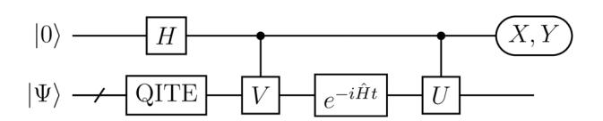

FIG. 1. Quantum circuit to calculate the finite-temperature dynamical correlation function  $\langle U(t)V\rangle_{\beta}$ . The ancilla qubit is initialized in  $|0\rangle$  and the system qubit are initialized in  $|\Psi\rangle$ . Here / denotes a bundle of qubits. Measuring X(Y) on the ancilla yields the real (imaginary) part of  $\langle U(t)V\rangle$  on the QITE-evolved initial state. Performing a thermal average over all initial states yields  $\langle U(t)V\rangle_{\beta}$ .

prior to measurement is

$$\tilde{\rho} = \tilde{U}(I_a \otimes e^{-i\hat{H}t}) \tilde{V}(\rho_a \otimes \rho_s) \tilde{V}^{\dagger}(I_a \otimes e^{i\hat{H}t}) \tilde{U}^{\dagger}, \quad (11)$$

where

$$\rho_a = |+\rangle \langle +|\,, \tag{12}$$

$$\rho_{s} = |\Phi(\beta/2)\rangle \langle \Phi(\beta/2)|, \qquad (13)$$

and  $\tilde{U}(\tilde{V})$  is the controlled-U (controlled-V) gate.

Measuring X (Y) on the ancilla yields the real (imaginary) part of the dynamical correlation function on a single QITE-evolved basis state:

$$Tr(\tilde{\rho}X_a) = \text{Re } \langle \Phi(\beta/2)|U(t)V|\Phi(\beta/2)\rangle$$
 (14)

$$Tr(\tilde{\rho}Y_a) = Im \langle \Phi(\beta/2) | U(t)V | \Phi(\beta/2) \rangle. \tag{15}$$

If the initial states are the METTS sample states, an unweighted average over the initial states yields the finite-temperature dynamical correlation function  $\langle U(t)V\rangle_{\beta}$ . In this work, we consider the exact expression for the finite-temperature average of an observable  $\hat{O}$ :

$$\langle \hat{O} \rangle_{\beta} = \frac{\text{Tr}(e^{-\beta \hat{H}} \hat{O})}{\text{Tr}(e^{-\beta \hat{H}})}.$$
 (16)

The numerator trace and the denominator trace are either evaluated by full sampling over the entire Hilbert space, denoted as full trace evaluation, or by random sampling over a subspace of the Hilbert space, denoted as stochastic trace evaluation. If  $\hat{O} = U(t)V$ , Eq. (16) yields the finite-temperature dynamical correlation function  $\langle U(t)V\rangle_{\beta}$ .  $\hat{O}$  can also be a static observable, in which case Eq. (16) yields the static observable at finite temperature.

#### III. METHODS

## A. Pauli string reduction by $\mathbb{Z}_2$ symmetries

If we include all  $4^D$  Pauli strings over each domain consisting of D qubits, each QITE unitary  $e^{-i\Delta\tau \hat{G}[I]}$  applied as in Eq. (4) yields  $\mathcal{O}(N4^D)$  multiqubit rotation gates by the standard rotation gate decomposition [45], which results in a circuit too deep on near-term quantum devices even for D=2. Because of this prohibitive resource overhead, we describe a systematic method to reduce the number of Pauli strings in the QITE unitaries when the Hamiltonian and initial state have  $\mathbb{Z}_2$  symmetries.

 $\mathbb{Z}_2$  symmetries on qubit Hamiltonians have direct parallels with the stabilizer formalism in quantum error-correcting codes [46]. Suppose the Hamiltonian has  $d \mathbb{Z}_2$ 

symmetries, i.e.,  $\hat{H}$  commutes with elements of a group isomorphic to  $\mathbb{Z}_2^d$  generated independently by d Pauli strings, and the initial state is in the +1 eigenspace of all d generators. If we regard the symmetry group  $\mathbb{Z}_2^d$  as the stabilizer  $\mathcal{S}$ , the symmetry sector of the initial state corresponds to the stabilizer subspace  $V_{\mathcal{S}}$ .

In stabilizer codes, the normalizer of the stabilizer  $\mathcal{N}(\mathcal{S})$  includes all Pauli strings that commute with elements of the stabilizer  $\mathcal{S}$ , and all valid operations on the code space are in the quotient group  $\mathcal{N}(\mathcal{S})/\mathcal{S}$ . Intuitively, to preserve  $\mathbb{Z}_2$  symmetries, among all Pauli strings from  $\mathcal{P}_{\hat{H}[I]}$  the QITE unitaries should only include those from the quotient group  $\mathcal{N}(\mathcal{S})/\mathcal{S}$ . We now show that the original QITE algorithm subsumes the requirement that the Pauli strings should be chosen from  $\mathcal{N}(\mathcal{S})/\mathcal{S}$  because the action of the unitary  $e^{-i\Delta \tau \hat{G}[I]}$  with the Pauli strings from the unreduced set  $\mathcal{P}_{\hat{H}[I]}$  is the same as the action with Pauli strings from the reduced set  $\mathcal{P}_{\hat{H}[I]} \cap \mathcal{N}(\mathcal{S})/\mathcal{S}$ . This result is stated as the following Proposition, proved and discussed in Appendix A.

**Proposition.** Suppose QITE is applied to approximate the imaginary time propagator  $e^{-\Delta \tau \hat{H}[I]}$  on the state  $|\Psi\rangle$ . If there exists a stabilizer  $\mathcal{S}$  such that every element of  $\mathcal{S}$  commutes with  $\hat{H}[I]$  and  $|\Psi\rangle \in V_{\mathcal{S}}$ , then the following are true.

(a) The action of  $e^{-i\Delta \tau \hat{G}[I]}$  on  $|\Psi\rangle$  with  $\sigma_{\mu} \in \mathcal{P}_{\hat{H}[I]}$  is equivalent to the action with  $\sigma_{\mu} \in \mathcal{P}_{\hat{H}[I]} \cap \mathcal{N}(\mathcal{S})/\mathcal{S}$ ,

(b) 
$$e^{-i\Delta\tau \hat{G}[l]} |\Psi\rangle \in V_{\mathcal{S}}$$
.

Further reduction in the number of Pauli strings can be achieved by recalling from Ref. [31] that when the Hamiltonian and the initial state are real in the computational basis, the state after imaginary time evolution must be real. Thus, only Pauli strings with an odd number of Y need to be included in the QITE unitaries. Since  $\mathbb{Z}_2$  symmetries and the conditions of a real Hamiltonian and initial state are independent, when both conditions are satisfied, the number of Pauli strings can be reduced using both conditions, in which case the reduced set of Pauli strings is modified to  $\mathcal{P}_{\hat{H}[I]} \cap \mathcal{N}(\mathcal{S})/\mathcal{S} \cap \{\sigma_{\mu} : \sum_{j} \delta_{\mu_{j}, \mathcal{Y}} \equiv 1 \pmod{2}\}.$ 

In practice the Proposition is used inductively on the Trotter terms  $\hat{H}[I]$ , which implies the stabilizer need to be chosen such that every element of the stabilizer commutes with all  $\hat{H}[I]$ , or equivalently with  $\hat{H}$ . For spin Hamiltonians, the stabilizer generators are usually global  $\mathbb{Z}_2$  symmetries such as  $Z^{\otimes N}$  and  $X^{\otimes N}$ . For general Hamiltonians, the  $\mathbb{Z}_2$  symmetries can be found by Gaussian elimination on the parity-check matrix formed from the Hamiltonian terms [47].

To confirm our Pauli string reduction scheme, we compare the QITE energy trajectory as a function of imaginary time simulated without noise or measurement sampling on a single initial state with and without reduction of the

Pauli strings in the QITE unitaries by  $\mathbb{Z}_2$  symmetries. The Hamiltonians we study include the transverse-field Ising model (TFIM) Hamiltonian

$$\hat{H}_{\text{TFIM}} = J \sum_{i=0}^{N-2} X_i X_{i+1} + h \sum_{i=0}^{N-1} Z_i$$
 (17)

and the Heisenberg XXZ Hamiltonian

$$\hat{H}_{XXZ} = J \sum_{i=0}^{N-2} (X_i X_{i+1} + Y_i Y_{i+1} + \Delta Z_i Z_{i+1}), \qquad (18)$$

with open boundary conditions assumed for both.

In Fig. 2 we plot energy versus imaginary time calculated with QITE on a single initial state. The unreduced set of Pauli strings only includes Pauli strings with odd numbers of Y because the Hamiltonian and initial state are real in the computational basis. We choose a sufficiently small imaginary-time-step size  $\Delta \tau$  to ensure that the Trotter errors from expansion in Eq. (4) are negligible. Figure 2(a) plots the energy trajectory for the initial state  $|0001\rangle$  in the four-site TFIM with J=h=1. The Hamiltonian and the initial state have a  $\mathbb{Z}_2$  symmetry  $Z_0Z_1Z_2Z_3$ . By combining reduced Pauli strings from all three D=2 domains, we obtain 6 Pauli strings in the QITE unitaries

$$X_0Y_1, Y_0X_1, X_1Y_2, Y_1X_2, X_2Y_3, Y_2X_3,$$
 (19)

compared to 16 Pauli strings without reduction by  $\mathbb{Z}_2$  symmetries. Figure 2(b) plots energy versus imaginary time

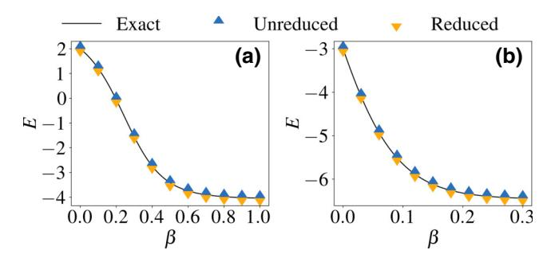

FIG. 2. Energy E versus imaginary time  $\beta$  simulated without noise or measurement sampling on a single initial state with and without reduction of the Pauli strings in the QITE unitaries by  $\mathbb{Z}_2$  symmetries. (a) Four-site TFIM with J=h=1 and initial state  $|0001\rangle$ . The imaginary-time-step size in QITE is set to  $\Delta \tau = 0.01$ . The number of Pauli strings from three D=2 domains is reduced from 16 to 6 by one  $\mathbb{Z}_2$  symmetry  $Z_0Z_1Z_2Z_3$ . (b) Four-site Heisenberg model with  $J=\Delta=1$  and initial state  $(|0101\rangle+|1010\rangle)$  / $\sqrt{2}$ . The imaginary-time-step size in QITE is set to  $\Delta \tau = 0.03$ . The number of Pauli strings on the single D=4 domain is reduced from 120 to 6 by two  $\mathbb{Z}_2$  symmetries  $Z_0Z_1Z_2Z_3$  and  $X_0X_1X_2X_3$ . In both panels the energy trajectories using reduced numbers of Pauli strings match the energy trajectories without reduction, which also match the energy trajectories from exact imaginary time evolution.

of the initial state  $(|0101\rangle + |1010\rangle)/\sqrt{2}$  on the four-site Heisenberg model with  $J = \Delta = 1$ . The Hamiltonian and the initial state have two  $\mathbb{Z}_2$  symmetries  $Z_0Z_1Z_2Z_3$  and  $X_0X_1X_2X_3$ . The 120 Pauli strings in the QITE unitaries without reduction are reduced to the 6 Pauli strings

$$X_0Y_1Z_2, X_0Z_1Y_2, Y_0X_1Z_2, Y_0Z_1X_2, Z_0X_1Y_2, Z_0Y_1X_2.$$
 (20)

In both panels of Fig. 2, the energy trajectories using reduced numbers of Pauli strings match the energy trajectories without reduction, which also match the energy trajectories from exact imaginary time evolution.

### **B.** Circuit optimization

Even with reduction of Pauli strings in the QITE unitaries by  $\mathbb{Z}_2$  symmetries, applying the QITE unitaries as in Eq. (4) may still result in a circuit too deep to be implemented on current quantum hardware. In this section we describe circuit optimization techniques that further reduce circuit depth.

In two-site calculations, both the QITE circuit and the real time evolution circuit can be optimized to constant depth with a standard single- and two-qubit gate set, regardless of the number of imaginary and real time steps. For example, in the two-site TFIM there is only one Pauli string  $X_0Y_1$  in the QITE unitaries after reduction by the  $\mathbb{Z}_2$  symmetry  $Z_0Z_1$ . Suppose the unitary applied to the state at the kth imaginary time step is  $e^{-i\Delta\tau x_kX_0Y_1}$ . Then the unitaries at all imaginary time steps can be multiplied into a single two-qubit rotation gate  $e^{-i\theta X_0Y_1/2}$  where  $\theta = 2\Delta\tau \sum_k x_k$ . For real time evolution, the two-qubit operator  $e^{-i\hat{H}t}$  is decomposed by the KAK decomposition [48–51] into six single-qubit gates and two CNOT gates.

In four-site calculations, neither the QITE circuit nor the real time evolution circuit is of constant depth. If we Trotterize the QITE unitaries as in Eq. (4) and similarly for the real time propagator, the circuit is too deep to be accurately implemented on existing quantum devices. Therefore, we recompile the circuit by fitting each QITE unitary  $e^{-i\Delta\tau \hat{G}[I]}$  or the real time propagator  $e^{-i\hat{H}t}$  to a parametrized circuit [52–54] using an open-source tensor network-based quantum simulation library [55]. Figure 3(a) shows the recompiled four-site QITE circuit, where the  $U_3$  gate is a generic single-qubit gate defined as

$$U_3(\theta, \phi, \lambda) = \begin{pmatrix} \cos(\theta/2) & -e^{i\lambda}\sin(\theta/2) \\ e^{i\phi}\sin(\theta/2) & e^{i(\lambda+\phi)}\cos(\theta/2) \end{pmatrix}. \quad (21)$$

The four  $U_3$  gates at the left constitute the base gate round. Each additional gate round consists of a layer of CNOT gates and a layer of single-qubit gates. The additional gate rounds alternate between even-odd and odd-even pairs of qubits. Let the target unitary be  $U_{\rm targ}$  and the recompiled

unitary be  $U_{\rm rec}(\theta)$ , where  $\theta$  is a composite variable denoting all the angles. Given a reduced density operator  $\rho$  on the finite domain acted on by the target unitary, the optimal recompiled unitary is found by performing a gradient descent to maximize the function

$$F(\boldsymbol{\theta}) = \left| \text{Tr} [U_{\text{rec}}(\boldsymbol{\theta})^{\dagger} U_{\text{targ}} \rho] \right|^{2}, \tag{22}$$

which can be interpreted as the fidelity between  $U_{\rm rec}(\theta)$  and  $U_{\rm targ}$  with respect to the reduced density matrix  $\rho$ . Since the QITE unitaries are real, we use the one-parameter single-qubit gate  $R_y(\theta) = U_3(\theta,0,0)$  in the recompiled circuit for QITE, while for real time evolution we keep the  $U_3$  gate as the parametrized single-qubit gate.

In Fig. 3(b), we examine how recompilation affects observable values by simulating the finite-temperature energy  $\langle E \rangle_{\beta}$  of the four-site TFIM with J=3, h=1 in the absence of noise or measurement sampling. Both the

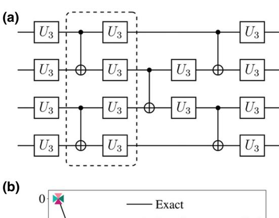

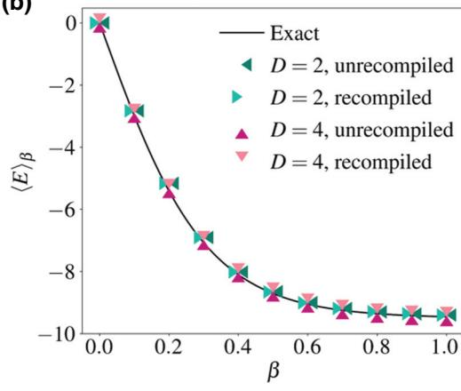

FIG. 3. (a) Four-site recompiled circuit. The four  $U_3$  gates at the left constitute the base gate round. Each additional gate round includes a layer of CNOT gates and a layer of single-qubit gates as shown in the dashed box. The additional gate rounds alternate between even-odd and odd-even pairs of qubits, so that the circuit shown consists of three gate rounds. (b) Comparison of the finite-temperature energy  $\langle E \rangle_{\beta}$  of the four-site TFIM with J=3,h=1 with and without recompilation in the absence of noise and measurement sampling. The imaginary time step size in QITE is  $\Delta \tau = 0.05$ . For both D=2 and D=4, the observable values from the recompiled QITE unitaries are within 0.1% of those from the unrecompiled QITE unitaries.

D=2 and the D=4 QITE unitaries are recompiled with three gate rounds, resulting in a circuit of the same form as that shown in Fig. 3(a). For both D=2 and D=4, the average recompilation fidelity defined in Eq. (22) is above 0.9999, and the observable values from the recompiled QITE unitaries are within 0.1% of those from the unrecompiled QITE unitaries. The observable values from QITE are also close to the exact values, which is expected from a noiseless simulation.

### C. Error mitigation

To mitigate the effect of hardware noise on the measurement results, we postprocess our hardware data by error-mitigation methods, including postselection, readout error mitigation, and phase-and-scale correction. Postselection and readout error mitigation are applied to the measurement outcomes at each imaginary time step in the QITE subroutine; phase-and-scale correction is applied to the final computed finite-temperature dynamical correlation function as a single-step postprocessing. Richardson extrapolation to the zero-noise limit on short-depth circuits [56] as recently implemented in QITE [37] is also carried out; however, it is not observed to further improve the results and hence is not applied in our calculations.

Postselection is performed on  $\mathbb{Z}_2$  symmetries discussed in Sec. III A. When the Hamiltonian and the initial state have  $\mathbb{Z}_2$  symmetries, the final state after imaginary or real time evolution should have the same stabilizer parities as the initial state. However, during execution of the circuit, gate errors and qubit decoherence can induce nonzero overlap of the qubit state with the subspace of the wrong parity. Postselection can mitigate these undesirable effects by discarding measurement outcomes with the wrong parity [57,58].

We specifically consider the symmetry from a single stabilizer generator. If the operator to be measured is an ancilla operator, we can simply measure the stabilizer generator on all the system qubits and read off the parity without interfering with measurement of the ancilla. If the operator to be measured acts on system qubits, we need to simultaneously measure the operator and the stabilizer generator, which is possible because all operators in Eq. (10) commute with the stabilizer generator by our choice of Pauli strings in the QITE unitaries in Sec. III A. Specifically, each operator and the stabilizer generator can be simultaneously measured by using Clifford gates to transform the Pauli string components of the operator and the stabilizer generator until they are qubitwise commuting, so that their expectation values can be read off on different qubits [59–62].

Figure 4 shows the circuit to simultaneously measure the stabilizer generator  $Z_0Z_1Z_2Z_3$  and a Pauli string that commutes with it in a four-site QITE calculation. The sequence

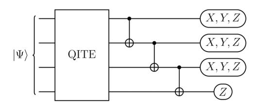

FIG. 4. Measurement of a Pauli string in a four-site QITE calculation with postselection on the stabilizer generator  $Z_0Z_1Z_2Z_3$ . The appended CNOT gates achieve simultaneous measurement of the Pauli string with the stabilizer generator by transforming  $Z_0Z_1Z_2Z_3$  to  $Z_3$  acting on a single qubit, from which the stabilizer parity is read off. The other qubits are measured in X, Y, or Z basis depending on the Pauli string measured. Measurement outcomes with the wrong parity are discarded.

of CNOT gates after the QITE circuit in Fig. 4 transforms  $Z_0Z_1Z_2Z_3$  to  $Z_3$ . Since  $Z_3$  acts on a single qubit, it necessarily qubitwise commutes with the transformed Pauli string. In practice, we stop applying CNOT gates when the transformed Pauli string becomes qubitwise commuting with the transformed stabilizer generator, and therefore the number of CNOT gates added to the end of the circuit ranges from zero to three.

To account for noise in the final measurement, the built-in readout-error-mitigation routine in Qiskit [63] is applied to each measurement outcome. Because of the small size of the systems we study, for N qubits we carry out full calibration on all  $2^N$  initial states. Application of the inverse of the calibration matrix to the raw measurement counts is performed by the default least-squares fitting method.

We assess the effectiveness of applying postselection and readout error mitigation at every imaginary step of QITE by simulating the finite-temperature energy of two-site and four-site TFIMs using full trace evaluation with measurement sampling and the noise model from ibmq\_rome. In both panels of Fig. 5, QITE is applied with Pauli strings reduced and circuits optimized. In particular, four-site QITE unitaries are of domain size D = 2 and recompiled with three rounds of gates. From Fig. 5 we can see that both readout error mitigation and postselection shift the raw data toward the exact data, confirming the effectiveness of both schemes in reducing the effect of noise. Furthermore, a combination of readout error mitigation and postselection is observed to be most effective in mitigating the errors, which is not apparent on two sites in Fig. 5(a) presumably because of the small size of the system but clearly evident on four sites in Fig. 5(b).

In calculations of finite-temperature dynamical correlation functions, the ancilla qubit is in the state  $|+\rangle$  before entangling with the system qubits. When there is a long sequence of gates in the real time propagator  $e^{-i\hat{H}t}$ , decoherence of the ancilla qubit such as amplitude damping to the qubit ground state  $|0\rangle$  and depolarization will significantly affect the X and Y measurement results on the

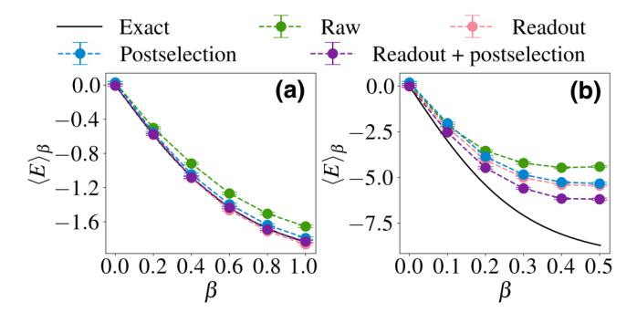

FIG. 5. Finite-temperature energy  $\langle E \rangle_{\beta}$  of (a) the two-site TFIM with J=h=1 and (b) the four-site TFIM with J=3, h=1, simulated with measurement sampling and the noise model from  $ibmq\_rome$ . The imaginary-time-step size in QITE is  $\Delta \tau = 0.1$  for two-site TFIM and  $\Delta \tau = 0.05$  for four-site TFIM. Raw data are postprocessed at each imaginary time step with either readout error mitigation, or postselection, or both. Employing both readout error mitigation and postselection is observed to be most effective in mitigating the errors.

ancilla. To mitigate the effect of ancilla decoherence, we apply phase-and-scale correction [14,15] as a single-step postprocessing to the result at the end of the calculation. The only finite-temperature dynamical correlation function considered in this work is  $\langle Z_0(t)Z_0\rangle_{\beta}$ , which is equal to 1 analytically at t=0. Hence, we apply phase-and-scale correction by dividing the raw hardware  $\langle Z_0(t)Z_0\rangle_{\beta}$  at each t by the raw hardware  $\langle Z_0(t=0)Z_0\rangle_{\beta}$  to enforce the condition  $\langle Z_0(t=0)Z_0\rangle_{\beta}=1$ .

#### IV. RESULTS

Experiments of computing finite-temperature observables are conducted on IBM Quantum devices  $ibmq\_bogota$  and  $ibmq\_rome$  [64], both of which consist of five qubits arranged on a chain with nearest-neighbor interactions and similar error rates. IBM's open-source library Qiskit [65] is used to implement our algorithms on the devices. In each calculation, the N system qubits  $0, \ldots, N-1$  are arranged adjacent to each other and the ancilla is closest to system qubit 0.

The systems we study are sufficiently small that we apply QITE to approximate the full imaginary time propagator  $e^{-\Delta \tau \hat{H}}$  at each imaginary time step, which is equivalent to setting L=1 and  $\hat{H}[1]=\hat{H}$  in Eq. (1). The QITE linear systems in Eq. (5) are solved by a conjugate gradient method. Because hardware noise and measurement sampling lead to ill-conditioned A matrices in the QITE linear systems, we add a regularizer of 0.2 to the diagonal elements of each A matrix in the four-site calculations.

Each calibration circuit used for readout error mitigation is repeated 1000 times; each Pauli string measurement circuit used to construct the QITE linear systems is repeated 8000 times. Error bars from full trace evaluation

result only from measurement sampling and are the size of the markers in most figures; error bars from stochastic trace evaluation originate from both measurement sampling and initial-state sampling. A detailed description of error bars in full and stochastic trace evaluation is given in Appendix B.

#### A. Two-site calculations

We study the two-site TFIM defined in Eq. (17) by setting h = 1 and varying J. The finite-temperature energy  $\langle E \rangle_{\beta}$  and static correlation function  $\langle X_0 X_1 \rangle_{\beta}$  are calculated on the Hamiltonians with  $J = \pm 1, \pm 3$ , while the finite-temperature dynamical correlation function  $\langle Z_0(t)Z_0 \rangle_{\beta}$  and excitation spectra are calculated on the Hamiltonian with J = 3. In all calculations, finite-temperature observables are calculated by full trace evaluation and the circuits are optimized according to the circuit optimization procedures in Sec. III B.

Figure 6 shows the finite-temperature energy  $\langle E \rangle_{\beta}$  and static correlation function  $\langle X_0 X_1 \rangle_{\beta}$  of the two-site TFIM with  $J=\pm 1,\pm 3$  from  $\beta=0$  to  $\beta=2$ . In both Figs. 6(a) and 6(b) the finite-temperature observables obtained on hardware are within 1% to 4% of the exact values. Further, if we regard each finite-temperature variable as a function of J, analytically it can be shown that  $\langle E \rangle_{\beta}(J)=\langle E \rangle_{\beta}(-J)$  and  $\langle X_0 X_1 \rangle_{\beta}(J)=-\langle X_0 X_1 \rangle_{\beta}(-J)$ . This relation is satisfied in the hardware data.

Next, finite-temperature dynamical properties are calculated on the two-site TFIM with J=3, h=1. The dynamical correlation function  $\langle Z_0(t)Z_0\rangle_\beta$  is evaluated from  $\beta=0$  to  $\beta=2$  and at real time from t=0 to  $t=8\pi$ . Figures 7(a) and 7(b) show the real and imaginary parts of  $\langle Z_0(t)Z_0\rangle_\beta$  at  $\beta=0.2$  and  $\beta=1.8$  up to  $t=4\pi$ . From Figs. 7(a) and 7(b) we see that even without phase-and-scale correction, the real and imaginary parts of  $\langle Z_0(t)Z_0\rangle_\beta$  agree well with the exact results at both small and large  $\beta$ ,

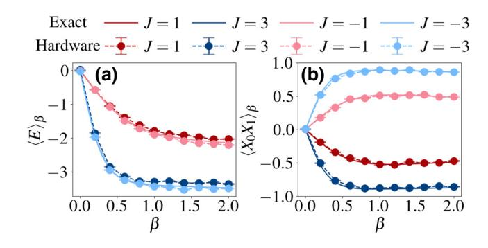

FIG. 6. (a) Finite-temperature energy  $\langle E \rangle_{\beta}$  and (b) static correlation function  $\langle X_0 X_1 \rangle_{\beta}$  of the two-site TFIM with  $J=\pm 1, \pm 3$  and h=1 versus inverse temperature  $\beta$ . The imaginary-timestep size in QITE is  $\Delta \tau = 0.1$ . The observables obtained on hardware are within 1–4% of the exact values.

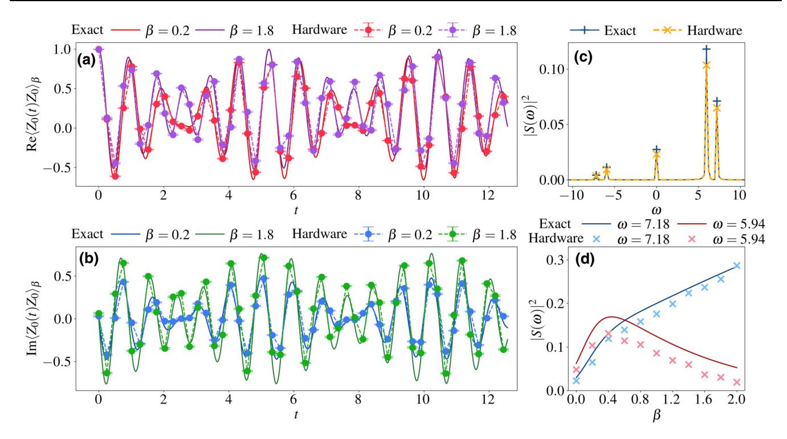

FIG. 7. Finite-temperature dynamical properties of the two-site TFIM with J=3, h=1. The imaginary-time-step size in QITE is set to  $\Delta \tau=0.1$ . (a) Real and (b) imaginary parts of the finite-temperature dynamical correlation function  $\langle Z_0(t)Z_0\rangle_{\beta}$  at  $\beta=0.2$  and  $\beta=1.8$  versus real time t. (c) Finite-temperature excitation spectra  $|S(\omega)|^2$  versus frequency  $\omega$ . Positive (negative) frequencies correspond to emissions (absorptions). (d) Amplitudes of the two emission peaks at  $\omega=7.18$  and  $\omega=5.94$ . The hardware data capture finite-temperature dynamics of two-site TFIM across a wide range of temperatures.

presumably due to the constant and shallow depth of the real time evolution circuit.

The spectral density  $S(\omega)$  is obtained by a discrete Fourier transform of the dynamical correlation function  $\langle Z_0(t)Z_0\rangle_{\beta}$ . Specifically, at each  $\beta$ 

$$S(\omega_k) = \frac{1}{n_t} \sum_{m=0}^{n_t-1} \langle Z_0(t_m) Z_0 \rangle_{\beta} e^{i\omega_k t_m}, \qquad (23)$$

where  $n_t$  is the total number of points in the time series,  $t_m = m\Delta t$ , and  $\omega_k = 2\pi k/n_t\Delta t$ . With this definition of Fourier transform, the peaks at positive (negative) frequencies correspond to emissions (absorptions) of excitations of the system.

In Fig. 7(c) we plot the excitation spectra of the twosite TFIM at  $\beta=0.2$ . The exact excitation spectrum is obtained by a Fourier transform of the exact  $\langle Z_0(t)Z_0\rangle_{\beta}$ at the same points in real time as the  $\langle Z_0(t)Z_0\rangle_{\beta}$  obtained on hardware. From the plot, we can see that the hardware excitation spectrum agrees well with the exact excitation spectrum. The frequencies  $\omega=0,\pm 5.94,\pm 7.18$ , at which the peaks in the excitation spectra are located, correspond to the excitation frequencies of  $\omega=0,\pm 6.00,\pm 7.21$  from exact diagonalization of the Hamiltonian. The deviation of the frequencies in the excitation spectra obtained from hardware  $\langle Z_0(t)Z_0\rangle_\beta$  compared to the frequencies obtained from exact diagonalization is due to the finite real time domain in our hardware calculations.

To analyze the evolution of the excitation spectra across different temperatures, we plot the amplitudes at the two emission frequencies versus  $\beta$  in Fig. 7(d). Analytically, the amplitude of the transition from an initial state  $|\Psi_i\rangle$ to a final state  $|\Psi_f\rangle$  is  $e^{-\beta E_f} |\langle \Psi_i | Z_0 | \Psi_f \rangle|^2 / \mathcal{Z}$ , where  $E_f$  is the energy of the final state and  $\mathcal{Z}$  is the partition function. In the two-site TFIM, the only allowed transitions are between the two states in each of the two-dimensional eigenspaces of  $Z_0Z_1$  with eigenvalues  $\pm 1$ . The frequency  $\pm 7.18$  corresponds to a transition in the +1 eigenspace, where the ground state lies, and the frequency  $\pm 5.94$  corresponds to a transition in the -1eigenspace, where the first excited state lies. As the temperature decreases from infinite temperature ( $\beta$  increases from 0), the populations in the two lowest states first increase until the ground state population dominates over that of the first excited state at around  $\beta = 0.4$ , a trend reproduced by the amplitudes obtained from hardware data in Fig. 7(d). Thus, Fig. 7 shows that quantum hardware accurately captures the finite-temperature dynamics of the two-site TFIM across a wide range of temperatures.

#### **B.** Four-site calculations

We next proceed to four-site spin systems. We study the four-site TFIM defined in Eq. (17) with J = 3, h = 1. Full trace evaluation is employed unless otherwise specified.

First, let us consider gate counts in the four-site circuits. For the four-site TFIM with D = 2, after reduction by the  $\mathbb{Z}_2$  symmetry  $Z_0Z_1Z_2Z_3$  there are six weight-two Pauli strings, which are the ones given in Eq. (19). If we Trotterize the QITE unitaries as in Eq. (4), each unitary requires 12 CNOT gates by the standard rotation gate decomposition [45], which becomes unfeasible on nearterm quantum hardware after the first few imaginary time steps. When D=4, even after reduction by one  $\mathbb{Z}_2$  symmetry there are still 28 Pauli strings in each QITE unitary. After Trotterization and rotation gate decomposition, each QITE unitary requires more than 50 CNOT gates for a single imaginary time step. Hence, when D = 2, we compute finite-temperature observables both by Trotterizing and by recompiling the QITE unitaries with three gate rounds; when D = 4, we only recompile the QITE unitaries with

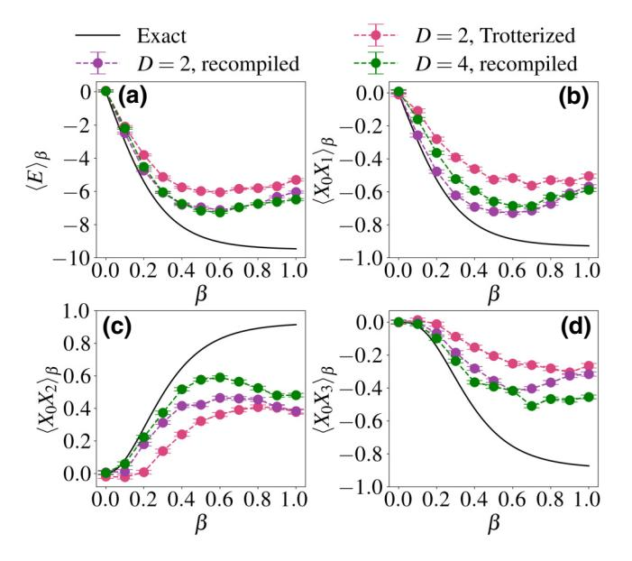

FIG. 8. (a) Finite-temperature energy  $\langle E \rangle_{\beta}$  and static correlation functions (b)  $\langle X_0 X_1 \rangle_{\beta}$  (c)  $\langle X_0 X_2 \rangle_{\beta}$  (d)  $\langle X_0 X_3 \rangle_{\beta}$  of the four-site TFIM with J=3,h=1 versus inverse temperature  $\beta$  with different QITE unitaries. The imaginary-time-step size in QITE is set to  $\Delta \tau = 0.05$ . The D=2 QITE unitaries are either Trotterized as in Eq. (4) or recompiled, while all D=4 QITE unitaries are recompiled. The results with recompiled QITE unitaries are closer to exact results than the results with Trotterized QITE unitaries due to circuit depth. Between the calculations with recompiled unitaries, D=4 is not necessarily closer to exact results than D=2 for all observables, possibly due to the increased influence of hardware noise in the larger linear systems.

three gate rounds. To obtain dynamical correlation functions, we additionally recompile the real time propagator  $e^{-i\hat{H}t}$  with five gate rounds. The number of gate rounds is chosen so that the fidelity as defined in Eq. (22) is at least 0.999 on average in each calculation.

Figure 8 shows the finite-temperature energy  $\langle E \rangle_{\beta}$  and static correlation functions  $\langle X_0 X_1 \rangle_{\beta}$ ,  $\langle X_0 X_2 \rangle_{\beta}$ ,  $\langle X_0 X_3 \rangle_{\beta}$  of the four-site TFIM. From the figure, we can see that the finite-temperature observables calculated with Trotterized D = 2 QITE unitaries deviate from those calculated with D=2 recompiled QITE unitaries or D=4 recompiled QITE unitaries after  $\beta = 0.1$ . This deviation is due to the deep circuit resulting from 12 layers of CNOT gates per imaginary time step, compared to 3 layers of CNOT gates per imaginary time step in the recompiled circuit. The observables from the D = 2 recompiled QITE unitaries are in reasonable agreement with those from D = 4 recompiled QITE unitaries for all  $\beta$ , which is consistent with the simulator results in the absence of noise or measurement sampling in Fig. 3(b). However, even the recompiled QITE unitaries are not able to track the exact finite-temperature observables for  $\beta \gtrsim 0.4$ . In particular, the slope is reversed compared to the exact result for  $\beta > 0.5$ . QITE up to  $\beta = 0.5$  corresponds to 5 imaginary time steps and hence 15 layers of CNOT gates, which is almost at the limit of circuit depth on these quantum devices.

To explore the scalability of our approach, we compare stochastic trace evaluation with full trace evaluation in calculating the finite-temperature energy of the four-site

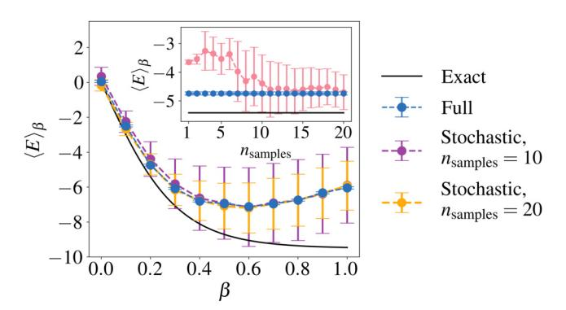

FIG. 9. Finite-temperature energy  $\langle E \rangle_{\beta}$  of the four-site TFIM with J=3,h=1 versus inverse temperature  $\beta$  using full- and stochastic trace evaluation. QITE is performed with recompiled D=2 unitaries with a time step of  $\Delta \tau=0.05$ . Results of stochastic trace evaluation are shown with the number of samples  $n_{\text{samples}}$  set to 10 and 20. Inset shows the running average of  $\langle E \rangle_{\beta}$  versus  $n_{\text{samples}}$  using stochastic trace evaluation at  $\beta=0.2$  (red symbols), with full trace evaluation (blue symbols) and exact results (black solid line) plotted as constant values. Stochastic trace evaluation with ten samples is already sufficient to reproduce the results from full trace evaluation across a wide range of  $\beta$ .

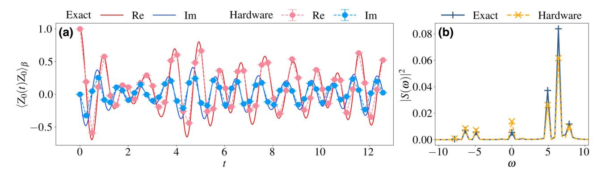

FIG. 10. Finite-temperature dynamical properties of the four-site TFIM with J=3, h=1 at  $\beta=0.2$ . QITE is performed with a time step of  $\Delta \tau=0.05$  and recompiled D=2 unitaries. (a) Real and imaginary parts of the finite-temperature dynamical correlation function  $\langle Z_0(t)Z_0\rangle_{\beta}$  versus real time t. Raw hardware data are postprocessed by phase-and-scale correction. (b) Finite-temperature excitation spectra obtained by Fourier transform of exact and phase-and-scale-corrected hardware  $\langle Z_0(t)Z_0\rangle_{\beta}$  at the same points in real time. The hardware  $\langle Z_0(t)Z_0\rangle_{\beta}$  and excitation spectrum after phase-and-scale correction are in good agreement with the exact results.

TFIM. Stochastic trace evaluation is performed by uniformly selecting initial states in the full trace evaluation result with recompiled D=2 QITE unitaries. In Fig. 9, we plot the stochastic trace evaluation results with 10 and 20 samples along with the full trace evaluation and exact results; the inset shows the running average of  $\langle E \rangle_{\beta}$  versus the number of samples  $n_{\text{samples}}$ . As can be seen from the figure, random sampling with 10 samples already reproduced the results from full sampling on all 16 initial states, indicating that using scalable sampling schemes is a promising approach to studying larger systems.

Finally, in Fig. 10 we show the dynamical properties of the four-site TFIM with J=3, h=1 at  $\beta=0.2$ . The calculation is implemented by recompiling D=2 QITE unitaries with three gate rounds and real time propagation with five gate rounds. Figure 10(a) shows the real and imaginary parts of  $\langle Z_0(t)Z_0\rangle_\beta$  after phase-and-scale correction. With this correction, both the real and the imaginary parts show good agreement with the exact result. Figure 10(b) shows the excitation spectra obtained by Fourier transforming the exact and phase-and-scale-corrected hardware  $\langle Z_0(t)Z_0\rangle_\beta$  at the same points in real time. The excitation spectrum from hardware data accurately reproduces not only the frequencies  $\omega=0,\pm4.90,\pm6.37,\pm7.84$  but also the peak amplitudes.

The favorable agreement of the hardware  $\langle Z_0(t)Z_0\rangle_{\beta}$  with the exact result is in contrast with the deviation of finite-temperature static observables from the exact values in Fig. 8. In fact, the raw hardware  $\langle Z_0(t)Z_0\rangle_{\beta}$  at t=0 is 0.821+0.397i, which is far from the exact value 1, indicating that the phase-and-scale correction has a significant effect in correcting raw hardware data. Although in Ref. [15] a phase-and-scale correction combined with readout error mitigation was not observed to yield as large an improvement as we see in our hardware data, the use

of postselection before the phase-and-scale correction in our implementation may be responsible for some of the improvement relative to exact results.

Even though the phase does not enter the static observables we compute, the lack of a scale correction scheme for the static observables may explain their large deviation from the exact values compared to dynamical observables. Moreover, even though the recompiled circuit in Fig. 10 includes up to 11 gate rounds with the QITE and real time evolution gates combined, the ancilla is initialized after the QITE circuit and hence only experiences five gate rounds prior to measurement. The relatively shallow circuit applied to the ancilla may be another reason for the good performance of the quantum device for calculating the finite-temperature dynamical observable  $\langle Z_0(t)Z_0\rangle_{\beta}$ .

## V. CONCLUSION AND OUTLOOK

Our work demonstrates that finite-temperature physics of quantum spin systems is accessible with near-term quantum hardware and paves the way for further study of finite-temperature phenomena on near-term quantum devices. With methods to reduce required quantum resources and mitigate errors in raw hardware data, QITE enables the practical calculation of finite-temperature energy, static and dynamical correlation functions, and spectral densities of excitations.

On two sites, static and dynamical observables for a wide range of temperatures are accurately captured by quantum hardware. An important factor underlying this accuracy is the constant depth of the circuit in both QITE and real time evolution. Constant circuit depth in QITE allowed us to extend QITE-based finite-temperature calculations from a single site [31]; constant circuit depth in

real time evolution allowed us to reproduce exact finitetemperature dynamical correlation functions on quantum hardware without phase-and-scale correction as compared to previous studies [14,15].

On four sites, finite-temperature static observables calculated on quantum hardware with circuit recompilation are in reasonable agreement with exact results at  $\beta \leq 0.5$ . We are also able to accurately reproduce the finite-temperature dynamical correlation function using phase-and-scale correction at a high temperature  $\beta \sim 0.2$ . However, accurate determination of observables at lower temperatures still appears challenging using the current recompilation scheme where the QITE unitaries are recompiled separately at each imaginary time step. Therefore, simulating quantum systems at low temperature on nearterm quantum computers will likely require additional reduction of circuit depth such as recompilation with merged imaginary time steps [39] or lower error rates on quantum devices either from efficient error mitigation for imaginary time or from improvements in hardware.

To simulate larger systems, more qubits, deeper circuits, and a scalable method for performing thermal averages are required. Since the main limitation in our four-site calculations is circuit depth rather than system size, simulation of larger systems will likely require more aggressive recompilation techniques. However, this recompilation is scalable as the fidelity defined in Eq. (22) is evaluated on the reduced density matrix. To investigate the scalability of the method to calculate thermal averages, we examined how stochastic trace evaluation performs in calculating finite-temperature observables compared to full trace evaluation. We found that on four sites stochastic trace evaluation reproduced full trace evaluation results accurately in the temperature regime we study. Compared to the previously proposed QMETTS algorithm, stochastic trace evaluation has zero autocorrelation time. A detailed comparison of QITE-based computation of finite-temperature observables with different sampling schemes is a topic worth exploring. Furthermore, with the availability of more qubits [66,67], trading increased computational time due to sampling for an increased number of qubits via constructing purifications of density matrices [22–24] may be another feasible direction for studying finite-temperature physics on near-term quantum hardware.

## **ACKNOWLEDGMENTS**

The authors thank Y. Wang, X. Ma, S. Sheldon and T. P. Gujarati for helpful discussions. S.-N.S., A.T.K.T., and A.J.M. are supported by NSF Grant No. 1839204. R.N.T. and G.K.-L.C. are supported by the US Department of Energy, Office of Science, Grant No. 19374. S.-N.S. acknowledges J. M. Burks and G. O. Jones for helping with access to IBM Quantum devices.

## APPENDIX A: PROOF OF PAULI STRING REDUCTION BY $\mathbb{Z}_2$ SYMMETRIES

In Sec. III A we introduce a scheme to reduce Pauli strings in the QITE unitaries by  $\mathbb{Z}_2$  symmetries. We mention that rather than impose  $\mathbb{Z}_2$  symmetries in choosing the Pauli strings in the QITE unitaries, the original QITE algorithm subsumes the preservation of  $\mathbb{Z}_2$  symmetries. We now restate the Proposition and present a proof that derives directly from the QITE linear systems in Eq. (5).

**Proposition.** Suppose QITE is applied to approximate the imaginary time propagator  $e^{-\Delta \tau \hat{H}[I]}$  on the state  $|\Psi\rangle$ . If there exists a stabilizer  $\mathcal{S}$  such that every element of  $\mathcal{S}$  commutes with  $\hat{H}[I]$  and  $|\Psi\rangle \in V_{\mathcal{S}}$ , then the following are true

- (a) The action of  $e^{-i\Delta \tau \hat{G}[I]}$  on  $|\Psi\rangle$  with  $\sigma_{\mu} \in \mathcal{P}_{\hat{H}[I]}$  is equivalent to the action with  $\sigma_{\mu} \in \mathcal{P}_{\hat{H}[I]} \cap \mathcal{N}(\mathcal{S})/\mathcal{S}$ ,
- (b)  $e^{-i\Delta\tau \hat{G}[l]} |\Psi\rangle \in V_{\mathcal{S}}$ .

*Proof.*—Pick  $\sigma_{\mu} \notin \mathcal{N}(\mathcal{S})$ . Since  $e^{-\Delta \tau \hat{H}[I]}$  commutes with elements of  $\mathcal{S}$  and  $|\Psi\rangle \in V_{\mathcal{S}}$ , for any  $s \in \mathcal{S}$  we have  $\langle \Psi | e^{-\Delta \tau \hat{H}[I]} \sigma_{\mu} s | \Psi \rangle = -\langle \Psi | s e^{-\Delta \tau \hat{H}[I]} \sigma_{\mu} | \Psi \rangle$ , which implies  $\langle \Psi | e^{-\Delta \tau \hat{H}[I]} \sigma_{\mu} | \Psi \rangle = 0$ . Hence

$$b[I]_{\mu} = \frac{\operatorname{Im} \langle \Psi | e^{-\Delta \tau \hat{H}[I]} \sigma_{\mu} | \Psi \rangle}{\Delta \tau c[I]^{1/2}} = 0.$$
 (A1)

Now fix the column index  $\mathbf{v}$  such that  $\sigma_{\mathbf{v}} \in \mathcal{N}(\mathcal{S})$ , then for any  $s \in \mathcal{S}$ ,  $\langle \Psi | \sigma_{\mu} \sigma_{\mathbf{v}} s | \Psi \rangle = - \langle \Psi | s \sigma_{\mu} \sigma_{\mathbf{v}} | \Psi \rangle$ , which implies  $\langle \Psi | \sigma_{\mu} \sigma_{\mathbf{v}} | \Psi \rangle = 0$ . Hence

$$A_{\mu\nu} = \operatorname{Re} \langle \Psi | \sigma_{\mu} \sigma_{\nu} | \Psi \rangle = 0 \tag{A2}$$

Since A is Hermitian and real,  $A_{\nu\mu} = A_{\mu\nu}^* = A_{\mu\nu} = 0$ . Thus the linear system has the block-diagonal form

$$\begin{pmatrix} A[I]' & \mathbf{0} \\ \mathbf{0} & A[I]'' \end{pmatrix} \begin{pmatrix} x[I]' \\ x[I]'' \end{pmatrix} = \begin{pmatrix} b[I]' \\ \mathbf{0} \end{pmatrix}, \quad (A3)$$

where the quantities with single primes are indexed by  $\mu$  such that  $\sigma_{\mu} \in \mathcal{N}(\mathcal{S})$  and those with double primes are indexed by  $\mu$  such that  $\sigma_{\mu} \notin \mathcal{N}(\mathcal{S})$ . By setting x[I]'' to 0, the linear system is reduced to A[I]'x[I]' = b[I]'.

To show that the set of  $\sigma_{\mu}$  can be reduced from  $\mathcal{N}(\mathcal{S})$  to  $\mathcal{N}(\mathcal{S})/\mathcal{S}$ , suppose  $\sigma_{\mu}$  and  $\sigma_{\mu'}$  belong to the same coset in  $\mathcal{N}(\mathcal{S})/\mathcal{S}$ , then  $\sigma_{\mu'} = \pm \sigma_{\mu} s$  for some  $s \in \mathcal{S}$ . In the QITE unitary  $e^{-i\Delta \tau \hat{G}[l]} = \sum_{k=0}^{\infty} (-i\Delta \tau)^k (\sum_{\mu} x[l]_{\mu} \sigma_{\mu})^k$ , each term in the sum is a power of  $-i\Delta \tau$  times a product of the form  $\prod_{\nu} (x[l]_{\nu} \sigma_{\nu})$ . If a product term contains  $x[l]_{\mu'} \sigma_{\mu'}$ ,

the action of this term on  $|\Psi\rangle$  is proportional to

$$\left(\prod_{\nu''} x[l]_{\nu''} \sigma_{\nu''}\right) (x[l]_{\mu'} \sigma_{\mu'}) \left(\prod_{\nu'} x[l]_{\nu'} \sigma_{\nu'}\right) |\Psi\rangle. \quad (A4)$$

In the product over v', each  $\sigma_{v'} \in \mathcal{N}(S)$ , so  $\prod_{v'} (x[l]_{v'}\sigma_{v'}) |\Psi\rangle \in V_S$ . Then Eq. (A4) is equivalent to

$$\left(\prod_{\nu''} x[l]_{\nu''}\sigma_{\nu''}\right) (\pm x[l]_{\mu'}\sigma_{\mu}) \left(\prod_{\nu'} x[l]_{\nu'}\sigma_{\nu'}\right) |\Psi\rangle. \quad (A5)$$

Since this applies to every pair of Pauli strings in the same coset,  $\hat{G}[I]$  can be written as

$$\hat{G}[l] = \sum_{\mu} \widetilde{x[l]}_{\mu} \sigma_{\mu}, \tag{A6}$$

where  $\mu$  is chosen such that  $\sigma_{\mu} \in \mathcal{P}_{\hat{H}[I]} \cap \mathcal{N}(\mathcal{S})/\mathcal{S}$ ,  $\widetilde{x[I]}_{\mu} = \sum_{\mu'} \eta_{\mu'} x[I]_{\mu'}$ ,  $\eta_{\mu'} = \pm 1$  and  $\mu'$  is chosen such that  $\sigma_{\mu'} \in \sigma_{\mu} \mathcal{S}$ .

Since all Pauli strings on the exponent of  $e^{-i\Delta \tau \hat{G}[I]}$  commute with elements of  $\mathcal{S}$ ,  $e^{-i\Delta \tau \hat{G}[I]}$  commutes with elements of  $\mathcal{S}$  and hence  $e^{-i\Delta \tau \hat{G}[I]} |\Psi\rangle \in V_{\mathcal{S}}$ .

Our Pauli string reduction scheme is related to the qubit encoding scheme that removes redundant qubits by exploiting  $\mathbb{Z}_2$  symmetries reported in Ref. [47]. In the qubit encoding scheme, a Hamiltonian over some number of qubits is transformed to another Hamiltonian over a smaller number of qubits by a series of Clifford gates. Our Pauli string reduction scheme coincides with the qubit-encoding scheme when the domain size D equals the total number of qubits N, in the sense that the reduced set of Pauli strings in our scheme exactly corresponds to all Pauli strings in the encoded Hamiltonian with redundant qubits removed in the qubit encoding scheme.

However, because the weight of a Pauli string can change during the Clifford transformation, the two schemes differ when D < N. On the one hand, some Pauli strings can decrease in weight after encoding. If we include all Pauli strings with domain size D in the encoded Hamiltonian, these Pauli strings might include those with domain size D' > D in the original Hamiltonian, thus increasing the total number of Pauli strings. On the other hand, some Pauli strings can increase in weight after encoding and result in an increased cost of the QITE algorithm. As an example, consider performing QITE on a Hamiltonian with periodic boundary conditions and the  $\mathbb{Z}_2$  symmetry  $Z_0Z_1Z_2Z_3$ . One of the D=2 Pauli strings is  $X_0Y_3$ . In the qubit encoding scheme, the symmetry operator  $Z_0Z_1Z_2Z_3$  is transformed to  $Z_3$  so that qubit 3 can be eliminated, but the weight-two Pauli string  $X_0Y_3$  is transformed to the higherweight Pauli string  $X_0X_1Y_2Z_3$ , thus requiring a larger QITE domain and increasing the overall cost of the algorithm. Therefore, in the present work, we use  $\mathbb{Z}_2$  symmetries to reduce the number of Pauli strings in the QITE unitaries rather than eliminate redundant qubits.

## APPENDIX B: ERROR BARS IN TRACE EVALUATION

We describe calculation of error bars of finite-temperature observables in full and stochastic trace evaluation. Here we use E(Q) and Var(Q) to denote the mean and variance of a quantity Q. The error in Q is the square root of its variance.

A finite-temperature observable  $\langle \hat{O} \rangle_{\beta} \equiv O$  has the expression  $O = \sum_i P_i O_i / \sum_i P_i$ , where  $P_i = || |\Psi_i(\beta/2)\rangle ||^2$  is the (unnormalized) probability and  $O_i = \langle \Psi_i(\beta/2)|\hat{O}|\Psi_i(\beta/2)\rangle$  is the expectation value of the observable after imaginary time evolution on the *i*th basis state  $|\Psi_i\rangle$ . On quantum computers, each probability  $P_i$  is built up from the energy expectation value at each imaginary time step:

$$P_{i} = \prod_{k=0}^{n_{\beta/2}-1} e^{-2\Delta \tau E_{i,k}},$$
 (B1)

where  $E_{i,k} = \langle \Phi_i(k\Delta\tau/2)|\hat{H}|\Phi_i(k\Delta\tau/2)\rangle$  and  $n_{\beta/2} = \beta/2$   $\Delta\tau$ ; each  $O_i$  is the expectation value of the observable on the QITE-evolved state  $|\Phi_i(\beta/2)\rangle$ . Note that here both the exact imaginary-time-evolved state  $|\Phi_i(\beta/2)\rangle$  and the QITE-evolved state  $|\Psi_i(\beta/2)\rangle$  are consistent with the definitions in Sec. II B.

In full trace evaluation O is regarded a function of the  $P_i$  and  $O_i$ , which are random variables because of measurement sampling on quantum computers. Var(O) can be evaluated by expanding O to first order in all  $P_i$  and  $O_i$  and assuming all  $P_i$  and  $O_i$  are independent, which then gives

$$Var(O) = \frac{\sum_{i=1}^{2^{N}} \{ E(P_i)^2 Var(O_i) + [E(O_i) - E(O)]^2 Var(P_i) \}}{\left[ \sum_{i=1}^{2^{N}} E(P_i) \right]^2}.$$
(B2)

In stochastic trace evaluation, we need to consider initial state sampling on top of measurement sampling. Define the numerator  $R = n_{\text{samples}}^{-1} \sum_{i=1}^{n_{\text{samples}}} P_i O_i$  and the denominator  $S = n_{\text{samples}}^{-1} \sum_{i=1}^{n_{\text{samples}}} P_i$  so that O = R/S. By first-order expansion of O in R and S and assuming R and S are independent,

$$Var(O) = \frac{E(R)^2 Var(S) + E(S)^2 Var(R)}{E(S)^4}.$$
 (B3)

Now expanding R and S to first order in all variables and assuming all variables are independent, we have

$$Var(R) = \frac{1}{n_{\text{samples}}^{2}} \sum_{i=1}^{n_{\text{samples}}} [(E(P_{i})E(O_{i}) - E(R))^{2} + E(P_{i})^{2} Var(O_{i}) + E(O_{i})^{2} Var(P_{i})], \quad (B4)$$

$$Var(S) = \frac{1}{n_{\text{samples}}^2} \sum_{i=1}^{n_{\text{samples}}} [(E(P_i) - E(S))^2 + Var(P_i)].$$
(B5)

- [1] R. P. Feynman, Simulating physics with computers, Int. J. Theor. Phys. **21**, 467 (1982).
- [2] S. Lloyd, Universal quantum simulators, Science 273, 1073 (1996).
- [3] I. M. Georgescu, S. Ashhab, and F. Nori, Quantum simulation, Rev. Mod. Phys. 86, 153 (2014).
- [4] A. Peruzzo, J. McClean, P. Shadbolt, M.-H. Yung, X.-Q. Zhou, P. J. Love, A. Aspuru-Guzik, and J. L. O'Brien, A variational eigenvalue solver on a photonic quantum processor, Nat. Commun. 5, 4213 (2014).
- [5] P. J. J. O'Malley *et al.*, Scalable Quantum Simulation of Molecular Energies, Phys. Rev. X 6, 031007 (2016).
- [6] A. Kandala, A. Mezzacapo, K. Temme, M. Takita, M. Brink, J. M. Chow, and J. M. Gambetta, Hardware-efficient variational quantum eigensolver for small molecules and quantum magnets, Nature 549, 242 (2017).
- [7] J. Colless, V. Ramasesh, D. Dahlen, M. Blok, M. Kimchi-Schwartz, J. McClean, J. Carter, W. de Jong, and I. Siddiqi, Computation of Molecular Spectra on a Quantum Processor with an Error-Resilient Algorithm, Phys. Rev. X 8, 011021 (2018).
- [8] A. Kandala, K. Temme, A. D. Córcoles, A. Mezzacapo, J. M. Chow, and J. M. Gambetta, Error mitigation extends the computational reach of a noisy quantum processor, Nature 567, 491 (2019).
- [9] H. Ma, M. Govoni, and G. Galli, Quantum simulations of materials on near-term quantum computers, npj Comput. Mater. 6, 85 (2020).
- [10] F. Arute *et al.*, Hartree-Fock on a superconducting qubit quantum computer, Science **369**, 1084 (2020).
- [11] R. Islam, C. Senko, W. C. Campbell, S. Korenblit, J. Smith, A. Lee, E. E. Edwards, C.-C. J. Wang, J. K. Freericks, and C. Monroe, Emergence and frustration of magnetism with variable-range interactions in a quantum simulator, Science 340, 583 (2013).
- [12] J. Zhang, G. Pagano, P. W. Hess, A. Kyprianidis, P. Becker, H. Kaplan, A. V. Gorshkov, Z.-X. Gong, and C. Monroe, Observation of a many-body dynamical phase transition with a 53-qubit quantum simulator, Nature 551, 601 (2017).
- [13] A. Smith, M. S. Kim, F. Pollmann, and J. Knolle, Simulating quantum many-body dynamics on a current digital quantum computer, npj Quantum Inf. 5, 106 (2019).
- [14] A. Chiesa, F. Tacchino, M. Grossi, P. Santini, I. Tavernelli, D. Gerace, and S. Carretta, Quantum hardware simulating

- four-dimensional inelastic neutron scattering, Nat. Phys. **15**, 455 (2019).
- [15] A. Francis, J. K. Freericks, and A. F. Kemper, Quantum computation of magnon spectra, Phys. Rev. B 101, 014411 (2020)
- [16] B. Bauer, S. Bravyi, M. Motta, and G. K.-L. Chan, Quantum algorithms for quantum chemistry and quantum materials science, arXiv:2001.03685.
- [17] B. M. Terhal and D. P. DiVincenzo, Problem of equilibration and the computation of correlation functions on a quantum computer, Phys. Rev. A **61**, 022301 (2000).
- [18] D. Poulin and P. Wocjan, Sampling from the Thermal Quantum Gibbs State and Evaluating Partition Functions with a Quantum Computer, Phys. Rev. Lett. **103**, 220502 (2009).
- [19] A. Riera, C. Gogolin, and J. Eisert, Thermalization in Nature and on a Quantum Computer, Phys. Rev. Lett. 108, 080402 (2012).
- [20] K. Temme, T. J. Osborne, K. G. Vollbrecht, D. Poulin, and F. Verstraete, Quantum metropolis sampling, Nature 471, 87 (2011).
- [21] M.-H. Yung and A. Aspuru-Guzik, A quantum—quantum metropolis algorithm, Proc. Natl. Acad. Sci. 109, 754 (2012).
- [22] J. Martyn and B. Swingle, Product spectrum ansatz and the simplicity of thermal states, Phys. Rev. A 100, 032107 (2019).
- [23] J. Wu and T. H. Hsieh, Variational Thermal Quantum Simulation via Thermofield Double States, Phys. Rev. Lett. **123**, 220502 (2019).
- [24] D. Zhu, S. Johri, N. M. Linke, K. A. Landsman, C. Huerta Alderete, N. H. Nguyen, A. Y. Matsuura, T. H. Hsieh, and C. Monroe, Generation of thermofield double states and critical ground states with a quantum computer, Proc. Natl. Acad. Sci. 117, 25402 (2020).
- [25] J.-G. Liu, L. Mao, P. Zhang, and L. Wang, Solving Quantum Statistical Mechanics with Variational Autoregressive Networks and Quantum Circuits, arXiv:1912.11381.
- [26] G. Verdon, J. Marks, S. Nanda, S. Leichenauer, and J. Hidary, Quantum Hamiltonian-Based Models and the Variational Quantum Thermalizer Algorithm, arXiv:1910.02071.
- [27] A. N. Chowdhury, G. H. Low, and N. Wiebe, A Variational Quantum Algorithm for Preparing Quantum Gibbs States, arXiv:2002.00055.
- [28] C. Zoufal, A. Lucchi, and S. Woerner, Variational Quantum Boltzmann Machines, arXiv:2006.06004.
- [29] Y. Wang, G. Li, and X. Wang, Variational quantum Gibbs state preparation with a truncated Taylor series, arXiv:2005.08797.
- [30] J. Cohn, F. Yang, K. Najafi, B. Jones, and J. K. Freericks, Minimal effective gibbs ansatz: A simple protocol for extracting an accurate thermal representation for quantum simulation, Phys. Rev. A 102, 022622 (2020).
- [31] M. Motta, C. Sun, A. T. K. Tan, M. J. O'Rourke, E. Ye, A. J. Minnich, F. G. S. L. Brandão, and G. K.-L. Chan, Determining eigenstates and thermal states on a quantum computer using quantum imaginary time evolution, Nat. Phys. 16, 205 (2019).
- [32] S. McArdle, T. Jones, S. Endo, Y. Li, S. C. Benjamin, and X. Yuan, Variational ansatz-based quantum simulation of imaginary time evolution, npj Quantum Inf. 5, 75 (2019).

- [33] X. Yuan, S. Endo, Q. Zhao, Y. Li, and S. C. Benjamin, Theory of variational quantum simulation, Quantum 3, 191 (2019).
- [34] M. J. S. Beach, R. G. Melko, T. Grover, and T. H. Hsieh, Making trotters sprint: A variational imaginary time ansatz for quantum many-body systems, Phys. Rev. B **100**, 094434 (2019).
- [35] S. R. White, Minimally Entangled Typical Quantum States at Finite Temperature, Phys. Rev. Lett. 102, 190601 (2009).
- [36] E. M. Stoudenmire and S. R. White, Minimally entangled typical thermal state algorithms, New J. Phys. 12, 055026 (2010).
- [37] K. Yeter-Aydeniz, R. C. Pooser, and G. Siopsis, Practical quantum computation of chemical and nuclear energy levels using quantum imaginary time evolution and Lanczos algorithms, npj Quantum Inf. 6, 63 (2020).
- [38] H. Nishi, T. Kosugi, and Y. Ichiro Matsushita, Implementation of quantum imaginary-time evolution method on nisq devices: Nonlocal approximation, arXiv:2005.12715.
- [39] N. Gomes, F. Zhang, N. F. Berthusen, C.-Z. Wang, K.-M. Ho, P. P. Orth, and Y. Yao, Efficient step-merged quantum imaginary time evolution algorithm for quantum chemistry, arXiv:2006.15371.
- [40] K. Yeter-Aydeniz, G. Siopsis, and R. C. Pooser, Scattering in the Ising Model Using Quantum Lanczos Algorithm, arXiv:2008.08763.
- [41] G. Vidal, Efficient Simulation of One-Dimensional Quantum Many-Body Systems, Phys. Rev. Lett. 93, 040502 (2004).
- [42] H. F. Trotter, On the product of semi-groups of operators, Proc. Am. Math. Soc. 10, 545 (1959).
- [43] G. Ortiz, J. E. Gubernatis, E. Knill, and R. Laflamme, Quantum algorithms for fermionic simulations, Phys. Rev. A 64, 022319 (2001).
- [44] R. Somma, G. Ortiz, J. E. Gubernatis, E. Knill, and R. Laflamme, Simulating physical phenomena by quantum networks, Phys. Rev. A 65, 042323 (2002).
- [45] M. A. Nielsen and I. L. Chuang, Quantum Computation and Quantum Information (Cambridge University Press, Cambridge, England, 2019).
- [46] D. Gottesman, Theory of fault-tolerant quantum computation, Phys. Rev. A 57, 127 (1998).
- [47] S. Bravyi, J. M. Gambetta, A. Mezzacapo, and K. Temme, Tapering off qubits to simulate fermionic hamiltonians, arXiv:1701.08213.
- [48] N. Khaneja, R. Brockett, and S. J. Glaser, Time optimal control in spin systems, Phys. Rev. A 63, 032308 (2001).
- [49] B. Kraus and J. I. Cirac, Optimal creation of entanglement using a two-qubit gate, Phys. Rev. A 63, 062309 (2001).
- [50] F. Vatan and C. Williams, Optimal quantum circuits for general two-qubit gates, Phys. Rev. A 69, 032315 (2004).

- [51] G. Vidal and C. M. Dawson, Universal quantum circuit for two-qubit transformations with three controlled-NOT gates, Phys. Rev. A 69, 010301 (2004).
- [52] S. Khatri, R. LaRose, A. Poremba, L. Cincio, A. T. Sornborger, and P. J. Coles, Quantum-assisted quantum compiling, Quantum 3, 140 (2019).
- [53] T. Jones and S. C. Benjamin, Quantum compilation and circuit optimisation via energy dissipation, arXiv:1811.03147.
- [54] K. Heya, Y. Suzuki, Y. Nakamura, and K. Fujii, Variational Quantum Gate Optimization, arXiv:1810.12745.
- [55] J. Gray, Quimb: A python package for quantum information and many-body calculations, J. Open Source Softw. 3, 819 (2018).
- [56] K. Temme, S. Bravyi, and J. M. Gambetta, Error Mitigation for Short-Depth Quantum Circuits, Phys. Rev. Lett. 119, 180509 (2017).
- [57] X. Bonet-Monroig, R. Sagastizabal, M. Singh, and T. E. O'Brien, Low-cost error mitigation by symmetry verification, Phys. Rev. A 98, 062339 (2018).
- [58] S. McArdle, X. Yuan, and S. Benjamin, Error-Mitigated Digital Quantum Simulation, Phys. Rev. Lett. 122, 180501 (2019).
- [59] P. Gokhale, O. Angiuli, Y. Ding, K. Gui, T. Tomesh, M. Suchara, M. Martonosi, and F. T. Chong, Minimizing state preparations in variational quantum eigensolver by partitioning into commuting families, arXiv:1907.13623.
- [60] O. Crawford, B. van Straaten, D. Wang, T. Parks, E. Campbell, and S. Brierley, Efficient quantum measurement of pauli operators in the presence of finite sampling error, arXiv:1908.06942.
- [61] T.-C. Yen, V. Verteletskyi, and A. F. Izmaylov, Measuring all compatible operators in one series of single-qubit measurements using unitary transformations, J. Chem. Theory Comput. 16, 2400 (2020).
- [62] I. Hamamura and T. Imamichi, Efficient evaluation of quantum observables using entangled measurements, npj Quantum Inf. 6, 56 (2020).
- [63] A. Asfaw *et al.*, Learn Quantum Computation using Qiskit, http://community.qiskit.org/textbook.
- [64] J. Gambetta and D. McClure, Hitting a Quantum Volume Chord: IBM Quantum adds six new systems with Quantum Volume 32, https://www.ibm.com/blogs/research/2020/07/qv32-performance/.
- [65] G. Aleksandrowicz et al., Qiskit: An Open-source Framework for Quantum Computing (Zenodo, 2019).
- [66] P. Jurcevic *et al.*, Demonstration of quantum volume 64 on a superconducting quantum computing system, arXiv:2008. 08571.
- [67] F. Arute *et al.*, Quantum supremacy using a programmable superconducting processor, Nature **574**, 505 (2019).