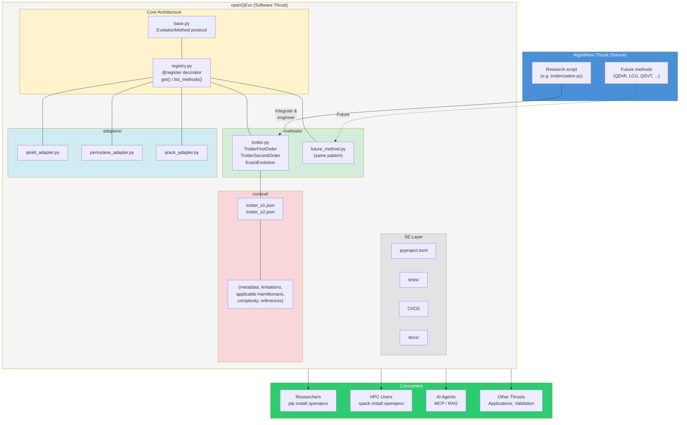
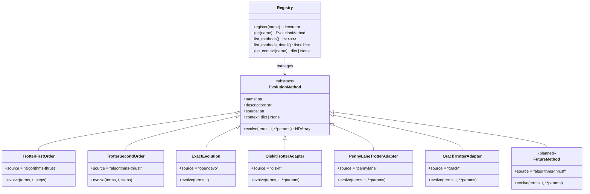

# Architecture

openQEvo uses a **Strategy + Registry + Adapter** pattern to keep the
codebase modular. Every evolution method — whether native code from the
Algorithms Thrust or a wrapper around an external library — implements the
same `EvolutionMethod` interface and self-registers with the registry.

## Overview



## Class diagram



## Project structure

```
src/openqevo/
├── __init__.py              # Auto-registers methods, exports registry API
├── base.py                  # EvolutionMethod ABC
├── registry.py              # @register, get(), list_methods(), context loader
├── methods/
│   ├── __init__.py          # Auto-imports all native methods
│   └── trotter.py           # Trotter-Suzuki 1st/2nd order + exact (placeholder)
└── adapters/
    ├── __init__.py          # Optional imports (skip if lib not installed)
    ├── qiskit_adapter.py    # Qiskit wrapper (working)
    ├── pennylane_adapter.py # PennyLane wrapper (working)
    └── qrack_adapter.py     # Qrack GPU-accelerated (Unitary Foundation, stub)
```

## How to add a new method

Adding a new evolution method requires **one file** and **one import line**:

### 1. Create the method file

```python
# src/openqevo/methods/qdrift.py
from openqevo.base import EvolutionMethod
from openqevo.registry import register

@register("qdrift")
class QDrift(EvolutionMethod):
    description = "Randomized product formula"
    source = "algorithms-thrust"

    def evolve(self, terms, t, **params):
        ...
```

### 2. Register it

Add one import to `src/openqevo/methods/__init__.py`:

```python
from openqevo.methods import qdrift  # noqa: F401
```

That's it. The method is now available via `openqevo.get("qdrift")` and
appears in `openqevo.list_methods()`.

### 3. (Optional) Add context metadata

Create `context/qdrift.json` following the schema in `context/schema.json`.
The method's `.context` property will automatically load and validate it.

```json
{
  "method_name": "qdrift",
  "description": "...",
  "source": "algorithms-thrust",
  "parameters": {
    "steps": { "type": "int", "description": "...", "required": true }
  }
}
```

Use `pytest --no-context-validation` while the file is still incomplete (see
[Context validation](#context-validation) below).

## How to add an adapter

Same pattern, but in `adapters/` and with a `try/except` import:

### 1. Create the adapter file

```python
# src/openqevo/adapters/new_lib_adapter.py
from new_lib import SomeEvolver

from openqevo.base import EvolutionMethod
from openqevo.registry import register

@register("new_lib_evolver")
class NewLibAdapter(EvolutionMethod):
    description = "Evolution via new_lib"
    source = "new_lib"

    def evolve(self, terms, t, **params):
        # Translate terms to new_lib format and call
        ...
```

### 2. Register it

Add to `src/openqevo/adapters/__init__.py`:

```python
try:
    from openqevo.adapters import new_lib_adapter  # noqa: F401
except ImportError:
    pass
```

The `try/except` ensures openQEvo works without `new_lib` installed.

## Context validation

Every `context/*.json` file is validated against `context/schema.json` (JSON
Schema draft 2020-12) both at **runtime** (when `.context` is accessed) and in
**tests** (`test_context_validates_against_schema`).

### Runtime behaviour

`registry.get_context()` validates by default. Pass `validate=False` to skip
for a specific call:

```python
ctx = openqevo.registry.get_context("qdrift", validate=False)
```

The global default is controlled by `registry._settings["context_validation"]`
(always `True` in normal use). This will become `openqevo.configure()` in a
future release.

### Disabling validation during development

When writing a new context file that is not yet complete, pass
`--no-context-validation` to pytest to skip the schema test for the whole
session:

```bash
pytest --no-context-validation
```

Remove the flag once the file satisfies the schema; CI always runs without it.

### Currently required fields

| Field | Type | Description |
|-------|------|-------------|
| `method_name` | string | Registry key matching `@register("name")` |
| `description` | string | Human-readable summary of the method |
| `source` | string (enum) | Origin: `algorithms-thrust`, `openqevo`, `qiskit`, `pennylane`, `qrack` |
| `parameters` | object | Per-parameter metadata (type, description, required, range) |

All other fields (`applicable_hamiltonians`, `limitations`, `complexity`,
`references`, `example_path`) are optional but encouraged — see
`context/trotter_s1.json` for a complete example.

### Promoting a field to required

1. Add the field name to `"required"` in `context/schema.json`
2. Add the field to every existing `context/*.json` file
3. Run `pytest` — the schema test enforces it automatically with no test code changes
