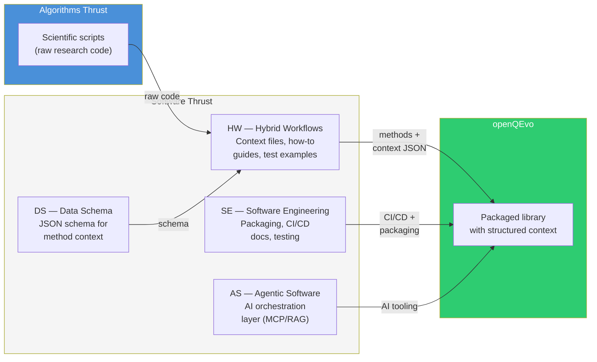
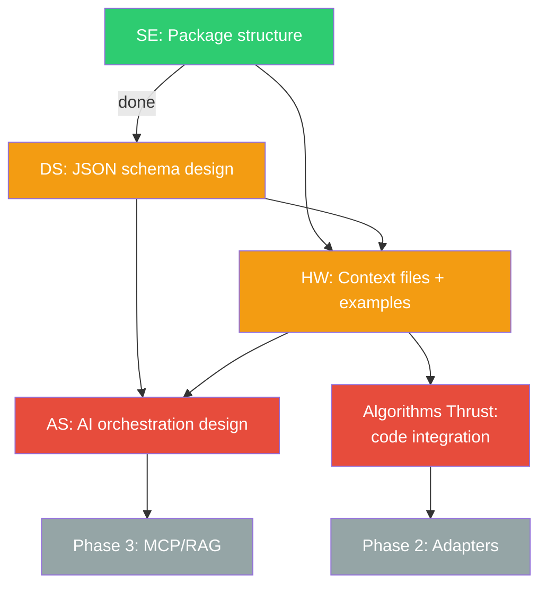

# Cross-project workflow

openQEvo is a collaboration across all five Software Thrust projects and
the Algorithms Thrust. This document describes how the pieces fit together.

## Workflow

## Responsibilities

### HW — Hybrid Workflows ([Issue #4](https://github.com/QSCSoftwareThrust/OpenQEvo/issues/4))

**What they deliver:**
- One JSON context file per evolution method (metadata, limitations,
  applicable Hamiltonians, complexity, references)
- How-to guides: when to use each strategy and on what types of Hamiltonians
- Test examples for each method
- Integration of the actual Algorithms Thrust code into `methods/`

**Key personnel:** Zack Windom (context and examples), Daniel Claudino (QC)

### DS — Data Schema ([Issue #2](https://github.com/QSCSoftwareThrust/OpenQEvo/issues/2))

**What they deliver:**
- JSON schema defining the structure of method context files
- Validation tooling for context files
- Alignment with the broader openQSE data schema

**Key personnel:** Thomas Naughton, Samuel Stein

**Related:** [DataSchema RFC #5 — trotterization schema requirements](https://github.com/QSCSoftwareThrust/DataSchema/issues/5)

### AS — Agentic Software ([Issue #3](https://github.com/QSCSoftwareThrust/OpenQEvo/issues/3))

**What they deliver:**
- Design for AI-assisted method selection using the structured context
- MCP or RAG integration so AI agents can discover and recommend methods
- Orchestration layer connecting openQEvo to hybrid workflows

**Key personnel:** Tirthankar Ghosal

**Dependency:** Needs the JSON schema (DS, issue #2) to be defined first.

### SE — Software Engineering ([Issue #1](https://github.com/QSCSoftwareThrust/OpenQEvo/issues/1))

**What they deliver:**
- Python package structure (`src/` layout, `pyproject.toml`) — done
- CI/CD workflows (GitHub Actions: lint, test, docs build)
- Documentation infrastructure (Sphinx or MkDocs)
- Branch protection rules and PR review setup
- Spack recipe for HPC deployment (Phase 3)

**Key personnel:** Seth Johnson

## Dependency chain

Legend: green = done, orange = in progress, red = blocked/waiting, gray = future
