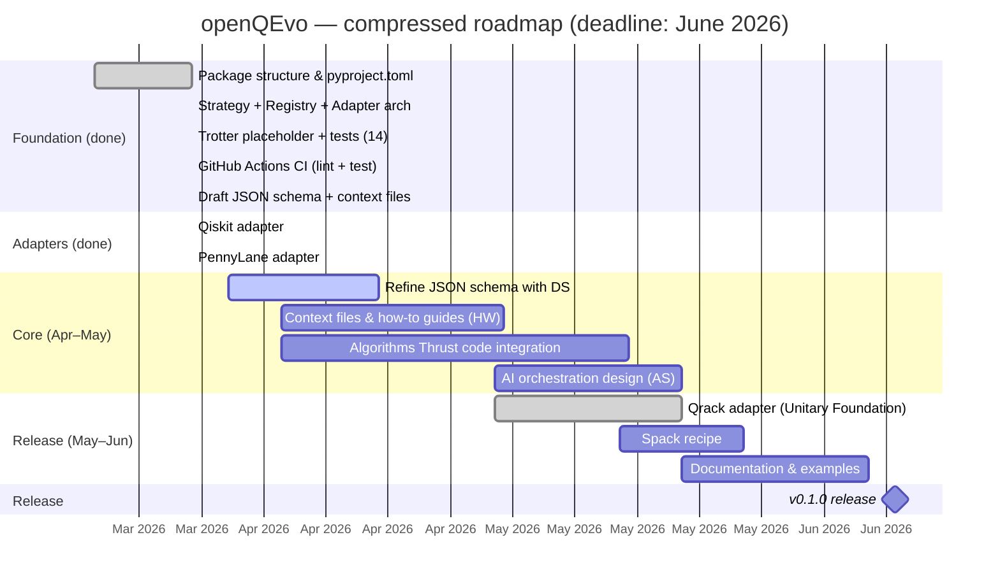
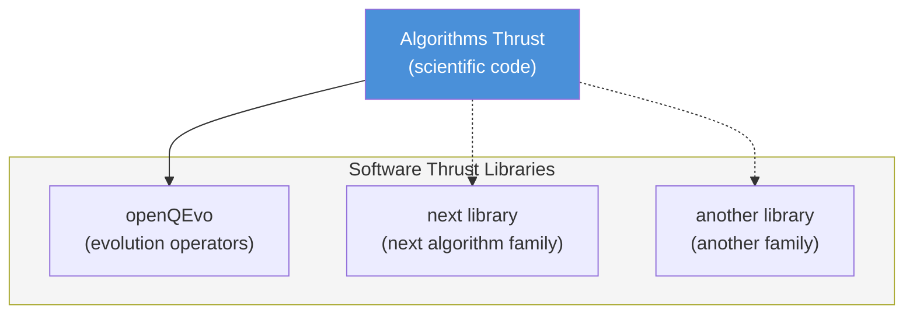

# Roadmap

**Deadline: June 2026**

All phases run in parallel. openQSE is a community specification; openQEvo
is the first concrete software deliverable from the Software Thrust.

## Timeline

## Task tracker

### Foundation — done

| Task | Status |
|------|--------|
| Package structure (`src/` layout, `pyproject.toml`) | Done |
| Strategy + Registry + Adapter architecture | Done |
| Trotter placeholder (1st, 2nd order, exact) | Done |
| GitHub Actions CI (lint + test, Python 3.10-3.12) | Done |
| Draft JSON schema for context files | Done |
| Context JSON for trotter_s1, trotter_s2, exact | Done |
| 19 core tests passing | Done |
| README, CONTRIBUTING.md, docs/ | Done |

### Adapters — done

| Adapter | Library | Status | Tests |
|---------|---------|--------|-------|
| `qiskit_trotter` | Qiskit | **Working** | 9 passing |
| `pennylane_trotter` | PennyLane | **Working** | 9 passing |
| `qrack_trotter` | Qrack (Unitary Foundation) | **Experimental** | 7 passing + real PyQrack CPU validation |

### Core — April/May 2026

| Task | Owner | Status | Issue |
|------|-------|--------|-------|
| Refine JSON schema with DS feedback | DS (Thomas) | In progress | [#2](https://github.com/QSCSoftwareThrust/OpenQEvo/issues/2) |
| Context JSON refinement + how-to guides | HW (Zack) | Open | [#4](https://github.com/QSCSoftwareThrust/OpenQEvo/issues/4) |
| Replace placeholder with Algorithms Thrust code | HW + Algorithms | Pending | — |
| AI orchestration design (MCP/RAG) | AS (Tirthankar) | Open | [#3](https://github.com/QSCSoftwareThrust/OpenQEvo/issues/3) |

### Release — May/June 2026

| Task | Owner | Status |
|------|-------|--------|
| Qrack adapter implementation | Unitary Foundation collab | Implemented; GPU/OpenCL validation pending host runtime |
| Spack recipe | SE | Pending |
| Documentation & examples | All | Ongoing |

### Release — June 15, 2026

| Deliverable | Description |
|-------------|-------------|
| `openqevo` v0.1.0 on PyPI | Pip-installable package |
| Spack recipe in `spack-packages/` | HPC-installable |
| 2 working adapters (Qiskit, PennyLane) + experimental Qrack | External library integration |
| Context JSON for all methods | AI-ready metadata |
| CI/CD green | Lint + test + docs build |

## Long-term vision

openQEvo is the first library built using this model. If the pattern works,
future algorithm families from the Algorithms Thrust follow the same
architecture:

Each library follows the same architecture: Strategy + Registry + Adapters +
Context JSON. The Software Thrust provides the engineering; the Algorithms
Thrust provides the science.
