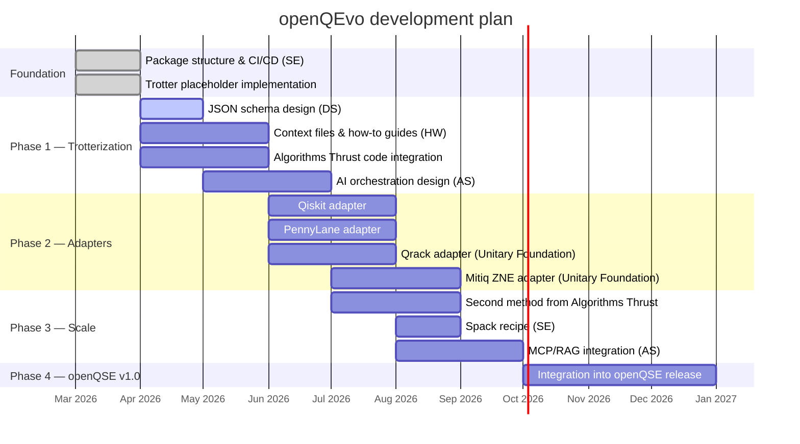
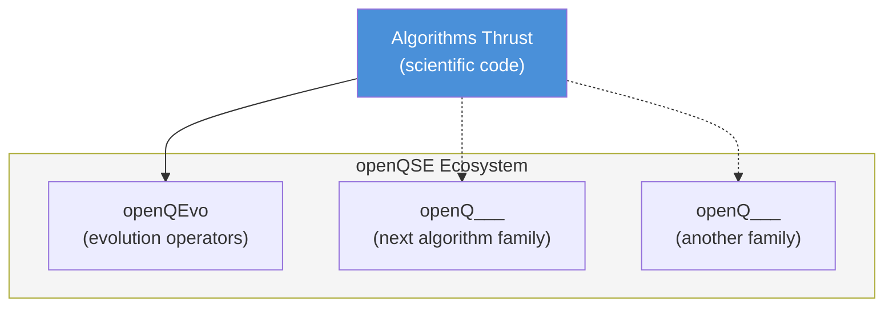

# Roadmap

## Timeline

## Phases

### Phase 1 — Trotterization (current)

The first method integration, establishing the pattern for all future work.

| Task | Owner | Status |
|------|-------|--------|
| Package structure (`pyproject.toml`, `src/` layout) | SE | Done |
| Trotter placeholder implementation | openQEvo | Done |
| JSON schema for method context files | DS | [In progress (#2)](https://github.com/QSCSoftwareThrust/OpenQEvo/issues/2) |
| Context files, how-to guides, test examples | HW | [Open (#4)](https://github.com/QSCSoftwareThrust/OpenQEvo/issues/4) |
| Replace placeholder with Algorithms Thrust code | HW + Algorithms | Pending |
| AI orchestration design (MCP/RAG) | AS | [Open (#3)](https://github.com/QSCSoftwareThrust/OpenQEvo/issues/3) |
| CI/CD workflows | SE | [Open (#1)](https://github.com/QSCSoftwareThrust/OpenQEvo/issues/1) |

### Phase 2 — Adapters

Wrap external libraries behind the same `EvolutionMethod` interface so
users can compare methods from different ecosystems.

| Adapter | Library | Type |
|---------|---------|------|
| `qiskit_trotter` | Qiskit | Direct evolution |
| `pennylane_trotter` | PennyLane | Direct evolution |
| `qrack_trotter` | Qrack (Unitary Foundation) | GPU-accelerated evolution |
| `mitiq_zne` | Mitiq (Unitary Foundation) | Error-mitigated wrapper |

### Phase 3 — Scale

Prove the model by integrating a second method from the Algorithms Thrust
(e.g., QDrift, LCU, or QSVT). If the architecture handles this cleanly,
the pattern is validated.

Also: Spack recipe for HPC deployment, and MCP/RAG integration for
AI-assisted method selection.

### Phase 4 — openQSE v1.0

Bundle openQEvo into the first openQSE release alongside outputs from the
other Software Thrust projects (Data Schema, Compilation Tools, etc.).

## Long-term vision

openQEvo is one component of a larger pattern. If the model succeeds:

Each `openQ___` library follows the same architecture: Strategy + Registry +
Adapters + Context JSON. The Software Thrust provides the engineering; the
Algorithms Thrust provides the science.
